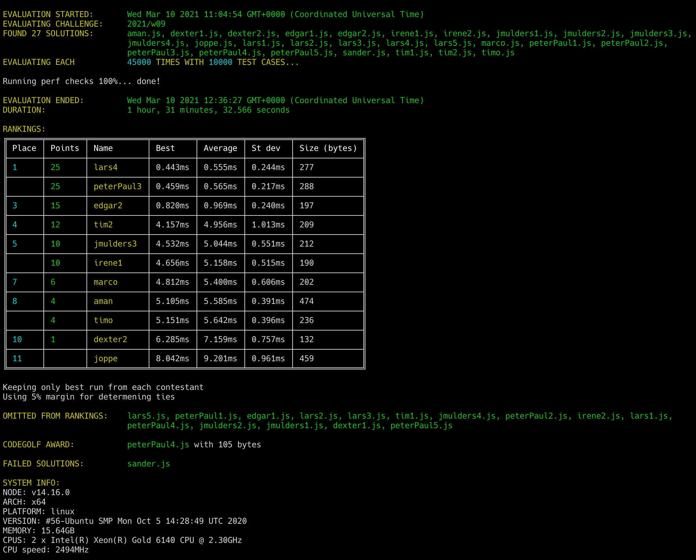

# Week 09 challenge

Write a function that takes 3 arguments - integer value for red, green and blue and transforms it to corresponding hex string in the form of
##RRGGBB (capital letters). The input values are truncated to the range of 0-255, e.g. negative values become 0 and values >= 255 are truncated to 255.

Note: The answer should always be 7 characters long, the shorthand form #FFF is not required.

Examples:

```
rgb2Hex(255, 255, 255) // returns '#FFFFFF'
rgb2Hex(255, 255, 300) // returns '#FFFFFF'
rgb2Hex(0,0,0) // returns '#000000'
rgb2Hex(-20,0,0) // returns '#000000'
rgb2Hex(77, 22, 159) // returns '#4D169F'
```


## Upload link

[Submissions are closed]


## Results

| Place | Name       | Performance | Codegolf | Jury award | Total points |
|-------|------------|-------------|----------|------------|--------------|
| 1.    | Peter-Paul | 25          | 5        |            | 30           |
| 2.    | Lars       | 25          |          |            | 25           |
| 3.    | Edgar      | 15          |          |            | 15           |
| 4.    | Tim        | 12          |          |            | 12           |
| 5.    | Jan        | 10          |          |            | 10           |
|       | Irene      | 10          |          |            | 10           |
| 7.    | Marco      | 6           |          |            | 6            |
| 8.    | Joppe      |             |          | 5          | 5            |
| 9.    | Aman       | 4           |          |            | 4            |
|       | Timo       | 4           |          |            | 4            |
| 11.   | Dexter     | 1           |          |            | 1            |


### Jury vote

#### Harijs
1. joppe (readable & clear code in functional style)
2. lars4 (first figured out to prefill a 256 size array)
3. edgar1 (he commented that he wrote it by hand - no minimizer)

#### Israel
1. peterPaul5 (for his thinking outside-the-box mindset of going the WASM route)
2. edgar1 (for writing minimized code by hand, which makes me want to sent him a captcha test to see if he’s not a robot)
3. joppe (for his functional programming approach + readability)

### Screenshot



### Full output log
```
EVALUATION STARTED:       Wed Mar 10 2021 11:04:54 GMT+0000 (Coordinated Universal Time)
EVALUATING CHALLENGE:     2021/w09
FOUND 27 SOLUTIONS:       aman.js, dexter1.js, dexter2.js, edgar1.js, edgar2.js, irene1.js, irene2.js, jmulders1.js, jmulders2.js, jmulders3.js,
                          jmulders4.js, joppe.js, lars1.js, lars2.js, lars3.js, lars4.js, lars5.js, marco.js, peterPaul1.js, peterPaul2.js,
                          peterPaul3.js, peterPaul4.js, peterPaul5.js, sander.js, tim1.js, tim2.js, timo.js
EVALUATING EACH           45000 TIMES WITH 10000 TEST CASES...

Running perf checks 100%... done!

EVALUATION ENDED:         Wed Mar 10 2021 12:36:27 GMT+0000 (Coordinated Universal Time)
DURATION:                 1 hour, 31 minutes, 32.566 seconds

RANKINGS:
╔═══════╤════════╤════════════╤═════════╤═════════╤═════════╤══════════════╗
║ Place │ Points │ Name       │ Best    │ Average │ St dev  │ Size (bytes) ║
╟───────┼────────┼────────────┼─────────┼─────────┼─────────┼──────────────╢
║ 1     │ 25     │ lars4      │ 0.443ms │ 0.555ms │ 0.244ms │ 277          ║
╟───────┼────────┼────────────┼─────────┼─────────┼─────────┼──────────────╢
║       │ 25     │ peterPaul3 │ 0.459ms │ 0.565ms │ 0.217ms │ 288          ║
╟───────┼────────┼────────────┼─────────┼─────────┼─────────┼──────────────╢
║ 3     │ 15     │ edgar2     │ 0.820ms │ 0.969ms │ 0.240ms │ 197          ║
╟───────┼────────┼────────────┼─────────┼─────────┼─────────┼──────────────╢
║ 4     │ 12     │ tim2       │ 4.157ms │ 4.956ms │ 1.013ms │ 209          ║
╟───────┼────────┼────────────┼─────────┼─────────┼─────────┼──────────────╢
║ 5     │ 10     │ jmulders3  │ 4.532ms │ 5.044ms │ 0.551ms │ 212          ║
╟───────┼────────┼────────────┼─────────┼─────────┼─────────┼──────────────╢
║       │ 10     │ irene1     │ 4.656ms │ 5.158ms │ 0.515ms │ 190          ║
╟───────┼────────┼────────────┼─────────┼─────────┼─────────┼──────────────╢
║ 7     │ 6      │ marco      │ 4.812ms │ 5.400ms │ 0.606ms │ 202          ║
╟───────┼────────┼────────────┼─────────┼─────────┼─────────┼──────────────╢
║ 8     │ 4      │ aman       │ 5.105ms │ 5.585ms │ 0.391ms │ 474          ║
╟───────┼────────┼────────────┼─────────┼─────────┼─────────┼──────────────╢
║       │ 4      │ timo       │ 5.151ms │ 5.642ms │ 0.396ms │ 236          ║
╟───────┼────────┼────────────┼─────────┼─────────┼─────────┼──────────────╢
║ 10    │ 1      │ dexter2    │ 6.285ms │ 7.159ms │ 0.757ms │ 132          ║
╟───────┼────────┼────────────┼─────────┼─────────┼─────────┼──────────────╢
║ 11    │        │ joppe      │ 8.042ms │ 9.201ms │ 0.961ms │ 459          ║
╚═══════╧════════╧════════════╧═════════╧═════════╧═════════╧══════════════╝

Keeping only best run from each contestant
Using 5% margin for determening ties

OMITTED FROM RANKINGS:    lars5.js, peterPaul1.js, edgar1.js, lars2.js, lars3.js, tim1.js, jmulders4.js, peterPaul2.js, irene2.js, lars1.js,
                          peterPaul4.js, jmulders2.js, jmulders1.js, dexter1.js, peterPaul5.js

CODEGOLF AWARD:           peterPaul4.js with 105 bytes

FAILED SOLUTIONS:         sander.js

SYSTEM INFO:
NODE: v14.16.0
ARCH: x64
PLATFORM: linux
VERSION: #56-Ubuntu SMP Mon Oct 5 14:28:49 UTC 2020
MEMORY: 15.64GB
CPUS: 2 x Intel(R) Xeon(R) Gold 6140 CPU @ 2.30GHz
CPU speed: 2494MHz

RAW RESULTS:
┌─────────┬─────────────────┬────────┬────────────────────┬────────────────────┬────────────────────┬────────────────────┬─────────────────────┬──────┬───────┐
│ (index) │    solution     │ failed │       total        │      average       │        best        │       worst        │        stdev        │ size │ runs  │
├─────────┼─────────────────┼────────┼────────────────────┼────────────────────┼────────────────────┼────────────────────┼─────────────────────┼──────┼───────┤
│    0    │   'lars4.js'    │ false  │ 24954.117151952116 │ 0.554535936710047  │ 0.443312999792397  │ 11.019696000032127 │ 0.24357373599440746 │ 277  │ 45000 │
│    1    │   'lars5.js'    │ false  │ 25034.72079908068  │ 0.5563271288684595 │ 0.4462430002167821 │ 10.702086000703275 │ 0.23993091446512296 │ 248  │ 45000 │
│    2    │ 'peterPaul3.js' │ false  │ 25430.984402980248 │ 0.5651329867328944 │ 0.4589490005746484 │ 7.057013999670744  │ 0.21654782896233515 │ 288  │ 45000 │
│    3    │ 'peterPaul1.js' │ false  │ 40470.57480596157  │ 0.8993461067991461 │ 0.7271419996395707 │ 21.75235699955374  │ 0.34175755401416436 │ 263  │ 45000 │
│    4    │   'edgar2.js'   │ false  │ 43594.90672499448  │ 0.9687757049998773 │ 0.8199909999966621 │ 11.407150999642909 │ 0.24040285270688885 │ 197  │ 45000 │
│    5    │   'edgar1.js'   │ false  │  43840.3964520272  │ 0.974231032267271  │ 0.8285170001909137 │ 9.197142000019085  │ 0.2398058980863891  │ 233  │ 45000 │
│    6    │   'lars2.js'    │ false  │  48775.783988907   │  1.0839063108646   │ 0.9274730002507567 │ 12.878285999409854 │ 0.2503903640149966  │ 464  │ 45000 │
│    7    │   'lars3.js'    │ false  │ 49003.94716007984  │ 1.0889766035573298 │ 0.9319749999558553 │ 7.609298000112176  │ 0.23877974676216554 │ 207  │ 45000 │
│    8    │    'tim2.js'    │ false  │ 223012.88946794212 │ 4.955841988176491  │ 4.157364999991842  │ 23.498655000003055 │ 1.0129930926567912  │ 209  │ 45000 │
│    9    │    'tim1.js'    │ false  │ 226214.55247406347 │ 5.026990054979188  │ 4.205916999839246  │ 25.46290099993348  │ 1.0196544444439344  │ 236  │ 45000 │
│   10    │ 'jmulders3.js'  │ false  │ 226969.60610799782 │ 5.043769024622174  │ 4.531585999997333  │ 18.55146300047636  │  0.551126192386831  │ 212  │ 45000 │
│   11    │ 'jmulders4.js'  │ false  │ 228225.07094390533 │ 5.071668243197896  │  4.57253299979493  │  18.0440840004012  │ 0.5095164451008491  │ 204  │ 45000 │
│   12    │   'irene1.js'   │ false  │ 232108.50421301724 │ 5.157966760289272  │ 4.655542999505997  │ 14.558457000181079 │ 0.5145997706657754  │ 190  │ 45000 │
│   13    │   'marco.js'    │ false  │ 243005.97127691953 │ 5.4001326950426565 │ 4.8117130000609905 │ 18.662557000294328 │ 0.6064074021592455  │ 202  │ 45000 │
│   14    │ 'peterPaul2.js' │ false  │ 254344.06787503854 │ 5.652090397223079  │ 5.086575999855995  │ 21.009684999473393 │ 0.5833794073379958  │ 106  │ 45000 │
│   15    │   'irene2.js'   │ false  │ 251315.67973698897 │ 5.584792883044199  │ 5.0881829999852926 │ 17.62513200007379  │ 0.4112294200881838  │ 231  │ 45000 │
│   16    │   'lars1.js'    │ false  │ 251716.30449607025 │ 5.593695655468228  │ 5.102278999984264  │  18.9616930000484  │ 0.40785920898272543 │ 204  │ 45000 │
│   17    │    'aman.js'    │ false  │ 251345.43736303906 │ 5.5854541636230906 │ 5.105037000030279  │ 12.956090999767184 │ 0.39103225278959963 │ 474  │ 45000 │
│   18    │    'timo.js'    │ false  │ 253880.6705170257  │ 5.6417926781561265 │  5.15104699973017  │ 13.296486999839544 │ 0.3963908812544352  │ 236  │ 45000 │
│   19    │ 'peterPaul4.js' │ false  │ 270102.23390095064 │  6.00227186446557  │ 5.372757999924943  │ 27.944521999917924 │ 0.6350151490371183  │ 105  │ 45000 │
│   20    │ 'jmulders2.js'  │ false  │ 278039.0673078695  │ 6.178645940174878  │ 5.509214999852702  │ 21.19550499971956  │  0.665332048366774  │ 202  │ 45000 │
│   21    │ 'jmulders1.js'  │ false  │ 304662.6575900136  │  6.77028127977808  │ 5.978452000766993  │ 22.020793000236154 │ 0.7327857629135798  │ 203  │ 45000 │
│   22    │  'dexter2.js'   │ false  │ 322159.3229130571  │ 7.1590960647346025 │ 6.285223999992013  │ 21.00652700010687  │ 0.7571644543584567  │ 132  │ 45000 │
│   23    │  'dexter1.js'   │ false  │ 328843.2629188745  │ 7.307628064863878  │ 6.334374000318348  │ 26.949910999974236 │ 0.7714671615781173  │ 206  │ 45000 │
│   24    │   'joppe.js'    │ false  │ 414052.37981705304 │ 9.201163995934511  │ 8.042377999983728  │ 32.634244000539184 │ 0.9611486091859825  │ 459  │ 45000 │
│   25    │ 'peterPaul5.js' │ false  │  559945.381568114  │ 12.443230701513645 │ 10.09177100006491  │ 34.47744600009173  │ 1.4697451604365284  │ 624  │ 45000 │
│   26    │   'sander.js'   │  true  │         0          │        null        │        null        │        null        │        null         │ 316  │   0   │
└─────────┴─────────────────┴────────┴────────────────────┴────────────────────┴────────────────────┴────────────────────┴─────────────────────┴──────┴───────┘
```
