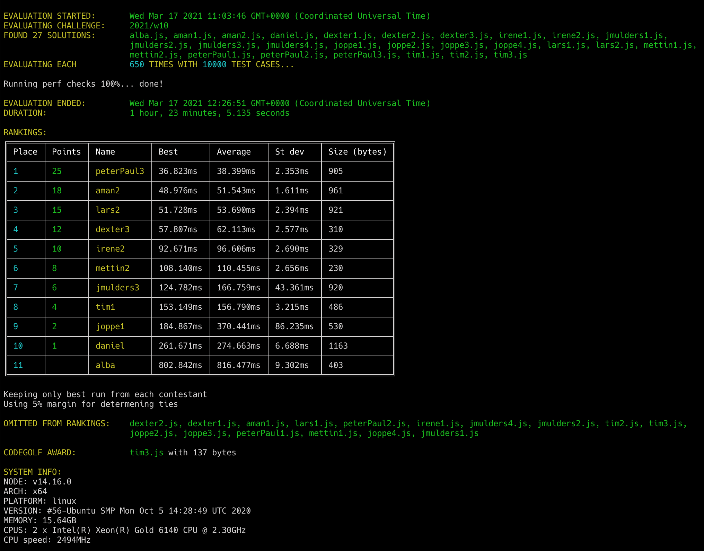

# Week 10 challenge

Write a function which takes in a string, counts the occurrance of each character (case ignored) and then returns an array of unique characters ordered from most occurring to least.
If characters occur the same amount of times, then order them by their ASCII number (lower first, e.g. 'a' before 'b').

Examples:

```
rankLetters('abcd')); // returns ['a', 'b', 'c', 'd']
rankLetters('dbca')); // returns ['a', 'b', 'c', 'd']
rankLetters('dbbccca')); // returns ['c', 'b', 'a', 'd']

rankLetters('Passionate People')); // returns ['e', 'p', 'a', 'o', 's', ' ', 'i', 'l', 'n', 't']

rankLetters('Amsterdam')); // returns ['a', 'm', 'd', 'e', 'r', 's', 't']

rankLetters('The quick brown fox jumps over the lazy dog')); // returns [' ', 'o', 'e', 'h', 'r', 't', 'u', 'a', 'b', 'c', 'd', 'f', 'g', 'i', 'j', 'k', 'l', 'm', 'n', 'p', 'q', 's', 'v', 'w', 'x', 'y', 'z']

rankLetters(`$jQuery('#app').boot().forEach((something) => console.log('@app ' + something + 'has booted!!!'));`)); // returns ['o', ' ', '\'', 'e', '(', ')', 'a', 'h', 'p', 's', 't', '!', '.', 'g', 'n', '+', 'b', 'c', 'i', 'l', 'm', 'r', '#', '$', ';', '=', '>', '@', 'd', 'f', 'j', 'q', 'u', 'y']


```


## Upload link

[Submissions are closed]


## Results


| Place | Name       | Performance | Codegolf | Jury award | Total points |
|-------|------------|-------------|----------|------------|--------------|
| 1.    | Peter-Paul | 25          |          |            | 25           |
| 2.    | Aman       | 18          |          |            | 18           |
| 3.    | Dexter     | 12          |          | 5          | 17           |
| 4.    | Lars       | 15          |          |            | 15           |
| 5.    | Irene      | 10          |          |            | 10           |
| 6.    | Tim        | 4           | 5        |            | 9            |
| 7.    | Mettin     | 8           |          |            | 8            |
| 8.    | Jan        | 6           |          |            | 6            |
| 9.    | Joppe      | 2           |          |            | 2            |
| 10    | Daniel     | 1           |          |            | 1            |


### Jury vote

#### Harijs
1. dexter2 - nice, clear, chained flow of execution
2. daniel - functional style with clear flow of transformation
3. peterPaul2 - well comented, clear and fast

#### Israel
1. dexter2 - For a very elegant, readable approach on a single chained statement.
2. tim3- For his quick thinking being the first one to use lodash aiming for the codegolf award
3. peterPaul2 - For a nicely commented and readable solution

#### David
- (1/2) PP & Lars equally because they use a Map which makes it very elegant.
- (3) Jan because I like this regex solution, its a nice out of the box one

### Screenshot



### Full output log
```
EVALUATION STARTED:       Wed Mar 17 2021 11:03:46 GMT+0000 (Coordinated Universal Time)
EVALUATING CHALLENGE:     2021/w10
FOUND 27 SOLUTIONS:       alba.js, aman1.js, aman2.js, daniel.js, dexter1.js, dexter2.js, dexter3.js, irene1.js, irene2.js, jmulders1.js,
                          jmulders2.js, jmulders3.js, jmulders4.js, joppe1.js, joppe2.js, joppe3.js, joppe4.js, lars1.js, lars2.js, mettin1.js,
                          mettin2.js, peterPaul1.js, peterPaul2.js, peterPaul3.js, tim1.js, tim2.js, tim3.js
EVALUATING EACH           650 TIMES WITH 10000 TEST CASES...

Running perf checks 100%... done!

EVALUATION ENDED:         Wed Mar 17 2021 12:26:51 GMT+0000 (Coordinated Universal Time)
DURATION:                 1 hour, 23 minutes, 5.135 seconds

RANKINGS:
╔═══════╤════════╤════════════╤═══════════╤═══════════╤══════════╤══════════════╗
║ Place │ Points │ Name       │ Best      │ Average   │ St dev   │ Size (bytes) ║
╟───────┼────────┼────────────┼───────────┼───────────┼──────────┼──────────────╢
║ 1     │ 25     │ peterPaul3 │ 36.823ms  │ 38.399ms  │ 2.353ms  │ 905          ║
╟───────┼────────┼────────────┼───────────┼───────────┼──────────┼──────────────╢
║ 2     │ 18     │ aman2      │ 48.976ms  │ 51.543ms  │ 1.611ms  │ 961          ║
╟───────┼────────┼────────────┼───────────┼───────────┼──────────┼──────────────╢
║ 3     │ 15     │ lars2      │ 51.728ms  │ 53.690ms  │ 2.394ms  │ 921          ║
╟───────┼────────┼────────────┼───────────┼───────────┼──────────┼──────────────╢
║ 4     │ 12     │ dexter3    │ 57.807ms  │ 62.113ms  │ 2.577ms  │ 310          ║
╟───────┼────────┼────────────┼───────────┼───────────┼──────────┼──────────────╢
║ 5     │ 10     │ irene2     │ 92.671ms  │ 96.606ms  │ 2.690ms  │ 329          ║
╟───────┼────────┼────────────┼───────────┼───────────┼──────────┼──────────────╢
║ 6     │ 8      │ mettin2    │ 108.140ms │ 110.455ms │ 2.656ms  │ 230          ║
╟───────┼────────┼────────────┼───────────┼───────────┼──────────┼──────────────╢
║ 7     │ 6      │ jmulders3  │ 124.782ms │ 166.759ms │ 43.361ms │ 920          ║
╟───────┼────────┼────────────┼───────────┼───────────┼──────────┼──────────────╢
║ 8     │ 4      │ tim1       │ 153.149ms │ 156.790ms │ 3.215ms  │ 486          ║
╟───────┼────────┼────────────┼───────────┼───────────┼──────────┼──────────────╢
║ 9     │ 2      │ joppe1     │ 184.867ms │ 370.441ms │ 86.235ms │ 530          ║
╟───────┼────────┼────────────┼───────────┼───────────┼──────────┼──────────────╢
║ 10    │ 1      │ daniel     │ 261.671ms │ 274.663ms │ 6.688ms  │ 1163         ║
╟───────┼────────┼────────────┼───────────┼───────────┼──────────┼──────────────╢
║ 11    │        │ alba       │ 802.842ms │ 816.477ms │ 9.302ms  │ 403          ║
╚═══════╧════════╧════════════╧═══════════╧═══════════╧══════════╧══════════════╝

Keeping only best run from each contestant
Using 5% margin for determening ties

OMITTED FROM RANKINGS:    dexter2.js, dexter1.js, aman1.js, lars1.js, peterPaul2.js, irene1.js, jmulders4.js, jmulders2.js, tim2.js, tim3.js,
                          joppe2.js, joppe3.js, peterPaul1.js, mettin1.js, joppe4.js, jmulders1.js

CODEGOLF AWARD:           tim3.js with 137 bytes

SYSTEM INFO:
NODE: v14.16.0
ARCH: x64
PLATFORM: linux
VERSION: #56-Ubuntu SMP Mon Oct 5 14:28:49 UTC 2020
MEMORY: 15.64GB
CPUS: 2 x Intel(R) Xeon(R) Gold 6140 CPU @ 2.30GHz
CPU speed: 2494MHz

RAW RESULTS:
┌─────────┬─────────────────┬────────┬────────────────────┬────────────────────┬────────────────────┬────────────────────┬────────────────────┬──────┬──────┐
│ (index) │    solution     │ failed │       total        │      average       │        best        │       worst        │       stdev        │ size │ runs │
├─────────┼─────────────────┼────────┼────────────────────┼────────────────────┼────────────────────┼────────────────────┼────────────────────┼──────┼──────┤
│    0    │ 'peterPaul3.js' │ false  │ 24959.260463992832 │ 38.39886225229667  │ 36.82268199976534  │  69.0347410000395  │ 2.353005779205573  │ 905  │ 650  │
│    1    │   'aman2.js'    │ false  │ 33502.72120900615  │ 51.54264801385562  │  48.9755779998377  │ 58.564329000073485 │ 1.6113356133493333 │ 961  │ 650  │
│    2    │   'lars2.js'    │ false  │ 34898.383849005186 │ 53.689821306161825 │ 51.72809599991888  │ 75.36189700011164  │ 2.3941387678457873 │ 921  │ 650  │
│    3    │  'dexter3.js'   │ false  │ 40373.674413984554 │ 62.11334525228393  │ 57.80710200034082  │ 82.83690400002524  │ 2.576541681361204  │ 310  │ 650  │
│    4    │  'dexter2.js'   │ false  │ 41456.95502900405  │ 63.77993081385238  │ 59.513426000019535 │ 83.21277599968016  │ 2.702373094074709  │ 336  │ 650  │
│    5    │  'dexter1.js'   │ false  │ 41673.468014998856 │ 64.11302771538286  │ 59.74239700008184  │ 85.08685100032017  │ 2.707572019348295  │ 218  │ 650  │
│    6    │   'aman1.js'    │ false  │ 44642.10501099887  │ 68.68016155538288  │ 65.81814599968493  │  90.5415709996596  │ 2.485804171057624  │ 676  │ 650  │
│    7    │   'lars1.js'    │ false  │ 48580.72895599785  │ 74.73958300922746  │ 72.76125799957663  │  93.304270000197   │ 1.8023461227858926 │ 605  │ 650  │
│    8    │ 'peterPaul2.js' │ false  │ 50093.076560997695 │ 77.06627163230415  │ 74.66648499993607  │ 97.29548099962994  │ 2.4057162483311063 │ 699  │ 650  │
│    9    │   'irene2.js'   │ false  │ 62793.69614999261  │ 96.60568638460401  │ 92.67131099989638  │ 119.03286699997261 │ 2.6895369697255354 │ 329  │ 650  │
│   10    │  'mettin2.js'   │ false  │ 71795.57281800511  │ 110.45472741231555 │ 108.14002500008792 │ 130.4505709996447  │  2.65646331222444  │ 230  │ 650  │
│   11    │   'irene1.js'   │ false  │ 74908.53849899408  │ 115.24390538306781 │ 111.14961700001732 │ 135.96726399939507 │ 2.8421794461278123 │ 359  │ 650  │
│   12    │ 'jmulders3.js'  │ false  │ 108393.09095900078 │ 166.7586014753858  │ 124.7822399996221  │ 257.3504719999619  │  43.3608174078493  │ 920  │ 650  │
│   13    │ 'jmulders4.js'  │ false  │ 112543.51522499858 │ 173.1438695769209  │ 128.84829899994656 │ 262.19518399983644 │ 43.64607542367891  │ 482  │ 650  │
│   14    │ 'jmulders2.js'  │ false  │ 122148.82092300092 │ 187.92126295846296 │ 146.17693599965423 │ 277.0068339994177  │ 43.680700718082754 │ 439  │ 650  │
│   15    │    'tim1.js'    │ false  │ 101913.46034698703 │ 156.78993899536468 │ 153.14916600007564 │ 173.83834800031036 │  3.21498281219868  │ 486  │ 650  │
│   16    │    'tim2.js'    │ false  │ 107650.19724000557 │ 165.61568806154702 │ 159.98523700004444 │ 182.73677800036967 │ 3.606033697472276  │ 252  │ 650  │
│   17    │    'tim3.js'    │ false  │ 156754.7904769948  │ 241.16121611845352 │ 184.32227100012824 │ 357.1564500001259  │ 59.34427504936181  │ 137  │ 650  │
│   18    │   'joppe1.js'   │ false  │ 240786.79574800277 │ 370.4412242276966  │  184.867157000117  │ 453.76075999997556 │ 86.23514390487064  │ 530  │ 650  │
│   19    │   'joppe2.js'   │ false  │ 250319.38985899973 │ 385.10675362923035 │ 194.52510200068355 │ 677.1201809998602  │ 87.49717821516435  │ 493  │ 650  │
│   20    │   'joppe3.js'   │ false  │ 211076.60681898263 │ 324.7332412599733  │  195.518219999969  │ 457.81730799982324 │  85.7775068261461  │ 575  │ 650  │
│   21    │ 'peterPaul1.js' │ false  │ 185817.63242699884 │ 285.8732806569213  │ 220.44083600025624 │ 404.00057400017977 │ 57.575952836955885 │ 143  │ 650  │
│   22    │  'mettin1.js'   │ false  │ 234565.5036339997  │ 360.87000559076876 │ 233.7606720002368  │ 412.27123800013214 │ 42.60399119206938  │ 781  │ 650  │
│   23    │   'daniel.js'   │ false  │ 178530.77220400004 │ 274.6627264676924  │ 261.6711630001664  │ 298.15263600088656 │ 6.687500314540329  │ 1163 │ 650  │
│   24    │   'joppe4.js'   │ false  │ 260359.84900500963 │ 400.55361385386095 │ 262.53443200001493 │ 548.5770769999363  │ 86.76359868115436  │ 692  │ 650  │
│   25    │    'alba.js'    │ false  │ 530710.3691819976  │ 816.4774910492271  │ 802.8418120001443  │ 863.7146899998188  │ 9.301604483553634  │ 403  │ 650  │
│   26    │ 'jmulders1.js'  │ false  │ 1612576.710989997  │ 2480.8872476769184 │ 2415.320759000024  │ 2742.4101559994742 │ 33.50151811570715  │ 245  │ 650  │
└─────────┴─────────────────┴────────┴────────────────────┴────────────────────┴────────────────────┴────────────────────┴────────────────────┴──────┴──────┘
```