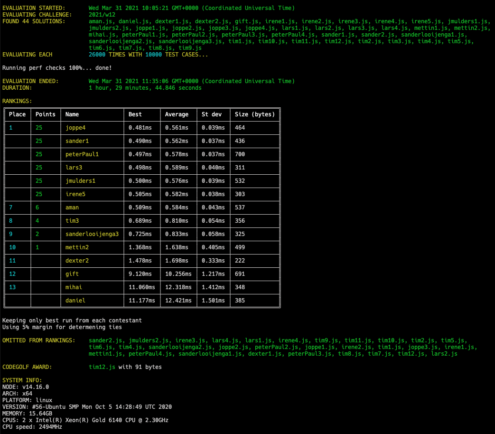

# Week 12 challenge

For this weeks challenge you will have to apply some manipulation to a number and its digits.
Write a function `manipulateNumber` which takes an (integer) number A and
* obtains a new new number B with order of the digits reversed
* subtracts this number from the original and gets a new number C
* sums up all the digits to get number D and applies the sign which C had
* returns D

### Example 1

* Take in number 432
* Get reversed number: 234
* Subtract from original: 432 - 234 = 198
* Get final number 1 + 9 + 8 = 18 => +18 (stays positive because 198 > 0)

### Example 2

* Take in number 123
* Get reversed number: 321
* Subtract from original: 123 - 321 = -198
* Get final number 1 + 9 + 8 = 18 => -18 (becomes negative because -198 < 0)


### Example in code:

```javascript

manipulateNumber(432); // returns 18
manipulateNumber(123); // returns -18
manipulateNumber(55); // returns 0
manipulateNumber(212); // returns 0
manipulateNumber(45200); // returns 27

```


## Upload link

[Submissions are closed]


## Results


| Place | Name        | Performance | Codegolf | Jury award | Total points |
|-------|-------------|-------------|----------|------------|--------------|
| 1.    | Lars        | 25          |          | 5          | 30           |
| 2.    | Joppe       | 25          |          |            | 25           |
|       | Sander A.   | 25          |          |            | 25           |
|       | Peter-Paul  | 25          |          |            | 25           |
|       | Jan Bart    | 25          |          |            | 25           |
|       | Irene       | 25          |          |            | 25           |
| 7.    | Tim         | 4           | 5        |            | 9            |
| 8.    | Aman        | 6           |          |            | 6            |
| 9.    | Sander L.   | 2           |          |            | 2            |
| 10.   | Mettin      | 1           |          |            | 1            |
| 11.   | Dexter      |             |          |            |              |
| 12.   | Gift        |             |          |            |              |
| 13.   | Mihai       |             |          |            |              |
|       | Daniel      |             |          |            |              |


### Jury vote

#### Harijs
1. Lars - lars1 well structured and named; and was immediately first to come up with pure math solution; lars2 - using eval for codegolf :)
2. Dexter1 - clear naming; nice chained flow
3. Mettin2 - being ashamed for stealing from stackoverflow :D

#### Israel
1. lars2 - for being the first time we see eval being used in a solution
2. mettin2 - for being honest about his sources in a comment
3. peterPaul2 - because I’m a teapot (he’ll understand)
#### David
1. Sander1/Peterpaul1 - Using the faster bitwise operator instead of using floor
2. Lars3 - Clever way of reusing the same function
3. Aman - Most structured/readable code

### Screenshot



### Full output log
```
EVALUATION STARTED:       Wed Mar 31 2021 10:05:21 GMT+0000 (Coordinated Universal Time)
EVALUATING CHALLENGE:     2021/w12
FOUND 44 SOLUTIONS:       aman.js, daniel.js, dexter1.js, dexter2.js, gift.js, irene1.js, irene2.js, irene3.js, irene4.js, irene5.js, jmulders1.js,
                          jmulders2.js, joppe1.js, joppe2.js, joppe3.js, joppe4.js, lars1.js, lars2.js, lars3.js, lars4.js, mettin1.js, mettin2.js,
                          mihai.js, peterPaul1.js, peterPaul2.js, peterPaul3.js, peterPaul4.js, sander1.js, sander2.js, sanderlooijenga1.js,
                          sanderlooijenga2.js, sanderlooijenga3.js, tim1.js, tim10.js, tim11.js, tim12.js, tim2.js, tim3.js, tim4.js, tim5.js,
                          tim6.js, tim7.js, tim8.js, tim9.js
EVALUATING EACH           26000 TIMES WITH 10000 TEST CASES...

Running perf checks 100%... done!

EVALUATION ENDED:         Wed Mar 31 2021 11:35:06 GMT+0000 (Coordinated Universal Time)
DURATION:                 1 hour, 29 minutes, 44.846 seconds

RANKINGS:
╔═══════╤════════╤══════════════════╤══════════╤══════════╤═════════╤══════════════╗
║ Place │ Points │ Name             │ Best     │ Average  │ St dev  │ Size (bytes) ║
╟───────┼────────┼──────────────────┼──────────┼──────────┼─────────┼──────────────╢
║ 1     │ 25     │ joppe4           │ 0.481ms  │ 0.561ms  │ 0.039ms │ 464          ║
╟───────┼────────┼──────────────────┼──────────┼──────────┼─────────┼──────────────╢
║       │ 25     │ sander1          │ 0.490ms  │ 0.562ms  │ 0.037ms │ 436          ║
╟───────┼────────┼──────────────────┼──────────┼──────────┼─────────┼──────────────╢
║       │ 25     │ peterPaul1       │ 0.497ms  │ 0.578ms  │ 0.037ms │ 700          ║
╟───────┼────────┼──────────────────┼──────────┼──────────┼─────────┼──────────────╢
║       │ 25     │ lars3            │ 0.498ms  │ 0.589ms  │ 0.040ms │ 311          ║
╟───────┼────────┼──────────────────┼──────────┼──────────┼─────────┼──────────────╢
║       │ 25     │ jmulders1        │ 0.500ms  │ 0.576ms  │ 0.039ms │ 532          ║
╟───────┼────────┼──────────────────┼──────────┼──────────┼─────────┼──────────────╢
║       │ 25     │ irene5           │ 0.505ms  │ 0.582ms  │ 0.038ms │ 303          ║
╟───────┼────────┼──────────────────┼──────────┼──────────┼─────────┼──────────────╢
║ 7     │ 6      │ aman             │ 0.509ms  │ 0.584ms  │ 0.043ms │ 537          ║
╟───────┼────────┼──────────────────┼──────────┼──────────┼─────────┼──────────────╢
║ 8     │ 4      │ tim3             │ 0.689ms  │ 0.810ms  │ 0.054ms │ 356          ║
╟───────┼────────┼──────────────────┼──────────┼──────────┼─────────┼──────────────╢
║ 9     │ 2      │ sanderlooijenga3 │ 0.725ms  │ 0.833ms  │ 0.058ms │ 325          ║
╟───────┼────────┼──────────────────┼──────────┼──────────┼─────────┼──────────────╢
║ 10    │ 1      │ mettin2          │ 1.368ms  │ 1.638ms  │ 0.405ms │ 499          ║
╟───────┼────────┼──────────────────┼──────────┼──────────┼─────────┼──────────────╢
║ 11    │        │ dexter2          │ 1.478ms  │ 1.698ms  │ 0.333ms │ 222          ║
╟───────┼────────┼──────────────────┼──────────┼──────────┼─────────┼──────────────╢
║ 12    │        │ gift             │ 9.120ms  │ 10.256ms │ 1.217ms │ 691          ║
╟───────┼────────┼──────────────────┼──────────┼──────────┼─────────┼──────────────╢
║ 13    │        │ mihai            │ 11.060ms │ 12.318ms │ 1.412ms │ 348          ║
╟───────┼────────┼──────────────────┼──────────┼──────────┼─────────┼──────────────╢
║       │        │ daniel           │ 11.177ms │ 12.421ms │ 1.501ms │ 385          ║
╚═══════╧════════╧══════════════════╧══════════╧══════════╧═════════╧══════════════╝

Keeping only best run from each contestant
Using 5% margin for determening ties

OMITTED FROM RANKINGS:    sander2.js, jmulders2.js, irene3.js, lars4.js, lars1.js, irene4.js, tim9.js, tim11.js, tim10.js, tim2.js, tim5.js,
                          tim6.js, tim4.js, sanderlooijenga2.js, joppe2.js, peterPaul2.js, joppe1.js, irene2.js, tim1.js, joppe3.js, irene1.js,
                          mettin1.js, peterPaul4.js, sanderlooijenga1.js, dexter1.js, peterPaul3.js, tim8.js, tim7.js, tim12.js, lars2.js

CODEGOLF AWARD:           tim12.js with 91 bytes

SYSTEM INFO:
NODE: v14.16.0
ARCH: x64
PLATFORM: linux
VERSION: #56-Ubuntu SMP Mon Oct 5 14:28:49 UTC 2020
MEMORY: 15.64GB
CPUS: 2 x Intel(R) Xeon(R) Gold 6140 CPU @ 2.30GHz
CPU speed: 2494MHz

RAW RESULTS:
┌─────────┬───────────────────────┬────────┬────────────────────┬────────────────────┬─────────────────────┬────────────────────┬──────────────────────┬──────┬───────┐
│ (index) │       solution        │ failed │       total        │      average       │        best         │       worst        │        stdev         │ size │ runs  │
├─────────┼───────────────────────┼────────┼────────────────────┼────────────────────┼─────────────────────┼────────────────────┼──────────────────────┼──────┼───────┤
│    0    │      'joppe4.js'      │ false  │ 14583.803755014495 │ 0.560915529039019  │ 0.4814909999258816  │ 1.089959999982966  │ 0.03851848429755965  │ 464  │ 26000 │
│    1    │     'sander1.js'      │ false  │ 14616.19807802228  │ 0.5621614645393185 │ 0.4896919997408986  │ 0.9959760000929236 │ 0.03683023026542719  │ 436  │ 26000 │
│    2    │     'sander2.js'      │ false  │ 14977.162542005666 │ 0.5760447131540641 │ 0.4952239999547601  │  1.0469269999885   │ 0.03739489091909199  │ 230  │ 26000 │
│    3    │    'peterPaul1.js'    │ false  │ 15023.663174055197 │ 0.5778331990021229 │ 0.49734599981456995 │ 1.1337119997479022 │ 0.03738929302231055  │ 700  │ 26000 │
│    4    │      'lars3.js'       │ false  │ 15304.177518945755 │ 0.5886222122671444 │ 0.4983410001732409  │ 1.2016759999096394 │ 0.040281048515880116 │ 311  │ 26000 │
│    5    │    'jmulders1.js'     │ false  │ 14984.59722398546  │ 0.5763306624609792 │ 0.4998379999306053  │ 1.0708719999529421 │  0.0387082926984559  │ 532  │ 26000 │
│    6    │    'jmulders2.js'     │ false  │ 14910.13269997634  │ 0.5734666423067823 │ 0.5031550000421703  │ 1.4725479999906383 │ 0.03850438482708481  │ 498  │ 26000 │
│    7    │      'irene5.js'      │ false  │ 15124.51627399381  │ 0.5817121643843773 │ 0.5048850001767278  │ 1.0545149999670684 │ 0.037701878018208734 │ 303  │ 26000 │
│    8    │       'aman.js'       │ false  │ 15194.227658980468 │ 0.5843933714992487 │ 0.5089220004156232  │  3.22669100004714  │ 0.043087467279389564 │ 537  │ 26000 │
│    9    │      'irene3.js'      │ false  │ 15427.772535034062 │ 0.5933758667320793 │ 0.5157200000248849  │ 1.1753750001080334 │ 0.03843355114783794  │ 494  │ 26000 │
│   10    │      'lars4.js'       │ false  │ 15389.299188054865 │ 0.5918961226174948 │ 0.5172319998964667  │ 1.1614319998770952 │ 0.040652253246005535 │ 341  │ 26000 │
│   11    │      'lars1.js'       │ false  │ 16116.058240017286 │ 0.6198483938468187 │  0.527131000009831  │ 1.0861949999816716 │ 0.03870459261809629  │ 622  │ 26000 │
│   12    │      'irene4.js'      │ false  │ 15500.779985999601 │ 0.5961838456153693 │ 0.5299300001934171  │ 1.221546999993734  │ 0.03801429698853064  │ 369  │ 26000 │
│   13    │       'tim3.js'       │ false  │ 21071.184704977757 │ 0.810430180960683  │  0.688535999506712  │ 2.0579930000239983 │ 0.054328657305073025 │ 356  │ 26000 │
│   14    │       'tim9.js'       │ false  │ 20963.905918048622 │ 0.8063040737711008 │  0.693226000003051  │ 4.279153999872506  │ 0.05813458814770543  │ 387  │ 26000 │
│   15    │      'tim11.js'       │ false  │ 20983.27594802642  │ 0.8070490749240932 │ 0.6985730000305921  │ 3.3185640000738204 │ 0.05438097773115643  │ 357  │ 26000 │
│   16    │      'tim10.js'       │ false  │ 20941.342764029352 │ 0.805436260154975  │ 0.7000100002624094  │ 1.4658510000444949 │ 0.05057339015246413  │ 361  │ 26000 │
│   17    │       'tim2.js'       │ false  │ 21059.410816027972 │ 0.809977339077999  │ 0.7038479996845126  │ 1.559140000026673  │ 0.05524252784034053  │ 334  │ 26000 │
│   18    │       'tim5.js'       │ false  │ 21042.06257297643  │ 0.8093100989606319 │ 0.7073320001363754  │ 1.5254879998974502 │ 0.05500221733769126  │ 390  │ 26000 │
│   19    │       'tim6.js'       │ false  │ 21093.017375962838 │ 0.8112698990754937 │ 0.7107499999692664  │ 1.558619000017643  │ 0.05746713300184593  │ 386  │ 26000 │
│   20    │       'tim4.js'       │ false  │ 21049.564113973916 │ 0.8095986197682276 │ 0.7185500003397465  │ 1.5719690001569688 │ 0.05321772437473487  │ 352  │ 26000 │
│   21    │ 'sanderlooijenga3.js' │ false  │ 21649.95761098506  │ 0.8326906773455792 │ 0.7253240002319217  │ 2.616555000189692  │ 0.05780730485960743  │ 325  │ 26000 │
│   22    │ 'sanderlooijenga2.js' │ false  │  37656.6258650113  │ 1.4483317640388962 │ 1.3181750001385808  │ 2.150872000027448  │ 0.06883663286792208  │ 666  │ 26000 │
│   23    │     'mettin2.js'      │ false  │ 42584.60212801359  │ 1.6378693126159074 │ 1.3679189999820665  │ 28.200466999784112 │  0.4046480974292519  │ 499  │ 26000 │
│   24    │     'dexter2.js'      │ false  │ 44139.103238913696 │ 1.697657816881296  │ 1.4776510000228882  │ 19.915350999915972 │  0.3330349220691297  │ 222  │ 26000 │
│   25    │      'joppe2.js'      │ false  │ 52564.94210199734  │ 2.021728542384513  │ 1.7448520000325516  │ 9.478875000029802  │ 0.18900450567793378  │ 754  │ 26000 │
│   26    │    'peterPaul2.js'    │ false  │ 69072.61374599034  │ 2.6566389902303977 │  2.29754800000228   │ 27.314404000062495 │  0.5978787080433361  │ 123  │ 26000 │
│   27    │      'joppe1.js'      │ false  │ 79468.11995596526  │  3.05646615215251  │ 2.6545090000145137  │ 29.01002799998969  │  0.7974109695050908  │ 585  │ 26000 │
│   28    │      'irene2.js'      │ false  │ 86810.27797501927  │ 3.3388568451930487 │ 2.8619990004226565  │ 38.85466400021687  │  0.7890588251575696  │ 475  │ 26000 │
│   29    │       'tim1.js'       │ false  │ 87293.43571492193  │ 3.357439835189305  │  2.89618800021708   │ 30.717513999901712 │  0.8265338056282893  │ 460  │ 26000 │
│   30    │      'joppe3.js'      │ false  │ 152932.8796749467  │ 5.882033833651795  │  5.144102999940515  │ 51.813190000131726 │  1.1402126054502484  │ 110  │ 26000 │
│   31    │      'irene1.js'      │ false  │ 167163.9723180118  │ 6.429383550692761  │  5.718129000044428  │ 34.34381200000644  │  1.0415174159621332  │ 323  │ 26000 │
│   32    │     'mettin1.js'      │ false  │ 174487.00177401752 │ 6.711038529769905  │ 5.9456710000522435  │ 36.65851099975407  │  1.168260755748694   │ 364  │ 26000 │
│   33    │    'peterPaul4.js'    │ false  │ 224240.18435703742 │  8.62462247527067  │  7.704037999967113  │ 35.001308999955654 │  1.274894139881251   │  92  │ 26000 │
│   34    │ 'sanderlooijenga1.js' │ false  │ 261533.50831701624 │ 10.05898108911601  │  9.005560000427067  │ 36.33557900041342  │  1.2789798867320783  │ 445  │ 26000 │
│   35    │     'dexter1.js'      │ false  │ 263999.5363300332  │ 10.153828320385893 │  9.023449999280274  │ 36.197556000202894 │  1.241894151138239   │ 325  │ 26000 │
│   36    │       'gift.js'       │ false  │ 266659.8204010223  │ 10.256146938500859 │  9.11992199998349   │ 36.702206999994814 │  1.2165482924349964  │ 691  │ 26000 │
│   37    │    'peterPaul3.js'    │ false  │ 285176.09144600015 │ 10.968311209461545 │  9.91764900018461   │ 38.64601999986917  │  1.2645047941220389  │ 100  │ 26000 │
│   38    │       'tim8.js'       │ false  │ 324091.14824700943 │ 12.465044163346517 │ 10.870854999986477  │ 46.388135999965016 │  1.4047504527084378  │  92  │ 26000 │
│   39    │       'tim7.js'       │ false  │ 320878.0878229741  │ 12.341464916268233 │ 10.871754999738187  │ 38.92714100005105  │  1.390863502389677   │  95  │ 26000 │
│   40    │      'mihai.js'       │ false  │ 320263.51015700423 │ 12.317827313730932 │ 11.060240999999223  │ 39.35111299995333  │  1.4122411484729696  │ 348  │ 26000 │
│   41    │      'tim12.js'       │ false  │ 330147.1174230337  │ 12.697966054732065 │  11.15644000004977  │ 53.28965299995616  │  1.5226960285364886  │  91  │ 26000 │
│   42    │      'daniel.js'      │ false  │ 322944.0720650305  │ 12.42092584865502  │ 11.176920999772847  │ 56.378954000072554 │  1.5010430989712766  │ 385  │ 26000 │
│   43    │      'lars2.js'       │ false  │ 1032377.7905360193 │ 39.706838097539205 │ 36.928650999907404  │ 85.96952500008047  │  2.747617932820657   │ 108  │ 26000 │
└─────────┴───────────────────────┴────────┴────────────────────┴────────────────────┴─────────────────────┴────────────────────┴──────────────────────┴──────┴───────┘
```