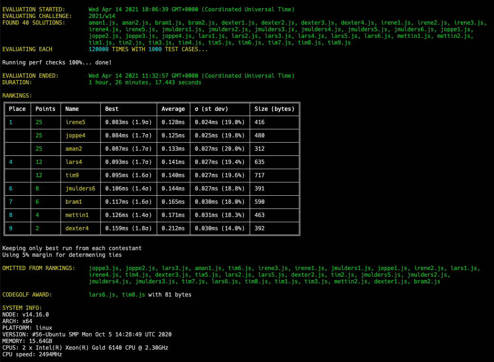

# Week 14 challenge

## ButY evaluator

For this week's challenge you will implement an **evaluator** for **arithmetic expressions** in the imaginary programming language **ButY**.

### Example

Here's an example of a simple expression in ButY:

```text
5 × ⸨ ⸨ 18 ÷ 2 ⸩ − 7 ⸩
```

Which... yeah. Luckily you won't have to write a lexer or parser, because your evaluator will be given an **Abstract Syntax Tree** as input:

```js
{
  type: 'BinaryExpression',
  operator: 'multiply',
  left: {
    type: 'Literal',
    value: 5
  },
  right: {
    type: 'BinaryExpression',
    operator: 'subtract',
    left: {
      type: 'BinaryExpression',
      operator: 'divide',
      left: {
        type: 'Literal',
        value: 18
      },
      right: {
        type: 'Literal',
        value: 2
      }
    },
    right: {
      type: 'Literal',
      value: 7
    }
  }
}
```

In this example the expected return value is `10`.

#### Examples in code

```js
evaluate({ type: 'Literal', value: 42 });
// returns 42

evaluate({
  type: 'BinaryExpression',
  operator: 'add',
  left: { type: 'Literal', value: 32 },
  right: { type: 'Literal', value: 10 },
});
// returns 42
```

### AST interface

```ts
type Expression = Literal | BinaryExpression

type Literal = {
  type: 'Literal',
  value: number
}

type BinaryExpression = {
  type: 'BinaryExpression',
  operator: 'add' | 'subtract' | 'multiply' | 'divide',
  left: Expression,
  right: Expression
}
```

### Other notes

You do not need to account for dividing by 0.

## Author

Peter-Paul

## Upload link

[Submissions are closed]


## Results


| Place | Name        | Performance | Codegolf | Jury award | Total points |
|-------|-------------|-------------|----------|------------|--------------|
| 1.    | Irene       | 25          |          |            | 25           |
|       | Joppe       | 25          |          |            | 25           |
|       | Aman        | 25          |          |            | 25           |
| 4.    | Lars        | 12          | 5        |            | 17           |
|       | Tim         | 12          | 5        |            | 17           |
| 6.    | Mettin      | 4           |          | 5          | 9            |
| 7.    | Jan Bart    | 8           |          |            | 8            |
| 8.    | Bram        | 6           |          |            | 6            |
| 9.    | Dexter      | 2           |          |            | 2            |

### Jury vote

#### Harijs
1. irene5 - fast and still very clear, well structured and readable.
2. dexter1 - I like how his code structure closely mirrors the butY language grammar.
3. lars1 - I like the style of creating operators map and function as value for each operation.

#### David

1. Jmulder1: For me this is the cleanest solutions. Nice way of combining some "fake enums :stuck_out_tongue: " with the switch statement. The list of operators and expression type would make it easy for others to expand
2. Mettin1: Also very clear, but it would be nice to throw an error when an operator doesnt match since we are checking strings here.
3. Lars2/Tim5: Using ramda for exact matches

#### Peter-Paul
1. mettin1: Very clean and correct. Would be easy to debug when - inevitably - new node types are added.
2. lars2: First one to find out the operator names exactly match ramda functions. 🤯
3. jmulders5: Shortest "pure" golf.

### Screenshot



### Full output log
```
EVALUATION STARTED:       Wed Apr 14 2021 10:06:39 GMT+0000 (Coordinated Universal Time)
EVALUATING CHALLENGE:     2021/w14
FOUND 40 SOLUTIONS:       aman1.js, aman2.js, bram1.js, bram2.js, dexter1.js, dexter2.js, dexter3.js, dexter4.js, irene1.js, irene2.js, irene3.js,
                          irene4.js, irene5.js, jmulders1.js, jmulders2.js, jmulders3.js, jmulders4.js, jmulders5.js, jmulders6.js, joppe1.js,
                          joppe2.js, joppe3.js, joppe4.js, lars1.js, lars2.js, lars3.js, lars4.js, lars5.js, lars6.js, mettin1.js, mettin2.js,
                          tim1.js, tim2.js, tim3.js, tim4.js, tim5.js, tim6.js, tim7.js, tim8.js, tim9.js
EVALUATING EACH           120000 TIMES WITH 1000 TEST CASES...

Running perf checks 100%... done!

EVALUATION ENDED:         Wed Apr 14 2021 11:32:57 GMT+0000 (Coordinated Universal Time)
DURATION:                 1 hour, 26 minutes, 17.443 seconds

RANKINGS:
╔═══════╤════════╤═══════════╤════════════════╤═════════╤═════════════════╤══════════════╗
║ Place │ Points │ Name      │ Best           │ Average │ σ (st dev)      │ Size (bytes) ║
╟───────┼────────┼───────────┼────────────────┼─────────┼─────────────────┼──────────────╢
║ 1     │ 25     │ irene5    │ 0.083ms (1.9σ) │ 0.128ms │ 0.024ms (19.0%) │ 416          ║
╟───────┼────────┼───────────┼────────────────┼─────────┼─────────────────┼──────────────╢
║       │ 25     │ joppe4    │ 0.084ms (1.7σ) │ 0.125ms │ 0.025ms (19.8%) │ 480          ║
╟───────┼────────┼───────────┼────────────────┼─────────┼─────────────────┼──────────────╢
║       │ 25     │ aman2     │ 0.087ms (1.7σ) │ 0.133ms │ 0.027ms (20.0%) │ 312          ║
╟───────┼────────┼───────────┼────────────────┼─────────┼─────────────────┼──────────────╢
║ 4     │ 12     │ lars4     │ 0.093ms (1.7σ) │ 0.141ms │ 0.027ms (19.4%) │ 635          ║
╟───────┼────────┼───────────┼────────────────┼─────────┼─────────────────┼──────────────╢
║       │ 12     │ tim9      │ 0.095ms (1.6σ) │ 0.140ms │ 0.027ms (19.6%) │ 717          ║
╟───────┼────────┼───────────┼────────────────┼─────────┼─────────────────┼──────────────╢
║ 6     │ 8      │ jmulders6 │ 0.106ms (1.4σ) │ 0.144ms │ 0.027ms (18.8%) │ 391          ║
╟───────┼────────┼───────────┼────────────────┼─────────┼─────────────────┼──────────────╢
║ 7     │ 6      │ bram1     │ 0.117ms (1.6σ) │ 0.165ms │ 0.030ms (18.0%) │ 590          ║
╟───────┼────────┼───────────┼────────────────┼─────────┼─────────────────┼──────────────╢
║ 8     │ 4      │ mettin1   │ 0.126ms (1.4σ) │ 0.171ms │ 0.031ms (18.3%) │ 463          ║
╟───────┼────────┼───────────┼────────────────┼─────────┼─────────────────┼──────────────╢
║ 9     │ 2      │ dexter4   │ 0.159ms (1.8σ) │ 0.212ms │ 0.030ms (14.0%) │ 392          ║
╚═══════╧════════╧═══════════╧════════════════╧═════════╧═════════════════╧══════════════╝

Keeping only best run from each contestant
Using 5% margin for determening ties

OMITTED FROM RANKINGS:    joppe3.js, joppe2.js, lars3.js, aman1.js, tim6.js, irene3.js, irene1.js, jmulders1.js, joppe1.js, irene2.js, lars1.js,
                          irene4.js, tim4.js, dexter3.js, tim5.js, lars2.js, lars5.js, dexter2.js, tim2.js, jmulders5.js, jmulders2.js,
                          jmulders4.js, jmulders3.js, tim7.js, lars6.js, tim8.js, tim1.js, tim3.js, mettin2.js, dexter1.js, bram2.js

CODEGOLF AWARD:           lars6.js, tim8.js with 81 bytes

SYSTEM INFO:
NODE: v14.16.0
ARCH: x64
PLATFORM: linux
VERSION: #56-Ubuntu SMP Mon Oct 5 14:28:49 UTC 2020
MEMORY: 15.64GB
CPUS: 2 x Intel(R) Xeon(R) Gold 6140 CPU @ 2.30GHz
CPU speed: 2494MHz

RAW RESULTS:
┌─────────┬────────────────┬────────┬────────────────────┬─────────────────────┬─────────────────────┬────────────────────┬──────────────────────┬──────┬────────┐
│ (index) │    solution    │ failed │       total        │       average       │        best         │       worst        │        stdev         │ size │  runs  │
├─────────┼────────────────┼────────┼────────────────────┼─────────────────────┼─────────────────────┼────────────────────┼──────────────────────┼──────┼────────┤
│    0    │  'irene5.js'   │ false  │ 15408.900702867453 │ 0.12840750585722877 │ 0.08310600044205785 │ 5.428020000021206  │ 0.02440056133355562  │ 416  │ 120000 │
│    1    │  'joppe4.js'   │ false  │ 14952.93562906736  │ 0.12460779690889467 │ 0.08373699989169836 │ 2.097259000001941  │ 0.02464638029377811  │ 480  │ 120000 │
│    2    │   'aman2.js'   │ false  │ 15940.44219005169  │ 0.13283701825043076 │ 0.08667699992656708 │ 3.102327000000514  │  0.0265573985981837  │ 312  │ 120000 │
│    3    │  'joppe3.js'   │ false  │ 15718.180515068787 │ 0.13098483762557322 │ 0.0894980002194643  │ 1.8189499999862164 │ 0.025430137635935393 │ 552  │ 120000 │
│    4    │   'lars4.js'   │ false  │ 16905.84730694833  │ 0.1408820608912361  │ 0.09314899996388704 │ 4.083738999994239  │ 0.027345079493990267 │ 635  │ 120000 │
│    5    │   'tim9.js'    │ false  │ 16792.527266969468 │ 0.13993772722474557 │ 0.09530800022184849 │ 2.9794140000012703 │ 0.027459567485517977 │ 717  │ 120000 │
│    6    │  'joppe2.js'   │ false  │ 16438.430243891606 │ 0.1369869186990967  │ 0.09850199986249208 │ 2.196351999999024  │ 0.025475592125508102 │ 520  │ 120000 │
│    7    │   'lars3.js'   │ false  │ 16931.304078077577 │ 0.14109420065064648 │ 0.09902000008150935 │ 2.7254980000143405 │ 0.026764562669536824 │ 440  │ 120000 │
│    8    │   'aman1.js'   │ false  │ 17990.511927991494 │ 0.14992093273326246 │ 0.10024799965322018 │ 10.444434999953955 │  0.0610853973689374  │ 315  │ 120000 │
│    9    │   'tim6.js'    │ false  │ 16849.383718992613 │ 0.1404115309916051  │ 0.10092799999983981 │ 2.4873509999888483 │ 0.02546196544524307  │ 458  │ 120000 │
│   10    │ 'jmulders6.js' │ false  │ 17318.59469905446  │ 0.14432162249212052 │ 0.10581800004001707 │ 1.3854119998868555 │ 0.027064070453117563 │ 391  │ 120000 │
│   11    │  'irene3.js'   │ false  │ 18188.64306189574  │ 0.15157202551579782 │ 0.11025599995627999 │ 2.7547730000223964 │ 0.028380077577550306 │ 342  │ 120000 │
│   12    │  'irene1.js'   │ false  │ 18468.821711929544 │ 0.15390684759941287 │ 0.11200099997222424 │ 9.726649000309408  │ 0.03899744704169356  │ 746  │ 120000 │
│   13    │ 'jmulders1.js' │ false  │ 18642.608518022083 │ 0.15535507098351736 │ 0.11393400002270937 │ 1.9011760000139475 │ 0.026889509839008216 │ 712  │ 120000 │
│   14    │  'joppe1.js'   │ false  │ 19068.92208393733  │ 0.15890768403281108 │ 0.11586600029841065 │ 1.4112379997968674 │ 0.026707929297728385 │ 522  │ 120000 │
│   15    │   'bram1.js'   │ false  │ 19761.545932061883 │ 0.16467954943384902 │ 0.11723500001244247 │ 3.274980999995023  │ 0.029624142058810653 │ 590  │ 120000 │
│   16    │  'mettin1.js'  │ false  │ 20483.81011207751  │ 0.1706984176006459  │ 0.12574900034815073 │ 5.416087999998126  │ 0.03129775933881926  │ 463  │ 120000 │
│   17    │  'irene2.js'   │ false  │ 24570.033493004215 │ 0.20475027910836846 │ 0.14692500000819564 │ 11.334098000079393 │  0.0845414320094221  │ 162  │ 120000 │
│   18    │  'dexter4.js'  │ false  │ 25406.971450944548 │ 0.21172476209120455 │ 0.15871499991044402 │ 1.5606830000178888 │ 0.02965210452599691  │ 392  │ 120000 │
│   19    │   'lars1.js'   │ false  │ 24950.02064902085  │ 0.20791683874184042 │ 0.16391099989414215 │ 1.484712999779731  │  0.0287001009679742  │ 371  │ 120000 │
│   20    │  'irene4.js'   │ false  │ 27052.843044008478 │ 0.22544035870007065 │ 0.16622699983417988 │  5.27563799964264  │  0.071905074408819   │ 146  │ 120000 │
│   21    │   'tim4.js'    │ false  │ 35157.05548301112  │ 0.29297546235842603 │ 0.2279519997537136  │ 7.068498999986332  │  0.0376178878230305  │  92  │ 120000 │
│   22    │  'dexter3.js'  │ false  │ 33870.05193007644  │ 0.28225043275063705 │ 0.22985699959099293 │ 2.7368880000140052 │ 0.03394994588469896  │ 554  │ 120000 │
│   23    │   'tim5.js'    │ false  │ 35165.24985300764  │ 0.2930437487750637  │ 0.23169300006702542 │ 2.2801519999920856 │ 0.03256013260938499  │ 177  │ 120000 │
│   24    │   'lars2.js'   │ false  │ 40159.33946606374  │ 0.3346611622171978  │  0.263721999945119  │ 8.138336000032723  │ 0.06141244100166308  │  93  │ 120000 │
│   25    │   'lars5.js'   │ false  │ 39835.00674000484  │ 0.33195838950004036 │ 0.26585100032389164 │ 2.7466950000089128 │ 0.05069725436588284  │  91  │ 120000 │
│   26    │  'dexter2.js'  │ false  │ 69265.30415583393  │ 0.5772108679652828  │ 0.4383930000476539  │ 39.16376599948853  │  0.2184423701190226  │ 160  │ 120000 │
│   27    │   'tim2.js'    │ false  │ 96737.52434194324  │ 0.8061460361828603  │ 0.5904560000635684  │  72.2945339998696  │ 0.26434367367491846  │ 928  │ 120000 │
│   28    │ 'jmulders5.js' │ false  │ 88751.95638895503  │ 0.7395996365746252  │ 0.6312560001388192  │ 4.366960000013933  │ 0.07906702770297452  │ 102  │ 120000 │
│   29    │ 'jmulders2.js' │ false  │ 89677.49717802179  │  0.747312476483515  │ 0.6333290003240108  │ 3.7121840000036173 │ 0.08612563591255414  │ 129  │ 120000 │
│   30    │ 'jmulders4.js' │ false  │ 90084.47787493988  │ 0.7507039822911656  │ 0.6411069994792342  │ 6.870409999974072  │  0.0894770637588455  │ 110  │ 120000 │
│   31    │ 'jmulders3.js' │ false  │ 89742.45274500438  │ 0.7478537728750365  │ 0.6435409998521209  │ 27.42404800001532  │ 0.11665747695437506  │ 128  │ 120000 │
│   32    │   'tim7.js'    │ false  │ 91183.17423102111  │ 0.7598597852585093  │ 0.6555029998999089  │ 3.457170999608934  │  0.0728524439207537  │  86  │ 120000 │
│   33    │   'lars6.js'   │ false  │ 102523.98196907697 │ 0.8543665164089748  │ 0.7047180002555251  │ 11.486247999593616 │ 0.08874738812005255  │  81  │ 120000 │
│   34    │   'tim8.js'    │ false  │ 102017.45156899138 │ 0.8501454297415949  │ 0.7376800000201911  │ 4.268062000046484  │  0.0777849224386876  │  81  │ 120000 │
│   35    │   'tim1.js'    │ false  │ 121885.2299780316  │  1.01571024981693   │ 0.7691579996608198  │  64.7487269998528  │ 0.25213194413902174  │ 144  │ 120000 │
│   36    │   'tim3.js'    │ false  │ 131477.91668893068 │  1.095649305741089  │ 0.8480440001003444  │ 63.90738300001249  │  0.2657983684148781  │ 125  │ 120000 │
│   37    │  'mettin2.js'  │ false  │ 244532.9246559966  │ 2.0377743721333053  │ 1.3669179999269545  │ 116.35683999955654 │  0.6093873977646229  │ 129  │ 120000 │
│   38    │  'dexter1.js'  │ false  │ 348847.2902260702  │  2.907060751883918  │  2.500280000269413  │ 42.779900999739766 │  0.274346795111969   │ 432  │ 120000 │
│   39    │   'bram2.js'   │ false  │ 2781247.325906888  │  23.17706104922407  │ 21.258056000020588  │  91.2335269995965  │  1.0085370800952627  │ 183  │ 120000 │
└─────────┴────────────────┴────────┴────────────────────┴─────────────────────┴─────────────────────┴────────────────────┴──────────────────────┴──────┴────────┘
```