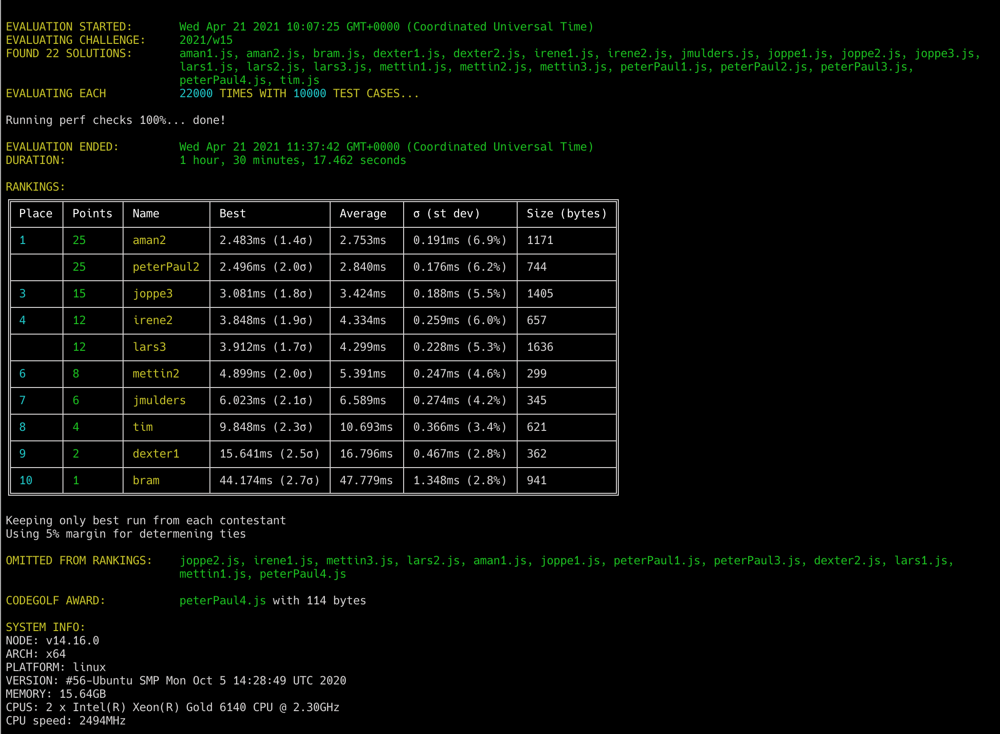

# Week 15 challenge

Congratulations! You have inheritted a huge legacy code base, and it is a mess! The naming convention is a total chaos.
Variables and functions are named in all sorts of ways. Worst of all - even hybrid naming conventions are there.

You and your colleague decide that it cannot stay that way for longer, and everything must be renamed to camel case.
Your colleague will do the scraping the codebase and collecting all instances of variable & function names.
Your task is to write a function `fixCase` which, given a variable name, in one of the many cases, always returns it renamed to a proper camel case.

**Note:** the hypothetical language of the codebase in this case accepts `-` and `'` as valid characters for variable names. So you will have to handle that :)

Examples:
```
fixCase('one') // returns 'one'
fixCase('ONE') // returns 'one'
fixCase('oneTwoThree') // returns 'oneTwoThree'
fixCase('OneTwoThree') // returns 'oneTwoThree'
fixCase('One\'TwoThree') // returns 'one\'TwoThree'
fixCase('OneT\'woThree') // returns 'oneT\'woThree'
fixCase('one-two-three') // returns 'oneTwoThree'
fixCase('one_two_three') // returns 'oneTwoThree'
fixCase('one_Two_three') // returns 'oneTwoThree'
fixCase('one_two-three') // returns 'oneTwoThree'
fixCase('one__two__three') // returns 'oneTwoThree'
fixCase('one--two--three') // returns 'oneTwoThree'
fixCase('one__two--three') // returns 'oneTwoThree'
fixCase('ONE_two_THREE') // returns 'oneTwoThree'
fixCase('ONE_Two--THREE') // returns 'oneTwoThree'
fixCase('ONE_Two--THREE') // returns 'oneTwoThree'
fixCase('ONE_Two--THR\'EE') // returns 'oneTwoThr\'ee'
```


## Upload link

[Submissions are closed]


## Results


| Place | Name        | Performance | Codegolf | Jury award | Total points |
|-------|-------------|-------------|----------|------------|--------------|
| 1.    | Peter-Paul  | 25          | 5        |            | 30           |
| 2.    | Aman        | 25          |          |            | 25           |
| 3.    | Irene       | 12          |          | 5          | 17           |
|       | Lars        | 12          |          | 5          | 17           |
| 5.    | Joppe       | 15          |          |            | 15           |
| 6.    | Mettin      | 8           |          |            | 8            |
| 7.    | Jan Bart    | 6           |          |            | 6            |
| 8.    | Tim         | 4           |          |            | 4            |
| 9.    | Dexter      | 2           |          |            | 2            |
| 10.   | Bram        | 1           |          |            | 1            |

### Jury vote

#### Harijs
1. lars3 - well commented and easy to follow logic
2. joppe3 - working with char codes under the hood and giving variable names to A,Z - etc.
3. mettin2 - split by regex + reduce

#### Israel
1. jmulders.js - because of his usage of all arguments of Array.reduce
2. irene2.js for her usage of Map as a cache
3. lars3.js for his nicely commented code, the thought process is really on display there

#### David
1. irene2 - clever usage of Map ( wonder if this solution wins speed wise with longer strings :wink: )
2. peterpaul1 - cleanest solution
3. lars3 - well documented and nice to follow thought process

### Screenshot



### Full output log
```
EVALUATION STARTED:       Wed Apr 21 2021 10:07:25 GMT+0000 (Coordinated Universal Time)
EVALUATING CHALLENGE:     2021/w15
FOUND 22 SOLUTIONS:       aman1.js, aman2.js, bram.js, dexter1.js, dexter2.js, irene1.js, irene2.js, jmulders.js, joppe1.js, joppe2.js, joppe3.js,
                          lars1.js, lars2.js, lars3.js, mettin1.js, mettin2.js, mettin3.js, peterPaul1.js, peterPaul2.js, peterPaul3.js,
                          peterPaul4.js, tim.js
EVALUATING EACH           22000 TIMES WITH 10000 TEST CASES...

Running perf checks 100%... done!

EVALUATION ENDED:         Wed Apr 21 2021 11:37:42 GMT+0000 (Coordinated Universal Time)
DURATION:                 1 hour, 30 minutes, 17.462 seconds

RANKINGS:
╔═══════╤════════╤════════════╤═════════════════╤══════════╤════════════════╤══════════════╗
║ Place │ Points │ Name       │ Best            │ Average  │ σ (st dev)     │ Size (bytes) ║
╟───────┼────────┼────────────┼─────────────────┼──────────┼────────────────┼──────────────╢
║ 1     │ 25     │ aman2      │ 2.483ms (1.4σ)  │ 2.753ms  │ 0.191ms (6.9%) │ 1171         ║
╟───────┼────────┼────────────┼─────────────────┼──────────┼────────────────┼──────────────╢
║       │ 25     │ peterPaul2 │ 2.496ms (2.0σ)  │ 2.840ms  │ 0.176ms (6.2%) │ 744          ║
╟───────┼────────┼────────────┼─────────────────┼──────────┼────────────────┼──────────────╢
║ 3     │ 15     │ joppe3     │ 3.081ms (1.8σ)  │ 3.424ms  │ 0.188ms (5.5%) │ 1405         ║
╟───────┼────────┼────────────┼─────────────────┼──────────┼────────────────┼──────────────╢
║ 4     │ 12     │ irene2     │ 3.848ms (1.9σ)  │ 4.334ms  │ 0.259ms (6.0%) │ 657          ║
╟───────┼────────┼────────────┼─────────────────┼──────────┼────────────────┼──────────────╢
║       │ 12     │ lars3      │ 3.912ms (1.7σ)  │ 4.299ms  │ 0.228ms (5.3%) │ 1636         ║
╟───────┼────────┼────────────┼─────────────────┼──────────┼────────────────┼──────────────╢
║ 6     │ 8      │ mettin2    │ 4.899ms (2.0σ)  │ 5.391ms  │ 0.247ms (4.6%) │ 299          ║
╟───────┼────────┼────────────┼─────────────────┼──────────┼────────────────┼──────────────╢
║ 7     │ 6      │ jmulders   │ 6.023ms (2.1σ)  │ 6.589ms  │ 0.274ms (4.2%) │ 345          ║
╟───────┼────────┼────────────┼─────────────────┼──────────┼────────────────┼──────────────╢
║ 8     │ 4      │ tim        │ 9.848ms (2.3σ)  │ 10.693ms │ 0.366ms (3.4%) │ 621          ║
╟───────┼────────┼────────────┼─────────────────┼──────────┼────────────────┼──────────────╢
║ 9     │ 2      │ dexter1    │ 15.641ms (2.5σ) │ 16.796ms │ 0.467ms (2.8%) │ 362          ║
╟───────┼────────┼────────────┼─────────────────┼──────────┼────────────────┼──────────────╢
║ 10    │ 1      │ bram       │ 44.174ms (2.7σ) │ 47.779ms │ 1.348ms (2.8%) │ 941          ║
╚═══════╧════════╧════════════╧═════════════════╧══════════╧════════════════╧══════════════╝

Keeping only best run from each contestant
Using 5% margin for determening ties

OMITTED FROM RANKINGS:    joppe2.js, irene1.js, mettin3.js, lars2.js, aman1.js, joppe1.js, peterPaul1.js, peterPaul3.js, dexter2.js, lars1.js,
                          mettin1.js, peterPaul4.js

CODEGOLF AWARD:           peterPaul4.js with 114 bytes

SYSTEM INFO:
NODE: v14.16.0
ARCH: x64
PLATFORM: linux
VERSION: #56-Ubuntu SMP Mon Oct 5 14:28:49 UTC 2020
MEMORY: 15.64GB
CPUS: 2 x Intel(R) Xeon(R) Gold 6140 CPU @ 2.30GHz
CPU speed: 2494MHz

RAW RESULTS:
┌─────────┬─────────────────┬────────┬────────────────────┬────────────────────┬────────────────────┬────────────────────┬─────────────────────┬──────┬───────┐
│ (index) │    solution     │ failed │       total        │      average       │        best        │       worst        │        stdev        │ size │ runs  │
├─────────┼─────────────────┼────────┼────────────────────┼────────────────────┼────────────────────┼────────────────────┼─────────────────────┼──────┼───────┤
│    0    │   'aman2.js'    │ false  │ 60572.74121905526  │ 2.7533064190479664 │ 2.482635999796912  │ 15.929511999711394 │ 0.19073080311952564 │ 1171 │ 22000 │
│    1    │ 'peterPaul2.js' │ false  │ 62470.26503501792  │ 2.8395575015917234 │ 2.4956360002979636 │ 6.011605000123382  │ 0.1761912500499651  │ 744  │ 22000 │
│    2    │   'joppe3.js'   │ false  │ 75331.21817499714  │ 3.424146280681688  │ 3.080963000189513  │ 5.863874000031501  │ 0.1882475255887894  │ 1405 │ 22000 │
│    3    │   'joppe2.js'   │ false  │  84031.0569230435  │ 3.8195934965019775 │ 3.451888999901712  │ 6.852880000136793  │ 0.19265878614780205 │ 1344 │ 22000 │
│    4    │   'irene2.js'   │ false  │ 95356.77159594791  │ 4.334398708906723  │ 3.8477630000561476 │ 19.445569000032265 │  0.25901606632161   │ 657  │ 22000 │
│    5    │   'lars3.js'    │ false  │ 94588.97807806043  │ 4.299499003548202  │ 3.9120610002428293 │ 16.954177999985404 │ 0.2284385477291348  │ 1636 │ 22000 │
│    6    │   'irene1.js'   │ false  │ 100708.50658799871 │ 4.577659390363578  │ 4.126204999978654  │ 8.373992000008002  │ 0.22634922688779338 │ 584  │ 22000 │
│    7    │  'mettin2.js'   │ false  │ 118594.90321095963 │ 5.390677418679983  │ 4.8987940000370145 │ 13.168384999968112 │ 0.2470646725525943  │ 299  │ 22000 │
│    8    │  'mettin3.js'   │ false  │ 122782.36955608358 │ 5.581016798003799  │ 5.089799999957904  │ 12.995929999975488 │ 0.2546575378577569  │ 135  │ 22000 │
│    9    │   'lars2.js'    │ false  │ 131048.78646600002 │ 5.956763021181819  │ 5.429609999991953  │ 10.905437000095844 │ 0.26408007456684046 │ 699  │ 22000 │
│   10    │  'jmulders.js'  │ false  │ 144957.0481060057  │ 6.588956732091169  │  6.02345799934119  │ 13.069958999985829 │  0.273993443455754  │ 345  │ 22000 │
│   11    │   'aman1.js'    │ false  │ 157986.8406370452  │  7.1812200289566   │ 6.599127000197768  │ 13.29862799984403  │ 0.28673158211003624 │ 319  │ 22000 │
│   12    │   'joppe1.js'   │ false  │ 228921.91418704396 │ 10.405541553956544 │  9.58563799993135  │ 20.655260999919847 │ 0.36703157684151877 │ 784  │ 22000 │
│   13    │    'tim.js'     │ false  │  235254.178670021  │ 10.693371757728228 │ 9.848314000060782  │ 20.070997000206262 │ 0.3663493411212725  │ 621  │ 22000 │
│   14    │ 'peterPaul1.js' │ false  │ 237194.29689697776 │ 10.781558949862625 │ 9.930588000221178  │ 21.53870499995537  │ 0.35939962716074314 │ 885  │ 22000 │
│   15    │  'dexter1.js'   │ false  │ 369516.1176050221  │ 16.79618716386464  │ 15.641146999783814 │ 30.963782000122592 │ 0.46722457852861143 │ 362  │ 22000 │
│   16    │ 'peterPaul3.js' │ false  │ 369416.8036969531  │ 16.79167289531605  │ 15.780482000205666 │  31.2126209998969  │ 0.4766351786169923  │ 120  │ 22000 │
│   17    │  'dexter2.js'   │ false  │ 371095.4234480586  │ 16.867973793093572 │ 15.802576000103727 │ 29.450108000077307 │  0.508165167888105  │ 221  │ 22000 │
│   18    │   'lars1.js'    │ false  │ 378894.5070989914  │  17.2224775954087  │ 16.205010999925435 │ 32.26422900008038  │ 0.48456510481069975 │ 121  │ 22000 │
│   19    │  'mettin1.js'   │ false  │ 410780.69601598626 │ 18.671849818908466 │ 17.371713999891654 │ 40.67255000001751  │ 0.5665448964493811  │ 618  │ 22000 │
│   20    │ 'peterPaul4.js' │ false  │ 491258.4232690524  │ 22.329928330411473 │ 21.025672999909148 │ 41.048535000067204 │ 0.6037330164710424  │ 114  │ 22000 │
│   21    │    'bram.js'    │ false  │ 1051148.7813990042 │  47.7794900635911  │ 44.17417899996508  │ 96.20104800001718  │ 1.3478812177090718  │ 941  │ 22000 │
└─────────┴─────────────────┴────────┴────────────────────┴────────────────────┴────────────────────┴────────────────────┴─────────────────────┴──────┴───────┘
```