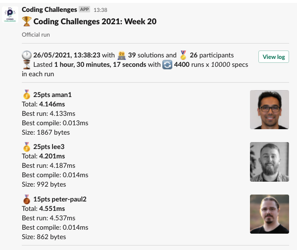
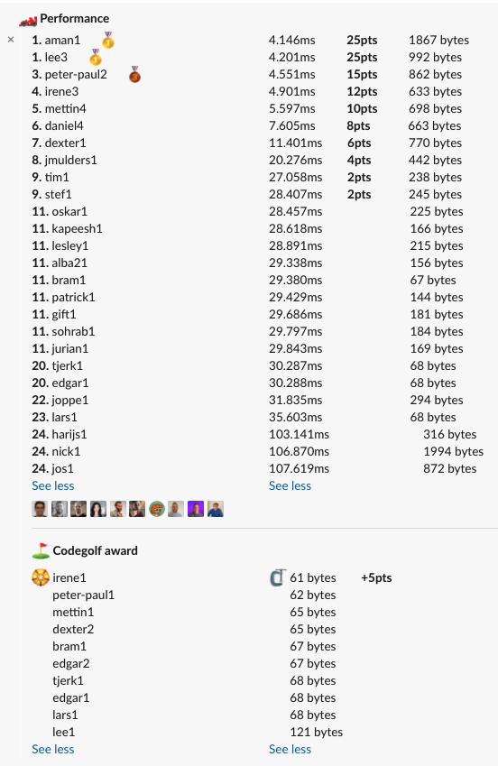

# Week 20 challenge

Write a function `mergeArrays` which takes in 2 arrays as first 2 arguments and output sorting direction as 3rd.
Both input arrays will be sorted, so perhaps you can take advantage of that.
However, the length and and input array sorting direction is variable.

**Note:**
The input arrays should not be mutated!
The result should always be a new array.

Examples:
```
mergeArrays([1, 2, 3, 4], [8, 7, 6, 5], 'asc') // returns [1, 2, 3, 4, 5, 6 ,7, 8]
mergeArrays([10, 6, 2, 1, -1, -5], [3, 4, 7, 9], 'desc') // returns [10, 9, 7, 6, 4, 3, 2, 1, -1, -5]
```


## Upload link

[Submissions are closed]

## Results


| Place | Name        | Performance | Codegolf | Jury award | Total points |
|-------|-------------|-------------|----------|------------|--------------|
| 1.    | Aman        | 25          |          |            | 25           |
|       | Lee         | 25          |          |            | 25           |
| 3.    | Irene       | 12          | 5        |            | 17           |
| 4.    | Peter-Paul  | 15          |          |            | 15           |
| 5.    | Mettin      | 10          |          |            | 10           |
| 6.    | Daniel      | 8           |          |            | 8            |
| 7.    | Tim         | 2           |          | 5          | 7            |
| 8.    | Dexter      | 6           |          |            | 6            |
| 9.    | Jan Bart    | 4           |          |            | 4            |
| 10.   | Stef        | 2           |          |            | 2            |

### Jury vote

#### Harijs
1. Aman1 - fast as hell and using empty for (; ;) statements which I hadn’t seen in practice before :smile:
2. Irene1 - genious c[3]? for shortest way to check if sorting is to be done descending
3. Tim1 - Code like an Egyptian :joy:

#### David

1. Tim1 Thats the coolest piece of code I've seen so far in this coding challange
2. Jos1 The combo breaker throw :'D
3. Nick1 AJAX!!!!

### Screenshot





### Full output log
```
EVALUATION STARTED:                 26/05/2021, 12:08:01
EVALUATING CHALLENGE:               2021/w20
FOUND 39 SOLUTIONS:                 alba21.js, aman1.js, bram1.js, daniel1.js, daniel2.js, daniel3.js, daniel4.js, dexter1.js, dexter2.js, edgar1.js,
                                    edgar2.js, gift1.js, harijs1.js, irene1.js, irene2.js, irene3.js, jmulders1.js, joppe1.js, jos1.js, jurian1.js,
                                    kapeesh1.js, lars1.js, lee1.js, lee2.js, lee3.js, lesley1.js, mettin1.js, mettin2.js, mettin3.js, mettin4.js, nick1.js,
                                    oskar1.js, patrick1.js, peter-paul1.js, peter-paul2.js, sohrab1.js, stef1.js, tim1.js, tjerk1.js
RUNNING EVALUATION FOR:             5400 SECONDS WITH 10000 TEST CASES IN EACH CYCLE...


EVALUATION ENDED:                   26/05/2021, 13:38:18
DURATION:                           1 hour, 30 minutes, 17.045 seconds

RANKINGS:
╔═══════╤════════╤═════════════╤═══════════╤═══════════╤══════════════╤══════╗
║ Place │ Points │ Name        │ Total     │ Best run  │ Best compile │ Size ║
╟───────┼────────┼─────────────┼───────────┼───────────┼──────────────┼──────╢
║ 1     │ 25     │ aman1       │ 4.146ms   │ 4.133ms   │ 0.013ms      │ 1867 ║
╟───────┼────────┼─────────────┼───────────┼───────────┼──────────────┼──────╢
║       │ 25     │ lee3        │ 4.201ms   │ 4.187ms   │ 0.014ms      │ 992  ║
╟───────┼────────┼─────────────┼───────────┼───────────┼──────────────┼──────╢
║ 3     │ 15     │ peter-paul2 │ 4.551ms   │ 4.537ms   │ 0.014ms      │ 862  ║
╟───────┼────────┼─────────────┼───────────┼───────────┼──────────────┼──────╢
║ 4     │ 12     │ irene3      │ 4.901ms   │ 4.886ms   │ 0.015ms      │ 633  ║
╟───────┼────────┼─────────────┼───────────┼───────────┼──────────────┼──────╢
║ 5     │ 10     │ mettin4     │ 5.597ms   │ 5.583ms   │ 0.013ms      │ 698  ║
╟───────┼────────┼─────────────┼───────────┼───────────┼──────────────┼──────╢
║ 6     │ 8      │ daniel4     │ 7.605ms   │ 7.587ms   │ 0.018ms      │ 663  ║
╟───────┼────────┼─────────────┼───────────┼───────────┼──────────────┼──────╢
║ 7     │ 6      │ dexter1     │ 11.401ms  │ 11.386ms  │ 0.015ms      │ 770  ║
╟───────┼────────┼─────────────┼───────────┼───────────┼──────────────┼──────╢
║ 8     │ 4      │ jmulders1   │ 20.276ms  │ 20.260ms  │ 0.016ms      │ 442  ║
╟───────┼────────┼─────────────┼───────────┼───────────┼──────────────┼──────╢
║ 9     │ 2      │ tim1        │ 27.058ms  │ 27.041ms  │ 0.016ms      │ 238  ║
╟───────┼────────┼─────────────┼───────────┼───────────┼──────────────┼──────╢
║       │ 2      │ stef1       │ 28.407ms  │ 28.391ms  │ 0.016ms      │ 245  ║
╟───────┼────────┼─────────────┼───────────┼───────────┼──────────────┼──────╢
║ 11    │        │ oskar1      │ 28.457ms  │ 28.441ms  │ 0.016ms      │ 225  ║
╟───────┼────────┼─────────────┼───────────┼───────────┼──────────────┼──────╢
║       │        │ kapeesh1    │ 28.618ms  │ 28.603ms  │ 0.016ms      │ 166  ║
╟───────┼────────┼─────────────┼───────────┼───────────┼──────────────┼──────╢
║       │        │ lesley1     │ 28.891ms  │ 28.875ms  │ 0.016ms      │ 215  ║
╟───────┼────────┼─────────────┼───────────┼───────────┼──────────────┼──────╢
║       │        │ alba21      │ 29.338ms  │ 29.323ms  │ 0.015ms      │ 156  ║
╟───────┼────────┼─────────────┼───────────┼───────────┼──────────────┼──────╢
║       │        │ bram1       │ 29.380ms  │ 29.366ms  │ 0.014ms      │ 67   ║
╟───────┼────────┼─────────────┼───────────┼───────────┼──────────────┼──────╢
║       │        │ patrick1    │ 29.429ms  │ 29.414ms  │ 0.015ms      │ 144  ║
╟───────┼────────┼─────────────┼───────────┼───────────┼──────────────┼──────╢
║       │        │ gift1       │ 29.686ms  │ 29.670ms  │ 0.016ms      │ 181  ║
╟───────┼────────┼─────────────┼───────────┼───────────┼──────────────┼──────╢
║       │        │ sohrab1     │ 29.797ms  │ 29.781ms  │ 0.016ms      │ 184  ║
╟───────┼────────┼─────────────┼───────────┼───────────┼──────────────┼──────╢
║       │        │ jurian1     │ 29.843ms  │ 29.827ms  │ 0.016ms      │ 169  ║
╟───────┼────────┼─────────────┼───────────┼───────────┼──────────────┼──────╢
║ 20    │        │ tjerk1      │ 30.287ms  │ 30.273ms  │ 0.014ms      │ 68   ║
╟───────┼────────┼─────────────┼───────────┼───────────┼──────────────┼──────╢
║       │        │ edgar1      │ 30.288ms  │ 30.274ms  │ 0.014ms      │ 68   ║
╟───────┼────────┼─────────────┼───────────┼───────────┼──────────────┼──────╢
║ 22    │        │ joppe1      │ 31.835ms  │ 31.820ms  │ 0.015ms      │ 294  ║
╟───────┼────────┼─────────────┼───────────┼───────────┼──────────────┼──────╢
║ 23    │        │ lars1       │ 35.603ms  │ 35.589ms  │ 0.014ms      │ 68   ║
╟───────┼────────┼─────────────┼───────────┼───────────┼──────────────┼──────╢
║ 24    │        │ harijs1     │ 103.141ms │ 103.114ms │ 0.027ms      │ 316  ║
╟───────┼────────┼─────────────┼───────────┼───────────┼──────────────┼──────╢
║       │        │ nick1       │ 106.870ms │ 106.846ms │ 0.023ms      │ 1994 ║
╟───────┼────────┼─────────────┼───────────┼───────────┼──────────────┼──────╢
║       │        │ jos1        │ 107.619ms │ 107.599ms │ 0.020ms      │ 872  ║
╚═══════╧════════╧═════════════╧═══════════╧═══════════╧══════════════╧══════╝

Keeping only best run from each contestant
Using 5% margin for determening ties

OMITTED FROM RANKINGS:              lee2.js, irene2.js, mettin2.js, mettin3.js, daniel3.js, daniel2.js, daniel1.js, mettin1.js, edgar2.js, lee1.js,
                                    irene1.js, peter-paul1.js, dexter2.js

CODEGOLF AWARD:                     irene1.js with 61 bytes

SYSTEM INFO:
NODE: v14.16.0
ARCH: x64
PLATFORM: linux
VERSION: #56-Ubuntu SMP Mon Oct 5 14:28:49 UTC 2020
MEMORY: 15.64GB
CPUS: 2 x Intel(R) Xeon(R) Gold 6140 CPU @ 2.30GHz
CPU speed: 2494MHz

RAW RESULTS:
┌─────────┬──────────────────┬────────────────────┬────────────────────┬──────────────────────┬──────┬────────────────┬────────────────────┬──────────────┬────────┬────────────┬──────┐
│ (index) │     solution     │       total        │      bestRun       │     bestCompile      │ size │    compiled    │   validationTime   │ onlyCodegolf │ failed │ failReason │ runs │
├─────────┼──────────────────┼────────────────────┼────────────────────┼──────────────────────┼──────┼────────────────┼────────────────────┼──────────────┼────────┼────────────┼──────┤
│    0    │    'aman1.js'    │ 4.146058999933302  │ 4.132907000137493  │ 0.013151999795809388 │ 1867 │ 'successfully' │ 77.30218299999979  │    false     │ false  │    null    │ 4400 │
│    1    │    'lee3.js'     │ 4.201456000097096  │ 4.186997000128031  │ 0.01445899996906519  │ 992  │ 'successfully' │     84.696731      │    false     │ false  │    null    │ 4400 │
│    2    │    'lee2.js'     │ 4.416872999398038  │ 4.4013980000745505 │ 0.015474999323487282 │ 856  │ 'successfully' │ 73.56319900000017  │    false     │ false  │    null    │ 4400 │
│    3    │ 'peter-paul2.js' │ 4.5508309996221215 │ 4.536554999649525  │ 0.014275999972596765 │ 862  │ 'successfully' │ 66.33422799999971  │    false     │ false  │    null    │ 4400 │
│    4    │   'irene3.js'    │ 4.901060999836773  │ 4.886020000092685  │ 0.015040999744087458 │ 633  │ 'successfully' │ 73.49549000000115  │    false     │ false  │    null    │ 4400 │
│    5    │   'irene2.js'    │ 5.503410000004806  │ 5.4891339999157935 │ 0.014276000089012086 │ 803  │ 'successfully' │ 85.41537799999787  │    false     │ false  │    null    │ 4400 │
│    6    │   'mettin4.js'   │ 5.596706000156701  │ 5.583310000132769  │ 0.013396000023931265 │ 698  │ 'successfully' │ 79.33515899999838  │    false     │ false  │    null    │ 4400 │
│    7    │   'daniel4.js'   │ 7.605220000259578  │ 7.5867440002039075 │ 0.018476000055670738 │ 663  │ 'successfully' │ 87.32533899999908  │    false     │ false  │    null    │ 4400 │
│    8    │   'mettin2.js'   │ 8.177374999038875  │  8.16191599983722  │ 0.015458999201655388 │ 481  │ 'successfully' │ 85.16463999999905  │    false     │ false  │    null    │ 4400 │
│    9    │   'mettin3.js'   │ 8.410489999689162  │ 8.395306999795139  │ 0.015182999894022942 │ 800  │ 'successfully' │ 91.06162200000108  │    false     │ false  │    null    │ 4400 │
│   10    │   'dexter1.js'   │  11.4012460000813  │ 11.386163000017405 │ 0.01508300006389618  │ 770  │ 'successfully' │ 88.78382599999895  │    false     │ false  │    null    │ 4400 │
│   11    │   'daniel3.js'   │ 15.941178000182845 │ 15.91906100010965  │ 0.022117000073194504 │ 901  │ 'successfully' │ 96.56444300000294  │    false     │ false  │    null    │ 4400 │
│   12    │   'daniel2.js'   │ 18.04886099952273  │ 18.02714499994181  │ 0.021715999580919743 │ 1110 │ 'successfully' │ 180.85451300000204 │    false     │ false  │    null    │ 4400 │
│   13    │  'jmulders1.js'  │ 20.275791000109166 │ 20.259879000019282 │ 0.015912000089883804 │ 442  │ 'successfully' │ 96.95157299999846  │    false     │ false  │    null    │ 4400 │
│   14    │    'tim1.js'     │ 27.057513000443578 │ 27.041037000715733 │ 0.016475999727845192 │ 238  │ 'successfully' │ 103.67990099999588 │    false     │ false  │    null    │ 4400 │
│   15    │   'daniel1.js'   │ 28.163701999932528 │ 28.147158000152558 │ 0.016543999779969454 │ 147  │ 'successfully' │ 109.84051100000215 │    false     │ false  │    null    │ 4400 │
│   16    │    'stef1.js'    │ 28.40686299977824  │ 28.390871999785304 │ 0.01599099999293685  │ 245  │ 'successfully' │ 104.08415199999581 │    false     │ false  │    null    │ 4400 │
│   17    │   'oskar1.js'    │ 28.456601000856608 │ 28.440957000479102 │ 0.015644000377506018 │ 225  │ 'successfully' │ 104.16131199999654 │    false     │ false  │    null    │ 4400 │
│   18    │  'kapeesh1.js'   │ 28.61845500022173  │ 28.60282399971038  │ 0.015631000511348248 │ 166  │ 'successfully' │ 103.63811200000055 │    false     │ false  │    null    │ 4400 │
│   19    │   'lesley1.js'   │ 28.890876000747085 │ 28.875088999979198 │ 0.01578700076788664  │ 215  │ 'successfully' │ 104.07620500000121 │    false     │ false  │    null    │ 4400 │
│   20    │   'alba21.js'    │ 29.338267999701202 │ 29.32289300020784  │ 0.01537499949336052  │ 156  │ 'successfully' │ 154.3899960000017  │    false     │ false  │    null    │ 4400 │
│   21    │    'bram1.js'    │ 29.38039599964395  │ 29.36620199959725  │ 0.01419400004670024  │  67  │ 'successfully' │ 111.06128000000172 │    false     │ false  │    null    │ 4400 │
│   22    │  'patrick1.js'   │ 29.42932999972254  │ 29.413834000006318 │ 0.015495999716222286 │ 144  │ 'successfully' │ 106.9254460000011  │    false     │ false  │    null    │ 4400 │
│   23    │    'gift1.js'    │ 29.68622599961236  │ 29.670059999916703 │ 0.016165999695658684 │ 181  │ 'successfully' │ 112.08081200000015 │    false     │ false  │    null    │ 4400 │
│   24    │   'sohrab1.js'   │ 29.796889000339434 │ 29.78119400050491  │ 0.015694999834522605 │ 184  │ 'successfully' │ 104.96536500000366 │    false     │ false  │    null    │ 4400 │
│   25    │   'jurian1.js'   │ 29.84300100035034  │ 29.827487000264227 │ 0.01551400008611381  │ 169  │ 'successfully' │ 103.60116500000004 │    false     │ false  │    null    │ 4400 │
│   26    │   'mettin1.js'   │ 29.87739099934697  │ 29.862917999736965 │ 0.01447299961000681  │  65  │ 'successfully' │ 103.81494699999894 │    false     │ false  │    null    │ 4400 │
│   27    │   'tjerk1.js'    │ 30.28686499968171  │ 30.272595999762416 │ 0.014268999919295311 │  68  │ 'successfully' │ 104.13080500000069 │    false     │ false  │    null    │ 4400 │
│   28    │   'edgar1.js'    │ 30.287960999878123 │ 30.274042000062764 │ 0.013918999815359712 │  68  │ 'successfully' │ 112.4124849999971  │    false     │ false  │    null    │ 4400 │
│   29    │   'edgar2.js'    │ 30.402528000529855 │ 30.388199000619352 │ 0.014328999910503626 │  67  │ 'successfully' │ 109.92065000000002 │    false     │ false  │    null    │ 4400 │
│   30    │    'lee1.js'     │ 30.420964000746608 │ 30.40693600010127  │ 0.014028000645339489 │ 121  │ 'successfully' │ 104.33667300000161 │    false     │ false  │    null    │ 4400 │
│   31    │   'joppe1.js'    │ 31.83473900007084  │ 31.81969100004062  │ 0.015048000030219555 │ 294  │ 'successfully' │ 104.19337200000155 │    false     │ false  │    null    │ 4400 │
│   32    │   'irene1.js'    │ 32.519682000158355 │ 32.50595800019801  │ 0.01372399996034801  │  61  │ 'successfully' │ 106.86365899999873 │    false     │ false  │    null    │ 4400 │
│   33    │ 'peter-paul1.js' │ 32.70457400009036  │ 32.690268999896944 │ 0.014305000193417072 │  62  │ 'successfully' │ 106.29172199999448 │    false     │ false  │    null    │ 4400 │
│   34    │   'dexter2.js'   │ 34.83805899973959  │ 34.823774999938905 │ 0.014283999800682068 │  65  │ 'successfully' │ 109.16133700000137 │    false     │ false  │    null    │ 4400 │
│   35    │    'lars1.js'    │ 35.602920999750495 │ 35.58865599986166  │ 0.014264999888837337 │  68  │ 'successfully' │ 105.78166899999997 │    false     │ false  │    null    │ 4400 │
│   36    │   'harijs1.js'   │ 103.14099299989175 │ 103.11373599991202 │ 0.02725699997972697  │ 316  │ 'successfully' │ 219.51927199999773 │    false     │ false  │    null    │ 4400 │
│   37    │    'nick1.js'    │ 106.86956300074235 │ 106.84616200020537 │ 0.023401000536978245 │ 1994 │ 'successfully' │ 1324.5310290000016 │    false     │ false  │    null    │ 4400 │
│   38    │    'jos1.js'     │ 107.6185459997505  │ 107.5986700002104  │ 0.01987599954009056  │ 872  │ 'successfully' │ 415.75459899999987 │    false     │ false  │    null    │ 4400 │
└─────────┴──────────────────┴────────────────────┴────────────────────┴──────────────────────┴──────┴────────────────┴────────────────────┴──────────────┴────────┴────────────┴──────┘
```