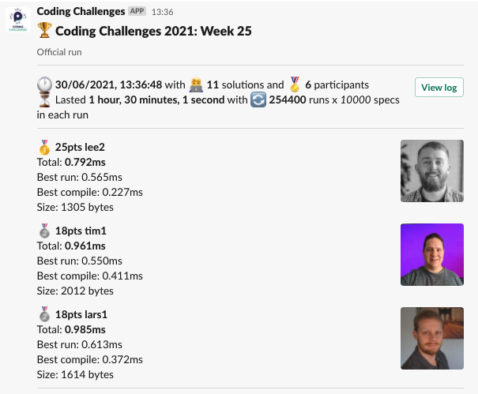
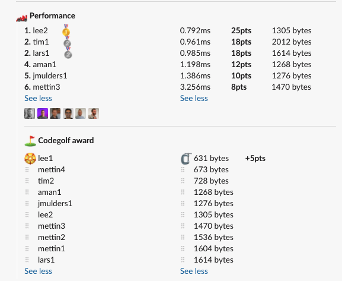

# Week 25 challenge

Write a function `spellItOut` which takes in an integer in the range -999999 to 999999 (included) and spells it out in english.

**Note:**
For this challenge character limit is raised to 4096

Examples:
```
spellItOut(0) // return 'zero'
spellItOut(5) // return 'five'
spellItOut(-7) // return 'minus seven'
spellItOut(27) // return 'twenty-seven'
spellItOut(205) // return 'two hundred five'
spellItOut(-752) // return 'minus seven hundred fifty-two'
spellItOut(17346) // return 'seventeen thousand three hundred forty-six'
spellItOut(654321) // return 'six hundred fifty-four thousand three hundred twenty-one'
spellItOut(-1233456) // return 'minus one hundred twenty-three thousand four hundred fifty-six'
spellItOut(999999) // return 'nine hundred ninety-nine thousand nine hundred ninety-nine'
spellItOut(-999999) // return 'minus nine hundred ninety-nine thousand nine hundred ninety-nine'
```


## Upload link

[PP Connect](https://connect.passionatepeople.io/code-challenge-submission)

## Results


| Place | Name        | Performance | Codegolf | Jury award | Total points |
|-------|-------------|-------------|----------|------------|--------------|
| 1.    | Lee         | 25          | 5        |            | 30           |
| 2.    | Tim         | 18          |          |            | 18           |
|       | Lars        | 18          |          |            | 18           |
| 4.    | Aman        | 12          |          | 5          | 17           |
| 5.    | Jan Bart    | 10          |          |            | 10           |
| 6.    | Mettin      | 8           |          |            | 8            |

### Jury vote

#### Harijs

1. aman - Assembling result from hundreds and tens
2. jmulders - Interesting approach with convert and getting hundreds
3. lee1 - nice to see all the functionality in 631 bytes

### Screenshot





### Full output log
```
EVALUATION STARTED:                 30/06/2021, 12:06:42
EVALUATING CHALLENGE:               2021/w25
FOUND 11 SOLUTIONS:                 aman1.js, jmulders1.js, lars1.js, lee1.js, lee2.js, mettin1.js, mettin2.js, mettin3.js, mettin4.js, tim1.js, tim2.js
RUNNING EVALUATION FOR:             5400 SECONDS WITH 10000 TEST CASES IN EACH CYCLE...


EVALUATION ENDED:                   30/06/2021, 13:36:43
DURATION:                           1 hour, 30 minutes, 1.085 seconds

RANKINGS:
╔═══════╤════════╤═══════════╤═════════╤══════════╤══════════════╤══════╗
║ Place │ Points │ Name      │ Total   │ Best run │ Best compile │ Size ║
╟───────┼────────┼───────────┼─────────┼──────────┼──────────────┼──────╢
║ 1     │ 25     │ lee2      │ 0.792ms │ 0.565ms  │ 0.227ms      │ 1305 ║
╟───────┼────────┼───────────┼─────────┼──────────┼──────────────┼──────╢
║ 2     │ 18     │ tim1      │ 0.961ms │ 0.550ms  │ 0.411ms      │ 2012 ║
╟───────┼────────┼───────────┼─────────┼──────────┼──────────────┼──────╢
║       │ 18     │ lars1     │ 0.985ms │ 0.613ms  │ 0.372ms      │ 1614 ║
╟───────┼────────┼───────────┼─────────┼──────────┼──────────────┼──────╢
║ 4     │ 12     │ aman1     │ 1.198ms │ 1.164ms  │ 0.034ms      │ 1268 ║
╟───────┼────────┼───────────┼─────────┼──────────┼──────────────┼──────╢
║ 5     │ 10     │ jmulders1 │ 1.386ms │ 1.356ms  │ 0.030ms      │ 1276 ║
╟───────┼────────┼───────────┼─────────┼──────────┼──────────────┼──────╢
║ 6     │ 8      │ mettin3   │ 3.256ms │ 2.592ms  │ 0.664ms      │ 1470 ║
╚═══════╧════════╧═══════════╧═════════╧══════════╧══════════════╧══════╝

Keeping only best run from each contestant
Using 5% margin for determening ties

OMITTED FROM RANKINGS:              mettin2.js

ONLY CODEGOLF SOLUTIONS:            lee1.js, mettin1.js, mettin4.js, tim2.js

CODEGOLF AWARD:                     lee1.js with 631 bytes

SYSTEM INFO:
NODE: v14.16.0
ARCH: x64
PLATFORM: linux
VERSION: #56-Ubuntu SMP Mon Oct 5 14:28:49 UTC 2020
MEMORY: 15.64GB
CPUS: 2 x Intel(R) Xeon(R) Gold 6140 CPU @ 2.30GHz
CPU speed: 2494MHz

RAW RESULTS:
┌─────────┬────────────────┬────────────────────┬────────────────────┬──────────────────────┬──────┬────────────────┬────────────────────┬──────────────┬────────┬────────────┬────────┐
│ (index) │    solution    │       total        │      bestRun       │     bestCompile      │ size │    compiled    │   validationTime   │ onlyCodegolf │ failed │ failReason │  runs  │
├─────────┼────────────────┼────────────────────┼────────────────────┼──────────────────────┼──────┼────────────────┼────────────────────┼──────────────┼────────┼────────────┼────────┤
│    0    │   'lee2.js'    │ 0.7916399992536753 │ 0.5645499993115664 │  0.227089999942109   │ 1305 │ 'successfully' │ 17.251280999998926 │    false     │ false  │    null    │ 254400 │
│    1    │   'tim1.js'    │ 0.9607610004022717 │ 0.5499970000237226 │  0.4107640003785491  │ 2012 │ 'successfully' │ 15.635201000000961 │    false     │ false  │    null    │ 254400 │
│    2    │   'lars1.js'   │ 0.9851769997621886 │ 0.6132360000046901 │  0.3719409997574985  │ 1614 │ 'successfully' │ 30.868798999999854 │    false     │ false  │    null    │ 254400 │
│    3    │   'aman1.js'   │ 1.197829000186175  │ 1.1638329999987036 │ 0.03399600018747151  │ 1268 │ 'successfully' │ 47.03169800000069  │    false     │ false  │    null    │ 254400 │
│    4    │ 'jmulders1.js' │ 1.3858560007065535 │ 1.3556289998814464 │ 0.030227000825107098 │ 1276 │ 'successfully' │ 41.18746099999953  │    false     │ false  │    null    │ 254400 │
│    5    │  'mettin3.js'  │ 3.255863999715075  │ 2.5922719999216497 │  0.6635919997934252  │ 1470 │ 'successfully' │ 25.21782500000154  │    false     │ false  │    null    │ 254400 │
│    6    │  'mettin2.js'  │ 3.8383580003865063 │ 3.171982000116259  │  0.6663760002702475  │ 1536 │ 'successfully' │ 24.647683999999572 │    false     │ false  │    null    │ 254400 │
│    7    │   'lee1.js'    │        null        │        null        │         null         │ 631  │ 'successfully' │ 29.018137999999453 │     true     │ false  │    null    │   0    │
│    8    │  'mettin1.js'  │        null        │        null        │         null         │ 1604 │ 'successfully' │  21.5280359999997  │     true     │ false  │    null    │   0    │
│    9    │  'mettin4.js'  │        null        │        null        │         null         │ 673  │ 'successfully' │ 40.00314999999864  │     true     │ false  │    null    │   0    │
│   10    │   'tim2.js'    │        null        │        null        │         null         │ 728  │ 'successfully' │ 58.68020400000023  │     true     │ false  │    null    │   0    │
└─────────┴────────────────┴────────────────────┴────────────────────┴──────────────────────┴──────┴────────────────┴────────────────────┴──────────────┴────────┴────────────┴────────┘
```