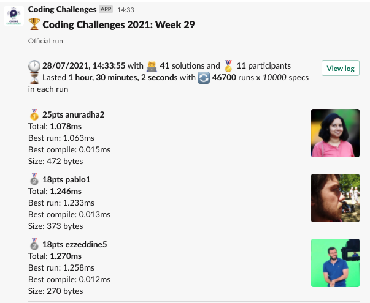

# Week 29 challenge

Write a function `chopMeUp` which takes in a string (1st argument) and splits it in `N` (2nd argument) sized chunks (defaults to `2`).
If the last chunk is shorter than `N`, then fill the missing characters with symbol `S` (3rd argument, which defaults to `_`).


Examples:
```
chopMeUp('abcd') // returns ["ab", "cd"]
chopMeUp('abcde') // returns ["ab", "cd", "e_"]
chopMeUp('abcdefghijklm', 3) // returns ["abc", "def", "ghi", "jkl", "m__"]
chopMeUp('abcdefghij', 7, '*') // returns ["abcdefg", "hij****"]
```

## Upload link

[PP Connect](https://connect.passionatepeople.io/code-challenge-submission)

## Results


| Place | Name        | Performance | Codegolf | Jury award | Total points |
|-------|-------------|-------------|----------|------------|--------------|
| 1.    | Anuradha    | 25          |          |            | 25           |
| 2.    | Pablo       | 18          |          |            | 18           |
|       | Ezzeddine   | 18          |          |            | 18           |
| 4.    | Javad       | 12          |          |            | 12           |
|       | Bram        | 12          |          |            | 12           |
|       | Gift        | 12          |          |            | 12           |
|       | Lars        | 12          |          |            | 12           |
| 8.    | Lee         | 4           |          | 5          | 9            |
| 9.    | Jan Bart    |             |  5       |            | 5            |
| 10.   | Hossein     | 4           |          |            | 4            |
|       | Mettin      | 4           |          |            | 4            |

### Jury vote

#### Israel
1. hossein2.js - Nice code-golf precursor that is is still very readable
2. lee2.js - fun function name “whyNotRegex”
3. gift1.js - usage of “statement” expressions in non-codegolf submission

#### Harijs
1. pablo3 - pretty elegant solution overall
2. lee2 - elegant regex solution
3. bram1 - first to submit reasonably performant solution

### Screenshot




### Full output log
```
EVALUATION STARTED:                 28/07/2021, 13:03:46
EVALUATING CHALLENGE:               2021/w29
FOUND 41 SOLUTIONS:                 anuradha1.js, anuradha2.js, anuradha3.js, bram1.js, ezzeddine1.js, ezzeddine2.js, ezzeddine3.js, ezzeddine4.js,
                          ezzeddine5.js, ezzeddine6.js, ezzeddine7.js, ezzeddine8.js, gift1.js, gift2.js, hossein1.js, hossein2.js, hossein3.js,
                          hossein4.js, hossein5.js, hossein6.js, hossein7.js, javad1.js, javad2.js, javad3.js, javad4.js, javad5.js, javad6.js,
                          javad7.js, jmulders1.js, jmulders2.js, lars1.js, lars2.js, lee1.js, lee2.js, lee3.js, lee4.js, mettin1.js, mettin2.js,
                          pablo1.js, pablo2.js, pablo3.js
RUNNING EVALUATION FOR:             5400 SECONDS WITH 10000 TEST CASES IN EACH CYCLE...


EVALUATION ENDED:                   28/07/2021, 14:33:49
DURATION:                           1 hour, 30 minutes, 2.927 seconds

RANKINGS:
╔═══════╤════════╤════════════╤═════════╤══════════╤══════════════╤══════╗
║ Place │ Points │ Name       │ Total   │ Best run │ Best compile │ Size ║
╟───────┼────────┼────────────┼─────────┼──────────┼──────────────┼──────╢
║ 1     │ 25     │ anuradha2  │ 1.078ms │ 1.063ms  │ 0.015ms      │ 472  ║
╟───────┼────────┼────────────┼─────────┼──────────┼──────────────┼──────╢
║ 2     │ 18     │ pablo1     │ 1.246ms │ 1.233ms  │ 0.013ms      │ 373  ║
╟───────┼────────┼────────────┼─────────┼──────────┼──────────────┼──────╢
║       │ 18     │ ezzeddine5 │ 1.270ms │ 1.258ms  │ 0.012ms      │ 270  ║
╟───────┼────────┼────────────┼─────────┼──────────┼──────────────┼──────╢
║ 4     │ 12     │ javad6     │ 1.333ms │ 1.320ms  │ 0.013ms      │ 485  ║
╟───────┼────────┼────────────┼─────────┼──────────┼──────────────┼──────╢
║       │ 12     │ bram1      │ 1.372ms │ 1.359ms  │ 0.013ms      │ 367  ║
╟───────┼────────┼────────────┼─────────┼──────────┼──────────────┼──────╢
║       │ 12     │ gift2      │ 1.383ms │ 1.370ms  │ 0.013ms      │ 235  ║
╟───────┼────────┼────────────┼─────────┼──────────┼──────────────┼──────╢
║       │ 12     │ lars2      │ 1.389ms │ 1.376ms  │ 0.013ms      │ 406  ║
╟───────┼────────┼────────────┼─────────┼──────────┼──────────────┼──────╢
║ 8     │ 4      │ hossein6   │ 1.411ms │ 1.399ms  │ 0.012ms      │ 446  ║
╟───────┼────────┼────────────┼─────────┼──────────┼──────────────┼──────╢
║       │ 4      │ lee3       │ 1.437ms │ 1.421ms  │ 0.016ms      │ 464  ║
╟───────┼────────┼────────────┼─────────┼──────────┼──────────────┼──────╢
║       │ 4      │ mettin1    │ 1.461ms │ 1.449ms  │ 0.012ms      │ 326  ║
╟───────┼────────┼────────────┼─────────┼──────────┼──────────────┼──────╢
║ 11    │        │ jmulders1  │ 1.584ms │ 1.572ms  │ 0.013ms      │ 324  ║
╚═══════╧════════╧════════════╧═════════╧══════════╧══════════════╧══════╝

Keeping only best run from each contestant
Using 5% margin for determening ties

OMITTED FROM RANKINGS:              anuradha1.js, anuradha3.js, ezzeddine2.js, ezzeddine7.js, ezzeddine1.js, ezzeddine6.js, ezzeddine3.js, ezzeddine4.js,
                          pablo3.js, hossein3.js, lars1.js, ezzeddine8.js, lee4.js, javad3.js, javad1.js, javad2.js, javad5.js, hossein1.js,
                          hossein2.js, lee1.js, mettin2.js, jmulders2.js, gift1.js, lee2.js, javad4.js, javad7.js, hossein4.js, hossein7.js,
                          hossein5.js

ONLY CODEGOLF SOLUTIONS:            pablo2.js

CODEGOLF AWARD:                     jmulders2.js with 100 bytes

SYSTEM INFO:
NODE: v14.16.0
ARCH: x64
PLATFORM: linux
VERSION: #56-Ubuntu SMP Mon Oct 5 14:28:49 UTC 2020
MEMORY: 15.64GB
CPUS: 2 x Intel(R) Xeon(R) Gold 6140 CPU @ 2.30GHz
CPU speed: 2494MHz

RAW RESULTS:
┌─────────┬─────────────────┬────────────────────┬────────────────────┬──────────────────────┬──────┬────────────────┬────────────────────┬──────────────┬────────┬────────────┬───────┐
│ (index) │    solution     │       total        │      bestRun       │     bestCompile      │ size │    compiled    │   validationTime   │ onlyCodegolf │ failed │ failReason │ runs  │
├─────────┼─────────────────┼────────────────────┼────────────────────┼──────────────────────┼──────┼────────────────┼────────────────────┼──────────────┼────────┼────────────┼───────┤
│    0    │ 'anuradha2.js'  │ 1.0777280000038445 │ 1.063112000003457  │ 0.01461600000038743  │ 472  │ 'successfully' │  39.2214899999999  │    false     │ false  │    null    │ 46700 │
│    1    │ 'anuradha1.js'  │ 1.2245970001677051 │ 1.2126570000546053 │ 0.011940000113099813 │ 154  │ 'successfully' │ 64.04219999999987  │    false     │ false  │    null    │ 46700 │
│    2    │ 'anuradha3.js'  │ 1.2377579999156296 │ 1.2231950000859797 │ 0.014562999829649925 │ 419  │ 'successfully' │ 41.22140000000218  │    false     │ false  │    null    │ 46700 │
│    3    │   'pablo1.js'   │ 1.2455030002165586 │ 1.2326670000329614 │ 0.012836000183597207 │ 373  │ 'successfully' │ 23.71939399999974  │    false     │ false  │    null    │ 46700 │
│    4    │ 'ezzeddine5.js' │ 1.2695310001727194 │ 1.2578190001659095 │ 0.01171200000680983  │ 270  │ 'successfully' │ 19.32237299999906  │    false     │ false  │    null    │ 46700 │
│    5    │ 'ezzeddine2.js' │ 1.2913339998340234 │ 1.2779899998567998 │ 0.013343999977223575 │ 533  │ 'successfully' │ 32.18702100000155  │    false     │ false  │    null    │ 46700 │
│    6    │ 'ezzeddine7.js' │ 1.2970679998397827 │ 1.2851640000008047 │ 0.011903999838978052 │ 272  │ 'successfully' │ 21.66218099999969  │    false     │ false  │    null    │ 46700 │
│    7    │ 'ezzeddine1.js' │ 1.3045470002107322 │ 1.2909119999967515 │ 0.013635000213980675 │ 538  │ 'successfully' │ 36.229755000000296 │    false     │ false  │    null    │ 46700 │
│    8    │ 'ezzeddine6.js' │ 1.3099299997556955 │ 1.2977509999182075 │ 0.012178999837487936 │ 268  │ 'successfully' │ 21.061655000001338 │    false     │ false  │    null    │ 46700 │
│    9    │ 'ezzeddine3.js' │ 1.3255829999689013 │ 1.3127170000225306 │ 0.01286599994637072  │ 495  │ 'successfully' │ 23.430703000001813 │    false     │ false  │    null    │ 46700 │
│   10    │   'javad6.js'   │ 1.3334550003055483 │ 1.3202830001246184 │  0.0131720001809299  │ 485  │ 'successfully' │  17.9485480000003  │    false     │ false  │    null    │ 46700 │
│   11    │   'bram1.js'    │ 1.3717329998034984 │ 1.3588579997885972 │ 0.012875000014901161 │ 367  │ 'successfully' │ 25.721607999999833 │    false     │ false  │    null    │ 46700 │
│   12    │   'gift2.js'    │ 1.3828619997948408 │ 1.3700790000148118 │ 0.012782999780029058 │ 235  │ 'successfully' │ 24.736006999999518 │    false     │ false  │    null    │ 46700 │
│   13    │   'lars2.js'    │ 1.3893850001040846 │ 1.3763160000089556 │ 0.013069000095129013 │ 406  │ 'successfully' │ 18.46023299999797  │    false     │ false  │    null    │ 46700 │
│   14    │ 'ezzeddine4.js' │ 1.393275999929756  │ 1.3801649999804795 │ 0.013110999949276447 │ 253  │ 'successfully' │ 21.665985999999975 │    false     │ false  │    null    │ 46700 │
│   15    │   'pablo3.js'   │ 1.4079519999213517 │ 1.395115999970585  │ 0.012835999950766563 │ 339  │ 'successfully' │ 23.73810400000002  │    false     │ false  │    null    │ 46700 │
│   16    │  'hossein6.js'  │ 1.410932999337092  │ 1.398886000039056  │ 0.012046999298036098 │ 446  │ 'successfully' │  19.9058449999975  │    false     │ false  │    null    │ 46700 │
│   17    │    'lee3.js'    │ 1.4373400000622496 │ 1.4211610001511872 │ 0.01617899991106242  │ 464  │ 'successfully' │ 25.153927999999723 │    false     │ false  │    null    │ 46700 │
│   18    │  'hossein3.js'  │ 1.4446239999961108 │ 1.4327459998894483 │ 0.011878000106662512 │ 404  │ 'successfully' │ 19.576555999999982 │    false     │ false  │    null    │ 46700 │
│   19    │   'lars1.js'    │ 1.446584000135772  │ 1.4329940000316128 │ 0.013590000104159117 │ 859  │ 'successfully' │ 28.631258999997954 │    false     │ false  │    null    │ 46700 │
│   20    │ 'ezzeddine8.js' │ 1.4500480002025142 │ 1.438350000185892  │ 0.011698000016622245 │ 247  │ 'successfully' │ 18.856510000001435 │    false     │ false  │    null    │ 46700 │
│   21    │  'mettin1.js'   │ 1.4610680001787841 │ 1.4491520002484322 │ 0.011915999930351973 │ 326  │ 'successfully' │ 17.596110000002227 │    false     │ false  │    null    │ 46700 │
│   22    │    'lee4.js'    │ 1.4734770003706217 │ 1.457379000261426  │ 0.01609800010919571  │ 414  │ 'successfully' │ 23.98117800000182  │    false     │ false  │    null    │ 46700 │
│   23    │   'javad3.js'   │ 1.5062560001388192 │ 1.4928339999169111 │ 0.013422000221908092 │ 435  │ 'successfully' │ 19.133966000001237 │    false     │ false  │    null    │ 46700 │
│   24    │   'javad1.js'   │ 1.5379280000925064 │ 1.5248259999789298 │ 0.01310200011357665  │ 374  │ 'successfully' │ 26.581318000000465 │    false     │ false  │    null    │ 46700 │
│   25    │   'javad2.js'   │ 1.5524589999113232 │ 1.5395569999236614 │ 0.012901999987661839 │ 396  │ 'successfully' │ 26.983351999999286 │    false     │ false  │    null    │ 46700 │
│   26    │ 'jmulders1.js'  │ 1.5844959998503327 │ 1.5716430000029504 │ 0.012852999847382307 │ 324  │ 'successfully' │ 17.45901099999901  │    false     │ false  │    null    │ 46700 │
│   27    │   'javad5.js'   │ 1.5960760000161827 │ 1.5829300000332296 │ 0.013145999982953072 │ 375  │ 'successfully' │ 19.20141099999819  │    false     │ false  │    null    │ 46700 │
│   28    │  'hossein1.js'  │ 1.6432500001974404 │ 1.6313730000983924 │ 0.011877000099048018 │ 135  │ 'successfully' │ 18.031660000000556 │    false     │ false  │    null    │ 46700 │
│   29    │  'hossein2.js'  │ 1.7030010001035407 │ 1.6908750000875443 │ 0.012126000015996397 │ 238  │ 'successfully' │ 17.216934000000037 │    false     │ false  │    null    │ 46700 │
│   30    │    'lee1.js'    │ 1.7227730005979538 │ 1.709571000188589  │  0.0132020004093647  │ 489  │ 'successfully' │ 24.007033999998384 │    false     │ false  │    null    │ 46700 │
│   31    │  'mettin2.js'   │ 1.9116720000747591 │ 1.8997309999540448 │ 0.011941000120714307 │ 105  │ 'successfully' │  39.0870410000025  │    false     │ false  │    null    │ 46700 │
│   32    │ 'jmulders2.js'  │ 2.823464000131935  │ 2.8113490000832826 │ 0.012115000048652291 │ 100  │ 'successfully' │ 23.059691000002204 │    false     │ false  │    null    │ 46700 │
│   33    │   'gift1.js'    │ 3.8590819998644292 │ 3.8458320000208914 │ 0.013249999843537807 │ 395  │ 'successfully' │ 22.95795899999939  │    false     │ false  │    null    │ 46700 │
│   34    │    'lee2.js'    │ 3.974354999838397  │ 3.960472999839112  │ 0.013881999999284744 │ 239  │ 'successfully' │ 24.21479900000122  │    false     │ false  │    null    │ 46700 │
│   35    │   'javad4.js'   │ 4.039919999893755  │ 4.027932999888435  │ 0.011987000005319715 │ 117  │ 'successfully' │ 23.910210000001825 │    false     │ false  │    null    │ 46700 │
│   36    │   'javad7.js'   │ 4.109645999968052  │ 4.097632999997586  │ 0.012012999970465899 │ 106  │ 'successfully' │ 28.006163000001834 │    false     │ false  │    null    │ 46700 │
│   37    │  'hossein4.js'  │ 4.154611999867484  │ 4.142687999876216  │ 0.01192399999126792  │ 107  │ 'successfully' │ 23.810179000000062 │    false     │ false  │    null    │ 46700 │
│   38    │  'hossein7.js'  │ 4.160035999957472  │ 4.147982999915257  │ 0.01205300004221499  │ 103  │ 'successfully' │ 28.885653999997885 │    false     │ false  │    null    │ 46700 │
│   39    │  'hossein5.js'  │ 4.243904000031762  │ 4.228936999919824  │ 0.014967000111937523 │ 494  │ 'successfully' │ 27.621688999999606 │    false     │ false  │    null    │ 46700 │
│   40    │   'pablo2.js'   │        null        │        null        │         null         │ 122  │ 'successfully' │ 24.096286999996664 │     true     │ false  │    null    │   0   │
└─────────┴─────────────────┴────────────────────┴────────────────────┴──────────────────────┴──────┴────────────────┴────────────────────┴──────────────┴────────┴────────────┴───────┘
```