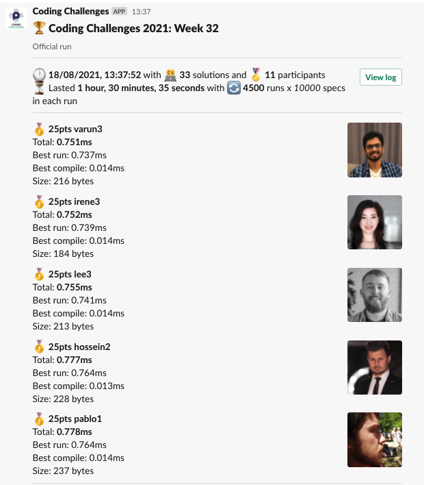
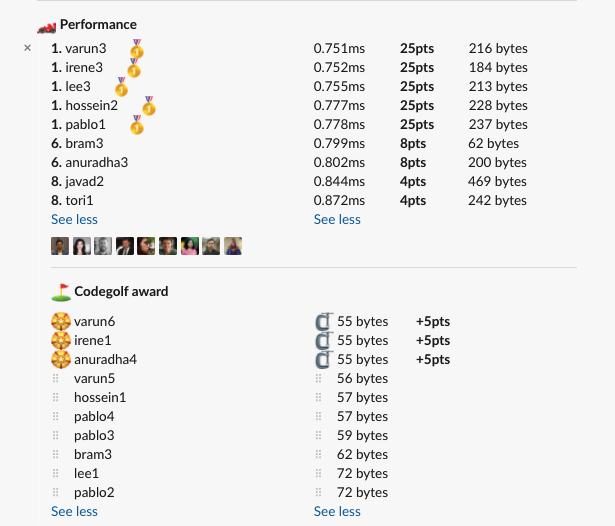

# Week 32 challenge

Write a function `imSpecial` which takes in an array of numbers and returns the only number which is unique.

The array will always contain 2 distinct numbers, out of which one will be unique;

Examples:
```
imSpecial([7,7,7,7,4,7,7,7]) // return 4
imSpecial([1,1,2]) // return 2
```


## Upload link

[PP Connect](https://connect.passionatepeople.io/code-challenge-submission)

## Results

| Place | Name        | Performance | Codegolf | Jury award | Total points |
|-------|-------------|-------------|----------|------------|--------------|
| 1.    | Varun       | 25          | 5        | 5          | 35           |
|       | Irene       | 25          | 5        |            | 30           |
| 3.    | Lee         | 25          |          |            | 25           |
|       | Hossein     | 25          |          |            | 25           |
|       | Pablo       | 25          |          |            | 25           |
| 6.    | Anuradha    | 8           | 5        |            | 13           |
| 7.    | Bram        | 8           |          |            | 8            |
| 8.    | Javad       | 4           |          |            | 4            |
|       | Tori        | 4           |          |            | 4            |

### Screenshot





### Vote

```
╔════════════════╤════════╤══════════════════════════════════════════════════════════════════════════════════════════════╗
║ Name           │ Vote   │ Comment                                                                                      ║
╟────────────────┼────────┼──────────────────────────────────────────────────────────────────────────────────────────────╢
║ harijs.deksnis │ varun6 │ short and elegant approach with .pop                                                         ║
╟────────────────┼────────┼──────────────────────────────────────────────────────────────────────────────────────────────╢
║ lee            │ tori1  │ For teaching me about the existence of a do-while loop in JS,                                ║
╟────────────────┼────────┼──────────────────────────────────────────────────────────────────────────────────────────────╢
║ varun          │ irene1 │ Array.find execution speed was a big learning for me and the solution is quite readable too! ║
╟────────────────┼────────┼──────────────────────────────────────────────────────────────────────────────────────────────╢
║ hossein        │ varun6 │ Using the bitwise operator                                                                   ║
╟────────────────┼────────┼──────────────────────────────────────────────────────────────────────────────────────────────╢
║ anuradha       │ varun6 │ I liked the usage of XOR for this solution and I learnt something new.                       ║
╟────────────────┼────────┼──────────────────────────────────────────────────────────────────────────────────────────────╢
║ irene          │ varun6 │ code golf with sort() and pop()                                                              ║
╟────────────────┼────────┼──────────────────────────────────────────────────────────────────────────────────────────────╢
║ israel         │ tori1  │ I like the use of do ... while for this solution                                             ║
╚════════════════╧════════╧══════════════════════════════════════════════════════════════════════════════════════════════╝
```

### Full output log
```
EVALUATION STARTED:                 18/08/2021, 12:07:11
EVALUATING CHALLENGE:               2021/w32
FOUND 33 SOLUTIONS:                 anuradha1.js, anuradha2.js, anuradha3.js, anuradha4.js, anuradha5.js, bram1.js, bram2.js, bram3.js, ezzeddine1.js,
                          hossein1.js, hossein2.js, irene1.js, irene2.js, irene3.js, javad1.js, javad2.js, javad3.js, lee1.js, lee2.js, lee3.js,
                          pablo1.js, pablo2.js, pablo3.js, pablo4.js, patrick1.js, patrick2.js, tori1.js, varun1.js, varun2.js, varun3.js,
                          varun4.js, varun5.js, varun6.js
RUNNING EVALUATION FOR:             5400 SECONDS WITH 10000 TEST CASES IN EACH CYCLE...


EVALUATION ENDED:                   18/08/2021, 13:37:46
DURATION:                           1 hour, 30 minutes, 35.353 seconds

RANKINGS:
╔═══════╤════════╤═══════════╤═════════╤══════════╤══════════════╤══════╗
║ Place │ Points │ Name      │ Total   │ Best run │ Best compile │ Size ║
╟───────┼────────┼───────────┼─────────┼──────────┼──────────────┼──────╢
║ 1     │ 25     │ varun3    │ 0.751ms │ 0.737ms  │ 0.014ms      │ 216  ║
╟───────┼────────┼───────────┼─────────┼──────────┼──────────────┼──────╢
║       │ 25     │ irene3    │ 0.752ms │ 0.739ms  │ 0.014ms      │ 184  ║
╟───────┼────────┼───────────┼─────────┼──────────┼──────────────┼──────╢
║       │ 25     │ lee3      │ 0.755ms │ 0.741ms  │ 0.014ms      │ 213  ║
╟───────┼────────┼───────────┼─────────┼──────────┼──────────────┼──────╢
║       │ 25     │ hossein2  │ 0.777ms │ 0.764ms  │ 0.013ms      │ 228  ║
╟───────┼────────┼───────────┼─────────┼──────────┼──────────────┼──────╢
║       │ 25     │ pablo1    │ 0.778ms │ 0.764ms  │ 0.014ms      │ 237  ║
╟───────┼────────┼───────────┼─────────┼──────────┼──────────────┼──────╢
║ 6     │ 8      │ bram3     │ 0.799ms │ 0.787ms  │ 0.012ms      │ 62   ║
╟───────┼────────┼───────────┼─────────┼──────────┼──────────────┼──────╢
║       │ 8      │ anuradha3 │ 0.802ms │ 0.786ms  │ 0.016ms      │ 200  ║
╟───────┼────────┼───────────┼─────────┼──────────┼──────────────┼──────╢
║ 8     │ 4      │ javad2    │ 0.844ms │ 0.831ms  │ 0.014ms      │ 469  ║
╟───────┼────────┼───────────┼─────────┼──────────┼──────────────┼──────╢
║       │ 4      │ tori1     │ 0.872ms │ 0.858ms  │ 0.014ms      │ 242  ║
╚═══════╧════════╧═══════════╧═════════╧══════════╧══════════════╧══════╝

Keeping only best run from each contestant
Using 5% margin for determening ties

OMITTED FROM RANKINGS:              anuradha2.js, bram2.js, javad1.js, varun2.js, bram1.js, lee2.js, irene2.js, anuradha1.js, varun1.js, lee1.js, javad3.js,
                          pablo3.js, hossein1.js, pablo2.js, varun6.js, varun5.js, pablo4.js, anuradha5.js, irene1.js, anuradha4.js

CODEGOLF AWARD:                     anuradha4.js, irene1.js, varun6.js with 55 bytes

FAILED SOLUTIONS:                   ezzeddine1.js, patrick1.js, patrick2.js, varun4.js

SYSTEM INFO:
NODE: v14.16.0
ARCH: x64
PLATFORM: linux
VERSION: #56-Ubuntu SMP Mon Oct 5 14:28:49 UTC 2020
MEMORY: 15.64GB
CPUS: 2 x Intel(R) Xeon(R) Gold 6140 CPU @ 2.30GHz
CPU speed: 2494MHz

RAW RESULTS:
┌─────────┬─────────────────┬────────────────────┬────────────────────┬──────────────────────┬──────┬────────────────┬─────────────────────┬────────────────┬──────────────┬────────┬────────────────────┬──────┐
│ (index) │    solution     │       total        │      bestRun       │     bestCompile      │ size │    compiled    │   validationTime    │ memoryEstimate │ onlyCodegolf │ failed │     failReason     │ runs │
├─────────┼─────────────────┼────────────────────┼────────────────────┼──────────────────────┼──────┼────────────────┼─────────────────────┼────────────────┼──────────────┼────────┼────────────────────┼──────┤
│    0    │   'varun3.js'   │ 0.7508719996549189 │ 0.7370769996196032 │ 0.013795000035315752 │ 216  │ 'successfully' │ 191.32181000000128  │     138560     │    false     │ false  │        null        │ 4500 │
│    1    │   'irene3.js'   │ 0.7523940000683069 │ 0.7385660000145435 │ 0.01382800005376339  │ 184  │ 'successfully' │ 190.22400200000266  │     137832     │    false     │ false  │        null        │ 4500 │
│    2    │    'lee3.js'    │ 0.7545989993959665 │ 0.7408819999545813 │ 0.01371699944138527  │ 213  │ 'successfully' │ 191.19955899999331  │     137752     │    false     │ false  │        null        │ 4500 │
│    3    │  'hossein2.js'  │ 0.7768739997409284 │ 0.7643459998071194 │ 0.012527999933809042 │ 228  │ 'successfully' │ 193.44016199999896  │     137048     │    false     │ false  │        null        │ 4500 │
│    4    │   'pablo1.js'   │ 0.777534999884665  │ 0.7638159999623895 │ 0.013718999922275543 │ 237  │ 'successfully' │  182.2156249999971  │     137632     │    false     │ false  │        null        │ 4500 │
│    5    │   'bram3.js'    │ 0.7993729999288917 │ 0.7871679998934269 │ 0.012205000035464764 │  62  │ 'successfully' │ 209.76834400000007  │     135552     │    false     │ false  │        null        │ 4500 │
│    6    │ 'anuradha3.js'  │ 0.8022770001552999 │ 0.785926999989897  │ 0.01635000016540289  │ 200  │ 'successfully' │  197.9882809999981  │     136064     │    false     │ false  │        null        │ 4500 │
│    7    │ 'anuradha2.js'  │ 0.8035349999554455 │ 0.7871070001274347 │ 0.016427999828010798 │ 196  │ 'successfully' │ 212.45897400000104  │     142496     │    false     │ false  │        null        │ 4500 │
│    8    │   'bram2.js'    │ 0.8257540001068264 │  0.81201700004749  │ 0.013737000059336424 │ 256  │ 'successfully' │ 189.82767100000274  │     138224     │    false     │ false  │        null        │ 4500 │
│    9    │   'javad2.js'   │ 0.8444560002535582 │ 0.8308250000700355 │ 0.013631000183522701 │ 469  │ 'successfully' │ 185.87413099999685  │     139192     │    false     │ false  │        null        │ 4500 │
│   10    │   'javad1.js'   │ 0.8565980002167635 │  0.84250400000019  │ 0.014094000216573477 │ 268  │ 'successfully' │ 187.66098599999532  │     138032     │    false     │ false  │        null        │ 4500 │
│   11    │   'varun2.js'   │ 0.8621160006150603 │ 0.8479580003768206 │ 0.014158000238239765 │ 233  │ 'successfully' │ 181.95425899999827  │     141056     │    false     │ false  │        null        │ 4500 │
│   12    │   'tori1.js'    │ 0.8719989997334778 │ 0.8582419999875128 │ 0.013756999745965004 │ 242  │ 'successfully' │  178.6918500000029  │     137640     │    false     │ false  │        null        │ 4500 │
│   13    │   'bram1.js'    │ 0.9355739993043244 │ 0.9219459998421371 │ 0.01362799946218729  │ 281  │ 'successfully' │ 188.59279799999786  │     139376     │    false     │ false  │        null        │ 4500 │
│   14    │    'lee2.js'    │ 0.9768710006028414 │ 0.9632299998775125 │ 0.013641000725328922 │ 263  │ 'successfully' │  180.6105749999988  │     137792     │    false     │ false  │        null        │ 4500 │
│   15    │   'irene2.js'   │ 1.8783320002257824 │ 1.8641860000789165 │ 0.014146000146865845 │ 252  │ 'successfully' │ 184.75838400000066  │     138064     │    false     │ false  │        null        │ 4500 │
│   16    │ 'anuradha1.js'  │  9.13135799986776  │ 9.111833999981172  │ 0.019523999886587262 │ 224  │ 'successfully' │  283.385760000001   │     143296     │    false     │ false  │        null        │ 4500 │
│   17    │   'varun1.js'   │ 10.896024000132456 │ 10.880811000009999 │ 0.015213000122457743 │ 235  │ 'successfully' │ 229.58101200000237  │     137720     │    false     │ false  │        null        │ 4500 │
│   18    │    'lee1.js'    │ 11.055130999535322 │ 11.041269999928772 │ 0.01386099960654974  │  72  │ 'successfully' │ 245.73406799999793  │     139392     │    false     │ false  │        null        │ 4500 │
│   19    │   'javad3.js'   │ 12.48335599922575  │ 12.468354000011459 │ 0.015001999214291573 │ 225  │ 'successfully' │  198.4723989999984  │     139360     │    false     │ false  │        null        │ 4500 │
│   20    │   'pablo3.js'   │ 13.316814000019804 │ 13.302861999953166 │ 0.013952000066637993 │  59  │ 'successfully' │ 213.23908700000175  │     138008     │    false     │ false  │        null        │ 4500 │
│   21    │  'hossein1.js'  │ 18.46776599972509  │ 18.454008999979123 │ 0.013756999745965004 │  57  │ 'successfully' │ 252.04925499999808  │     138960     │    false     │ false  │        null        │ 4500 │
│   22    │   'pablo2.js'   │  33.6623790001031  │ 33.64600199996494  │ 0.016377000138163567 │  72  │ 'successfully' │  271.1764259999982  │     137104     │    false     │ false  │        null        │ 4500 │
│   23    │   'varun6.js'   │ 33.780524000292644 │ 33.764298000372946 │ 0.016225999919697642 │  55  │ 'successfully' │  291.2368329999954  │     139752     │    false     │ false  │        null        │ 4500 │
│   24    │   'varun5.js'   │ 33.85818899970036  │ 33.84147300000768  │ 0.01671599969267845  │  56  │ 'successfully' │ 301.50958099999843  │     142456     │    false     │ false  │        null        │ 4500 │
│   25    │   'pablo4.js'   │ 34.02316299988888  │ 34.00729099987075  │ 0.015872000018134713 │  57  │ 'successfully' │ 257.21248199999536  │     137264     │    false     │ false  │        null        │ 4500 │
│   26    │ 'anuradha5.js'  │  40.2360679996782  │ 40.216233999992255 │ 0.019833999685943127 │ 143  │ 'successfully' │ 278.40376000000106  │     138056     │    false     │ false  │        null        │ 4500 │
│   27    │   'irene1.js'   │  400.54041699964   │ 400.5167370000054  │ 0.023679999634623528 │  55  │ 'successfully' │ 2106.9973629999986  │     140328     │    false     │ false  │        null        │ 4500 │
│   28    │ 'anuradha4.js'  │ 404.89281500042125 │ 404.86979800001427 │ 0.023017000406980515 │  55  │ 'successfully' │ 2082.8097229999985  │     138088     │    false     │ false  │        null        │ 4500 │
│   29    │ 'ezzeddine1.js' │        null        │        null        │         null         │  91  │ 'successfully' │ 0.9982600000003004  │     135608     │     true     │  true  │ 'Incorrect result' │  0   │
│   30    │  'patrick1.js'  │        null        │        null        │         null         │  99  │ 'successfully' │ 0.3631600000007893  │     135880     │    false     │  true  │ 'Incorrect result' │  0   │
│   31    │  'patrick2.js'  │        null        │        null        │         null         │  44  │ 'successfully' │ 0.19402599999739323 │     138096     │    false     │  true  │ 'Incorrect result' │  0   │
│   32    │   'varun4.js'   │        null        │        null        │         null         │  52  │ 'successfully' │ 0.7671540000010282  │     142432     │    false     │  true  │ 'Incorrect result' │  0   │
└─────────┴─────────────────┴────────────────────┴────────────────────┴──────────────────────┴──────┴────────────────┴─────────────────────┴────────────────┴──────────────┴────────┴────────────────────┴──────┘

MEMORY USAGE:
┌─────────┬────────────────┬────────────────┐
│ (index) │    solution    │ memoryEstimate │
├─────────┼────────────────┼────────────────┤
│    0    │   'bram3.js'   │     135552     │
│    1    │ 'anuradha3.js' │     136064     │
│    2    │ 'hossein2.js'  │     137048     │
│    3    │  'pablo2.js'   │     137104     │
│    4    │  'pablo4.js'   │     137264     │
│    5    │  'pablo1.js'   │     137632     │
│    6    │   'tori1.js'   │     137640     │
│    7    │  'varun1.js'   │     137720     │
│    8    │   'lee3.js'    │     137752     │
│    9    │   'lee2.js'    │     137792     │
│   10    │  'irene3.js'   │     137832     │
│   11    │  'pablo3.js'   │     138008     │
│   12    │  'javad1.js'   │     138032     │
│   13    │ 'anuradha5.js' │     138056     │
│   14    │  'irene2.js'   │     138064     │
│   15    │ 'anuradha4.js' │     138088     │
│   16    │   'bram2.js'   │     138224     │
│   17    │  'varun3.js'   │     138560     │
│   18    │ 'hossein1.js'  │     138960     │
│   19    │  'javad2.js'   │     139192     │
│   20    │  'javad3.js'   │     139360     │
│   21    │   'bram1.js'   │     139376     │
│   22    │   'lee1.js'    │     139392     │
│   23    │  'varun6.js'   │     139752     │
│   24    │  'irene1.js'   │     140328     │
│   25    │  'varun2.js'   │     141056     │
│   26    │  'varun5.js'   │     142456     │
│   27    │ 'anuradha2.js' │     142496     │
│   28    │ 'anuradha1.js' │     143296     │
└─────────┴────────────────┴────────────────┘
```