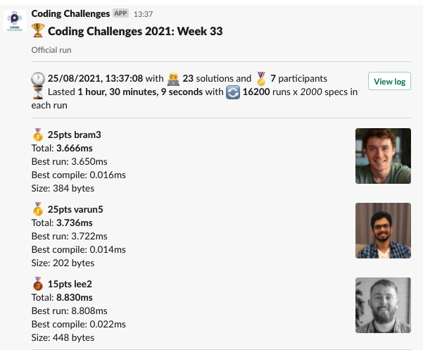
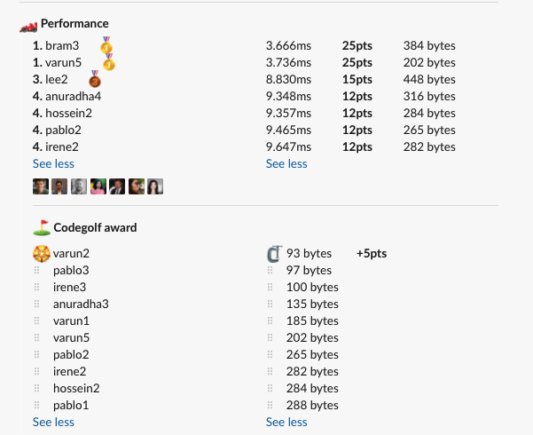

# Week 33 challenge

Write a function `buildPyramid` which takes in a number representing floors as first argument and returns an array of strings.
Each string represents a floor from top to bottom.

2nd argument optionally accepts a character to be used in building. Defaults to `*`.

Examples:
```
buildPyramid(3);
// returns
[
  '  *  ',
  ' *** ',
  '*****'
]

buildPyramid(6);
// returns
[
  '     *     ',
  '    ***    ',
  '   *****   ',
  '  *******  ',
  ' ********* ',
  '***********'
]

buildPyramid(3, '$');
// returns
[
  '  $  ',
  ' $$$ ',
  '$$$$$'
]
```


## Upload link

[PP Connect](https://connect.passionatepeople.io/code-challenge-submission)

## Results

| Place | Name        | Performance | Codegolf | Jury award | Total points |
|-------|-------------|-------------|----------|------------|--------------|
| 1.    | Varun       | 25          | 5        |            | 30           |
|       | Bram        | 25          |          | 5          | 30           |
| 3.    | Lee         | 15          |          |            | 15           |
| 4.    | Anuradha    | 12          |          |            | 12           |
|       | Hossein     | 12          |          |            | 12           |
|       | Pablo       | 12          |          |            | 12           |
|       | Irene       | 12          |          |            | 12           |


### Screenshot





### Vote

Voting is ongoing. Please `/vote` in Slack.

### Full output log
```
EVALUATION STARTED:                 25/08/2021, 12:06:53
EVALUATING CHALLENGE:               2021/w33
FOUND 23 SOLUTIONS:                 anuradha1.js, anuradha2.js, anuradha3.js, anuradha4.js, anuradha5.js, bram1.js, bram2.js, bram3.js, hossein1.js,
                          hossein2.js, irene1.js, irene2.js, irene3.js, lee1.js, lee2.js, pablo1.js, pablo2.js, pablo3.js, varun1.js, varun2.js,
                          varun3.js, varun4.js, varun5.js
RUNNING EVALUATION FOR:             5400 SECONDS WITH 2000 TEST CASES IN EACH CYCLE...


EVALUATION ENDED:                   25/08/2021, 13:37:02
DURATION:                           1 hour, 30 minutes, 9.145 seconds

RANKINGS:
╔═══════╤════════╤═══════════╤═════════╤══════════╤══════════════╤══════╗
║ Place │ Points │ Name      │ Total   │ Best run │ Best compile │ Size ║
╟───────┼────────┼───────────┼─────────┼──────────┼──────────────┼──────╢
║ 1     │ 25     │ bram3     │ 3.666ms │ 3.650ms  │ 0.016ms      │ 384  ║
╟───────┼────────┼───────────┼─────────┼──────────┼──────────────┼──────╢
║       │ 25     │ varun5    │ 3.736ms │ 3.722ms  │ 0.014ms      │ 202  ║
╟───────┼────────┼───────────┼─────────┼──────────┼──────────────┼──────╢
║ 3     │ 15     │ lee2      │ 8.830ms │ 8.808ms  │ 0.022ms      │ 448  ║
╟───────┼────────┼───────────┼─────────┼──────────┼──────────────┼──────╢
║ 4     │ 12     │ anuradha4 │ 9.348ms │ 9.333ms  │ 0.015ms      │ 316  ║
╟───────┼────────┼───────────┼─────────┼──────────┼──────────────┼──────╢
║       │ 12     │ hossein2  │ 9.357ms │ 9.341ms  │ 0.016ms      │ 284  ║
╟───────┼────────┼───────────┼─────────┼──────────┼──────────────┼──────╢
║       │ 12     │ pablo2    │ 9.465ms │ 9.448ms  │ 0.017ms      │ 265  ║
╟───────┼────────┼───────────┼─────────┼──────────┼──────────────┼──────╢
║       │ 12     │ irene2    │ 9.647ms │ 9.631ms  │ 0.017ms      │ 282  ║
╚═══════╧════════╧═══════════╧═════════╧══════════╧══════════════╧══════╝

Keeping only best run from each contestant
Using 5% margin for determening ties

OMITTED FROM RANKINGS:              varun4.js, bram2.js, varun3.js, lee1.js, anuradha3.js, pablo1.js, anuradha5.js, bram1.js, varun2.js, anuradha2.js,
                          irene1.js, hossein1.js, varun1.js, pablo3.js, anuradha1.js, irene3.js

CODEGOLF AWARD:                     varun2.js with 93 bytes

SYSTEM INFO:
NODE: v14.16.0
ARCH: x64
PLATFORM: linux
VERSION: #56-Ubuntu SMP Mon Oct 5 14:28:49 UTC 2020
MEMORY: 15.64GB
CPUS: 2 x Intel(R) Xeon(R) Gold 6140 CPU @ 2.30GHz
CPU speed: 2494MHz

RAW RESULTS:
┌─────────┬────────────────┬────────────────────┬────────────────────┬──────────────────────┬──────┬────────────────┬────────────────────┬────────────────┬──────────────┬────────┬────────────┬───────┐
│ (index) │    solution    │       total        │      bestRun       │     bestCompile      │ size │    compiled    │   validationTime   │ memoryEstimate │ onlyCodegolf │ failed │ failReason │ runs  │
├─────────┼────────────────┼────────────────────┼────────────────────┼──────────────────────┼──────┼────────────────┼────────────────────┼────────────────┼──────────────┼────────┼────────────┼───────┤
│    0    │   'bram3.js'   │ 3.6655839999439195 │ 3.6499710000352934 │ 0.01561299990862608  │ 384  │ 'successfully' │ 29.794622000001254 │     142800     │    false     │ false  │    null    │ 16200 │
│    1    │  'varun5.js'   │ 3.7360810006503016 │ 3.721863000653684  │ 0.014217999996617436 │ 202  │ 'successfully' │ 24.28800499999852  │     140512     │    false     │ false  │    null    │ 16200 │
│    2    │  'varun4.js'   │ 5.151807000860572  │ 5.1357710007578135 │ 0.016036000102758408 │ 612  │ 'successfully' │ 41.23539900000105  │     144712     │    false     │ false  │    null    │ 16200 │
│    3    │   'bram2.js'   │ 7.718958000012208  │  7.70312100002775  │ 0.01583699998445809  │ 343  │ 'successfully' │ 29.280851999999868 │     142968     │    false     │ false  │    null    │ 16200 │
│    4    │  'varun3.js'   │ 8.829402000294067  │ 8.812846000306308  │ 0.016555999987758696 │ 564  │ 'successfully' │ 41.69100199999957  │     144224     │    false     │ false  │    null    │ 16200 │
│    5    │   'lee2.js'    │ 8.830121999955736  │ 8.808132000034675  │  0.0219899999210611  │ 448  │ 'successfully' │ 165.4258149999987  │     143840     │    false     │ false  │    null    │ 16200 │
│    6    │ 'anuradha4.js' │ 9.347942000022158  │ 9.332870000042021  │ 0.015071999980136752 │ 316  │ 'successfully' │ 37.384829999999056 │     136600     │    false     │ false  │    null    │ 16200 │
│    7    │ 'hossein2.js'  │ 9.356519000604749  │ 9.340940000489354  │ 0.015579000115394592 │ 284  │ 'successfully' │  35.0401039999997  │     143592     │    false     │ false  │    null    │ 16200 │
│    8    │  'pablo2.js'   │ 9.464592999778688  │  9.44783699978143  │ 0.016755999997258186 │ 265  │ 'successfully' │ 38.37700499999846  │     140752     │    false     │ false  │    null    │ 16200 │
│    9    │   'lee1.js'    │ 9.577687000273727  │ 9.561473999987356  │ 0.016213000286370516 │ 357  │ 'successfully' │ 42.449446999999054 │     143584     │    false     │ false  │    null    │ 16200 │
│   10    │ 'anuradha3.js' │ 9.629962000995874  │ 9.614737000316381  │ 0.01522500067949295  │ 135  │ 'successfully' │ 49.31190699999934  │     146288     │    false     │ false  │    null    │ 16200 │
│   11    │  'irene2.js'   │ 9.647311999928206  │ 9.630664000287652  │ 0.01664799964055419  │ 282  │ 'successfully' │ 34.96917300000132  │     143176     │    false     │ false  │    null    │ 16200 │
│   12    │  'pablo1.js'   │ 9.681867000414059  │ 9.665038000326604  │ 0.016829000087454915 │ 288  │ 'successfully' │ 34.356581999996706 │     140928     │    false     │ false  │    null    │ 16200 │
│   13    │ 'anuradha5.js' │ 9.727737000444904  │ 9.706436000298709  │ 0.021301000146195292 │ 352  │ 'successfully' │ 34.51646199999959  │     152336     │    false     │ false  │    null    │ 16200 │
│   14    │   'bram1.js'   │ 9.804299000184983  │ 9.787938000168651  │ 0.016361000016331673 │ 337  │ 'successfully' │ 37.56456699999762  │     136624     │    false     │ false  │    null    │ 16200 │
│   15    │  'varun2.js'   │ 9.822095999959856  │ 9.806621000170708  │ 0.015474999789148569 │  93  │ 'successfully' │ 76.26593400000274  │     144240     │    false     │ false  │    null    │ 16200 │
│   16    │ 'anuradha2.js' │ 12.51396799995564  │ 12.493293999927118 │ 0.020674000028520823 │ 391  │ 'successfully' │ 47.62548600000082  │     145704     │    false     │ false  │    null    │ 16200 │
│   17    │  'irene1.js'   │ 13.219976000487804 │ 13.203077000565827 │ 0.01689899992197752  │ 363  │ 'successfully' │ 36.85177100000146  │     136352     │    false     │ false  │    null    │ 16200 │
│   18    │ 'hossein1.js'  │ 13.456692000851035 │ 13.43950100056827  │ 0.017191000282764435 │ 412  │ 'successfully' │ 42.25765600000159  │     149608     │    false     │ false  │    null    │ 16200 │
│   19    │  'varun1.js'   │ 14.464447000063956 │ 14.449078000150621 │ 0.015368999913334846 │ 185  │ 'successfully' │ 244.79286700000011 │     143680     │    false     │ false  │    null    │ 16200 │
│   20    │  'pablo3.js'   │ 14.887860999908298 │ 14.872049999888986 │ 0.015811000019311905 │  97  │ 'successfully' │ 39.55662299999676  │     140152     │    false     │ false  │    null    │ 16200 │
│   21    │ 'anuradha1.js' │ 28.096971999388188 │ 28.073847000021487 │ 0.02312499936670065  │ 396  │ 'successfully' │ 126.87455399999817 │     144024     │    false     │ false  │    null    │ 16200 │
│   22    │  'irene3.js'   │ 36.13260800007629  │ 36.11623899999904  │ 0.01636900007724762  │ 100  │ 'successfully' │  120.607683000002  │     143048     │    false     │ false  │    null    │ 16200 │
└─────────┴────────────────┴────────────────────┴────────────────────┴──────────────────────┴──────┴────────────────┴────────────────────┴────────────────┴──────────────┴────────┴────────────┴───────┘

MEMORY USAGE:
┌─────────┬────────────────┬────────────────┐
│ (index) │    solution    │ memoryEstimate │
├─────────┼────────────────┼────────────────┤
│    0    │  'irene1.js'   │     136352     │
│    1    │ 'anuradha4.js' │     136600     │
│    2    │   'bram1.js'   │     136624     │
│    3    │  'pablo3.js'   │     140152     │
│    4    │  'varun5.js'   │     140512     │
│    5    │  'pablo2.js'   │     140752     │
│    6    │  'pablo1.js'   │     140928     │
│    7    │   'bram3.js'   │     142800     │
│    8    │   'bram2.js'   │     142968     │
│    9    │  'irene3.js'   │     143048     │
│   10    │  'irene2.js'   │     143176     │
│   11    │   'lee1.js'    │     143584     │
│   12    │ 'hossein2.js'  │     143592     │
│   13    │  'varun1.js'   │     143680     │
│   14    │   'lee2.js'    │     143840     │
│   15    │ 'anuradha1.js' │     144024     │
│   16    │  'varun3.js'   │     144224     │
│   17    │  'varun2.js'   │     144240     │
│   18    │  'varun4.js'   │     144712     │
│   19    │ 'anuradha2.js' │     145704     │
│   20    │ 'anuradha3.js' │     146288     │
│   21    │ 'hossein1.js'  │     149608     │
│   22    │ 'anuradha5.js' │     152336     │
└─────────┴────────────────┴────────────────┘
```