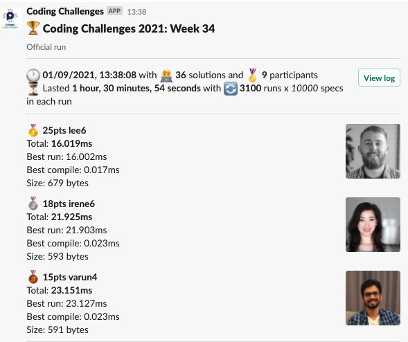
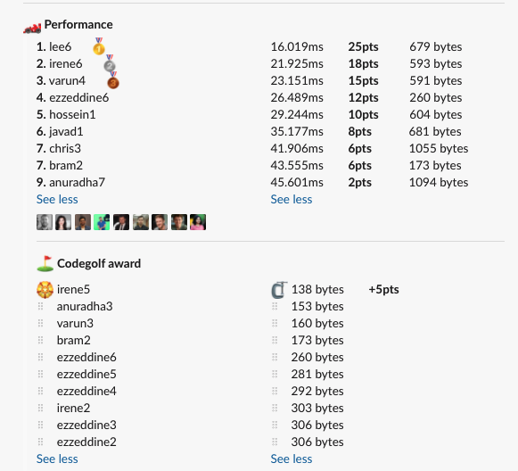

# Week 34 challenge

Write a function `mostValuable` which takes in a sentence and returns the first instance of word which is the most valuable.
Words value is calculated by summing up points for each letter.

Each letter scores points based on its position in the alphabet. A = 1, B = 2... etc.
Case does not matter when assigning points to letters.

*Note:* Only latin alphabet characters get points. Punctuation and all other symbols get 0 points.


Examples:
```
mostValuable('The quick brown fox jumps over the lazy dog') // return 'jumps'
mostValuable('The quick jUmPs brown fox jumps over the lazy dog') // return 'jUmPs'
mostValuable('Jackdaws love my big sphinx of quartz') // return 'quartz'
mostValuable('You go tell that vapid existentialist quack Freddy Nietzsche that he can just bite me twice') // return 'existentialist'
```


## Upload link

[PP Connect](https://connect.passionatepeople.io/code-challenge-submission)

## Results

| Place | Name      | Performance | Codegolf | Vote  | Total points |
|-------|-----------|-------------|----------|-------|--------------|
| 1.    | Lee       | 25          |          |       | 25           |
| 2.    | Irene     | 18          | 5        |       | 23           |
| 3.    | Varun     | 15          |          |       | 15           |
| 4.    | Ezzeddine | 12          |          |       | 12           |
| 5.    | Chris     | 6           |          | 5     | 11           |
| 6.    | Hossein   | 10          |          |       | 10           |
| 7.    | Javad     | 8           |          |       | 8            |
| 8.    | Bram      | 6           |          |       | 6            |
| 9.    | Anuradha  | 2           |          |       | 2            |


### Screenshot





### Vote

```
╔════════════════╤════════╤══════════════════════════════════════════════════════════════════════════════════════════════════════════════════════════════════╗
║ Name           │ Vote   │ Comment                                                                                                                          ║
╟────────────────┼────────┼──────────────────────────────────────────────────────────────────────────────────────────────────────────────────────────────────╢
║ israel         │ javad1 │ I found this submission to be one of the most readable and linear ones                                                           ║
╟────────────────┼────────┼──────────────────────────────────────────────────────────────────────────────────────────────────────────────────────────────────╢
║ harijs.deksnis │ chris3 │ Lots of chained .sets :)                                                                                                         ║
╟────────────────┼────────┼──────────────────────────────────────────────────────────────────────────────────────────────────────────────────────────────────╢
║ anuradha       │ lee6   │ Nice approach. I was trying to do something similar, but couldn't succeed. Thanks for showing how that could have been achieved. ║
╟────────────────┼────────┼──────────────────────────────────────────────────────────────────────────────────────────────────────────────────────────────────╢
║ irene          │ chris3 │ A for effort writing all those map sets :p                                                                                       ║
╟────────────────┼────────┼──────────────────────────────────────────────────────────────────────────────────────────────────────────────────────────────────╢
║ varun          │ irene5 │ `Math.max.apply` usage 🔥                                                                                                        ║
╚════════════════╧════════╧══════════════════════════════════════════════════════════════════════════════════════════════════════════════════════════════════╝
```

### Full output log
```
EVALUATION STARTED:                 01/09/2021, 12:07:08
EVALUATING CHALLENGE:               2021/w34
FOUND 36 SOLUTIONS:                 anuradha1.js, anuradha2.js, anuradha3.js, anuradha4.js, anuradha5.js, anuradha6.js, anuradha7.js, bram1.js, bram2.js,
                          chris1.js, chris2.js, chris3.js, ezzeddine1.js, ezzeddine2.js, ezzeddine3.js, ezzeddine4.js, ezzeddine5.js,
                          ezzeddine6.js, hossein1.js, irene1.js, irene2.js, irene3.js, irene4.js, irene5.js, irene6.js, javad1.js, lee1.js,
                          lee2.js, lee3.js, lee4.js, lee5.js, lee6.js, varun1.js, varun2.js, varun3.js, varun4.js
RUNNING EVALUATION FOR:             5400 SECONDS WITH 10000 TEST CASES IN EACH CYCLE...


EVALUATION ENDED:                   01/09/2021, 13:38:02
DURATION:                           1 hour, 30 minutes, 54.193 seconds

RANKINGS:
╔═══════╤════════╤════════════╤══════════╤══════════╤══════════════╤══════╗
║ Place │ Points │ Name       │ Total    │ Best run │ Best compile │ Size ║
╟───────┼────────┼────────────┼──────────┼──────────┼──────────────┼──────╢
║ 1     │ 25     │ lee6       │ 16.019ms │ 16.002ms │ 0.017ms      │ 679  ║
╟───────┼────────┼────────────┼──────────┼──────────┼──────────────┼──────╢
║ 2     │ 18     │ irene6     │ 21.925ms │ 21.903ms │ 0.023ms      │ 593  ║
╟───────┼────────┼────────────┼──────────┼──────────┼──────────────┼──────╢
║ 3     │ 15     │ varun4     │ 23.151ms │ 23.127ms │ 0.023ms      │ 591  ║
╟───────┼────────┼────────────┼──────────┼──────────┼──────────────┼──────╢
║ 4     │ 12     │ ezzeddine6 │ 26.489ms │ 26.469ms │ 0.020ms      │ 260  ║
╟───────┼────────┼────────────┼──────────┼──────────┼──────────────┼──────╢
║ 5     │ 10     │ hossein1   │ 29.244ms │ 29.221ms │ 0.022ms      │ 604  ║
╟───────┼────────┼────────────┼──────────┼──────────┼──────────────┼──────╢
║ 6     │ 8      │ javad1     │ 35.177ms │ 35.152ms │ 0.026ms      │ 681  ║
╟───────┼────────┼────────────┼──────────┼──────────┼──────────────┼──────╢
║ 7     │ 6      │ chris3     │ 41.906ms │ 41.868ms │ 0.038ms      │ 1055 ║
╟───────┼────────┼────────────┼──────────┼──────────┼──────────────┼──────╢
║       │ 6      │ bram2      │ 43.555ms │ 43.530ms │ 0.025ms      │ 173  ║
╟───────┼────────┼────────────┼──────────┼──────────┼──────────────┼──────╢
║ 9     │ 2      │ anuradha7  │ 45.601ms │ 45.560ms │ 0.041ms      │ 1094 ║
╚═══════╧════════╧════════════╧══════════╧══════════╧══════════════╧══════╝

Keeping only best run from each contestant
Using 5% margin for determening ties

OMITTED FROM RANKINGS:              irene4.js, lee5.js, lee3.js, lee4.js, irene3.js, ezzeddine4.js, lee2.js, ezzeddine5.js, ezzeddine3.js, varun2.js,
                          lee1.js, varun3.js, varun1.js, chris2.js, bram1.js, anuradha1.js, anuradha6.js, chris1.js, irene2.js, irene1.js,
                          anuradha5.js, anuradha4.js, anuradha3.js, irene5.js, ezzeddine2.js, ezzeddine1.js, anuradha2.js

CODEGOLF AWARD:                     irene5.js with 138 bytes

SYSTEM INFO:
NODE: v14.16.0
ARCH: x64
PLATFORM: linux
VERSION: #56-Ubuntu SMP Mon Oct 5 14:28:49 UTC 2020
MEMORY: 15.64GB
CPUS: 2 x Intel(R) Xeon(R) Gold 6140 CPU @ 2.30GHz
CPU speed: 2494MHz

RAW RESULTS:
┌─────────┬─────────────────┬────────────────────┬────────────────────┬──────────────────────┬──────┬────────────────┬────────────────────┬────────────────┬──────────────┬────────┬────────────┬──────┐
│ (index) │    solution     │       total        │      bestRun       │     bestCompile      │ size │    compiled    │   validationTime   │ memoryEstimate │ onlyCodegolf │ failed │ failReason │ runs │
├─────────┼─────────────────┼────────────────────┼────────────────────┼──────────────────────┼──────┼────────────────┼────────────────────┼────────────────┼──────────────┼────────┼────────────┼──────┤
│    0    │    'lee6.js'    │ 16.018526999279857 │ 16.00159699935466  │ 0.01692999992519617  │ 679  │ 'successfully' │ 981.7533220000005  │     148688     │    false     │ false  │    null    │ 3100 │
│    1    │   'irene6.js'   │ 21.925419999752194 │ 21.902890000026673 │ 0.02252999972552061  │ 593  │ 'successfully' │ 25.39763899999889  │     146616     │    false     │ false  │    null    │ 3100 │
│    2    │   'varun4.js'   │ 23.15061799995601  │ 23.127286999952048 │ 0.02333100000396371  │ 591  │ 'successfully' │ 192.2886260000014  │     146928     │    false     │ false  │    null    │ 3100 │
│    3    │   'irene4.js'   │ 23.447111999616027 │ 23.42580399941653  │ 0.021308000199496746 │ 547  │ 'successfully' │ 23.41031699999803  │     150176     │    false     │ false  │    null    │ 3100 │
│    4    │    'lee5.js'    │ 23.967791999690235 │ 23.94540600012988  │ 0.02238599956035614  │ 484  │ 'successfully' │ 968.5079500000029  │     146904     │    false     │ false  │    null    │ 3100 │
│    5    │    'lee3.js'    │ 24.19039599969983  │ 24.171790999360383 │ 0.018605000339448452 │ 569  │ 'successfully' │ 41.856158999999025 │     144792     │    false     │ false  │    null    │ 3100 │
│    6    │    'lee4.js'    │ 25.14893199969083  │ 25.12567299976945  │ 0.023258999921381474 │ 527  │ 'successfully' │ 1093.2095430000008 │     145200     │    false     │ false  │    null    │ 3100 │
│    7    │   'irene3.js'   │ 26.296012999489903 │ 26.27351099997759  │ 0.022501999512314796 │ 536  │ 'successfully' │ 26.96750500000053  │     144184     │    false     │ false  │    null    │ 3100 │
│    8    │ 'ezzeddine6.js' │ 26.48943499987945  │ 26.469018999952823 │ 0.020415999926626682 │ 260  │ 'successfully' │ 29.182496000001265 │     141840     │    false     │ false  │    null    │ 3100 │
│    9    │ 'ezzeddine4.js' │ 27.074521999806166 │ 27.05383099988103  │ 0.020690999925136566 │ 292  │ 'successfully' │ 49.03017099999852  │     148624     │    false     │ false  │    null    │ 3100 │
│   10    │    'lee2.js'    │ 27.235867000184953 │ 27.216705000028014 │ 0.01916200015693903  │ 545  │ 'successfully' │ 39.84764699999869  │     145216     │    false     │ false  │    null    │ 3100 │
│   11    │ 'ezzeddine5.js' │ 27.411442999262363 │ 27.389114999677986 │ 0.022327999584376812 │ 281  │ 'successfully' │ 42.27481899999839  │     144344     │    false     │ false  │    null    │ 3100 │
│   12    │ 'ezzeddine3.js' │ 28.588080000132322 │ 28.568123999983072 │ 0.01995600014925003  │ 306  │ 'successfully' │ 80.23815900000045  │     143736     │    false     │ false  │    null    │ 3100 │
│   13    │  'hossein1.js'  │ 29.243653999641538 │ 29.22135300002992  │ 0.022300999611616135 │ 604  │ 'successfully' │ 31.850916999999754 │     141888     │    false     │ false  │    null    │ 3100 │
│   14    │   'varun2.js'   │ 31.940369000658393 │  31.9154310002923  │ 0.024938000366091728 │ 669  │ 'successfully' │ 31.977874000000156 │     148248     │    false     │ false  │    null    │ 3100 │
│   15    │    'lee1.js'    │ 34.22349900007248  │ 34.198520000092685 │ 0.024978999979794025 │ 600  │ 'successfully' │ 57.58136600000216  │     166256     │    false     │ false  │    null    │ 3100 │
│   16    │   'varun3.js'   │ 34.491976000368595 │ 34.47106599994004  │ 0.020910000428557396 │ 160  │ 'successfully' │ 826.9446490000009  │     143728     │    false     │ false  │    null    │ 3100 │
│   17    │   'javad1.js'   │ 35.17743999976665  │  35.1517509999685  │ 0.02568899979814887  │ 681  │ 'successfully' │ 53.522235000000364 │     147344     │    false     │ false  │    null    │ 3100 │
│   18    │   'varun1.js'   │ 39.54931999993278  │ 39.52648299996508  │ 0.022836999967694283 │ 669  │ 'successfully' │ 45.01754399999845  │     149280     │    false     │ false  │    null    │ 3100 │
│   19    │   'chris3.js'   │ 41.90577100031078  │ 41.867553000338376 │ 0.03821799997240305  │ 1055 │ 'successfully' │ 67.41699599999993  │     143960     │    false     │ false  │    null    │ 3100 │
│   20    │   'chris2.js'   │ 42.55868300003931  │ 42.52088000020012  │ 0.03780299983918667  │ 1725 │ 'successfully' │ 57.62822600000072  │     142560     │    false     │ false  │    null    │ 3100 │
│   21    │   'bram2.js'    │ 43.55510800052434  │ 43.53038300015032  │ 0.024725000374019146 │ 173  │ 'successfully' │ 111.91923600000155 │     141336     │    false     │ false  │    null    │ 3100 │
│   22    │   'bram1.js'    │ 43.801471000071615 │ 43.77795899985358  │ 0.02351200021803379  │ 513  │ 'successfully' │ 53.03074100000231  │     141064     │    false     │ false  │    null    │ 3100 │
│   23    │ 'anuradha7.js'  │ 45.60080300012487  │ 45.559688999986975 │ 0.041114000137895346 │ 1094 │ 'successfully' │ 61.63014800000019  │     152688     │    false     │ false  │    null    │ 3100 │
│   24    │ 'anuradha1.js'  │ 47.92773999963538  │  47.8736659999995  │ 0.054073999635875225 │ 675  │ 'successfully' │ 106.45201000000088 │     142224     │    false     │ false  │    null    │ 3100 │
│   25    │ 'anuradha6.js'  │  48.303694000002   │ 48.24868299998343  │ 0.05501100001856685  │ 676  │ 'successfully' │  65.1038320000007  │     151176     │    false     │ false  │    null    │ 3100 │
│   26    │   'chris1.js'   │ 48.552007999736816 │ 48.51838199980557  │ 0.03362599993124604  │ 527  │ 'successfully' │  57.7365839999984  │     142240     │    false     │ false  │    null    │ 3100 │
│   27    │   'irene2.js'   │ 49.68682199995965  │ 49.669025000184774 │ 0.017796999774873257 │ 303  │ 'successfully' │ 76.57145500000115  │     141776     │    false     │ false  │    null    │ 3100 │
│   28    │   'irene1.js'   │ 50.03528199996799  │ 50.00845200009644  │ 0.02682999987155199  │ 434  │ 'successfully' │ 98.27000400000179  │     142128     │    false     │ false  │    null    │ 3100 │
│   29    │ 'anuradha5.js'  │ 53.10316099983174  │ 53.07042999996338  │ 0.03273099986836314  │ 400  │ 'successfully' │ 408.08472600000096 │     151536     │    false     │ false  │    null    │ 3100 │
│   30    │ 'anuradha4.js'  │ 54.146064000058686 │ 54.11483700000099  │ 0.031227000057697296 │ 358  │ 'successfully' │ 441.61842199999955 │     142760     │    false     │ false  │    null    │ 3100 │
│   31    │ 'anuradha3.js'  │ 54.668942000193056 │ 54.643444999994244 │ 0.025497000198811293 │ 153  │ 'successfully' │ 444.41561400000137 │     144200     │    false     │ false  │    null    │ 3100 │
│   32    │   'irene5.js'   │ 56.39479500055313  │ 56.37090600002557  │ 0.02388900052756071  │ 138  │ 'successfully' │ 532.0978769999965  │     156984     │    false     │ false  │    null    │ 3100 │
│   33    │ 'ezzeddine2.js' │ 98.49241199996322  │ 98.46498799975961  │ 0.027424000203609467 │ 306  │ 'successfully' │  139.173146000001  │     143704     │    false     │ false  │    null    │ 3100 │
│   34    │ 'ezzeddine1.js' │ 131.5573400000576  │ 131.53049100004137 │ 0.026849000016227365 │ 361  │ 'successfully' │ 170.59461399999782 │     153952     │    false     │ false  │    null    │ 3100 │
│   35    │ 'anuradha2.js'  │ 212.46704099996714 │ 212.4281240000273  │ 0.03891699993982911  │ 455  │ 'successfully' │ 282.96970899999724 │     156000     │    false     │ false  │    null    │ 3100 │
└─────────┴─────────────────┴────────────────────┴────────────────────┴──────────────────────┴──────┴────────────────┴────────────────────┴────────────────┴──────────────┴────────┴────────────┴──────┘

MEMORY USAGE:
┌─────────┬─────────────────┬────────────────┐
│ (index) │    solution     │ memoryEstimate │
├─────────┼─────────────────┼────────────────┤
│    0    │   'bram1.js'    │     141064     │
│    1    │   'bram2.js'    │     141336     │
│    2    │   'irene2.js'   │     141776     │
│    3    │ 'ezzeddine6.js' │     141840     │
│    4    │  'hossein1.js'  │     141888     │
│    5    │   'irene1.js'   │     142128     │
│    6    │ 'anuradha1.js'  │     142224     │
│    7    │   'chris1.js'   │     142240     │
│    8    │   'chris2.js'   │     142560     │
│    9    │ 'anuradha4.js'  │     142760     │
│   10    │ 'ezzeddine2.js' │     143704     │
│   11    │   'varun3.js'   │     143728     │
│   12    │ 'ezzeddine3.js' │     143736     │
│   13    │   'chris3.js'   │     143960     │
│   14    │   'irene3.js'   │     144184     │
│   15    │ 'anuradha3.js'  │     144200     │
│   16    │ 'ezzeddine5.js' │     144344     │
│   17    │    'lee3.js'    │     144792     │
│   18    │    'lee4.js'    │     145200     │
│   19    │    'lee2.js'    │     145216     │
│   20    │   'irene6.js'   │     146616     │
│   21    │    'lee5.js'    │     146904     │
│   22    │   'varun4.js'   │     146928     │
│   23    │   'javad1.js'   │     147344     │
│   24    │   'varun2.js'   │     148248     │
│   25    │ 'ezzeddine4.js' │     148624     │
│   26    │    'lee6.js'    │     148688     │
│   27    │   'varun1.js'   │     149280     │
│   28    │   'irene4.js'   │     150176     │
│   29    │ 'anuradha6.js'  │     151176     │
│   30    │ 'anuradha5.js'  │     151536     │
│   31    │ 'anuradha7.js'  │     152688     │
│   32    │ 'ezzeddine1.js' │     153952     │
│   33    │ 'anuradha2.js'  │     156000     │
│   34    │   'irene5.js'   │     156984     │
│   35    │    'lee1.js'    │     166256     │
└─────────┴─────────────────┴────────────────┘
```