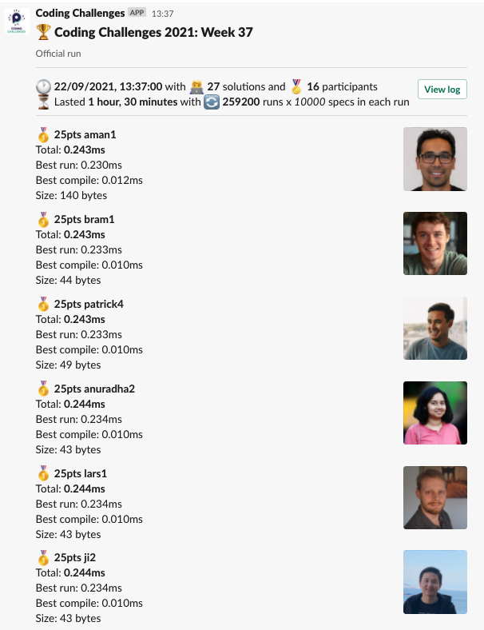
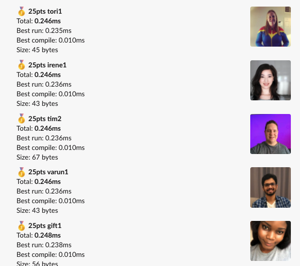
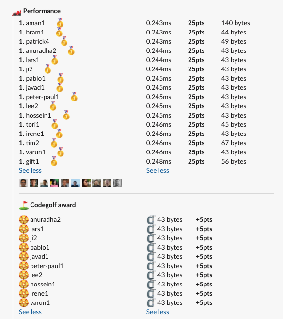

# Week 37 challenge

Write a function `wouldEuclidBeHappy` which takes in 3 numbers as arguments. The numbers each represent length of 3 sides of a triangle.
It should return `true` if a valid triangle can be constructed with these sides. Otherwise `false`.


Examples:
```
wouldEuclidBeHappy(1, 2, 2) // true
wouldEuclidBeHappy(8, 3, 3) // false
wouldEuclidBeHappy(3, 4, 5) // true
wouldEuclidBeHappy(9, 9, 9) // true
wouldEuclidBeHappy(9, 9, 1) // true
wouldEuclidBeHappy(1, 5, 1) // false
```


## Upload link

[PP Connect](https://connect.passionatepeople.io/code-challenge-submission)

## Results

| Place | Name       | Performance | Codegolf | Vote  | Total points |
|-------|------------|-------------|----------|-------|--------------|
| 1.    | Tim        | 25          | 5        | 5     | 35           |
| 2.    | Bram       | 25          | 5        |       | 30           |
|       | Anuradha   | 25          | 5        |       | 30           |
|       | Lars       | 25          | 5        |       | 30           |
|       | Ji         | 25          | 5        |       | 30           |
|       | Pablo      | 25          | 5        |       | 30           |
|       | Javad      | 25          | 5        |       | 30           |
|       | Peter-Paul | 25          | 5        |       | 30           |
|       | Lee        | 25          | 5        |       | 30           |
|       | Hossein    | 25          | 5        |       | 30           |
|       | Irene      | 25          | 5        |       | 30           |
|       | Varun      | 25          | 5        |       | 30           |
| 13.   | Aman       | 25          |          |       | 25           |
|       | Patrick    | 25          |          |       | 25           |
|       | Tori       | 25          |          |       | 25           |
|       | Gift       | 25          |          |       | 25           |


### Screenshot








### Vote

```
╔════════════════╤══════════╤═════════════════════════════════════════════════════════════════════════════════════════════════════════════════════╗
║ Name           │ Vote     │ Comment                                                                                                             ║
╟────────────────┼──────────┼─────────────────────────────────────────────────────────────────────────────────────────────────────────────────────╢
║ israel         │ tim2     │ Triangles.... triangles everywhere!!!                                                                               ║
╟────────────────┼──────────┼─────────────────────────────────────────────────────────────────────────────────────────────────────────────────────╢
║ harijs.deksnis │ tim2     │ I think the triangles deserve the vote for this one:)                                                               ║
╟────────────────┼──────────┼─────────────────────────────────────────────────────────────────────────────────────────────────────────────────────╢
║ javad          │ tim2     │ its more readable (ᐊ,ᐁ,ᐅ) , you can understand it solves something about rectangles even without a function name :) ║
╟────────────────┼──────────┼─────────────────────────────────────────────────────────────────────────────────────────────────────────────────────╢
║ bram           │ ji1      │ The first one to come up (I Think) with Math.abs to reduce the need for an extra AND check.                         ║
╟────────────────┼──────────┼─────────────────────────────────────────────────────────────────────────────────────────────────────────────────────╢
║ lee            │ patrick5 │ My favourite variable names.                                                                                        ║
╟────────────────┼──────────┼─────────────────────────────────────────────────────────────────────────────────────────────────────────────────────╢
║ varun          │ tim2     │ For the triangles 🔺                                                                                                ║
╟────────────────┼──────────┼─────────────────────────────────────────────────────────────────────────────────────────────────────────────────────╢
║ peter-paul     │ aman1    │ Aman did an Aman :D                                                                                                 ║
╚════════════════╧══════════╧═════════════════════════════════════════════════════════════════════════════════════════════════════════════════════╝
```

### Full output log
```

EVALUATION STARTED:                 22/09/2021, 12:06:54
EVALUATING CHALLENGE:               2021/w37
FOUND 27 SOLUTIONS:                 aman1.js, anuradha1.js, anuradha2.js, bram1.js, bram2.js, gift1.js, hossein1.js, irene1.js, javad1.js, ji1.js, ji2.js,
                          ji3.js, lars1.js, lee1.js, lee2.js, pablo1.js, patrick1.js, patrick2.js, patrick3.js, patrick4.js, patrick5.js,
                          peter-paul1.js, tim1.js, tim2.js, tim3.js, tori1.js, varun1.js
RUNNING EVALUATION FOR:             5400 SECONDS WITH 10000 TEST CASES IN EACH CYCLE...


EVALUATION ENDED:                   22/09/2021, 13:36:55
DURATION:                           1 hour, 30 minutes, 0.14 seconds

RANKINGS:
╔═══════╤════════╤═════════════╤═════════╤══════════╤══════════════╤══════╗
║ Place │ Points │ Name        │ Total   │ Best run │ Best compile │ Size ║
╟───────┼────────┼─────────────┼─────────┼──────────┼──────────────┼──────╢
║ 1     │ 25     │ aman1       │ 0.243ms │ 0.230ms  │ 0.012ms      │ 140  ║
╟───────┼────────┼─────────────┼─────────┼──────────┼──────────────┼──────╢
║       │ 25     │ bram1       │ 0.243ms │ 0.233ms  │ 0.010ms      │ 44   ║
╟───────┼────────┼─────────────┼─────────┼──────────┼──────────────┼──────╢
║       │ 25     │ patrick4    │ 0.243ms │ 0.233ms  │ 0.010ms      │ 49   ║
╟───────┼────────┼─────────────┼─────────┼──────────┼──────────────┼──────╢
║       │ 25     │ anuradha2   │ 0.244ms │ 0.234ms  │ 0.010ms      │ 43   ║
╟───────┼────────┼─────────────┼─────────┼──────────┼──────────────┼──────╢
║       │ 25     │ lars1       │ 0.244ms │ 0.234ms  │ 0.010ms      │ 43   ║
╟───────┼────────┼─────────────┼─────────┼──────────┼──────────────┼──────╢
║       │ 25     │ ji2         │ 0.244ms │ 0.234ms  │ 0.010ms      │ 43   ║
╟───────┼────────┼─────────────┼─────────┼──────────┼──────────────┼──────╢
║       │ 25     │ pablo1      │ 0.245ms │ 0.234ms  │ 0.010ms      │ 43   ║
╟───────┼────────┼─────────────┼─────────┼──────────┼──────────────┼──────╢
║       │ 25     │ javad1      │ 0.245ms │ 0.235ms  │ 0.010ms      │ 43   ║
╟───────┼────────┼─────────────┼─────────┼──────────┼──────────────┼──────╢
║       │ 25     │ peter-paul1 │ 0.245ms │ 0.235ms  │ 0.010ms      │ 43   ║
╟───────┼────────┼─────────────┼─────────┼──────────┼──────────────┼──────╢
║       │ 25     │ lee2        │ 0.245ms │ 0.235ms  │ 0.010ms      │ 43   ║
╟───────┼────────┼─────────────┼─────────┼──────────┼──────────────┼──────╢
║       │ 25     │ hossein1    │ 0.245ms │ 0.235ms  │ 0.010ms      │ 43   ║
╟───────┼────────┼─────────────┼─────────┼──────────┼──────────────┼──────╢
║       │ 25     │ tori1       │ 0.246ms │ 0.235ms  │ 0.010ms      │ 45   ║
╟───────┼────────┼─────────────┼─────────┼──────────┼──────────────┼──────╢
║       │ 25     │ irene1      │ 0.246ms │ 0.236ms  │ 0.010ms      │ 43   ║
╟───────┼────────┼─────────────┼─────────┼──────────┼──────────────┼──────╢
║       │ 25     │ tim2        │ 0.246ms │ 0.236ms  │ 0.010ms      │ 67   ║
╟───────┼────────┼─────────────┼─────────┼──────────┼──────────────┼──────╢
║       │ 25     │ varun1      │ 0.246ms │ 0.236ms  │ 0.010ms      │ 43   ║
╟───────┼────────┼─────────────┼─────────┼──────────┼──────────────┼──────╢
║       │ 25     │ gift1       │ 0.248ms │ 0.238ms  │ 0.010ms      │ 56   ║
╚═══════╧════════╧═════════════╧═════════╧══════════╧══════════════╧══════╝

Keeping only best run from each contestant
Using 5% margin for determening ties

OMITTED FROM RANKINGS:              anuradha1.js, patrick3.js, ji3.js, patrick5.js, bram2.js, tim3.js, patrick1.js, ji1.js, lee1.js, patrick2.js

CODEGOLF AWARD:                     anuradha2.js, bram2.js, hossein1.js, irene1.js, javad1.js, ji2.js, lars1.js, lee2.js, pablo1.js, peter-paul1.js, tim3.js, varun1.js with 43 bytes

FAILED SOLUTIONS:                   tim1.js

SYSTEM INFO:
NODE: v14.16.0
ARCH: x64
PLATFORM: linux
VERSION: #56-Ubuntu SMP Mon Oct 5 14:28:49 UTC 2020
MEMORY: 15.64GB
CPUS: 2 x Intel(R) Xeon(R) Gold 6140 CPU @ 2.30GHz
CPU speed: 2494MHz

RAW RESULTS:
┌─────────┬──────────────────┬─────────────────────┬─────────────────────┬──────────────────────┬──────┬────────────────┬────────────────────┬──────────────┬────────┬────────────────────┬────────┐
│ (index) │     solution     │        total        │       bestRun       │     bestCompile      │ size │    compiled    │   validationTime   │ onlyCodegolf │ failed │     failReason     │  runs  │
├─────────┼──────────────────┼─────────────────────┼─────────────────────┼──────────────────────┼──────┼────────────────┼────────────────────┼──────────────┼────────┼────────────────────┼────────┤
│    0    │    'aman1.js'    │ 0.24250299972482026 │ 0.23013199982233346 │ 0.012370999902486801 │ 140  │ 'successfully' │ 32.676634999999806 │    false     │ false  │        null        │ 259200 │
│    1    │    'bram1.js'    │ 0.2429489999776706  │ 0.23276399995665997 │ 0.010185000021010637 │  44  │ 'successfully' │ 12.16685900000084  │    false     │ false  │        null        │ 259200 │
│    2    │  'patrick4.js'   │ 0.24315299931913614 │ 0.2329679997637868  │ 0.01018499955534935  │  49  │ 'successfully' │ 7.404082000000926  │    false     │ false  │        null        │ 259200 │
│    3    │  'anuradha2.js'  │ 0.24397200005478226 │ 0.23412300006020814 │ 0.009848999994574115 │  43  │ 'successfully' │ 15.105782999999064 │    false     │ false  │        null        │ 259200 │
│    4    │    'lars1.js'    │ 0.2440899999346584  │ 0.23384899995289743 │ 0.010240999981760979 │  43  │ 'successfully' │ 7.265769999998156  │    false     │ false  │        null        │ 259200 │
│    5    │     'ji2.js'     │ 0.24416100022790488 │ 0.23391699999046978 │ 0.010244000237435102 │  43  │ 'successfully' │ 10.112027000002854 │    false     │ false  │        null        │ 259200 │
│    6    │  'anuradha1.js'  │ 0.24433200049679726 │ 0.23319200053811073 │ 0.01113999995868653  │ 115  │ 'successfully' │ 30.83073399999921  │    false     │ false  │        null        │ 259200 │
│    7    │   'pablo1.js'    │ 0.24450199987040833 │ 0.23418600001605228 │ 0.01031599985435605  │  43  │ 'successfully' │ 7.8566719999980705 │    false     │ false  │        null        │ 259200 │
│    8    │   'javad1.js'    │ 0.2448249999433756  │ 0.2346479999832809  │ 0.01017699996009469  │  43  │ 'successfully' │ 12.07476499999757  │    false     │ false  │        null        │ 259200 │
│    9    │ 'peter-paul1.js' │  0.245009999955073  │ 0.2351679999846965  │ 0.009841999970376492 │  43  │ 'successfully' │ 7.9024849999987055 │    false     │ false  │        null        │ 259200 │
│   10    │  'patrick3.js'   │ 0.24523600016254932 │ 0.23504300008062273 │ 0.010193000081926584 │  50  │ 'successfully' │ 7.582188000000315  │    false     │ false  │        null        │ 259200 │
│   11    │    'lee2.js'     │ 0.24530699997558258 │ 0.23535699999774806 │ 0.009949999977834523 │  43  │ 'successfully' │ 7.2568909999972675 │    false     │ false  │        null        │ 259200 │
│   12    │  'hossein1.js'   │ 0.24533899978268892 │ 0.23538099974393845 │ 0.00995800003875047  │  43  │ 'successfully' │ 7.821789000001445  │    false     │ false  │        null        │ 259200 │
│   13    │     'ji3.js'     │ 0.24557300002197735 │ 0.23358199998619966 │ 0.011991000035777688 │  80  │ 'successfully' │ 7.657696999998734  │    false     │ false  │        null        │ 259200 │
│   14    │    'tori1.js'    │ 0.24566199933178723 │ 0.23547399998642504 │ 0.010187999345362186 │  45  │ 'successfully' │ 7.735853999998653  │    false     │ false  │        null        │ 259200 │
│   15    │   'irene1.js'    │ 0.24587900005280972 │ 0.23556900024414062 │ 0.01030999980866909  │  43  │ 'successfully' │ 7.965737000002264  │    false     │ false  │        null        │ 259200 │
│   16    │    'tim2.js'     │ 0.2459559994749725  │ 0.23581499978899956 │ 0.010140999685972929 │  67  │ 'successfully' │  7.53323299999829  │    false     │ false  │        null        │ 259200 │
│   17    │   'varun1.js'    │ 0.24617099997703917 │ 0.2360519999929238  │ 0.010118999984115362 │  43  │ 'successfully' │ 7.497264999998151  │    false     │ false  │        null        │ 259200 │
│   18    │  'patrick5.js'   │ 0.2461809998494573  │ 0.23604899999918416 │ 0.010131999850273132 │  85  │ 'successfully' │  7.34257499999876  │    false     │ false  │        null        │ 259200 │
│   19    │    'bram2.js'    │ 0.24676599982194602 │ 0.23672499973326921 │ 0.01004100008867681  │  43  │ 'successfully' │ 11.542260999998689 │    false     │ false  │        null        │ 259200 │
│   20    │    'tim3.js'     │ 0.24718300020322204 │ 0.2370260003954172  │ 0.010156999807804823 │  43  │ 'successfully' │ 7.223985000000539  │    false     │ false  │        null        │ 259200 │
│   21    │    'gift1.js'    │ 0.24832000024616718 │ 0.2381520001217723  │ 0.010168000124394894 │  56  │ 'successfully' │ 13.893917000001238 │    false     │ false  │        null        │ 259200 │
│   22    │  'patrick1.js'   │ 0.24872000023606233 │ 0.23746699999901466 │ 0.011253000237047672 │ 182  │ 'successfully' │ 7.499368000000686  │    false     │ false  │        null        │ 259200 │
│   23    │     'ji1.js'     │ 0.25220900028944016 │ 0.2419090000912547  │ 0.010300000198185444 │  48  │ 'successfully' │ 14.790776999998343 │    false     │ false  │        null        │ 259200 │
│   24    │    'lee1.js'     │ 0.25352700031362474 │ 0.24251200025901198 │ 0.011015000054612756 │ 166  │ 'successfully' │ 7.3555989999986195 │    false     │ false  │        null        │ 259200 │
│   25    │  'patrick2.js'   │ 0.3143390000332147  │ 0.30280299996957183 │ 0.01153600006364286  │ 260  │ 'successfully' │ 7.763030000001891  │    false     │ false  │        null        │ 259200 │
│   26    │    'tim1.js'     │        null         │        null         │         null         │ 128  │ 'successfully' │ 0.1971769999981916 │    false     │  true  │ 'Incorrect result' │   0    │
└─────────┴──────────────────┴─────────────────────┴─────────────────────┴──────────────────────┴──────┴────────────────┴────────────────────┴──────────────┴────────┴────────────────────┴────────┘
```
