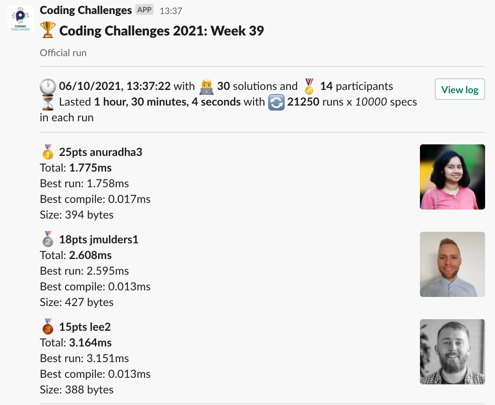
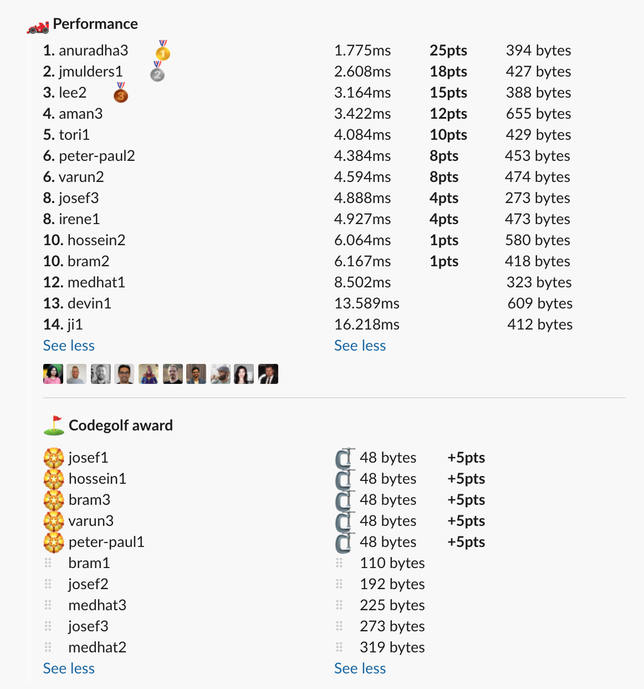

# Week 39 challenge

Write a function `removeDupes` which takes in a string and removes duplicate consequent alphabetical characters.
When checking for duplicates, case is ignored, however, the first instance of the character is left in string (whichever case it was)


Examples:
```
removeDupes('abcd') // return 'abcd'
removeDupes('ABCD') // return 'ABCD'
removeDupes('aabccd') // return 'abcd'
removeDupes('aAbCcccd') // return 'abCd'
removeDupes('aAbCcccdabbcdDD') // return 'abCdabcd'
```


## Upload link

[PP Connect](https://connect.passionatepeople.io/code-challenge-submission)

## Results

| Place | Name       | Performance | Codegolf | Vote  | Total points |
|-------|------------|-------------|----------|-------|--------------|
| 1.    | Anuradha   | 25          |          | 5     | 30           |
| 2.    | Jan Bart   | 18          |          | 5     | 23           |
| 3.    | Lee        | 15          |          |       | 15           |
| 4.    | Peter-Paul | 8           | 5        |       | 13           |
|       | Varun      | 8           | 5        |       | 13           |
| 6.    | Aman       | 12          |          |       | 12           |
| 7.    | Tori       | 10          |          |       | 10           |
| 8.    | Josef      | 4           | 5        |       | 9            |
| 9.    | Hossein    | 1           | 5        |       | 6            |
|       | Bram       | 1           | 5        |       | 6            |
| 11.   | Irene      | 4           |          |       | 4            |


### Screenshot





### Vote

```
╔════════════════╤═══════════╤════════════════════════════════════╗
║ Name           │ Vote      │ Comment                            ║
╟────────────────┼───────────┼────────────────────────────────────╢
║ bram           │ jmulders1 │ Love the: cur >= 'a'               ║
╟────────────────┼───────────┼────────────────────────────────────╢
║ aman.tuladhar  │ anuradha3 │ smart and fast, yet clean code     ║
╟────────────────┼───────────┼────────────────────────────────────╢
║ anuradha       │ jmulders1 │ for the >= 'a'; 😃                 ║
╟────────────────┼───────────┼────────────────────────────────────╢
║ harijs.deksnis │ lee2      │ Clear structure, readable and % 32 ║
╟────────────────┼───────────┼────────────────────────────────────╢
║ varun          │ anuradha3 │ One of the best uses of .call()    ║
╚════════════════╧═══════════╧════════════════════════════════════╝
```


### Full output log
```

EVALUATION STARTED:                 06/10/2021, 12:07:10
EVALUATING CHALLENGE:               2021/w39
FOUND 30 SOLUTIONS:                 aman1.js, aman2.js, aman3.js, anuradha1.js, anuradha2.js, anuradha3.js, bram1.js, bram2.js, bram3.js, devin1.js,
                          hossein1.js, hossein2.js, irene1.js, ji1.js, jmulders1.js, josef1.js, josef2.js, josef3.js, lee1.js, lee2.js, medhat1.js,
                          medhat2.js, medhat3.js, peter-paul1.js, peter-paul2.js, tori1.js, varun1.js, varun2.js, varun3.js, varun4.js
RUNNING EVALUATION FOR:             5400 SECONDS WITH 10000 TEST CASES IN EACH CYCLE...


EVALUATION ENDED:                   06/10/2021, 13:37:16
DURATION:                           1 hour, 30 minutes, 4.685 seconds

RANKINGS:
╔═══════╤════════╤═════════════╤══════════╤══════════╤══════════════╤══════╗
║ Place │ Points │ Name        │ Total    │ Best run │ Best compile │ Size ║
╟───────┼────────┼─────────────┼──────────┼──────────┼──────────────┼──────╢
║ 1     │ 25     │ anuradha3   │ 1.775ms  │ 1.758ms  │ 0.017ms      │ 394  ║
╟───────┼────────┼─────────────┼──────────┼──────────┼──────────────┼──────╢
║ 2     │ 18     │ jmulders1   │ 2.608ms  │ 2.595ms  │ 0.013ms      │ 427  ║
╟───────┼────────┼─────────────┼──────────┼──────────┼──────────────┼──────╢
║ 3     │ 15     │ lee2        │ 3.164ms  │ 3.151ms  │ 0.013ms      │ 388  ║
╟───────┼────────┼─────────────┼──────────┼──────────┼──────────────┼──────╢
║ 4     │ 12     │ aman3       │ 3.422ms  │ 3.408ms  │ 0.013ms      │ 655  ║
╟───────┼────────┼─────────────┼──────────┼──────────┼──────────────┼──────╢
║ 5     │ 10     │ tori1       │ 4.084ms  │ 4.072ms  │ 0.013ms      │ 429  ║
╟───────┼────────┼─────────────┼──────────┼──────────┼──────────────┼──────╢
║ 6     │ 8      │ peter-paul2 │ 4.384ms  │ 4.372ms  │ 0.012ms      │ 453  ║
╟───────┼────────┼─────────────┼──────────┼──────────┼──────────────┼──────╢
║       │ 8      │ varun2      │ 4.594ms  │ 4.578ms  │ 0.016ms      │ 474  ║
╟───────┼────────┼─────────────┼──────────┼──────────┼──────────────┼──────╢
║ 8     │ 4      │ josef3      │ 4.888ms  │ 4.876ms  │ 0.012ms      │ 273  ║
╟───────┼────────┼─────────────┼──────────┼──────────┼──────────────┼──────╢
║       │ 4      │ irene1      │ 4.927ms  │ 4.914ms  │ 0.014ms      │ 473  ║
╟───────┼────────┼─────────────┼──────────┼──────────┼──────────────┼──────╢
║ 10    │ 1      │ hossein2    │ 6.064ms  │ 6.050ms  │ 0.013ms      │ 580  ║
╟───────┼────────┼─────────────┼──────────┼──────────┼──────────────┼──────╢
║       │ 1      │ bram2       │ 6.167ms  │ 6.154ms  │ 0.014ms      │ 418  ║
╟───────┼────────┼─────────────┼──────────┼──────────┼──────────────┼──────╢
║ 12    │        │ medhat1     │ 8.502ms  │ 8.489ms  │ 0.013ms      │ 323  ║
╟───────┼────────┼─────────────┼──────────┼──────────┼──────────────┼──────╢
║ 13    │        │ devin1      │ 13.589ms │ 13.576ms │ 0.013ms      │ 609  ║
╟───────┼────────┼─────────────┼──────────┼──────────┼──────────────┼──────╢
║ 14    │        │ ji1         │ 16.218ms │ 16.205ms │ 0.014ms      │ 412  ║
╚═══════╧════════╧═════════════╧══════════╧══════════╧══════════════╧══════╝

Keeping only best run from each contestant
Using 5% margin for determening ties

OMITTED FROM RANKINGS:              aman1.js, aman2.js, anuradha1.js, varun4.js, lee1.js, josef2.js, varun1.js, josef1.js, hossein1.js, bram3.js, varun3.js,
                          peter-paul1.js, bram1.js, medhat2.js, anuradha2.js, medhat3.js

CODEGOLF AWARD:                     bram3.js, hossein1.js, josef1.js, peter-paul1.js, varun3.js with 48 bytes

SYSTEM INFO:
NODE: v14.16.0
ARCH: x64
PLATFORM: linux
VERSION: #56-Ubuntu SMP Mon Oct 5 14:28:49 UTC 2020
MEMORY: 15.64GB
CPUS: 2 x Intel(R) Xeon(R) Gold 6140 CPU @ 2.30GHz
CPU speed: 2494MHz

RAW RESULTS:
┌─────────┬──────────────────┬────────────────────┬────────────────────┬──────────────────────┬──────┬────────────────┬────────────────────┬──────────────┬────────┬────────────┬───────┐
│ (index) │     solution     │       total        │      bestRun       │     bestCompile      │ size │    compiled    │   validationTime   │ onlyCodegolf │ failed │ failReason │ runs  │
├─────────┼──────────────────┼────────────────────┼────────────────────┼──────────────────────┼──────┼────────────────┼────────────────────┼──────────────┼────────┼────────────┼───────┤
│    0    │  'anuradha3.js'  │ 1.7753480005194433 │ 1.7582640005275607 │ 0.017083999991882592 │ 394  │ 'successfully' │ 35.370396000002074 │    false     │ false  │    null    │ 21250 │
│    1    │  'jmulders1.js'  │ 2.608202000032179  │ 2.5953600000357255 │ 0.012841999996453524 │ 427  │ 'successfully' │ 10.995484999999462 │    false     │ false  │    null    │ 21250 │
│    2    │    'lee2.js'     │ 3.1636009998619556 │ 3.1509159998968244 │ 0.012684999965131283 │ 388  │ 'successfully' │ 12.79533999999694  │    false     │ false  │    null    │ 21250 │
│    3    │    'aman3.js'    │ 3.421766999643296  │ 3.408278999850154  │ 0.01348799979314208  │ 655  │ 'successfully' │ 30.688011999998707 │    false     │ false  │    null    │ 21250 │
│    4    │    'aman1.js'    │ 3.7790430006571114 │ 3.7668200004845858 │ 0.012223000172525644 │ 524  │ 'successfully' │ 39.471826999997575 │    false     │ false  │    null    │ 21250 │
│    5    │    'aman2.js'    │ 3.9135959999402985 │ 3.9016180000035092 │ 0.011977999936789274 │ 485  │ 'successfully' │ 30.450855999999476 │    false     │ false  │    null    │ 21250 │
│    6    │  'anuradha1.js'  │ 4.019221999915317  │ 4.006108999950811  │ 0.013112999964505434 │ 336  │ 'successfully' │  33.4911119999997  │    false     │ false  │    null    │ 21250 │
│    7    │    'tori1.js'    │ 4.084430999937467  │  4.07156800001394  │ 0.01286299992352724  │ 429  │ 'successfully' │ 30.381497999998828 │    false     │ false  │    null    │ 21250 │
│    8    │ 'peter-paul2.js' │ 4.383720000041649  │ 4.371943000005558  │ 0.011777000036090612 │ 453  │ 'successfully' │ 17.57603399999789  │    false     │ false  │    null    │ 21250 │
│    9    │   'varun2.js'    │ 4.594069000100717  │  4.57811599993147  │ 0.01595300016924739  │ 474  │ 'successfully' │ 37.71868899999754  │    false     │ false  │    null    │ 21250 │
│   10    │   'varun4.js'    │ 4.676726999692619  │ 4.660912999883294  │ 0.01581399980932474  │ 542  │ 'successfully' │ 46.865216999998665 │    false     │ false  │    null    │ 21250 │
│   11    │    'lee1.js'     │ 4.782915000105277  │ 4.769083000021055  │ 0.013832000084221363 │ 396  │ 'successfully' │ 23.80803200000082  │    false     │ false  │    null    │ 21250 │
│   12    │   'josef3.js'    │ 4.888254000572488  │ 4.876376000000164  │  0.0118780005723238  │ 273  │ 'successfully' │ 17.10657199999696  │    false     │ false  │    null    │ 21250 │
│   13    │   'irene1.js'    │ 4.927451000083238  │ 4.913776000030339  │ 0.013675000052899122 │ 473  │ 'successfully' │ 19.671171999998478 │    false     │ false  │    null    │ 21250 │
│   14    │  'hossein2.js'   │  6.06362900021486  │ 6.050473000155762  │ 0.013156000059098005 │ 580  │ 'successfully' │ 45.52085799999986  │    false     │ false  │    null    │ 21250 │
│   15    │    'bram2.js'    │  6.16744599910453  │ 6.153941999655217  │ 0.013503999449312687 │ 418  │ 'successfully' │ 17.719097000001057 │    false     │ false  │    null    │ 21250 │
│   16    │   'josef2.js'    │  6.50427000009222  │ 6.490557999990415  │ 0.013712000101804733 │ 192  │ 'successfully' │ 87.74689800000124  │    false     │ false  │    null    │ 21250 │
│   17    │   'varun1.js'    │  7.10524299973622  │ 7.089180999901146  │ 0.016061999835073948 │ 952  │ 'successfully' │ 12.142747999998392 │    false     │ false  │    null    │ 21250 │
│   18    │   'medhat1.js'   │  8.5017939999816   │  8.48864399996819  │ 0.013150000013411045 │ 323  │ 'successfully' │ 42.37618300000031  │    false     │ false  │    null    │ 21250 │
│   19    │   'josef1.js'    │ 9.077767000067979  │ 9.065322000067681  │ 0.012445000000298023 │  48  │ 'successfully' │ 16.99875500000053  │    false     │ false  │    null    │ 21250 │
│   20    │  'hossein1.js'   │  9.11076900025364  │ 9.098306000232697  │ 0.012463000020943582 │  48  │ 'successfully' │ 29.48981300000014  │    false     │ false  │    null    │ 21250 │
│   21    │    'bram3.js'    │ 9.128367000084836  │ 9.115967999969143  │ 0.012399000115692616 │  48  │ 'successfully' │ 23.891778000001068 │    false     │ false  │    null    │ 21250 │
│   22    │   'varun3.js'    │  9.1436079996638   │ 9.131324999965727  │ 0.012282999698072672 │  48  │ 'successfully' │ 21.17881999999736  │    false     │ false  │    null    │ 21250 │
│   23    │ 'peter-paul1.js' │ 9.144328000023961  │ 9.132139999885112  │ 0.01218800013884902  │  48  │ 'successfully' │ 18.727378999999928 │    false     │ false  │    null    │ 21250 │
│   24    │    'bram1.js'    │  9.55475000012666  │ 9.542067999951541  │ 0.012682000175118446 │ 110  │ 'successfully' │ 126.74552299999777 │    false     │ false  │    null    │ 21250 │
│   25    │   'medhat2.js'   │ 9.870511000044644  │ 9.856900000013411  │ 0.013611000031232834 │ 319  │ 'successfully' │ 39.60559600000124  │    false     │ false  │    null    │ 21250 │
│   26    │  'anuradha2.js'  │ 10.226670000236481 │ 10.212919000070542 │ 0.013751000165939331 │ 397  │ 'successfully' │ 34.14893200000006  │    false     │ false  │    null    │ 21250 │
│   27    │   'medhat3.js'   │ 11.426345999992918 │ 11.412395999999717 │ 0.013949999993201345 │ 225  │ 'successfully' │ 22.861047000002145 │    false     │ false  │    null    │ 21250 │
│   28    │   'devin1.js'    │ 13.589379000011832 │ 13.575922999996692 │ 0.01345600001513958  │ 609  │ 'successfully' │ 47.089366000000155 │    false     │ false  │    null    │ 21250 │
│   29    │     'ji1.js'     │ 16.218461000185926 │ 16.204652000044007 │ 0.01380900014191866  │ 412  │ 'successfully' │ 27.33062599999903  │    false     │ false  │    null    │ 21250 │
└─────────┴──────────────────┴────────────────────┴────────────────────┴──────────────────────┴──────┴────────────────┴────────────────────┴──────────────┴────────┴────────────┴───────┘
```
