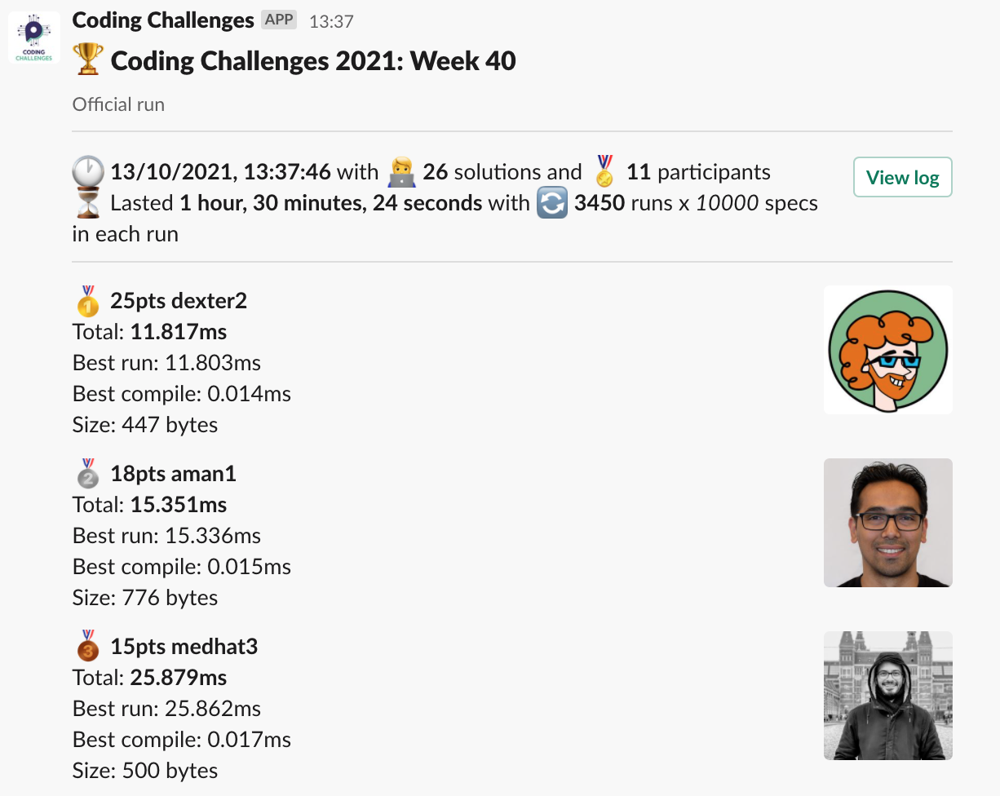
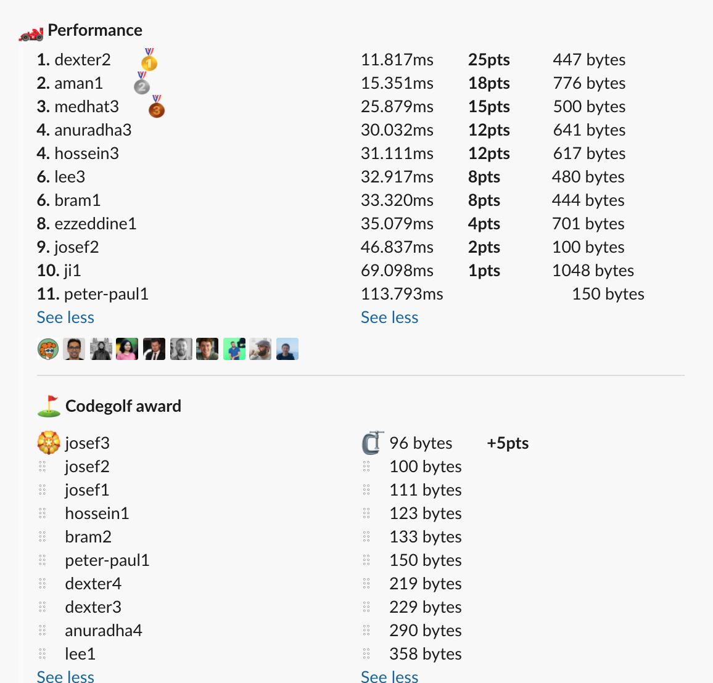

# Week 40 challenge

Jerry likes playing cards with friends. One day, he sat for a game with a random stranger in the park. As the game progressed, jerry started suspecting that the stranger might have swapped a card with one of his own card. He needs help to find out if there is an invalid card in the deck.

Each card in the deck is represented by an alphabet (case-sensitive) and number of cards used for the game is not fixed.

Jerry knows the initial set of cards in the deck and the current set. Help in identify if there is an additional card in the deck. Note: The deck was shuffled in-between.

Example:
```
helpJerry('aysllash', 'haasslyh') // return ['l', 'h']
```

Explanation:

Initial set of cards: syllaash
Set of cards during check: aysllash

By looking at both the sets, the stranger has swapped the card `l` with the card `h` without jerry's knowledge.


Other Examples:
```
helpJerry('iermnerw', 'eenrmwri') // return []
helpJerry('abbcse', 'bcaedb') // return ['s', 'd']
helpJerry('rcjVnbgFkKlRAdhCakABwNdnsSjanDHkEe', 'hjRgkaHkeNKnEBFckanjAsAdrjVdDbCnlw') // return ['S', 'j']
helpJerry('QEEKFUpHRBNAWHBYUwKqVJBBKJ', 'UpKFBUQHJVKEPNqBYKEBABRWwH') // return ['J', 'P']
```

## Author

Varun


## Upload link

[PP Connect](https://connect.passionatepeople.io/code-challenge-submission)


## Results

| Place | Name      | Performance | Codegolf | Vote  | Total points |
|-------|-----------|-------------|----------|-------|--------------|
| 1.    | Dexter    | 25          |          | 5     | 30           |
| 2.    | Aman      | 18          |          |       | 18           |
| 3.    | Medhat    | 15          |          |       | 15           |
| 4.    | Anuradha  | 12          |          |       | 12           |
|       | Hossein   | 12          |          |       | 12           |
| 6.    | Lee       | 8           |          |       | 8            |
|       | Bram      | 8           |          |       | 8            |
| 8.    | Josef     | 2           | 5        |       | 7            |
| 9.    | Ezzeddine | 4           |          |       | 4            |
| 10.   | Ji        | 1           |          |       | 1            |


### Screenshot





### Vote

```
╔════════════════╤═════════╤════════════════════════════════════════════════════════════════════════════════════════════════════════════════════╗
║ Name           │ Vote    │ Comment                                                                                                            ║
╟────────────────┼─────────┼────────────────────────────────────────────────────────────────────────────────────────────────────────────────────╢
║ lee            │ dexter2 │ Really love this approach of adding/subtracting 1 (so balanced pairs are eliminated as 0 in the second while loop) ║
╟────────────────┼─────────┼────────────────────────────────────────────────────────────────────────────────────────────────────────────────────╢
║ aman.tuladhar  │ dexter2 │ Simple, fast, and readable!                                                                                        ║
╟────────────────┼─────────┼────────────────────────────────────────────────────────────────────────────────────────────────────────────────────╢
║ anuradha       │ dexter2 │ unique solution, using array of numbers to solve a problem of strings                                              ║
╟────────────────┼─────────┼────────────────────────────────────────────────────────────────────────────────────────────────────────────────────╢
║ varun          │ josef3  │ Using replace to the advantage                                                                                     ║
╟────────────────┼─────────┼────────────────────────────────────────────────────────────────────────────────────────────────────────────────────╢
║ harijs.deksnis │ dexter2 │ Really smart to think of an array as a way to represent this problem                                               ║
╟────────────────┼─────────┼────────────────────────────────────────────────────────────────────────────────────────────────────────────────────╢
║ medhat         │ dexter2 │ I liked the array idea and reverse looping +1                                                                      ║
╚════════════════╧═════════╧════════════════════════════════════════════════════════════════════════════════════════════════════════════════════╝
```


### Full output log
```

EVALUATION STARTED:                 13/10/2021, 12:07:16
EVALUATING CHALLENGE:               2021/w40
FOUND 26 SOLUTIONS:                 aman1.js, anuradha1.js, anuradha2.js, anuradha3.js, anuradha4.js, bram1.js, bram2.js, dexter1.js, dexter2.js, dexter3.js,
                          dexter4.js, ezzeddine1.js, hossein1.js, hossein2.js, hossein3.js, ji1.js, josef1.js, josef2.js, josef3.js, lee1.js,
                          lee2.js, lee3.js, medhat1.js, medhat2.js, medhat3.js, peter-paul1.js
RUNNING EVALUATION FOR:             5400 SECONDS WITH 10000 TEST CASES IN EACH CYCLE...


EVALUATION ENDED:                   13/10/2021, 13:37:40
DURATION:                           1 hour, 30 minutes, 24.383 seconds

RANKINGS:
╔═══════╤════════╤═════════════╤═══════════╤═══════════╤══════════════╤══════╗
║ Place │ Points │ Name        │ Total     │ Best run  │ Best compile │ Size ║
╟───────┼────────┼─────────────┼───────────┼───────────┼──────────────┼──────╢
║ 1     │ 25     │ dexter2     │ 11.817ms  │ 11.803ms  │ 0.014ms      │ 447  ║
╟───────┼────────┼─────────────┼───────────┼───────────┼──────────────┼──────╢
║ 2     │ 18     │ aman1       │ 15.351ms  │ 15.336ms  │ 0.015ms      │ 776  ║
╟───────┼────────┼─────────────┼───────────┼───────────┼──────────────┼──────╢
║ 3     │ 15     │ medhat3     │ 25.879ms  │ 25.862ms  │ 0.017ms      │ 500  ║
╟───────┼────────┼─────────────┼───────────┼───────────┼──────────────┼──────╢
║ 4     │ 12     │ anuradha3   │ 30.032ms  │ 30.016ms  │ 0.016ms      │ 641  ║
╟───────┼────────┼─────────────┼───────────┼───────────┼──────────────┼──────╢
║       │ 12     │ hossein3    │ 31.111ms  │ 31.095ms  │ 0.016ms      │ 617  ║
╟───────┼────────┼─────────────┼───────────┼───────────┼──────────────┼──────╢
║ 6     │ 8      │ lee3        │ 32.917ms  │ 32.902ms  │ 0.014ms      │ 480  ║
╟───────┼────────┼─────────────┼───────────┼───────────┼──────────────┼──────╢
║       │ 8      │ bram1       │ 33.320ms  │ 33.306ms  │ 0.015ms      │ 444  ║
╟───────┼────────┼─────────────┼───────────┼───────────┼──────────────┼──────╢
║ 8     │ 4      │ ezzeddine1  │ 35.079ms  │ 35.062ms  │ 0.017ms      │ 701  ║
╟───────┼────────┼─────────────┼───────────┼───────────┼──────────────┼──────╢
║ 9     │ 2      │ josef2      │ 46.837ms  │ 46.824ms  │ 0.013ms      │ 100  ║
╟───────┼────────┼─────────────┼───────────┼───────────┼──────────────┼──────╢
║ 10    │ 1      │ ji1         │ 69.098ms  │ 69.083ms  │ 0.014ms      │ 1048 ║
╟───────┼────────┼─────────────┼───────────┼───────────┼──────────────┼──────╢
║ 11    │        │ peter-paul1 │ 113.793ms │ 113.776ms │ 0.017ms      │ 150  ║
╚═══════╧════════╧═════════════╧═══════════╧═══════════╧══════════════╧══════╝

Keeping only best run from each contestant
Using 5% margin for determening ties

OMITTED FROM RANKINGS:              dexter4.js, dexter3.js, anuradha1.js, hossein2.js, anuradha2.js, bram2.js, josef1.js, josef3.js, medhat2.js, lee2.js,
                          lee1.js, anuradha4.js, medhat1.js, hossein1.js, dexter1.js

CODEGOLF AWARD:                     josef3.js with 96 bytes

SYSTEM INFO:
NODE: v14.16.0
ARCH: x64
PLATFORM: linux
VERSION: #56-Ubuntu SMP Mon Oct 5 14:28:49 UTC 2020
MEMORY: 15.64GB
CPUS: 2 x Intel(R) Xeon(R) Gold 6140 CPU @ 2.30GHz
CPU speed: 2494MHz

RAW RESULTS:
┌─────────┬──────────────────┬────────────────────┬────────────────────┬──────────────────────┬──────┬────────────────┬────────────────────┬──────────────┬────────┬────────────┬──────┐
│ (index) │     solution     │       total        │      bestRun       │     bestCompile      │ size │    compiled    │   validationTime   │ onlyCodegolf │ failed │ failReason │ runs │
├─────────┼──────────────────┼────────────────────┼────────────────────┼──────────────────────┼──────┼────────────────┼────────────────────┼──────────────┼────────┼────────────┼──────┤
│    0    │   'dexter2.js'   │ 11.817294999957085 │ 11.80315799987875  │ 0.014137000078335404 │ 447  │ 'successfully' │ 45.23612100000173  │    false     │ false  │    null    │ 3450 │
│    1    │    'aman1.js'    │ 15.351173000177369 │ 15.336009999969974 │ 0.015163000207394361 │ 776  │ 'successfully' │ 94.06060999999681  │    false     │ false  │    null    │ 3450 │
│    2    │   'dexter4.js'   │ 17.468641000334173 │  17.4554820000194  │ 0.013159000314772129 │ 219  │ 'successfully' │ 33.60786399999779  │    false     │ false  │    null    │ 3450 │
│    3    │   'dexter3.js'   │ 18.125563999870792 │ 18.112660999875516 │ 0.012902999995276332 │ 229  │ 'successfully' │ 34.13017300000138  │    false     │ false  │    null    │ 3450 │
│    4    │   'medhat3.js'   │ 25.87863900011871  │ 25.862051000003703 │ 0.016588000115007162 │ 500  │ 'successfully' │ 43.87172199999986  │    false     │ false  │    null    │ 3450 │
│    5    │  'anuradha3.js'  │ 30.031720999861136 │ 30.01556900003925  │ 0.01615199982188642  │ 641  │ 'successfully' │ 56.39090199999919  │    false     │ false  │    null    │ 3450 │
│    6    │  'anuradha1.js'  │ 30.631800000439398 │ 30.617682000040077 │ 0.014118000399321318 │ 588  │ 'successfully' │ 73.27853200000027  │    false     │ false  │    null    │ 3450 │
│    7    │  'hossein3.js'   │ 31.110996000061277 │ 31.094932999985758 │ 0.016063000075519085 │ 617  │ 'successfully' │ 54.57634899999903  │    false     │ false  │    null    │ 3450 │
│    8    │    'lee3.js'     │ 32.91650200029835  │ 32.90201900014654  │ 0.01448300015181303  │ 480  │ 'successfully' │ 51.17801099999997  │    false     │ false  │    null    │ 3450 │
│    9    │    'bram1.js'    │ 33.32046200032346  │ 33.30558000016026  │ 0.014882000163197517 │ 444  │ 'successfully' │ 74.14002400000027  │    false     │ false  │    null    │ 3450 │
│   10    │  'hossein2.js'   │  33.6728010000661  │ 33.65717800008133  │ 0.015622999984771013 │ 700  │ 'successfully' │ 59.24334699999963  │    false     │ false  │    null    │ 3450 │
│   11    │  'anuradha2.js'  │ 34.965157000144245 │ 34.95101099999738  │ 0.014146000146865845 │ 624  │ 'successfully' │ 74.71109300000171  │    false     │ false  │    null    │ 3450 │
│   12    │ 'ezzeddine1.js'  │ 35.07908000005409  │ 35.06226700008847  │ 0.01681299996562302  │ 701  │ 'successfully' │ 63.05049599999984  │    false     │ false  │    null    │ 3450 │
│   13    │    'bram2.js'    │ 35.929581000236794 │ 35.91648400016129  │ 0.013097000075504184 │ 133  │ 'successfully' │ 249.96212299999752 │    false     │ false  │    null    │ 3450 │
│   14    │   'josef2.js'    │ 46.83720399951562  │ 46.824076999910176 │ 0.013126999605447054 │ 100  │ 'successfully' │ 60.18139599999995  │    false     │ false  │    null    │ 3450 │
│   15    │   'josef1.js'    │ 47.18527499912307  │ 47.17199199926108  │ 0.013282999861985445 │ 111  │ 'successfully' │ 60.22984400000132  │    false     │ false  │    null    │ 3450 │
│   16    │   'josef3.js'    │ 47.38366200006567  │ 47.37055999995209  │ 0.01310200011357665  │  96  │ 'successfully' │ 237.3184919999985  │    false     │ false  │    null    │ 3450 │
│   17    │   'medhat2.js'   │ 56.41403299989179  │ 56.399609999964014 │ 0.014422999927774072 │ 437  │ 'successfully' │ 75.71409900000072  │    false     │ false  │    null    │ 3450 │
│   18    │    'lee2.js'     │ 59.20296899997629  │ 59.18869400001131  │ 0.014274999964982271 │ 433  │ 'successfully' │ 90.68371499999921  │    false     │ false  │    null    │ 3450 │
│   19    │    'lee1.js'     │ 62.03106399974786  │ 62.01699399994686  │ 0.014069999800994992 │ 358  │ 'successfully' │  92.4030160000002  │    false     │ false  │    null    │ 3450 │
│   20    │     'ji1.js'     │ 69.09768000012264  │ 69.08336800010875  │ 0.014312000013887882 │ 1048 │ 'successfully' │ 93.42184300000008  │    false     │ false  │    null    │ 3450 │
│   21    │  'anuradha4.js'  │ 78.04576300038025  │ 78.03011700045317  │ 0.015645999927073717 │ 290  │ 'successfully' │ 102.23649800000203 │    false     │ false  │    null    │ 3450 │
│   22    │   'medhat1.js'   │ 84.88785899942741  │ 84.87197300000116  │ 0.01588599942624569  │ 462  │ 'successfully' │ 284.47685600000113 │    false     │ false  │    null    │ 3450 │
│   23    │  'hossein1.js'   │ 85.11756700038677  │ 85.10305400000652  │ 0.014513000380247831 │ 123  │ 'successfully' │ 120.82945599999948 │    false     │ false  │    null    │ 3450 │
│   24    │ 'peter-paul1.js' │ 113.7931849991437  │ 113.7762849999126  │ 0.016899999231100082 │ 150  │ 'successfully' │  375.797129999999  │    false     │ false  │    null    │ 3450 │
│   25    │   'dexter1.js'   │ 168.60240299999714 │ 168.5292259999551  │ 0.07317700004205108  │ 527  │ 'successfully' │ 574.0473859999984  │    false     │ false  │    null    │ 3450 │
└─────────┴──────────────────┴────────────────────┴────────────────────┴──────────────────────┴──────┴────────────────┴────────────────────┴──────────────┴────────┴────────────┴──────┘
```
  