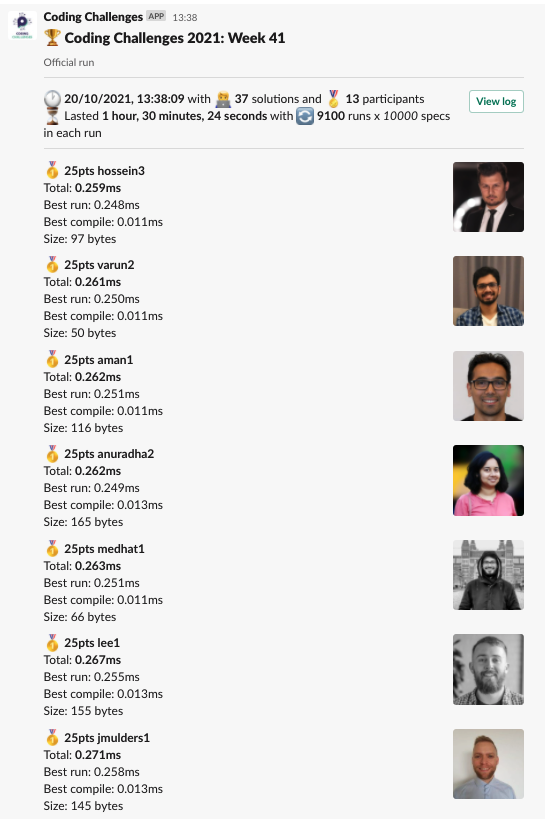
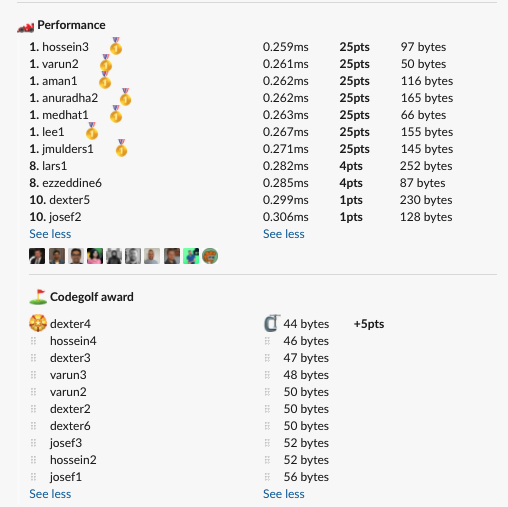

# Week 41 challenge

Write a function `addUpWithoutTens` which takes in a number `N` and returns the sum of all integers from 1 until `N` including, except those which are divisible by 10;


Examples:
```
addUpWithoutTens(1) // returns 1
addUpWithoutTens(5) // returns 15
addUpWithoutTens(9) // returns 45
addUpWithoutTens(10) // returns 45
addUpWithoutTens(11) // returns 56
addUpWithoutTens(19) // returns 180
addUpWithoutTens(20) // returns 180
```


## Upload link

[PP Connect](https://connect.passionatepeople.io/code-challenge-submission)

## Results

| Place | Name      | Performance | Codegolf | Vote  | Total points |
|-------|-----------|-------------|----------|-------|--------------|
| 1.    | Jan Bart  | 25          |          | 5     | 30           |
| 2.    | Hossein   | 25          |          |       | 25           |
|       | Varun     | 25          |          |       | 25           |
|       | Aman      | 25          |          |       | 25           |
|       | Anuradha  | 25          |          |       | 25           |
|       | Medhat    | 25          |          |       | 25           |
|       | Lee       | 25          |          |       | 25           |
| 8.    | Dexter    | 1           | 5        |       | 6            |
| 9.    | Lars      | 4           |          |       | 4            |
|       | Ezzeddine | 4           |          |       | 4            |
| 11.   | Josef     | 1           |          |       | 1            |


### Screenshot





### Vote

```
╔════════════════╤═══════════╤═══════════════════════════════════════════╗
║ Name           │ Vote      │ Comment                                   ║
╟────────────────┼───────────┼───────────────────────────────────────────╢
║ patrick        │ lee1      │ Elegant and readable                      ║
╟────────────────┼───────────┼───────────────────────────────────────────╢
║ lee            │ jmulders1 │ I like extracting out that addUp function ║
╟────────────────┼───────────┼───────────────────────────────────────────╢
║ aman.tuladhar  │ dexter4   │ Genius! poetry man poetry                 ║
╟────────────────┼───────────┼───────────────────────────────────────────╢
║ harijs.deksnis │ jmulders1 │ Well readable and with a reusable logic.  ║
╟────────────────┼───────────┼───────────────────────────────────────────╢
║ varun          │ hossein3  │ Getting the solution faster with ~~       ║
╚════════════════╧═══════════╧═══════════════════════════════════════════╝
```


### Full output log
```

EVALUATION STARTED:                 20/10/2021, 12:07:39
EVALUATING CHALLENGE:               2021/w41
FOUND 37 SOLUTIONS:                 aman1.js, anuradha1.js, anuradha2.js, bram1.js, bram2.js, dexter1.js, dexter2.js, dexter3.js, dexter4.js, dexter5.js,
                          dexter6.js, dexter7.js, dexter8.js, ezzeddine1.js, ezzeddine2.js, ezzeddine3.js, ezzeddine4.js, ezzeddine5.js,
                          ezzeddine6.js, hossein1.js, hossein2.js, hossein3.js, hossein4.js, jmulders1.js, josef1.js, josef2.js, josef3.js,
                          josef4.js, lars1.js, lee1.js, medhat1.js, medhat2.js, patrick1.js, patrick2.js, varun1.js, varun2.js, varun3.js
RUNNING EVALUATION FOR:             5400 SECONDS WITH 10000 TEST CASES IN EACH CYCLE...


EVALUATION ENDED:                   20/10/2021, 13:38:04
DURATION:                           1 hour, 30 minutes, 24.413 seconds

RANKINGS:
╔═══════╤════════╤════════════╤═════════╤══════════╤══════════════╤══════╗
║ Place │ Points │ Name       │ Total   │ Best run │ Best compile │ Size ║
╟───────┼────────┼────────────┼─────────┼──────────┼──────────────┼──────╢
║ 1     │ 25     │ hossein3   │ 0.259ms │ 0.248ms  │ 0.011ms      │ 97   ║
╟───────┼────────┼────────────┼─────────┼──────────┼──────────────┼──────╢
║       │ 25     │ varun2     │ 0.261ms │ 0.250ms  │ 0.011ms      │ 50   ║
╟───────┼────────┼────────────┼─────────┼──────────┼──────────────┼──────╢
║       │ 25     │ aman1      │ 0.262ms │ 0.251ms  │ 0.011ms      │ 116  ║
╟───────┼────────┼────────────┼─────────┼──────────┼──────────────┼──────╢
║       │ 25     │ anuradha2  │ 0.262ms │ 0.249ms  │ 0.013ms      │ 165  ║
╟───────┼────────┼────────────┼─────────┼──────────┼──────────────┼──────╢
║       │ 25     │ medhat1    │ 0.263ms │ 0.251ms  │ 0.011ms      │ 66   ║
╟───────┼────────┼────────────┼─────────┼──────────┼──────────────┼──────╢
║       │ 25     │ lee1       │ 0.267ms │ 0.255ms  │ 0.013ms      │ 155  ║
╟───────┼────────┼────────────┼─────────┼──────────┼──────────────┼──────╢
║       │ 25     │ jmulders1  │ 0.271ms │ 0.258ms  │ 0.013ms      │ 145  ║
╟───────┼────────┼────────────┼─────────┼──────────┼──────────────┼──────╢
║ 8     │ 4      │ lars1      │ 0.282ms │ 0.269ms  │ 0.013ms      │ 252  ║
╟───────┼────────┼────────────┼─────────┼──────────┼──────────────┼──────╢
║       │ 4      │ ezzeddine6 │ 0.285ms │ 0.266ms  │ 0.018ms      │ 87   ║
╟───────┼────────┼────────────┼─────────┼──────────┼──────────────┼──────╢
║ 10    │ 1      │ dexter5    │ 0.299ms │ 0.287ms  │ 0.012ms      │ 230  ║
╟───────┼────────┼────────────┼─────────┼──────────┼──────────────┼──────╢
║       │ 1      │ josef2     │ 0.306ms │ 0.293ms  │ 0.013ms      │ 128  ║
╚═══════╧════════╧════════════╧═════════╧══════════╧══════════════╧══════╝

Keeping only best run from each contestant
Using 5% margin for determening ties

OMITTED FROM RANKINGS:              varun3.js, medhat2.js, hossein4.js, ezzeddine2.js, ezzeddine1.js, varun1.js, ezzeddine3.js, ezzeddine4.js, ezzeddine5.js,
                          dexter8.js, josef4.js, dexter4.js, dexter7.js, dexter3.js, josef3.js, josef1.js, dexter2.js, hossein2.js, dexter1.js,
                          dexter6.js, hossein1.js

ONLY CODEGOLF SOLUTIONS:            anuradha1.js, bram1.js, bram2.js

CODEGOLF AWARD:                     dexter4.js with 44 bytes

FAILED SOLUTIONS:                   patrick1.js, patrick2.js

SYSTEM INFO:
NODE: v14.16.0
ARCH: x64
PLATFORM: linux
VERSION: #56-Ubuntu SMP Mon Oct 5 14:28:49 UTC 2020
MEMORY: 15.64GB
CPUS: 2 x Intel Xeon Processor (Cascadelake)
CPU speed: 2494MHz

RAW RESULTS:
┌─────────┬─────────────────┬─────────────────────┬─────────────────────┬──────────────────────┬──────┬────────────────┬────────────────────┬──────────────┬────────┬────────────────────┬──────┐
│ (index) │    solution     │        total        │       bestRun       │     bestCompile      │ size │    compiled    │   validationTime   │ onlyCodegolf │ failed │     failReason     │ runs │
├─────────┼─────────────────┼─────────────────────┼─────────────────────┼──────────────────────┼──────┼────────────────┼────────────────────┼──────────────┼────────┼────────────────────┼──────┤
│    0    │  'hossein3.js'  │ 0.25893899984657764 │ 0.24769699992612004 │ 0.011241999920457602 │  97  │ 'successfully' │ 6.160884999997506  │    false     │ false  │        null        │ 9100 │
│    1    │   'varun2.js'   │ 0.26127399993129075 │ 0.24997499980963767 │ 0.01129900012165308  │  50  │ 'successfully' │ 13.27970600000117  │    false     │ false  │        null        │ 9100 │
│    2    │   'varun3.js'   │ 0.26167199993506074 │ 0.25038899993523955 │ 0.011282999999821186 │  48  │ 'successfully' │ 13.272007999999914 │    false     │ false  │        null        │ 9100 │
│    3    │   'aman1.js'    │ 0.2617540000937879  │ 0.2507589999586344  │ 0.010995000135153532 │ 116  │ 'successfully' │ 24.351417000001675 │    false     │ false  │        null        │ 9100 │
│    4    │ 'anuradha2.js'  │ 0.26234800001839176 │ 0.24937800003681332 │ 0.01296999998157844  │ 165  │ 'successfully' │ 14.756321000000753 │    false     │ false  │        null        │ 9100 │
│    5    │  'medhat1.js'   │ 0.2627249991055578  │ 0.25135199981741607 │ 0.011372999288141727 │  66  │ 'successfully' │ 6.079785000001721  │    false     │ false  │        null        │ 9100 │
│    6    │  'medhat2.js'   │ 0.26486500003375113 │ 0.25335699995048344 │ 0.011508000083267689 │ 133  │ 'successfully' │ 6.054340999995475  │    false     │ false  │        null        │ 9100 │
│    7    │  'hossein4.js'  │ 0.26558699959423393 │ 0.2540580000495538  │ 0.011528999544680119 │  46  │ 'successfully' │ 16.972397999998066 │    false     │ false  │        null        │ 9100 │
│    8    │    'lee1.js'    │ 0.26744499965570867 │ 0.2546180000063032  │ 0.01282699964940548  │ 155  │ 'successfully' │ 6.656668000003265  │    false     │ false  │        null        │ 9100 │
│    9    │ 'jmulders1.js'  │ 0.2706140000373125  │  0.257852999959141  │ 0.012761000078171492 │ 145  │ 'successfully' │ 6.728930999997829  │    false     │ false  │        null        │ 9100 │
│   10    │   'lars1.js'    │ 0.28208399983122945 │ 0.26916499994695187 │ 0.012918999884277582 │ 252  │ 'successfully' │ 5.757217999998829  │    false     │ false  │        null        │ 9100 │
│   11    │ 'ezzeddine6.js' │ 0.28462000051513314 │ 0.26629600021988153 │ 0.018324000295251608 │  87  │ 'successfully' │ 6.680920999999216  │    false     │ false  │        null        │ 9100 │
│   12    │ 'ezzeddine2.js' │ 0.29332100006286055 │  0.282242999994196  │ 0.01107800006866455  │ 107  │ 'successfully' │ 10.638073000001896 │    false     │ false  │        null        │ 9100 │
│   13    │ 'ezzeddine1.js' │ 0.2954659997485578  │ 0.2839119997806847  │ 0.011553999967873096 │ 190  │ 'successfully' │ 9.396675000003597  │    false     │ false  │        null        │ 9100 │
│   14    │   'varun1.js'   │ 0.2960879998281598  │ 0.2832599999383092  │ 0.012827999889850616 │ 181  │ 'successfully' │ 9.420992999999726  │    false     │ false  │        null        │ 9100 │
│   15    │ 'ezzeddine3.js' │ 0.2991209998726845  │ 0.28757600020617247 │ 0.011544999666512012 │  74  │ 'successfully' │ 15.190483999998833 │    false     │ false  │        null        │ 9100 │
│   16    │  'dexter5.js'   │ 0.29913100018166006 │ 0.2866410000715405  │ 0.012490000110119581 │ 230  │ 'successfully' │ 6.138421000003291  │    false     │ false  │        null        │ 9100 │
│   17    │ 'ezzeddine4.js' │ 0.3015960000921041  │ 0.29036700003780425 │ 0.011229000054299831 │  71  │ 'successfully' │ 16.83749099999841  │    false     │ false  │        null        │ 9100 │
│   18    │ 'ezzeddine5.js' │ 0.30221200035884976 │ 0.2857640003785491  │ 0.016447999980300665 │  79  │ 'successfully' │ 15.177507000000332 │    false     │ false  │        null        │ 9100 │
│   19    │   'josef2.js'   │ 0.30627099983394146 │ 0.2929210001602769  │ 0.01334999967366457  │ 128  │ 'successfully' │  6.70425200000318  │    false     │ false  │        null        │ 9100 │
│   20    │  'dexter8.js'   │ 0.31088499969337136 │ 0.2996689999708906  │ 0.011215999722480774 │ 248  │ 'successfully' │ 6.0329730000012205 │    false     │ false  │        null        │ 9100 │
│   21    │   'josef4.js'   │ 0.3134729997254908  │ 0.30049500009045005 │ 0.01297799963504076  │ 124  │ 'successfully' │  6.4849549999999   │    false     │ false  │        null        │ 9100 │
│   22    │  'dexter4.js'   │ 0.3259430001489818  │ 0.31459200009703636 │ 0.011351000051945448 │  44  │ 'successfully' │ 6.024654000000737  │    false     │ false  │        null        │ 9100 │
│   23    │  'dexter7.js'   │ 0.3260970002738759  │ 0.3144079999765381  │ 0.01168900029733777  │ 248  │ 'successfully' │ 5.996730999999272  │    false     │ false  │        null        │ 9100 │
│   24    │  'dexter3.js'   │ 0.3356270003132522  │ 0.3245550002902746  │ 0.01107200002297759  │  47  │ 'successfully' │ 6.517648000000918  │    false     │ false  │        null        │ 9100 │
│   25    │   'josef3.js'   │ 0.36909400013973936 │ 0.3576620001113042  │ 0.01143200002843514  │  52  │ 'successfully' │ 5.662774999997055  │    false     │ false  │        null        │ 9100 │
│   26    │   'josef1.js'   │ 0.3727490003220737  │ 0.3613830003887415  │ 0.011365999933332205 │  56  │ 'successfully' │ 6.3996489999990445 │    false     │ false  │        null        │ 9100 │
│   27    │  'dexter2.js'   │ 0.37307900027371943 │ 0.3617000002413988  │ 0.011379000032320619 │  50  │ 'successfully' │ 10.169114999996964 │    false     │ false  │        null        │ 9100 │
│   28    │  'hossein2.js'  │ 0.38813599944114685 │ 0.37645099963992834 │ 0.01168499980121851  │  52  │ 'successfully' │ 16.06429300000309  │    false     │ false  │        null        │ 9100 │
│   29    │  'dexter1.js'   │ 0.4901949993800372  │ 0.47832600004039705 │ 0.01186899933964014  │  72  │ 'successfully' │ 17.647204000000784 │    false     │ false  │        null        │ 9100 │
│   30    │  'dexter6.js'   │ 0.5624069997575134  │ 0.5508520000148565  │ 0.011554999742656946 │  50  │ 'successfully' │ 6.672939999996743  │    false     │ false  │        null        │ 9100 │
│   31    │  'hossein1.js'  │  552.7173480000347  │  552.6913809999824  │ 0.025967000052332878 │ 174  │ 'successfully' │ 573.9000569999989  │    false     │ false  │        null        │ 9100 │
│   32    │ 'anuradha1.js'  │        null         │        null         │         null         │ 185  │ 'successfully' │ 11227.542187999998 │     true     │ false  │        null        │  0   │
│   33    │   'bram1.js'    │        null         │        null         │         null         │ 197  │ 'successfully' │ 11179.977474999992 │     true     │ false  │        null        │  0   │
│   34    │   'bram2.js'    │        null         │        null         │         null         │ 197  │ 'successfully' │ 11268.033903999996 │     true     │ false  │        null        │  0   │
│   35    │  'patrick1.js'  │        null         │        null         │         null         │ 220  │ 'successfully' │ 4.443657000003441  │    false     │  true  │ 'Incorrect result' │  0   │
│   36    │  'patrick2.js'  │        null         │        null         │         null         │  75  │ 'successfully' │ 6.319482999999309  │    false     │  true  │ 'Incorrect result' │  0   │
└─────────┴─────────────────┴─────────────────────┴─────────────────────┴──────────────────────┴──────┴────────────────┴────────────────────┴──────────────┴────────┴────────────────────┴──────┘
```
  