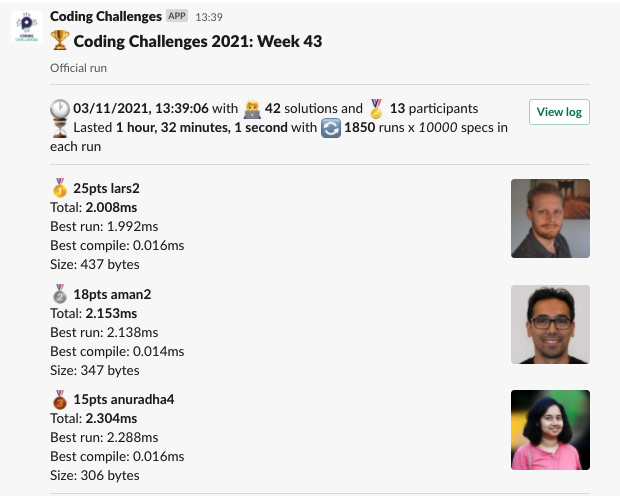
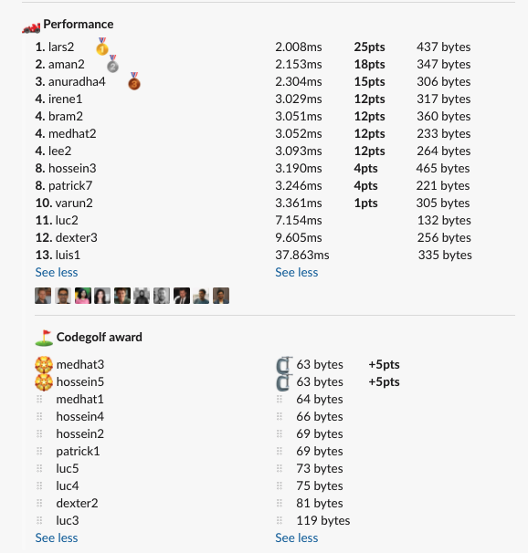

# Week 43 challenge

Write a function `hasItAll` which detects if given sentence is a pangram; A pangram is a sentence using every letter of the (Latin) alphabet at least once.


Letter case, numbers and punctuations can be ignored.

Examples:
```
hasItAll('Quick zephyrs blow, vexing daft Jim.') // returns true
hasItAll('Coding challenges are fun and interesting to create.') // returns false
hasItAll('Pack my box with five dozen liquor jugs.') // returns true
hasItAll('A wizard\'s job is to vex chumps quickly in fog.') // returns true
```


## Upload link

[PP Connect](https://connect.passionatepeople.io/code-challenge-submission)

## Results

| Place | Name     | Performance | Codegolf | Vote  | Total points |
|-------|----------|-------------|----------|-------|--------------|
| 1.    | Lars     | 25          |          | 5     | 30           |
| 2.    | Medhat   | 12          | 5        | 5     | 22           |
| 3.    | Aman     | 18          |          |       | 18           |
| 4.    | Anuradha | 15          |          |       | 15           |
| 5.    | Hossein  | 4           | 5        | 5     | 14           |
| 6.    | Irene    | 12          |          |       | 12           |
|       | Bram     | 12          |          |       | 12           |
|       | Lee      | 12          |          |       | 12           |
| 9.    | Patrick  | 4           |          |       | 4            |
| 10.   | Varun    | 1           |          |       | 1            |


### Screenshot





### Vote

```
╔════════════════╤══════════╤═════════════════════════════════════════════════════════════════════════════════════════════════════════════╗
║ Name           │ Vote     │ Comment                                                                                                     ║
╟────────────────┼──────────┼─────────────────────────────────────────────────────────────────────────────────────────────────────────────╢
║ harijs.deksnis │ aman2    │ Smart heuristic figuring out that in the spec dataset input bellow 50 characters always should return false ║
╟────────────────┼──────────┼─────────────────────────────────────────────────────────────────────────────────────────────────────────────╢
║ tim            │ lee3     │ Do repeat yourself 😆                                                                                       ║
╟────────────────┼──────────┼─────────────────────────────────────────────────────────────────────────────────────────────────────────────╢
║ anuradha       │ lars2    │ pretty straightforward solution, and fast ⚡                                                                ║
╟────────────────┼──────────┼─────────────────────────────────────────────────────────────────────────────────────────────────────────────╢
║ luc            │ hossein5 │ Recursive Regex :hat-off:                                                                                   ║
╟────────────────┼──────────┼─────────────────────────────────────────────────────────────────────────────────────────────────────────────╢
║ patrick        │ lars2    │ Smart use of assigning prototype methods to variables and calling these directly                            ║
╟────────────────┼──────────┼─────────────────────────────────────────────────────────────────────────────────────────────────────────────╢
║ timetc         │ medhat3  │ Really neatly done, also like the details like `>25`                                                        ║
╟────────────────┼──────────┼─────────────────────────────────────────────────────────────────────────────────────────────────────────────╢
║ hossein        │ varun1   │ didn't know about `Array(26).fill(0)`                                                                       ║
║                │          │ Honorable mention: lars1 for bitwise operation                                                              ║
╟────────────────┼──────────┼─────────────────────────────────────────────────────────────────────────────────────────────────────────────╢
║ bram           │ medhat3  │ Very smart solution for the codegolf!                                                                       ║
╟────────────────┼──────────┼─────────────────────────────────────────────────────────────────────────────────────────────────────────────╢
║ medhat         │ hossein5 │ I like how he plays with regex to make a small one                                                          ║
╚════════════════╧══════════╧═════════════════════════════════════════════════════════════════════════════════════════════════════════════╝
```


### Full output log
```
EVALUATION STARTED:                 03/11/2021, 12:06:59
EVALUATING CHALLENGE:               2021/w43
FOUND 42 SOLUTIONS:                 aman1.js, aman2.js, anuradha1.js, anuradha2.js, anuradha3.js, anuradha4.js, bram1.js, bram2.js, bram3.js, dexter1.js,
                          dexter2.js, dexter3.js, dexter4.js, hossein1.js, hossein2.js, hossein3.js, hossein4.js, hossein5.js, irene1.js, lars1.js,
                          lars2.js, lee1.js, lee2.js, lee3.js, luc1.js, luc2.js, luc3.js, luc4.js, luc5.js, luis1.js, medhat1.js, medhat2.js,
                          medhat3.js, patrick1.js, patrick2.js, patrick3.js, patrick4.js, patrick5.js, patrick6.js, patrick7.js, varun1.js,
                          varun2.js
RUNNING EVALUATION FOR:             5400 SECONDS WITH 10000 TEST CASES IN EACH CYCLE...


EVALUATION ENDED:                   03/11/2021, 13:39:01
DURATION:                           1 hour, 32 minutes, 1.835 seconds

RANKINGS:
╔═══════╤════════╤═══════════╤══════════╤══════════╤══════════════╤══════╗
║ Place │ Points │ Name      │ Total    │ Best run │ Best compile │ Size ║
╟───────┼────────┼───────────┼──────────┼──────────┼──────────────┼──────╢
║ 1     │ 25     │ lars2     │ 2.008ms  │ 1.992ms  │ 0.016ms      │ 437  ║
╟───────┼────────┼───────────┼──────────┼──────────┼──────────────┼──────╢
║ 2     │ 18     │ aman2     │ 2.153ms  │ 2.138ms  │ 0.014ms      │ 347  ║
╟───────┼────────┼───────────┼──────────┼──────────┼──────────────┼──────╢
║ 3     │ 15     │ anuradha4 │ 2.304ms  │ 2.288ms  │ 0.016ms      │ 306  ║
╟───────┼────────┼───────────┼──────────┼──────────┼──────────────┼──────╢
║ 4     │ 12     │ irene1    │ 3.029ms  │ 3.014ms  │ 0.015ms      │ 317  ║
╟───────┼────────┼───────────┼──────────┼──────────┼──────────────┼──────╢
║       │ 12     │ bram2     │ 3.051ms  │ 3.036ms  │ 0.015ms      │ 360  ║
╟───────┼────────┼───────────┼──────────┼──────────┼──────────────┼──────╢
║       │ 12     │ medhat2   │ 3.052ms  │ 3.038ms  │ 0.014ms      │ 233  ║
╟───────┼────────┼───────────┼──────────┼──────────┼──────────────┼──────╢
║       │ 12     │ lee2      │ 3.093ms  │ 3.079ms  │ 0.014ms      │ 264  ║
╟───────┼────────┼───────────┼──────────┼──────────┼──────────────┼──────╢
║ 8     │ 4      │ hossein3  │ 3.190ms  │ 3.177ms  │ 0.013ms      │ 465  ║
╟───────┼────────┼───────────┼──────────┼──────────┼──────────────┼──────╢
║       │ 4      │ patrick7  │ 3.246ms  │ 3.233ms  │ 0.013ms      │ 221  ║
╟───────┼────────┼───────────┼──────────┼──────────┼──────────────┼──────╢
║ 10    │ 1      │ varun2    │ 3.361ms  │ 3.348ms  │ 0.014ms      │ 305  ║
╟───────┼────────┼───────────┼──────────┼──────────┼──────────────┼──────╢
║ 11    │        │ luc2      │ 7.154ms  │ 7.141ms  │ 0.013ms      │ 132  ║
╟───────┼────────┼───────────┼──────────┼──────────┼──────────────┼──────╢
║ 12    │        │ dexter3   │ 9.605ms  │ 9.590ms  │ 0.015ms      │ 256  ║
╟───────┼────────┼───────────┼──────────┼──────────┼──────────────┼──────╢
║ 13    │        │ luis1     │ 37.863ms │ 37.844ms │ 0.019ms      │ 335  ║
╚═══════╧════════╧═══════════╧══════════╧══════════╧══════════════╧══════╝

Keeping only best run from each contestant
Using 5% margin for determening ties

OMITTED FROM RANKINGS:              aman1.js, bram3.js, anuradha3.js, lee3.js, bram1.js, patrick5.js, patrick6.js, patrick4.js, anuradha2.js, patrick2.js,
                          lars1.js, luc1.js, luc3.js, varun1.js, patrick3.js, anuradha1.js, hossein1.js, lee1.js, hossein2.js, luc4.js, luc5.js,
                          dexter1.js, medhat1.js, medhat3.js, patrick1.js, dexter2.js, hossein4.js, hossein5.js

ONLY CODEGOLF SOLUTIONS:            dexter4.js

CODEGOLF AWARD:                     hossein5.js, medhat3.js with 63 bytes

SYSTEM INFO:
NODE: v14.16.0
ARCH: x64
PLATFORM: linux
VERSION: #56-Ubuntu SMP Mon Oct 5 14:28:49 UTC 2020
MEMORY: 15.64GB
CPUS: 2 x Intel Xeon Processor (Cascadelake)
CPU speed: 2494MHz

RAW RESULTS:
┌─────────┬────────────────┬────────────────────┬────────────────────┬──────────────────────┬──────┬────────────────┬────────────────────┬──────────────┬────────┬────────────┬──────┐
│ (index) │    solution    │       total        │      bestRun       │     bestCompile      │ size │    compiled    │   validationTime   │ onlyCodegolf │ failed │ failReason │ runs │
├─────────┼────────────────┼────────────────────┼────────────────────┼──────────────────────┼──────┼────────────────┼────────────────────┼──────────────┼────────┼────────────┼──────┤
│    0    │   'lars2.js'   │ 2.008216999587603  │ 1.991725999978371  │ 0.01649099960923195  │ 437  │ 'successfully' │ 14.256690999998682 │    false     │ false  │    null    │ 1850 │
│    1    │   'aman2.js'   │ 2.1528929997002706 │ 2.1384410000173375 │ 0.014451999682933092 │ 347  │ 'successfully' │ 22.178757000001497 │    false     │ false  │    null    │ 1850 │
│    2    │ 'anuradha4.js' │ 2.3040320003055967 │ 2.2876100000576116 │ 0.016422000247985125 │ 306  │ 'successfully' │  24.0454639999989  │    false     │ false  │    null    │ 1850 │
│    3    │   'aman1.js'   │ 3.0143590001389384 │ 2.9995050001889467 │ 0.014853999949991703 │ 296  │ 'successfully' │ 27.199625999997807 │    false     │ false  │    null    │ 1850 │
│    4    │  'irene1.js'   │ 3.0286830000113696 │ 3.014178999932483  │ 0.014504000078886747 │ 317  │ 'successfully' │ 14.642296999998507 │    false     │ false  │    null    │ 1850 │
│    5    │   'bram2.js'   │ 3.0513090001186356 │ 3.036155999987386  │ 0.015153000131249428 │ 360  │ 'successfully' │ 10.146476000001712 │    false     │ false  │    null    │ 1850 │
│    6    │  'medhat2.js'  │ 3.0516910000296775 │ 3.0380820000136737 │ 0.013609000016003847 │ 233  │ 'successfully' │ 12.028621000001294 │    false     │ false  │    null    │ 1850 │
│    7    │   'bram3.js'   │ 3.0571009998675436 │ 3.042284999974072  │ 0.014815999893471599 │ 410  │ 'successfully' │  9.8794510000007   │    false     │ false  │    null    │ 1850 │
│    8    │ 'anuradha3.js' │ 3.0861119995824993 │ 3.0711330003105104 │ 0.014978999271988869 │ 217  │ 'successfully' │ 12.840684999999212 │    false     │ false  │    null    │ 1850 │
│    9    │   'lee2.js'    │ 3.092803000472486  │ 3.0789870005100965 │ 0.01381599996238947  │ 264  │ 'successfully' │ 13.973559999998542 │    false     │ false  │    null    │ 1850 │
│   10    │   'lee3.js'    │ 3.1093159999873023 │ 3.095560000016121  │ 0.013755999971181154 │ 1218 │ 'successfully' │ 11.789314000001468 │    false     │ false  │    null    │ 1850 │
│   11    │   'bram1.js'   │ 3.148144999984652  │ 3.1333490000106394 │ 0.014795999974012375 │ 364  │ 'successfully' │ 12.162876999998844 │    false     │ false  │    null    │ 1850 │
│   12    │ 'hossein3.js'  │ 3.1902720000362024 │ 3.176873999997042  │ 0.013398000039160252 │ 465  │ 'successfully' │ 9.920444000003044  │    false     │ false  │    null    │ 1850 │
│   13    │ 'patrick7.js'  │ 3.245982999971602  │ 3.233204999996815  │ 0.012777999974787235 │ 221  │ 'successfully' │ 12.127220000002126 │    false     │ false  │    null    │ 1850 │
│   14    │ 'patrick5.js'  │ 3.2489799996837974 │ 3.236486000008881  │ 0.012493999674916267 │ 127  │ 'successfully' │  51.7372890000006  │    false     │ false  │    null    │ 1850 │
│   15    │ 'patrick6.js'  │ 3.251792999682948  │ 3.2392120000440627 │ 0.01258099963888526  │ 221  │ 'successfully' │ 13.077965000000404 │    false     │ false  │    null    │ 1850 │
│   16    │ 'patrick4.js'  │  3.32462799991481  │ 3.3123459999915212 │ 0.012281999923288822 │ 123  │ 'successfully' │ 35.98629499999879  │    false     │ false  │    null    │ 1850 │
│   17    │  'varun2.js'   │  3.36138299992308  │ 3.347786999773234  │ 0.013596000149846077 │ 305  │ 'successfully' │ 32.08422000000064  │    false     │ false  │    null    │ 1850 │
│   18    │ 'anuradha2.js' │ 4.440548000857234  │ 4.427410000003874  │  0.0131380008533597  │ 265  │ 'successfully' │ 16.375781999999163 │    false     │ false  │    null    │ 1850 │
│   19    │ 'patrick2.js'  │ 6.0438179997727275 │  6.03078499995172  │ 0.013032999821007252 │ 160  │ 'successfully' │ 21.89053199999762  │    false     │ false  │    null    │ 1850 │
│   20    │   'lars1.js'   │ 6.855284000048414  │ 6.840107999974862  │ 0.015176000073552132 │ 668  │ 'successfully' │ 18.174542000000656 │    false     │ false  │    null    │ 1850 │
│   21    │   'luc2.js'    │ 7.153771000099368  │ 7.140549000003375  │ 0.01322200009599328  │ 132  │ 'successfully' │ 14.712069000001065 │    false     │ false  │    null    │ 1850 │
│   22    │   'luc1.js'    │ 7.176550000003772  │ 7.163185999990674  │ 0.01336400001309812  │ 148  │ 'successfully' │ 16.318480000001728 │    false     │ false  │    null    │ 1850 │
│   23    │   'luc3.js'    │ 7.2311519999057055 │ 7.217335999943316  │ 0.01381599996238947  │ 119  │ 'successfully' │ 17.466072999999597 │    false     │ false  │    null    │ 1850 │
│   24    │  'varun1.js'   │ 7.294925999827683  │ 7.281216999981552  │ 0.01370899984613061  │ 245  │ 'successfully' │ 44.241140000001906 │    false     │ false  │    null    │ 1850 │
│   25    │ 'patrick3.js'  │  9.22251300001517  │  9.20813800022006  │ 0.014374999795109034 │ 146  │ 'successfully' │ 22.585842999997112 │    false     │ false  │    null    │ 1850 │
│   26    │  'dexter3.js'  │ 9.604788000229746  │  9.58982599992305  │  0.0149620003066957  │ 256  │ 'successfully' │ 15.136634000002232 │    false     │ false  │    null    │ 1850 │
│   27    │ 'anuradha1.js' │ 12.164392999955453 │ 12.14910699997563  │ 0.015285999979823828 │ 352  │ 'successfully' │ 42.327823999999964 │    false     │ false  │    null    │ 1850 │
│   28    │ 'hossein1.js'  │ 20.373560999752954 │ 20.358317999867722 │ 0.015242999885231256 │ 322  │ 'successfully' │ 27.496117999999115 │    false     │ false  │    null    │ 1850 │
│   29    │   'lee1.js'    │ 29.55575600033626  │ 29.538800000213087 │  0.016956000123173   │ 285  │ 'successfully' │ 39.71903300000122  │    false     │ false  │    null    │ 1850 │
│   30    │ 'hossein2.js'  │ 32.75249600003008  │ 32.73720400000457  │ 0.015292000025510788 │  69  │ 'successfully' │ 62.71844400000191  │    false     │ false  │    null    │ 1850 │
│   31    │   'luc4.js'    │ 32.90080500021577  │ 32.88525599986315  │ 0.015549000352621078 │  75  │ 'successfully' │ 57.734550000001036 │    false     │ false  │    null    │ 1850 │
│   32    │   'luc5.js'    │ 33.05090899975039  │ 33.035040999995545 │ 0.015867999754846096 │  73  │ 'successfully' │ 51.95957999999882  │    false     │ false  │    null    │ 1850 │
│   33    │  'dexter1.js'  │ 37.18100299919024  │ 37.153531999792904 │ 0.027470999397337437 │ 307  │ 'successfully' │ 50.22160300000178  │    false     │ false  │    null    │ 1850 │
│   34    │   'luis1.js'   │  37.8629070003517  │ 37.844158000312746 │ 0.018749000038951635 │ 335  │ 'successfully' │ 51.78109300000142  │    false     │ false  │    null    │ 1850 │
│   35    │  'medhat1.js'  │ 40.49510499974713  │ 40.47817699983716  │ 0.016927999909967184 │  64  │ 'successfully' │ 60.45132000000012  │    false     │ false  │    null    │ 1850 │
│   36    │  'medhat3.js'  │ 40.549741999129765 │ 40.53257099993061  │ 0.017170999199151993 │  63  │ 'successfully' │ 59.381249999998545 │    false     │ false  │    null    │ 1850 │
│   37    │ 'patrick1.js'  │ 40.64613899961114  │ 40.629129000008106 │ 0.017009999603033066 │  69  │ 'successfully' │ 68.53159900000173  │    false     │ false  │    null    │ 1850 │
│   38    │  'dexter2.js'  │ 41.58014900004491  │ 41.563589999917895 │ 0.016559000127017498 │  81  │ 'successfully' │ 86.28591100000267  │    false     │ false  │    null    │ 1850 │
│   39    │ 'hossein4.js'  │ 1145.5115340002812 │ 1145.4837340000086 │ 0.02780000027269125  │  66  │ 'successfully' │ 1294.0863969999991 │    false     │ false  │    null    │ 1850 │
│   40    │ 'hossein5.js'  │ 1176.2977249997202 │ 1176.2693569997791 │ 0.02836799994111061  │  63  │ 'successfully' │ 1307.6466180000025 │    false     │ false  │    null    │ 1850 │
│   41    │  'dexter4.js'  │        null        │        null        │         null         │ 192  │ 'successfully' │ 72.51376900000105  │     true     │ false  │    null    │  0   │
└─────────┴────────────────┴────────────────────┴────────────────────┴──────────────────────┴──────┴────────────────┴────────────────────┴──────────────┴────────┴────────────┴──────┘
```
