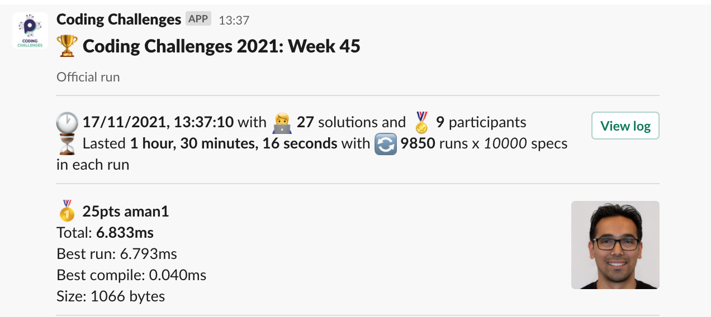
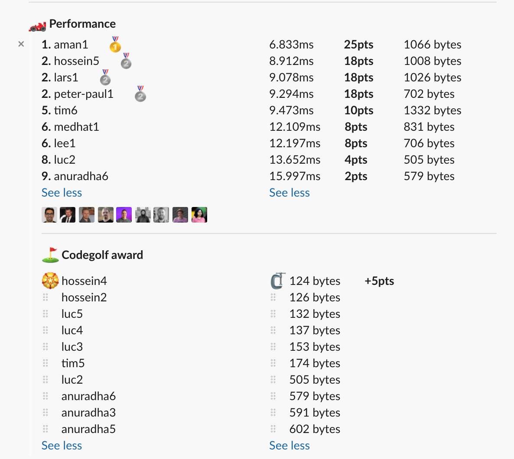

# Week 45 challenge

Write a function `maskIt` which accepts a string and a number. The number is converted to binary and used as mask.
The mask determines which letters in the orignal string are case-swapped. 1 - case is swapped, 0 - letter is kept as is.

The mask is teoretically infinite - it keeps repeating as long as you have characters in the original string.

*Note:* Non alphabetic characters are skipped over and kept as is.


## Example

string = 'an.example string!'
number = 27

27 in binary is '11011' which means that every 1st, 2nd, 4th and 5th letter will be swapped. Since mask repeats, then also 6th, 7th, 9th, 10th etc. will be swapped.

| Original | Mask | Result  | Notes |
|----------|------|---------|-------|
| a        | 1    | A       |       |
| n        | 1    | N       |       |
| .        |      | .       | Non alphabetic characters are skipped and mask is not taken into account |
| e        | 0    | e       |       |
| x        | 1    | X       |       |
| a        | 1    | A       |       |
| m        | 1    | M       |       |
| p        | 1    | P       |       |
| l        | 0    | l       |       |
| e        | 1    | E       |       |
| [space]  |      | [space] | Non alphabetic characters are skipped and mask is not taken into account |
| s        | 1    | S       |       |
| t        | 1    | T       |       |
| r        | 1    | R       |       |
| i        | 0    | i       |       |
| n        | 1    | N       |       |
| g        | 1    | G       |       |
| !        |      | !       | Non alphabetic characters are skipped and mask is not taken into account |


Examples:
```
maskIt('an.example string!', 27) // returns 'AN.eXAMPlE STRiNG!'
maskIt('an.example string!', 9) // returns 'An.eXAmpLE stRIng!'
maskIt('aaa!aaa', 1) // returns 'AAA!AAA'
maskIt('aaa!aaa', 2) // returns 'AaA!aAa'
```


## Upload link

[PP Connect](https://connect.passionatepeople.io/code-challenge-submission)

## Results

| Place | Name       | Performance | Codegolf | Vote  | Total points |
|-------|------------|-------------|----------|-------|--------------|
| 1.    | Aman       | 25          |          | 5     | 30           |
| 2.    | Hossein    | 18          | 5        |       | 23           |
| 3.    | Lars       | 18          |          |       | 18           |
|       | Peter-Paul | 18          |          |       | 18           |
| 5.    | Tim        | 10          |          |       | 10           |
| 6.    | Medhat     | 8           |          |       | 8            |
|       | Lee        | 8           |          |       | 8            |
| 8.    | Luc        | 4           |          |       | 4            |
| 9.    | Anuradha   | 2           |          |       | 2            |


### Screenshot





### Vote

```
╔════════════════╤══════════╤═════════════════════════════════════════════════════════════════════════╗
║ Name           │ Vote     │ Comment                                                                 ║
╟────────────────┼──────────┼─────────────────────────────────────────────────────────────────────────╢
║ harijs.deksnis │ aman1    │ Great balance between precomputing and computation on every invocation. ║
╟────────────────┼──────────┼─────────────────────────────────────────────────────────────────────────╢
║ aman.tuladhar  │ hossein4 │ nice one for the golf code                                              ║
╟────────────────┼──────────┼─────────────────────────────────────────────────────────────────────────╢
║ patrick        │ aman1    │ Nice use of memoization                                                 ║
╟────────────────┼──────────┼─────────────────────────────────────────────────────────────────────────╢
║ anuradha       │ aman1    │ memoization                                                             ║
╚════════════════╧══════════╧═════════════════════════════════════════════════════════════════════════╝
```


### Full output log
```

EVALUATION STARTED:                 17/11/2021, 12:06:48
EVALUATING CHALLENGE:               2021/w45
FOUND 27 SOLUTIONS:                 aman1.js, anuradha1.js, anuradha2.js, anuradha3.js, anuradha4.js, anuradha5.js, anuradha6.js, hossein1.js, hossein2.js,
                          hossein3.js, hossein4.js, hossein5.js, lars1.js, lee1.js, luc1.js, luc2.js, luc3.js, luc4.js, luc5.js, medhat1.js,
                          peter-paul1.js, tim1.js, tim2.js, tim3.js, tim4.js, tim5.js, tim6.js
RUNNING EVALUATION FOR:             5400 SECONDS WITH 10000 TEST CASES IN EACH CYCLE...


EVALUATION ENDED:                   17/11/2021, 13:37:05
DURATION:                           1 hour, 30 minutes, 16.189 seconds

RANKINGS:
╔═══════╤════════╤═════════════╤══════════╤══════════╤══════════════╤══════╗
║ Place │ Points │ Name        │ Total    │ Best run │ Best compile │ Size ║
╟───────┼────────┼─────────────┼──────────┼──────────┼──────────────┼──────╢
║ 1     │ 25     │ aman1       │ 6.833ms  │ 6.793ms  │ 0.040ms      │ 1066 ║
╟───────┼────────┼─────────────┼──────────┼──────────┼──────────────┼──────╢
║ 2     │ 18     │ hossein5    │ 8.912ms  │ 8.898ms  │ 0.014ms      │ 1008 ║
╟───────┼────────┼─────────────┼──────────┼──────────┼──────────────┼──────╢
║       │ 18     │ lars1       │ 9.078ms  │ 9.018ms  │ 0.060ms      │ 1026 ║
╟───────┼────────┼─────────────┼──────────┼──────────┼──────────────┼──────╢
║       │ 18     │ peter-paul1 │ 9.294ms  │ 9.278ms  │ 0.016ms      │ 702  ║
╟───────┼────────┼─────────────┼──────────┼──────────┼──────────────┼──────╢
║ 5     │ 10     │ tim6        │ 9.473ms  │ 9.385ms  │ 0.088ms      │ 1332 ║
╟───────┼────────┼─────────────┼──────────┼──────────┼──────────────┼──────╢
║ 6     │ 8      │ medhat1     │ 12.109ms │ 12.094ms │ 0.016ms      │ 831  ║
╟───────┼────────┼─────────────┼──────────┼──────────┼──────────────┼──────╢
║       │ 8      │ lee1        │ 12.197ms │ 12.180ms │ 0.016ms      │ 706  ║
╟───────┼────────┼─────────────┼──────────┼──────────┼──────────────┼──────╢
║ 8     │ 4      │ luc2        │ 13.652ms │ 13.636ms │ 0.016ms      │ 505  ║
╟───────┼────────┼─────────────┼──────────┼──────────┼──────────────┼──────╢
║ 9     │ 2      │ anuradha6   │ 15.997ms │ 15.980ms │ 0.017ms      │ 579  ║
╚═══════╧════════╧═════════════╧══════════╧══════════╧══════════════╧══════╝

Keeping only best run from each contestant
Using 5% margin for determening ties

OMITTED FROM RANKINGS:              hossein3.js, tim3.js, tim2.js, tim1.js, tim4.js, hossein1.js, anuradha5.js, anuradha1.js, anuradha2.js, anuradha3.js,
                          anuradha4.js, hossein2.js, luc4.js, luc3.js, tim5.js, hossein4.js, luc5.js

CODEGOLF AWARD:                     hossein4.js with 124 bytes

FAILED SOLUTIONS:                   luc1.js

SYSTEM INFO:
NODE: v14.16.0
ARCH: x64
PLATFORM: linux
VERSION: #56-Ubuntu SMP Mon Oct 5 14:28:49 UTC 2020
MEMORY: 15.64GB
CPUS: 2 x Intel Xeon Processor (Cascadelake)
CPU speed: 2494MHz

RAW RESULTS:
┌─────────┬──────────────────┬────────────────────┬────────────────────┬──────────────────────┬──────┬────────────────┬────────────────────┬──────────────┬────────┬────────────────────┬──────┐
│ (index) │     solution     │       total        │      bestRun       │     bestCompile      │ size │    compiled    │   validationTime   │ onlyCodegolf │ failed │     failReason     │ runs │
├─────────┼──────────────────┼────────────────────┼────────────────────┼──────────────────────┼──────┼────────────────┼────────────────────┼──────────────┼────────┼────────────────────┼──────┤
│    0    │    'aman1.js'    │ 6.833027999848127  │ 6.793372000101954  │ 0.03965599974617362  │ 1066 │ 'successfully' │ 54.301298000002134 │    false     │ false  │        null        │ 9850 │
│    1    │  'hossein5.js'   │ 8.912049000151455  │  8.89762800000608  │ 0.014421000145375729 │ 1008 │ 'successfully' │ 38.217774000000645 │    false     │ false  │        null        │ 9850 │
│    2    │    'lars1.js'    │ 9.077898000366986  │ 9.017536000348628  │ 0.06036200001835823  │ 1026 │ 'successfully' │ 27.636687999998685 │    false     │ false  │        null        │ 9850 │
│    3    │  'hossein3.js'   │ 9.089347000233829  │ 9.074703000020236  │ 0.014644000213593245 │ 1018 │ 'successfully' │ 55.214592000000266 │    false     │ false  │        null        │ 9850 │
│    4    │ 'peter-paul1.js' │ 9.293647000100464  │ 9.277635000180453  │ 0.016011999920010567 │ 702  │ 'successfully' │ 67.91499100000146  │    false     │ false  │        null        │ 9850 │
│    5    │    'tim6.js'     │ 9.472735999617726  │ 9.384703999850899  │ 0.08803199976682663  │ 1332 │ 'successfully' │ 26.883780000000115 │    false     │ false  │        null        │ 9850 │
│    6    │    'tim3.js'     │ 10.631163000129163 │ 10.57582199992612  │ 0.05534100020304322  │ 1138 │ 'successfully' │ 57.23502000000008  │    false     │ false  │        null        │ 9850 │
│    7    │    'tim2.js'     │ 11.778404999990016 │ 11.76117300009355  │ 0.017231999896466732 │ 1089 │ 'successfully' │ 59.14676900000268  │    false     │ false  │        null        │ 9850 │
│    8    │    'tim1.js'     │ 11.824059000238776 │ 11.778828999958932 │ 0.04523000027984381  │ 1210 │ 'successfully' │ 30.830164999999397 │    false     │ false  │        null        │ 9850 │
│    9    │   'medhat1.js'   │ 12.10934600001201  │ 12.093814000021666 │ 0.015531999990344048 │ 831  │ 'successfully' │ 68.06327100000271  │    false     │ false  │        null        │ 9850 │
│   10    │    'lee1.js'     │ 12.196572000160813 │ 12.180302999913692 │ 0.016269000247120857 │ 706  │ 'successfully' │ 61.182151999997586 │    false     │ false  │        null        │ 9850 │
│   11    │    'tim4.js'     │ 12.570247000548989 │ 12.513562000356615 │ 0.05668500019237399  │ 1107 │ 'successfully' │ 42.95529700000043  │    false     │ false  │        null        │ 9850 │
│   12    │    'luc2.js'     │ 13.652307000476867 │ 13.635865000076592 │ 0.016442000400274992 │ 505  │ 'successfully' │ 420.9599130000024  │    false     │ false  │        null        │ 9850 │
│   13    │  'hossein1.js'   │ 14.26717200037092  │ 14.25206600036472  │ 0.015106000006198883 │ 782  │ 'successfully' │  56.206556000001   │    false     │ false  │        null        │ 9850 │
│   14    │  'anuradha6.js'  │ 15.996772999875247 │ 15.980239999946207 │ 0.01653299992904067  │ 579  │ 'successfully' │ 54.72903900000165  │    false     │ false  │        null        │ 9850 │
│   15    │  'anuradha5.js'  │ 17.454877000302076 │ 17.438715000171214 │ 0.016162000130861998 │ 602  │ 'successfully' │ 38.26158799999757  │    false     │ false  │        null        │ 9850 │
│   16    │  'anuradha1.js'  │ 18.760364999994636 │ 18.74331700010225  │ 0.017047999892383814 │ 620  │ 'successfully' │ 50.84554799999751  │    false     │ false  │        null        │ 9850 │
│   17    │  'anuradha2.js'  │ 19.621526000089943 │ 19.594740000087768 │ 0.02678600000217557  │ 1163 │ 'successfully' │ 46.73600699999952  │    false     │ false  │        null        │ 9850 │
│   18    │  'anuradha3.js'  │ 22.513338000047952 │ 22.49667500006035  │ 0.016662999987602234 │ 591  │ 'successfully' │ 64.83745000000272  │    false     │ false  │        null        │ 9850 │
│   19    │  'anuradha4.js'  │ 23.028750999830663 │ 23.011351000051945 │ 0.017399999778717756 │ 649  │ 'successfully' │ 41.46464999999807  │    false     │ false  │        null        │ 9850 │
│   20    │  'hossein2.js'   │ 34.578291999932844 │ 34.56448200001614  │ 0.013809999916702509 │ 126  │ 'successfully' │ 52.76627699999881  │    false     │ false  │        null        │ 9850 │
│   21    │    'luc4.js'     │ 35.27932199975476  │ 35.26519799977541  │ 0.01412399997934699  │ 137  │ 'successfully' │ 62.232050999999046 │    false     │ false  │        null        │ 9850 │
│   22    │    'luc3.js'     │  35.5419689998962  │ 35.52759499987587  │ 0.014374000020325184 │ 153  │ 'successfully' │ 62.29395199999999  │    false     │ false  │        null        │ 9850 │
│   23    │    'tim5.js'     │ 35.55764999985695  │ 35.54367299983278  │ 0.013977000024169683 │ 174  │ 'successfully' │ 66.64176600000064  │    false     │ false  │        null        │ 9850 │
│   24    │  'hossein4.js'   │ 37.080767000094056 │ 37.06653300020844  │ 0.014233999885618687 │ 124  │ 'successfully' │ 57.61858199999915  │    false     │ false  │        null        │ 9850 │
│   25    │    'luc5.js'     │ 38.37101599993184  │ 38.357365999836475 │ 0.013650000095367432 │ 132  │ 'successfully' │  75.2964549999997  │    false     │ false  │        null        │ 9850 │
│   26    │    'luc1.js'     │        null        │        null        │         null         │ 478  │ 'successfully' │ 0.512879999998404  │    false     │  true  │ 'Incorrect result' │  0   │
└─────────┴──────────────────┴────────────────────┴────────────────────┴──────────────────────┴──────┴────────────────┴────────────────────┴──────────────┴────────┴────────────────────┴──────┘
```
  