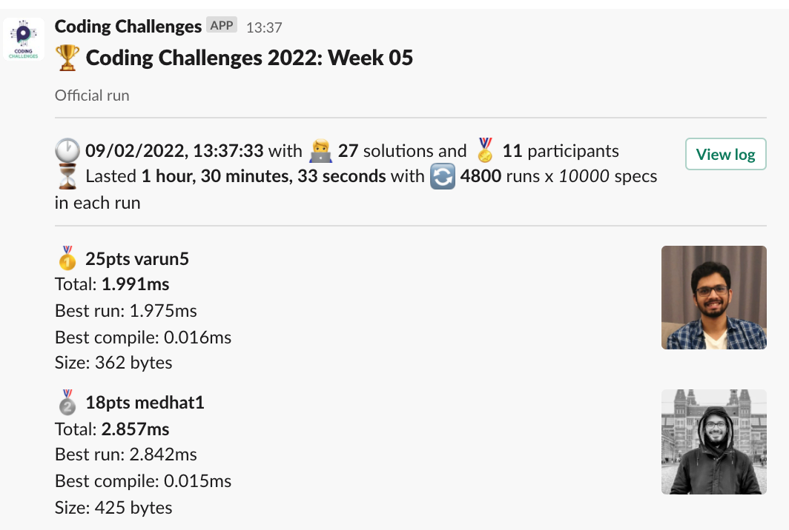
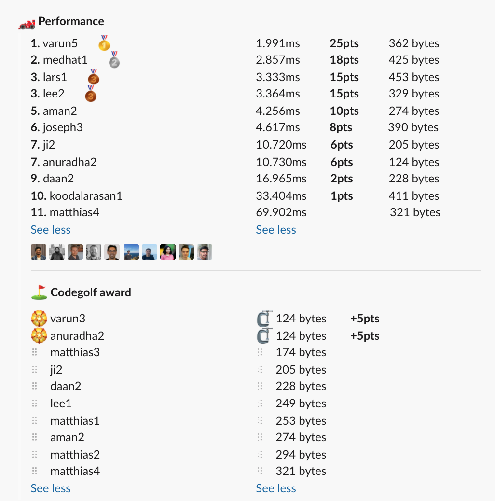

# Week 05 challenge

Write a function `imSpecial` which accepts a string and returns the first non-repeating characer.
Upper and lower case are considered the same character, but the function should correcly return the right case.

If all characters are repeating, then the result should be an empty string.


Examples:
```
imSpecial('Property') // returns 'o'
imSpecial('Abba') // returns ''
imSpecial('sTreSS') // returns 'T'
```


## Upload link

[PP Connect](https://connect.passionatepeople.io/code-challenge-submission)

## Results

| Place | Name     | Performance | Codegolf | Vote  | Total points |
|-------|----------|-------------|----------|-------|--------------|
| 1.    | Varun    | 25          | 5        | 5     | 35           |
| 2.    | Medhat   | 18          |          |       | 18           |
| 3.    | Lars     | 15          |          |       | 15           |
|       | Lee      | 15          |          |       | 15           |
| 5.    | Anuradha | 6           | 5        |       | 11           |
| 6.    | Aman     | 10          |          |       | 10           |
| 7.    | Joseph   | 8           |          |       | 8            |
| 8.    | Ji       | 6           |          |       | 6            |
| 9.    | Daan     | 2           |          |       | 2            |
| 10.   | Koodal   | 1           |          |       | 1            |


### Screenshot





### Vote

```
╔════════════════╤════════╤═════════════════════════════════════════════════════════════════════╗
║ Name           │ Vote   │ Comment                                                             ║
╟────────────────┼────────┼─────────────────────────────────────────────────────────────────────╢
║ harijs.deksnis │ varun5 │ Gotta love the last hour winning submission 🏎 🏁                    ║
╟────────────────┼────────┼─────────────────────────────────────────────────────────────────────╢
║ aman.tuladhar  │ varun5 │ A brilliant last-minute eureka moment, the lastIndexOf work-around! ║
╟────────────────┼────────┼─────────────────────────────────────────────────────────────────────╢
║ anuradha       │ varun5 │ I like the usage of indexOf instead of lastIndexOf                  ║
╚════════════════╧════════╧═════════════════════════════════════════════════════════════════════╝
```


### Full output log
```

EVALUATION STARTED:                 09/02/2022, 12:06:53
EVALUATING CHALLENGE:               2022/w05
FOUND 27 SOLUTIONS:                 aman1.js, aman2.js, anuradha1.js, anuradha2.js, anuradha3.js, anuradha4.js, daan1.js, daan2.js, ji1.js, ji2.js,
                          joseph1.js, joseph2.js, joseph3.js, koodalarasan1.js, lars1.js, lee1.js, lee2.js, matthias1.js, matthias2.js,
                          matthias3.js, matthias4.js, medhat1.js, varun1.js, varun2.js, varun3.js, varun4.js, varun5.js
RUNNING EVALUATION FOR:             5400 SECONDS WITH 10000 TEST CASES IN EACH CYCLE...


EVALUATION ENDED:                   09/02/2022, 13:37:27
DURATION:                           1 hour, 30 minutes, 33.917 seconds

RANKINGS:
╔═══════╤════════╤═══════════════╤══════════╤══════════╤══════════════╤══════╗
║ Place │ Points │ Name          │ Total    │ Best run │ Best compile │ Size ║
╟───────┼────────┼───────────────┼──────────┼──────────┼──────────────┼──────╢
║ 1     │ 25     │ varun5        │ 1.991ms  │ 1.975ms  │ 0.016ms      │ 362  ║
╟───────┼────────┼───────────────┼──────────┼──────────┼──────────────┼──────╢
║ 2     │ 18     │ medhat1       │ 2.857ms  │ 2.842ms  │ 0.015ms      │ 425  ║
╟───────┼────────┼───────────────┼──────────┼──────────┼──────────────┼──────╢
║ 3     │ 15     │ lars1         │ 3.333ms  │ 3.317ms  │ 0.016ms      │ 453  ║
╟───────┼────────┼───────────────┼──────────┼──────────┼──────────────┼──────╢
║       │ 15     │ lee2          │ 3.364ms  │ 3.349ms  │ 0.016ms      │ 329  ║
╟───────┼────────┼───────────────┼──────────┼──────────┼──────────────┼──────╢
║ 5     │ 10     │ aman2         │ 4.256ms  │ 4.240ms  │ 0.015ms      │ 274  ║
╟───────┼────────┼───────────────┼──────────┼──────────┼──────────────┼──────╢
║ 6     │ 8      │ joseph3       │ 4.617ms  │ 4.603ms  │ 0.014ms      │ 390  ║
╟───────┼────────┼───────────────┼──────────┼──────────┼──────────────┼──────╢
║ 7     │ 6      │ ji2           │ 10.720ms │ 10.706ms │ 0.014ms      │ 205  ║
╟───────┼────────┼───────────────┼──────────┼──────────┼──────────────┼──────╢
║       │ 6      │ anuradha2     │ 10.730ms │ 10.716ms │ 0.014ms      │ 124  ║
╟───────┼────────┼───────────────┼──────────┼──────────┼──────────────┼──────╢
║ 9     │ 2      │ daan2         │ 16.965ms │ 16.950ms │ 0.015ms      │ 228  ║
╟───────┼────────┼───────────────┼──────────┼──────────┼──────────────┼──────╢
║ 10    │ 1      │ koodalarasan1 │ 33.404ms │ 33.388ms │ 0.016ms      │ 411  ║
╟───────┼────────┼───────────────┼──────────┼──────────┼──────────────┼──────╢
║ 11    │        │ matthias4     │ 69.902ms │ 69.879ms │ 0.023ms      │ 321  ║
╚═══════╧════════╧═══════════════╧══════════╧══════════╧══════════════╧══════╝

Keeping only best run from each contestant
Using 5% margin for determening ties

OMITTED FROM RANKINGS:              varun4.js, varun2.js, lee1.js, varun3.js, aman1.js, joseph1.js, anuradha1.js, joseph2.js, varun1.js, anuradha3.js,
                          anuradha4.js, ji1.js, matthias3.js, matthias1.js, daan1.js, matthias2.js

CODEGOLF AWARD:                     anuradha2.js, varun3.js with 124 bytes

SYSTEM INFO:
NODE: v14.16.0
ARCH: x64
PLATFORM: linux
VERSION: #56-Ubuntu SMP Mon Oct 5 14:28:49 UTC 2020
MEMORY: 15.64GB
CPUS: 2 x Intel Xeon Processor (Cascadelake)
CPU speed: 2494MHz

RAW RESULTS:
┌─────────┬────────────────────┬────────────────────┬────────────────────┬──────────────────────┬──────┬────────────────┬────────────────────┬──────────────┬────────┬────────────┬──────┐
│ (index) │      solution      │       total        │      bestRun       │     bestCompile      │ size │    compiled    │   validationTime   │ onlyCodegolf │ failed │ failReason │ runs │
├─────────┼────────────────────┼────────────────────┼────────────────────┼──────────────────────┼──────┼────────────────┼────────────────────┼──────────────┼────────┼────────────┼──────┤
│    0    │    'varun5.js'     │ 1.9912849999964237 │ 1.9753439999185503 │ 0.01594100007787347  │ 362  │ 'successfully' │ 11.674105999998574 │    false     │ false  │    null    │ 4800 │
│    1    │    'medhat1.js'    │ 2.8574399997014552 │ 2.8423819998279214 │ 0.015057999873533845 │ 425  │ 'successfully' │ 23.980765000000247 │    false     │ false  │    null    │ 4800 │
│    2    │    'varun4.js'     │ 3.2922670000698417 │ 3.275952000170946  │ 0.01631499989889562  │ 381  │ 'successfully' │ 12.490246999997908 │    false     │ false  │    null    │ 4800 │
│    3    │     'lars1.js'     │ 3.332800999749452  │ 3.3171290000900626 │ 0.015671999659389257 │ 453  │ 'successfully' │ 30.825293000001693 │    false     │ false  │    null    │ 4800 │
│    4    │     'lee2.js'      │ 3.3640899998135865 │  3.34850599989295  │ 0.015583999920636415 │ 329  │ 'successfully' │ 14.828285999999935 │    false     │ false  │    null    │ 4800 │
│    5    │    'varun2.js'     │ 3.3789760001236573 │ 3.3625389999942854 │ 0.01643700012937188  │ 380  │ 'successfully' │ 18.338465000000724 │    false     │ false  │    null    │ 4800 │
│    6    │     'aman2.js'     │ 4.255547001026571  │ 4.240227000787854  │ 0.015320000238716602 │ 274  │ 'successfully' │ 34.50377000000299  │    false     │ false  │    null    │ 4800 │
│    7    │     'lee1.js'      │  4.47340999962762  │ 4.459711999632418  │ 0.013697999995201826 │ 249  │ 'successfully' │ 26.720562999998947 │    false     │ false  │    null    │ 4800 │
│    8    │    'varun3.js'     │  4.56622299994342  │ 4.553258999949321  │ 0.01296399999409914  │ 124  │ 'successfully' │ 39.933343000000605 │    false     │ false  │    null    │ 4800 │
│    9    │    'joseph3.js'    │ 4.616939999628812  │ 4.602829999756068  │ 0.014109999872744083 │ 390  │ 'successfully' │ 13.153607000000193 │    false     │ false  │    null    │ 4800 │
│   10    │     'aman1.js'     │ 5.395201999694109  │ 5.362506999634206  │ 0.03269500005990267  │ 632  │ 'successfully' │ 66.53785400000197  │    false     │ false  │    null    │ 4800 │
│   11    │    'joseph1.js'    │ 10.492903999984264 │ 10.478108000010252 │ 0.014795999974012375 │ 399  │ 'successfully' │ 22.291096000000834 │    false     │ false  │    null    │ 4800 │
│   12    │      'ji2.js'      │ 10.720036000362597 │ 10.706390000414103 │ 0.013645999948494136 │ 205  │ 'successfully' │ 22.492369000003237 │    false     │ false  │    null    │ 4800 │
│   13    │   'anuradha2.js'   │ 10.729775000363588 │ 10.716194000095129 │ 0.01358100026845932  │ 124  │ 'successfully' │ 25.613656000001356 │    false     │ false  │    null    │ 4800 │
│   14    │   'anuradha1.js'   │ 10.927591000043321 │ 10.912002000026405 │ 0.015589000016916543 │ 333  │ 'successfully' │ 38.22179899999901  │    false     │ false  │    null    │ 4800 │
│   15    │     'daan2.js'     │ 16.96524600003613  │ 16.950164999987464 │ 0.015081000048667192 │ 228  │ 'successfully' │ 38.06991500000004  │    false     │ false  │    null    │ 4800 │
│   16    │    'joseph2.js'    │ 31.27227899990976  │ 31.25482999999076  │ 0.017448999918997288 │ 389  │ 'successfully' │ 237.27295199999935 │    false     │ false  │    null    │ 4800 │
│   17    │ 'koodalarasan1.js' │ 33.40400799992494  │  33.3882750000339  │ 0.01573299989104271  │ 411  │ 'successfully' │ 75.79980499999874  │    false     │ false  │    null    │ 4800 │
│   18    │    'varun1.js'     │ 49.00947300042026  │ 48.99019000004046  │ 0.019283000379800797 │ 586  │ 'successfully' │ 86.62261399999988  │    false     │ false  │    null    │ 4800 │
│   19    │   'anuradha3.js'   │ 67.10498500009999  │ 67.08267500018701  │ 0.02230999991297722  │ 610  │ 'successfully' │ 91.79611799999839  │    false     │ false  │    null    │ 4800 │
│   20    │   'anuradha4.js'   │  67.8935349995736  │ 67.86966899968684  │ 0.023865999886766076 │ 633  │ 'successfully' │ 103.9618330000012  │    false     │ false  │    null    │ 4800 │
│   21    │   'matthias4.js'   │ 69.90225399984047  │ 69.87882099999115  │ 0.023432999849319458 │ 321  │ 'successfully' │ 285.40818600000057 │    false     │ false  │    null    │ 4800 │
│   22    │      'ji1.js'      │ 84.32529199961573  │ 84.30047699995339  │ 0.024814999662339687 │ 647  │ 'successfully' │  69.8680889999996  │    false     │ false  │    null    │ 4800 │
│   23    │   'matthias3.js'   │ 89.46240099985152  │ 89.43760399986058  │ 0.024796999990940094 │ 174  │ 'successfully' │ 112.8314590000009  │    false     │ false  │    null    │ 4800 │
│   24    │   'matthias1.js'   │ 89.97658499982208  │ 89.95405199984089  │ 0.022532999981194735 │ 253  │ 'successfully' │ 204.3529299999973  │    false     │ false  │    null    │ 4800 │
│   25    │     'daan1.js'     │ 92.30478200037032  │ 92.27920099999756  │ 0.02558100037276745  │ 432  │ 'successfully' │ 327.30497099999775 │    false     │ false  │    null    │ 4800 │
│   26    │   'matthias2.js'   │ 201.3190730002243  │ 201.29217100003734 │ 0.02690200018696487  │ 294  │ 'successfully' │ 273.42181600000185 │    false     │ false  │    null    │ 4800 │
└─────────┴────────────────────┴────────────────────┴────────────────────┴──────────────────────┴──────┴────────────────┴────────────────────┴──────────────┴────────┴────────────┴──────┘
```
  