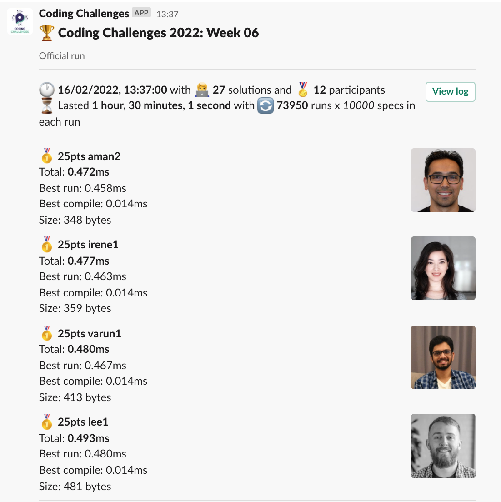
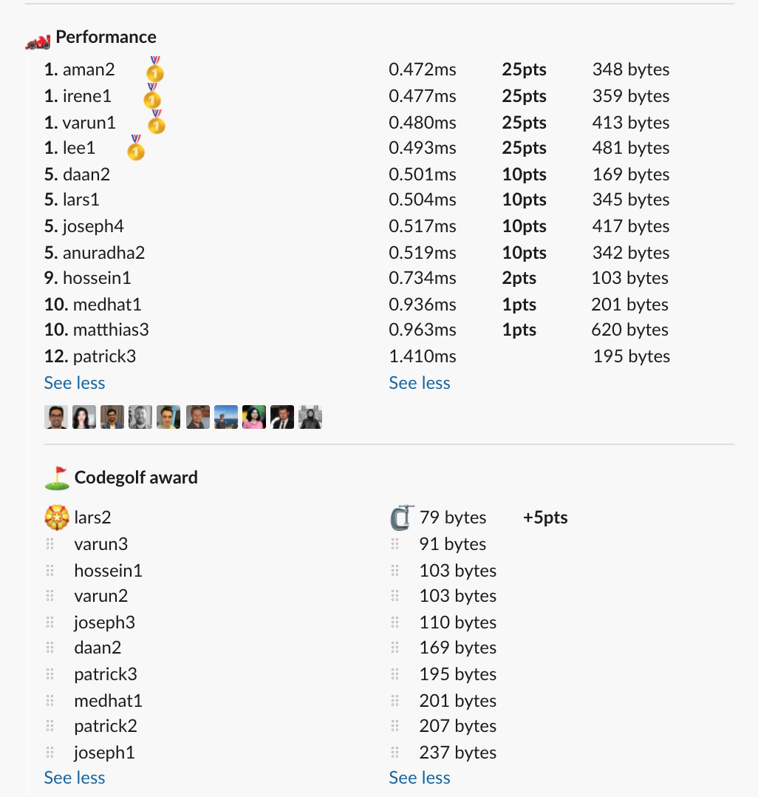

# Week 06 challenge

Write a function `whatsMissing` which accepts a subset of ordered alphabet letters and returns which of the letters is missing.
The letters will always be in the same case.


Examples:
```
whatsMissing(['b','c','d','f']) // returns 'e'
whatsMissing(['H','I','K','L']) // returns 'J'
```


## Upload link

[PP Connect](https://connect.passionatepeople.io/code-challenge-submission)

## Results

| Place | Name     | Performance | Codegolf | Vote  | Total points |
|-------|----------|-------------|----------|-------|--------------|
| 1.    | Aman     | 25          |          |       | 25           |
|       | Irene    | 25          |          |       | 25           |
|       | Varun    | 25          |          |       | 25           |
|       | Lee      | 25          |          |       | 25           |
| 5.    | Lars     | 10          | 5        | 5     | 20           |
| 6.    | Daan     | 10          |          |       | 10           |
|       | Joseph   | 10          |          |       | 10           |
|       | Anuradha | 10          |          |       | 10           |
| 9.    | Hossein  | 2           |          |       | 2            |
| 10.   | Medhat   | 1           |          |       | 1            |
|       | Matthias | 1           |          |       | 1            |


### Screenshot





### Vote

Voting is ongoing. Please `/vote` in Slack.


### Full output log
```

EVALUATION STARTED:                 16/02/2022, 12:06:53
EVALUATING CHALLENGE:               2022/w06
FOUND 27 SOLUTIONS:                 aman1.js, aman2.js, anuradha1.js, anuradha2.js, daan1.js, daan2.js, daan3.js, daan4.js, hossein1.js, irene1.js,
                          joseph1.js, joseph2.js, joseph3.js, joseph4.js, lars1.js, lars2.js, lee1.js, matthias1.js, matthias2.js, matthias3.js,
                          medhat1.js, patrick1.js, patrick2.js, patrick3.js, varun1.js, varun2.js, varun3.js
RUNNING EVALUATION FOR:             5400 SECONDS WITH 10000 TEST CASES IN EACH CYCLE...


EVALUATION ENDED:                   16/02/2022, 13:36:55
DURATION:                           1 hour, 30 minutes, 1.106 seconds

RANKINGS:
╔═══════╤════════╤═══════════╤═════════╤══════════╤══════════════╤══════╗
║ Place │ Points │ Name      │ Total   │ Best run │ Best compile │ Size ║
╟───────┼────────┼───────────┼─────────┼──────────┼──────────────┼──────╢
║ 1     │ 25     │ aman2     │ 0.472ms │ 0.458ms  │ 0.014ms      │ 348  ║
╟───────┼────────┼───────────┼─────────┼──────────┼──────────────┼──────╢
║       │ 25     │ irene1    │ 0.477ms │ 0.463ms  │ 0.014ms      │ 359  ║
╟───────┼────────┼───────────┼─────────┼──────────┼──────────────┼──────╢
║       │ 25     │ varun1    │ 0.480ms │ 0.467ms  │ 0.014ms      │ 413  ║
╟───────┼────────┼───────────┼─────────┼──────────┼──────────────┼──────╢
║       │ 25     │ lee1      │ 0.493ms │ 0.480ms  │ 0.014ms      │ 481  ║
╟───────┼────────┼───────────┼─────────┼──────────┼──────────────┼──────╢
║ 5     │ 10     │ daan2     │ 0.501ms │ 0.488ms  │ 0.013ms      │ 169  ║
╟───────┼────────┼───────────┼─────────┼──────────┼──────────────┼──────╢
║       │ 10     │ lars1     │ 0.504ms │ 0.489ms  │ 0.014ms      │ 345  ║
╟───────┼────────┼───────────┼─────────┼──────────┼──────────────┼──────╢
║       │ 10     │ joseph4   │ 0.517ms │ 0.503ms  │ 0.014ms      │ 417  ║
╟───────┼────────┼───────────┼─────────┼──────────┼──────────────┼──────╢
║       │ 10     │ anuradha2 │ 0.519ms │ 0.502ms  │ 0.017ms      │ 342  ║
╟───────┼────────┼───────────┼─────────┼──────────┼──────────────┼──────╢
║ 9     │ 2      │ hossein1  │ 0.734ms │ 0.723ms  │ 0.011ms      │ 103  ║
╟───────┼────────┼───────────┼─────────┼──────────┼──────────────┼──────╢
║ 10    │ 1      │ medhat1   │ 0.936ms │ 0.925ms  │ 0.011ms      │ 201  ║
╟───────┼────────┼───────────┼─────────┼──────────┼──────────────┼──────╢
║       │ 1      │ matthias3 │ 0.963ms │ 0.951ms  │ 0.012ms      │ 620  ║
╟───────┼────────┼───────────┼─────────┼──────────┼──────────────┼──────╢
║ 12    │        │ patrick3  │ 1.410ms │ 1.399ms  │ 0.011ms      │ 195  ║
╚═══════╧════════╧═══════════╧═════════╧══════════╧══════════════╧══════╝

Keeping only best run from each contestant
Using 5% margin for determening ties

OMITTED FROM RANKINGS:              aman1.js, daan4.js, anuradha1.js, varun2.js, joseph2.js, joseph3.js, joseph1.js, daan1.js, varun3.js, matthias2.js,
                          matthias1.js, daan3.js, patrick2.js, patrick1.js, lars2.js

CODEGOLF AWARD:                     lars2.js with 79 bytes

SYSTEM INFO:
NODE: v14.16.0
ARCH: x64
PLATFORM: linux
VERSION: #56-Ubuntu SMP Mon Oct 5 14:28:49 UTC 2020
MEMORY: 15.64GB
CPUS: 2 x Intel Xeon Processor (Cascadelake)
CPU speed: 2494MHz

RAW RESULTS:
┌─────────┬────────────────┬─────────────────────┬─────────────────────┬──────────────────────┬──────┬────────────────┬────────────────────┬──────────────┬────────┬────────────┬───────┐
│ (index) │    solution    │        total        │       bestRun       │     bestCompile      │ size │    compiled    │   validationTime   │ onlyCodegolf │ failed │ failReason │ runs  │
├─────────┼────────────────┼─────────────────────┼─────────────────────┼──────────────────────┼──────┼────────────────┼────────────────────┼──────────────┼────────┼────────────┼───────┤
│    0    │   'aman2.js'   │ 0.4715610002167523  │ 0.4577930001541972  │ 0.013768000062555075 │ 348  │ 'successfully' │ 46.05919899999935  │    false     │ false  │    null    │ 73950 │
│    1    │  'irene1.js'   │ 0.4769400004297495  │ 0.46308299992233515 │ 0.013857000507414341 │ 359  │ 'successfully' │ 26.199377999997523 │    false     │ false  │    null    │ 73950 │
│    2    │  'varun1.js'   │ 0.48044300003675744 │ 0.4666480000014417  │ 0.013795000035315752 │ 413  │ 'successfully' │ 23.52566300000035  │    false     │ false  │    null    │ 73950 │
│    3    │   'lee1.js'    │  0.493346999399364  │ 0.47955499961972237 │ 0.013791999779641628 │ 481  │ 'successfully' │ 26.570788000000903 │    false     │ false  │    null    │ 73950 │
│    4    │   'daan2.js'   │ 0.5012219999916852  │ 0.4877410000190139  │ 0.01348099997267127  │ 169  │ 'successfully' │ 36.27253099999871  │    false     │ false  │    null    │ 73950 │
│    5    │   'lars1.js'   │ 0.5035300001036376  │ 0.48949700011871755 │ 0.014032999984920025 │ 345  │ 'successfully' │ 24.739991999998892 │    false     │ false  │    null    │ 73950 │
│    6    │   'aman1.js'   │ 0.5118220001459122  │ 0.49839300010353327 │ 0.013429000042378902 │ 339  │ 'successfully' │ 64.02741400000014  │    false     │ false  │    null    │ 73950 │
│    7    │  'joseph4.js'  │ 0.5171740000369027  │ 0.5030140000162646  │ 0.014160000020638108 │ 417  │ 'successfully' │ 24.50502300000153  │    false     │ false  │    null    │ 73950 │
│    8    │ 'anuradha2.js' │ 0.5194200004916638  │ 0.5022910004481673  │ 0.01712900004349649  │ 342  │ 'successfully' │ 45.022501999999804 │    false     │ false  │    null    │ 73950 │
│    9    │   'daan4.js'   │  0.540059000137262  │ 0.5262499999953434  │ 0.01380900014191866  │ 240  │ 'successfully' │  24.8903109999992  │    false     │ false  │    null    │ 73950 │
│   10    │ 'anuradha1.js' │  0.546781999990344  │ 0.5336039999965578  │ 0.013177999993786216 │ 382  │ 'successfully' │ 36.66694799999823  │    false     │ false  │    null    │ 73950 │
│   11    │ 'hossein1.js'  │ 0.7338320002891123  │ 0.7226640000008047  │ 0.011168000288307667 │ 103  │ 'successfully' │ 100.61046500000157 │    false     │ false  │    null    │ 73950 │
│   12    │  'medhat1.js'  │  0.93567999987863   │ 0.9246699998620898  │ 0.011010000016540289 │ 201  │ 'successfully' │ 25.887556000001496 │    false     │ false  │    null    │ 73950 │
│   13    │ 'matthias3.js' │ 0.9629909994546324  │ 0.9507159998174757  │ 0.012274999637156725 │ 620  │ 'successfully' │ 23.424316000000545 │    false     │ false  │    null    │ 73950 │
│   14    │  'varun2.js'   │ 0.9692710000672378  │ 0.9579220000305213  │ 0.011349000036716461 │ 103  │ 'successfully' │ 95.61079199999949  │    false     │ false  │    null    │ 73950 │
│   15    │  'joseph2.js'  │ 1.0530209997668862  │ 1.0407650000415742  │ 0.012255999725311995 │ 321  │ 'successfully' │ 28.744521000000532 │    false     │ false  │    null    │ 73950 │
│   16    │  'joseph3.js'  │ 1.1510969999944791  │  1.139592999999877  │ 0.011503999994602054 │ 110  │ 'successfully' │ 30.418400000002293 │    false     │ false  │    null    │ 73950 │
│   17    │  'joseph1.js'  │ 1.1958330001216382  │ 1.1833490000572056  │ 0.012484000064432621 │ 237  │ 'successfully' │ 29.384813000000577 │    false     │ false  │    null    │ 73950 │
│   18    │   'daan1.js'   │ 1.2216649999609217  │  1.209084999980405  │ 0.012579999980516732 │ 238  │ 'successfully' │ 27.33390199999849  │    false     │ false  │    null    │ 73950 │
│   19    │  'varun3.js'   │ 1.3831400001363363  │ 1.3719600001350045  │ 0.011180000001331791 │  91  │ 'successfully' │ 31.472086000001582 │    false     │ false  │    null    │ 73950 │
│   20    │ 'patrick3.js'  │ 1.4103020010516047  │  1.399048000574112  │ 0.01125400047749281  │ 195  │ 'successfully' │ 27.16488400000162  │    false     │ false  │    null    │ 73950 │
│   21    │ 'matthias2.js' │  1.416425000061281  │ 1.4040070000337437  │ 0.012418000027537346 │ 437  │ 'successfully' │ 23.27420699999857  │    false     │ false  │    null    │ 73950 │
│   22    │ 'matthias1.js' │  1.99096699943766   │ 1.9790269997902215  │ 0.011939999647438526 │ 411  │ 'successfully' │ 25.830314999999246 │    false     │ false  │    null    │ 73950 │
│   23    │   'daan3.js'   │  2.576274999883026  │  2.561817000154406  │ 0.014457999728620052 │ 583  │ 'successfully' │  33.5083510000004  │    false     │ false  │    null    │ 73950 │
│   24    │ 'patrick2.js'  │  6.15491299983114   │  6.143188999965787  │ 0.011723999865353107 │ 207  │ 'successfully' │     33.095147      │    false     │ false  │    null    │ 73950 │
│   25    │ 'patrick1.js'  │  6.15570999996271   │  6.142938999983016  │ 0.012770999979693443 │ 435  │ 'successfully' │ 32.17853699999978  │    false     │ false  │    null    │ 73950 │
│   26    │   'lars2.js'   │ 17.242812999873422  │  17.23106200003531  │ 0.011750999838113785 │  79  │ 'successfully' │ 1230.461642000002  │    false     │ false  │    null    │ 73950 │
└─────────┴────────────────┴─────────────────────┴─────────────────────┴──────────────────────┴──────┴────────────────┴────────────────────┴──────────────┴────────┴────────────┴───────┘
```
  