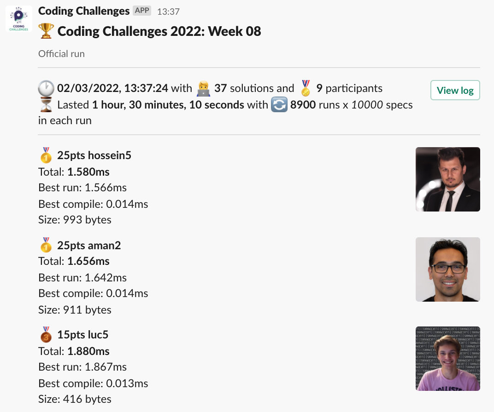
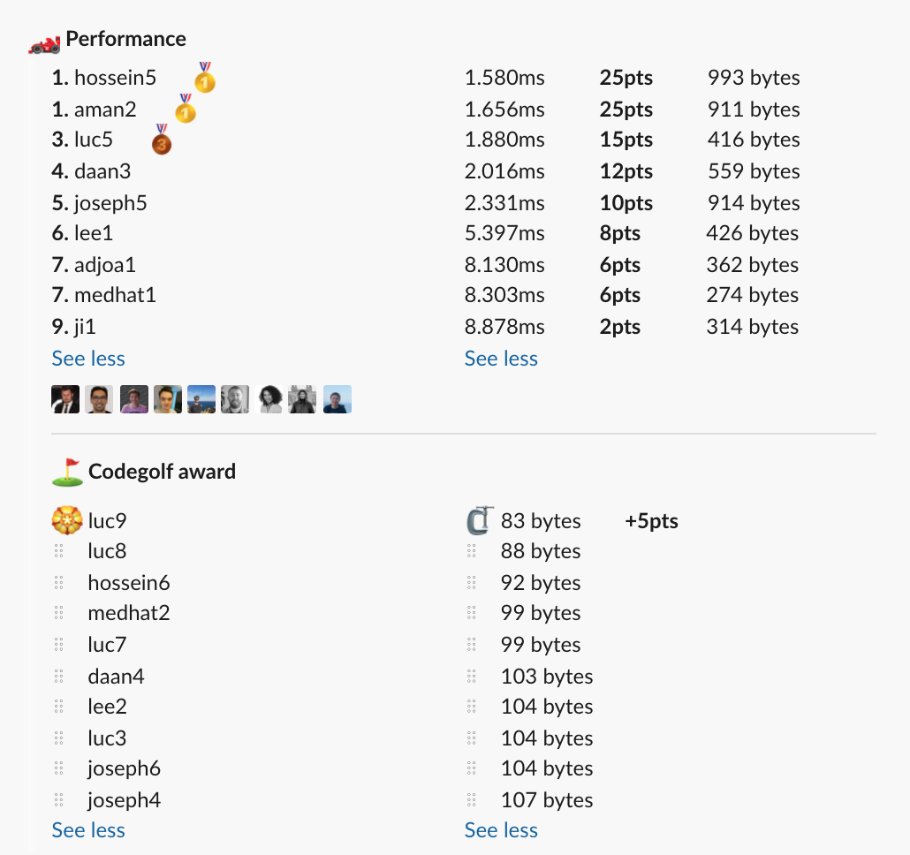

# Week 08 challenge

Write a function `supermarket` which accepts 2 arguments. First one represents an array of customers, where each item is a customer and the number itself is how many minutes it will take to process this customer. Second argument represents how many tills are open - how many customers can be processed in parallel.

The customers are processed in order and next customer starts check out as soon as a till opens.

The result of the function is how many minutes in total it will take to process all the queue.


Examples:
```
supermarket([1, 2, 3, 4], 1) // returns 10
// because if there's only one till open, the total time is the sum of the queue

supermarket([1, 2, 3, 4], 4) // returns 4
// because if there's as many tills as customers, the total time is the max processing time in queue

supermarket([12, 2, 3, 4], 2) // returns 12
// because last 3 customers finish before the 1st one is done processing

supermarket([2, 2, 7], 2) // returns 9

supermarket([1, 2, 3, 4, 5], 3) // returns 7
// because 1, 2 and 3 will be processed in parellell. The 4 will go to first till after 1 minute. And 5 will go to 2nd till after 2 minutes and thus will take 7min in total.
```


## Upload link

[PP Connect](https://connect.passionatepeople.io/code-challenge-submission)

## Results

| Place | Name    | Performance | Codegolf | Vote  | Total points |
|-------|---------|-------------|----------|-------|--------------|
| 1.    | Hossein | 25          |          |       | 25           |
|       | Aman    | 25          |          |       | 25           |
|       | Luc     | 15          | 5        | 5     | 25           |
| 4.    | Daan    | 12          |          |       | 12           |
| 5.    | Joseph  | 10          |          |       | 10           |
| 6.    | Lee     | 8           |          |       | 8            |
| 7.    | Adjoa   | 6           |          |       | 6            |
|       | Medhat  | 6           |          |       | 6            |
| 9.    | Ji      | 2           |          |       | 2            |


### Screenshot





### Vote

```
╔════════════════╤══════╤═══════════════════════════════════════════════════╗
║ Name           │ Vote │ Comment                                           ║
╟────────────────┼──────┼───────────────────────────────────────────────────╢
║ medhat         │ luc9 │ Awesome golf solution 👏                          ║
╟────────────────┼──────┼───────────────────────────────────────────────────╢
║ harijs.deksnis │ luc9 │ w1ck3d l33t h4x                                   ║
╟────────────────┼──────┼───────────────────────────────────────────────────╢
║ hossein        │ luc9 │ For the hard work and keeping the competition HOT ║
╟────────────────┼──────┼───────────────────────────────────────────────────╢
║ varun          │ luc9 │ For finding the required size and using it        ║
╟────────────────┼──────┼───────────────────────────────────────────────────╢
║ joseph         │ luc9 │ Keeping it short and sweet!                       ║
╟────────────────┼──────┼───────────────────────────────────────────────────╢
║ aman.tuladhar  │ luc9 │ Nice one                                          ║
╚════════════════╧══════╧═══════════════════════════════════════════════════╝
```


### Full output log
```

EVALUATION STARTED:                 02/03/2022, 12:07:09
EVALUATING CHALLENGE:               2022/w08
FOUND 37 SOLUTIONS:                 adjoa1.js, adjoa2.js, adjoa3.js, aman1.js, aman2.js, daan1.js, daan2.js, daan3.js, daan4.js, hossein1.js, hossein2.js,
                          hossein3.js, hossein4.js, hossein5.js, hossein6.js, ji1.js, joseph1.js, joseph2.js, joseph3.js, joseph4.js, joseph5.js,
                          joseph6.js, joseph7.js, joseph8.js, lee1.js, lee2.js, luc1.js, luc2.js, luc3.js, luc4.js, luc5.js, luc6.js, luc7.js,
                          luc8.js, luc9.js, medhat1.js, medhat2.js
RUNNING EVALUATION FOR:             5400 SECONDS WITH 10000 TEST CASES IN EACH CYCLE...


EVALUATION ENDED:                   02/03/2022, 13:37:19
DURATION:                           1 hour, 30 minutes, 10.092 seconds

RANKINGS:
╔═══════╤════════╤══════════╤═════════╤══════════╤══════════════╤══════╗
║ Place │ Points │ Name     │ Total   │ Best run │ Best compile │ Size ║
╟───────┼────────┼──────────┼─────────┼──────────┼──────────────┼──────╢
║ 1     │ 25     │ hossein5 │ 1.580ms │ 1.566ms  │ 0.014ms      │ 993  ║
╟───────┼────────┼──────────┼─────────┼──────────┼──────────────┼──────╢
║       │ 25     │ aman2    │ 1.656ms │ 1.642ms  │ 0.014ms      │ 911  ║
╟───────┼────────┼──────────┼─────────┼──────────┼──────────────┼──────╢
║ 3     │ 15     │ luc5     │ 1.880ms │ 1.867ms  │ 0.013ms      │ 416  ║
╟───────┼────────┼──────────┼─────────┼──────────┼──────────────┼──────╢
║ 4     │ 12     │ daan3    │ 2.016ms │ 2.001ms  │ 0.015ms      │ 559  ║
╟───────┼────────┼──────────┼─────────┼──────────┼──────────────┼──────╢
║ 5     │ 10     │ joseph5  │ 2.331ms │ 2.315ms  │ 0.016ms      │ 914  ║
╟───────┼────────┼──────────┼─────────┼──────────┼──────────────┼──────╢
║ 6     │ 8      │ lee1     │ 5.397ms │ 5.383ms  │ 0.014ms      │ 426  ║
╟───────┼────────┼──────────┼─────────┼──────────┼──────────────┼──────╢
║ 7     │ 6      │ adjoa1   │ 8.130ms │ 8.116ms  │ 0.014ms      │ 362  ║
╟───────┼────────┼──────────┼─────────┼──────────┼──────────────┼──────╢
║       │ 6      │ medhat1  │ 8.303ms │ 8.289ms  │ 0.014ms      │ 274  ║
╟───────┼────────┼──────────┼─────────┼──────────┼──────────────┼──────╢
║ 9     │ 2      │ ji1      │ 8.878ms │ 8.864ms  │ 0.015ms      │ 314  ║
╚═══════╧════════╧══════════╧═════════╧══════════╧══════════════╧══════╝

Keeping only best run from each contestant
Using 5% margin for determening ties

OMITTED FROM RANKINGS:              luc4.js, joseph7.js, daan2.js, hossein1.js, daan1.js, aman1.js, joseph2.js, joseph3.js, luc2.js, adjoa2.js, joseph4.js,
                          lee2.js, luc3.js, adjoa3.js, joseph1.js, joseph6.js, luc1.js, medhat2.js, luc7.js, hossein2.js, hossein3.js, hossein4.js,
                          hossein6.js, daan4.js, luc8.js, luc9.js

CODEGOLF AWARD:                     luc9.js with 83 bytes

FAILED SOLUTIONS:                   joseph8.js, luc6.js

SYSTEM INFO:
NODE: v14.16.0
ARCH: x64
PLATFORM: linux
VERSION: #56-Ubuntu SMP Mon Oct 5 14:28:49 UTC 2020
MEMORY: 15.64GB
CPUS: 2 x Intel(R) Xeon(R) Gold 6248 CPU @ 2.50GHz
CPU speed: 2494MHz

RAW RESULTS:
┌─────────┬───────────────┬────────────────────┬────────────────────┬──────────────────────┬──────┬────────────────┬────────────────────┬──────────────┬────────┬────────────────────┬──────┐
│ (index) │   solution    │       total        │      bestRun       │     bestCompile      │ size │    compiled    │   validationTime   │ onlyCodegolf │ failed │     failReason     │ runs │
├─────────┼───────────────┼────────────────────┼────────────────────┼──────────────────────┼──────┼────────────────┼────────────────────┼──────────────┼────────┼────────────────────┼──────┤
│    0    │ 'hossein5.js' │ 1.5799370002932847 │ 1.5659910002723336 │ 0.013946000020951033 │ 993  │ 'successfully' │ 48.90056399999594  │    false     │ false  │        null        │ 8900 │
│    1    │  'aman2.js'   │ 1.656070999801159  │ 1.6420609997585416 │ 0.014010000042617321 │ 911  │ 'successfully' │ 46.06997099999717  │    false     │ false  │        null        │ 8900 │
│    2    │   'luc5.js'   │ 1.8798859999515116 │ 1.867062000092119  │ 0.012823999859392643 │ 416  │ 'successfully' │ 552.5631250000006  │    false     │ false  │        null        │ 8900 │
│    3    │   'luc4.js'   │ 1.901116999797523  │ 1.886989999562502  │ 0.014127000235021114 │ 1384 │ 'successfully' │  552.346918999996  │    false     │ false  │        null        │ 8900 │
│    4    │  'daan3.js'   │ 2.016479999758303  │ 2.001497999764979  │ 0.01498199999332428  │ 559  │ 'successfully' │  55.1955719999969  │    false     │ false  │        null        │ 8900 │
│    5    │ 'joseph5.js'  │ 2.3311659996397793 │ 2.315211999695748  │ 0.01595399994403124  │ 914  │ 'successfully' │ 53.95543999999791  │    false     │ false  │        null        │ 8900 │
│    6    │ 'joseph7.js'  │ 2.3407629998400807 │ 2.3253509998321533 │ 0.015412000007927418 │ 914  │ 'successfully' │ 52.06465699999535  │    false     │ false  │        null        │ 8900 │
│    7    │  'daan2.js'   │ 2.4988230005837977 │ 2.483760999981314  │ 0.01506200060248375  │ 710  │ 'successfully' │ 52.18445100000099  │    false     │ false  │        null        │ 8900 │
│    8    │ 'hossein1.js' │ 2.594954999629408  │ 2.580773999914527  │ 0.014180999714881182 │ 1281 │ 'successfully' │ 52.907938000003924 │    false     │ false  │        null        │ 8900 │
│    9    │  'daan1.js'   │ 2.8834049999713898 │  2.86756999976933  │ 0.015835000202059746 │ 707  │ 'successfully' │ 50.31865300000209  │    false     │ false  │        null        │ 8900 │
│   10    │  'aman1.js'   │ 4.400830999482423  │ 4.3865979998372495 │ 0.01423299964517355  │ 583  │ 'successfully' │ 68.36032200000045  │    false     │ false  │        null        │ 8900 │
│   11    │   'lee1.js'   │ 5.3970939996652305 │ 5.383095999713987  │  0.0139979999512434  │ 426  │ 'successfully' │ 112.39466099999845 │    false     │ false  │        null        │ 8900 │
│   12    │ 'joseph2.js'  │ 7.293503999710083  │ 7.280468999873847  │ 0.013034999836236238 │ 430  │ 'successfully' │ 81.36547900000005  │    false     │ false  │        null        │ 8900 │
│   13    │ 'joseph3.js'  │ 7.955797000322491  │ 7.940849000122398  │ 0.014948000200092793 │ 495  │ 'successfully' │ 79.39619799999491  │    false     │ false  │        null        │ 8900 │
│   14    │  'adjoa1.js'  │ 8.129840000066906  │ 8.116018999833614  │ 0.01382100023329258  │ 362  │ 'successfully' │ 139.90594399999827 │    false     │ false  │        null        │ 8900 │
│   15    │ 'medhat1.js'  │  8.30321600055322  │ 8.288992000278085  │ 0.01422400027513504  │ 274  │ 'successfully' │  89.6260900000052  │    false     │ false  │        null        │ 8900 │
│   16    │   'luc2.js'   │ 8.412296999245882  │  8.39614100009203  │ 0.016155999153852463 │ 323  │ 'successfully' │ 220.01150100000086 │    false     │ false  │        null        │ 8900 │
│   17    │  'adjoa2.js'  │ 8.418586999177933  │ 8.404699999839067  │ 0.01388699933886528  │ 341  │ 'successfully' │ 111.78611500000261 │    false     │ false  │        null        │ 8900 │
│   18    │ 'joseph4.js'  │ 8.527341000270098  │ 8.514479000121355  │ 0.012862000148743391 │ 107  │ 'successfully' │ 87.02475799999957  │    false     │ false  │        null        │ 8900 │
│   19    │   'lee2.js'   │ 8.529645999893546  │  8.51662900019437  │ 0.013016999699175358 │ 104  │ 'successfully' │ 95.70757699999376  │    false     │ false  │        null        │ 8900 │
│   20    │   'luc3.js'   │  8.54507499979809  │  8.5322829997167   │ 0.012792000081390142 │ 104  │ 'successfully' │ 88.19467799999984  │    false     │ false  │        null        │ 8900 │
│   21    │  'adjoa3.js'  │ 8.690473000053316  │ 8.676269999705255  │ 0.014203000348061323 │ 202  │ 'successfully' │ 90.17147799999657  │    false     │ false  │        null        │ 8900 │
│   22    │ 'joseph1.js'  │ 8.706422999501228  │  8.6938549997285   │ 0.01256799977272749  │ 112  │ 'successfully' │ 148.87411599999905 │    false     │ false  │        null        │ 8900 │
│   23    │ 'joseph6.js'  │  8.75935300020501  │ 8.746950999833643  │ 0.01240200037136674  │ 104  │ 'successfully' │ 103.93686699999671 │    false     │ false  │        null        │ 8900 │
│   24    │   'luc1.js'   │ 8.773089000023901  │ 8.760106999892741  │ 0.01298200013116002  │ 124  │ 'successfully' │ 90.24870199999714  │    false     │ false  │        null        │ 8900 │
│   25    │   'ji1.js'    │  8.87839199975133  │ 8.863626999780536  │ 0.014764999970793724 │ 314  │ 'successfully' │  66.3232330000028  │    false     │ false  │        null        │ 8900 │
│   26    │ 'medhat2.js'  │  9.0640609995462   │  9.05149899981916  │ 0.01256199972704053  │  99  │ 'successfully' │ 144.58373800000118 │    false     │ false  │        null        │ 8900 │
│   27    │   'luc7.js'   │  9.30583900026977  │  9.29322599992156  │ 0.012613000348210335 │  99  │ 'successfully' │ 89.08373399999982  │    false     │ false  │        null        │ 8900 │
│   28    │ 'hossein2.js' │ 9.675633000209928  │ 9.661720999982208  │ 0.013912000227719545 │ 161  │ 'successfully' │ 210.3577970000042  │    false     │ false  │        null        │ 8900 │
│   29    │ 'hossein3.js' │ 10.707074000034481 │ 10.69315700000152  │ 0.013917000032961369 │ 115  │ 'successfully' │ 95.30341700000281  │    false     │ false  │        null        │ 8900 │
│   30    │ 'hossein4.js' │ 15.502234000246972 │ 15.487787999678403 │ 0.014446000568568707 │ 110  │ 'successfully' │ 109.12597600000299 │    false     │ false  │        null        │ 8900 │
│   31    │ 'hossein6.js' │ 19.592298000119627 │ 19.577142000198364 │ 0.015155999921262264 │  92  │ 'successfully' │ 116.06401899999764 │    false     │ false  │        null        │ 8900 │
│   32    │  'daan4.js'   │ 32.40948099922389  │ 32.38858399959281  │ 0.02089699963107705  │ 103  │ 'successfully' │ 145.93555099999503 │    false     │ false  │        null        │ 8900 │
│   33    │   'luc8.js'   │ 32.600088000297546 │  32.5808749999851  │ 0.019213000312447548 │  88  │ 'successfully' │ 85.98691600000166  │    false     │ false  │        null        │ 8900 │
│   34    │   'luc9.js'   │ 39.18052599998191  │ 39.15879500005394  │ 0.021730999927967787 │  83  │ 'successfully' │ 89.87093500000628  │    false     │ false  │        null        │ 8900 │
│   35    │ 'joseph8.js'  │        null        │        null        │         null         │  95  │ 'successfully' │ 0.3954779999985476 │    false     │  true  │ 'Incorrect result' │  0   │
│   36    │   'luc6.js'   │        null        │        null        │         null         │  99  │ 'successfully' │ 0.4081240000014077 │    false     │  true  │ 'Incorrect result' │  0   │
└─────────┴───────────────┴────────────────────┴────────────────────┴──────────────────────┴──────┴────────────────┴────────────────────┴──────────────┴────────┴────────────────────┴──────┘
```
  