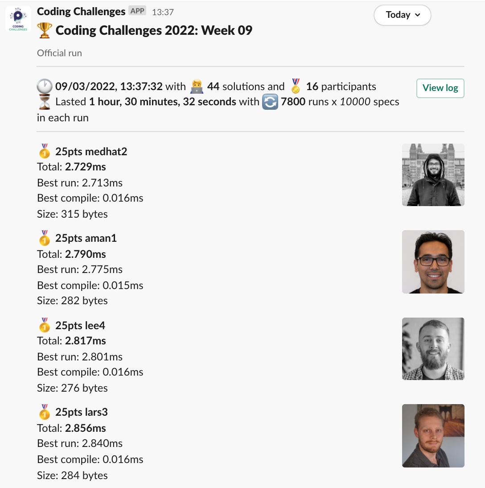
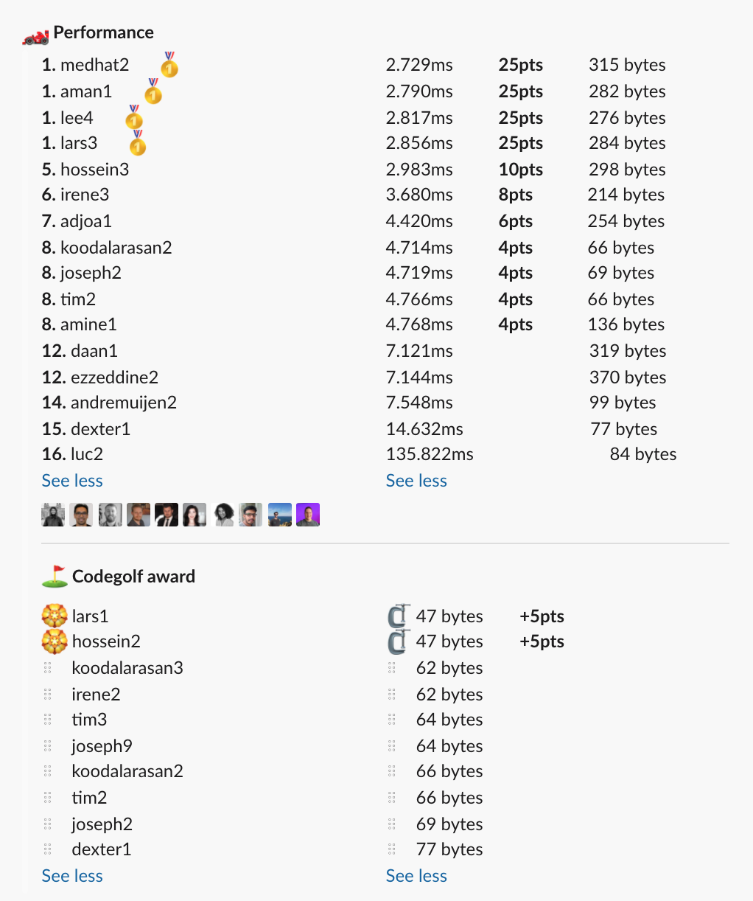

# Week 09 challenge

Write a function `goAround` which accepts a string and returns an array of strings representing a full rotation of the initial string.

First item of the array consists of all the characters shifted one position to the right, and the last character looping back to become the first character.
Every next array item is a further rotational step with the last item being the initial string itself.


Examples:
```
goAround('Victory') // returns ['ictoryV', 'ctoryVi', 'toryVic', 'oryVict', 'ryVicto', 'yVictor', 'Victory']
goAround('a') // returns ['a']
goAround('aB') // returns ['Ba', 'aB']
goAround('teNis') // returns ['eNist', 'Niste', 'isteN', 'steNi', 'teNis']
```


## Upload link

[PP Connect](https://connect.passionatepeople.io/code-challenge-submission)

## Results

| Place | Name    | Performance | Codegolf | Vote  | Total points |
|-------|---------|-------------|----------|-------|--------------|
| 1.    | Lars    | 25          | 5        | 5     | 35           |
| 2.    | Medhat  | 25          |          |       | 25           |
|       | Aman    | 25          |          |       | 25           |
|       | Lee     | 25          |          |       | 25           |
| 5.    | Hossein | 10          | 5        |       | 15           |
| 6.    | Irene   | 8           |          |       | 8            |
| 7.    | Adjoa   | 6           |          |       | 6            |
| 8.    | Koodal  | 4           |          |       | 4            |
|       | Joseph  | 4           |          |       | 4            |
|       | Tim     | 4           |          |       | 4            |
|       | Amine   | 4           |          |       | 4            |


### Screenshot





### Vote

```
╔═════════╤═══════╤════════════════════════════════════════════════════╗
║ Name    │ Vote  │ Comment                                            ║
╟─────────┼───────┼────────────────────────────────────────────────────╢
║ lee     │ lars3 │ Couldn't have written it better myself.            ║
╟─────────┼───────┼────────────────────────────────────────────────────╢
║ adjoa   │ lee4  │ It's creative how the string is combined twice!    ║
╟─────────┼───────┼────────────────────────────────────────────────────╢
║ hossein │ lars1 │ Having literally the exact same code golf as me ;) ║
║         │       │ I'm kinda voting myself :p                         ║
╚═════════╧═══════╧════════════════════════════════════════════════════╝
```


### Full output log
```

EVALUATION STARTED:                 09/03/2022, 12:06:54
EVALUATING CHALLENGE:               2022/w09
FOUND 44 SOLUTIONS:                 adjoa1.js, aman1.js, amine1.js, andremuijen1.js, andremuijen2.js, andremuijen3.js, daan1.js, dexter1.js, ezzeddine1.js,
                          ezzeddine2.js, hossein1.js, hossein2.js, hossein3.js, irene1.js, irene2.js, irene3.js, joseph1.js, joseph2.js,
                          joseph3.js, joseph4.js, joseph5.js, joseph6.js, joseph7.js, joseph8.js, joseph9.js, koodalarasan1.js, koodalarasan2.js,
                          koodalarasan3.js, lars1.js, lars2.js, lars3.js, lee1.js, lee2.js, lee3.js, lee4.js, luc1.js, luc2.js, medhat1.js,
                          medhat2.js, tim1.js, tim2.js, tim3.js, tim4.js, tim5.js
RUNNING EVALUATION FOR:             5400 SECONDS WITH 10000 TEST CASES IN EACH CYCLE...


EVALUATION ENDED:                   09/03/2022, 13:37:27
DURATION:                           1 hour, 30 minutes, 32.278 seconds

RANKINGS:
╔═══════╤════════╤═══════════════╤═══════════╤═══════════╤══════════════╤══════╗
║ Place │ Points │ Name          │ Total     │ Best run  │ Best compile │ Size ║
╟───────┼────────┼───────────────┼───────────┼───────────┼──────────────┼──────╢
║ 1     │ 25     │ medhat2       │ 2.729ms   │ 2.713ms   │ 0.016ms      │ 315  ║
╟───────┼────────┼───────────────┼───────────┼───────────┼──────────────┼──────╢
║       │ 25     │ aman1         │ 2.790ms   │ 2.775ms   │ 0.015ms      │ 282  ║
╟───────┼────────┼───────────────┼───────────┼───────────┼──────────────┼──────╢
║       │ 25     │ lee4          │ 2.817ms   │ 2.801ms   │ 0.016ms      │ 276  ║
╟───────┼────────┼───────────────┼───────────┼───────────┼──────────────┼──────╢
║       │ 25     │ lars3         │ 2.856ms   │ 2.840ms   │ 0.016ms      │ 284  ║
╟───────┼────────┼───────────────┼───────────┼───────────┼──────────────┼──────╢
║ 5     │ 10     │ hossein3      │ 2.983ms   │ 2.963ms   │ 0.020ms      │ 298  ║
╟───────┼────────┼───────────────┼───────────┼───────────┼──────────────┼──────╢
║ 6     │ 8      │ irene3        │ 3.680ms   │ 3.665ms   │ 0.015ms      │ 214  ║
╟───────┼────────┼───────────────┼───────────┼───────────┼──────────────┼──────╢
║ 7     │ 6      │ adjoa1        │ 4.420ms   │ 4.406ms   │ 0.015ms      │ 254  ║
╟───────┼────────┼───────────────┼───────────┼───────────┼──────────────┼──────╢
║ 8     │ 4      │ koodalarasan2 │ 4.714ms   │ 4.701ms   │ 0.014ms      │ 66   ║
╟───────┼────────┼───────────────┼───────────┼───────────┼──────────────┼──────╢
║       │ 4      │ joseph2       │ 4.719ms   │ 4.705ms   │ 0.014ms      │ 69   ║
╟───────┼────────┼───────────────┼───────────┼───────────┼──────────────┼──────╢
║       │ 4      │ tim2          │ 4.766ms   │ 4.752ms   │ 0.014ms      │ 66   ║
╟───────┼────────┼───────────────┼───────────┼───────────┼──────────────┼──────╢
║       │ 4      │ amine1        │ 4.768ms   │ 4.753ms   │ 0.015ms      │ 136  ║
╟───────┼────────┼───────────────┼───────────┼───────────┼──────────────┼──────╢
║ 12    │        │ daan1         │ 7.121ms   │ 7.105ms   │ 0.016ms      │ 319  ║
╟───────┼────────┼───────────────┼───────────┼───────────┼──────────────┼──────╢
║       │        │ ezzeddine2    │ 7.144ms   │ 7.126ms   │ 0.018ms      │ 370  ║
╟───────┼────────┼───────────────┼───────────┼───────────┼──────────────┼──────╢
║ 14    │        │ andremuijen2  │ 7.548ms   │ 7.533ms   │ 0.015ms      │ 99   ║
╟───────┼────────┼───────────────┼───────────┼───────────┼──────────────┼──────╢
║ 15    │        │ dexter1       │ 14.632ms  │ 14.617ms  │ 0.014ms      │ 77   ║
╟───────┼────────┼───────────────┼───────────┼───────────┼──────────────┼──────╢
║ 16    │        │ luc2          │ 135.822ms │ 135.803ms │ 0.019ms      │ 84   ║
╚═══════╧════════╧═══════════════╧═══════════╧═══════════╧══════════════╧══════╝

Keeping only best run from each contestant
Using 5% margin for determening ties

OMITTED FROM RANKINGS:              lee3.js, medhat1.js, lee2.js, lars2.js, lee1.js, irene1.js, joseph8.js, tim3.js, koodalarasan3.js, joseph3.js,
                          koodalarasan1.js, tim1.js, joseph7.js, tim4.js, joseph4.js, joseph6.js, joseph5.js, tim5.js, hossein1.js, irene2.js,
                          joseph9.js, ezzeddine1.js, andremuijen3.js, joseph1.js, lars1.js, hossein2.js, andremuijen1.js, luc1.js

CODEGOLF AWARD:                     hossein2.js, lars1.js with 47 bytes

SYSTEM INFO:
NODE: v14.16.0
ARCH: x64
PLATFORM: linux
VERSION: #56-Ubuntu SMP Mon Oct 5 14:28:49 UTC 2020
MEMORY: 15.64GB
CPUS: 2 x Intel(R) Xeon(R) Gold 6248 CPU @ 2.50GHz
CPU speed: 2494MHz

RAW RESULTS:
┌─────────┬────────────────────┬────────────────────┬────────────────────┬──────────────────────┬──────┬────────────────┬────────────────────┬──────────────┬────────┬────────────┬──────┐
│ (index) │      solution      │       total        │      bestRun       │     bestCompile      │ size │    compiled    │   validationTime   │ onlyCodegolf │ failed │ failReason │ runs │
├─────────┼────────────────────┼────────────────────┼────────────────────┼──────────────────────┼──────┼────────────────┼────────────────────┼──────────────┼────────┼────────────┼──────┤
│    0    │    'medhat2.js'    │ 2.7285789996240055 │ 2.7128200000006473 │ 0.01575899962335825  │ 315  │ 'successfully' │ 36.825583999998344 │    false     │ false  │    null    │ 7800 │
│    1    │     'aman1.js'     │ 2.7903049997985363 │ 2.7748589999973774 │ 0.015445999801158905 │ 282  │ 'successfully' │ 59.08162500000253  │    false     │ false  │    null    │ 7800 │
│    2    │     'lee4.js'      │ 2.817314000087208  │ 2.801067000007606  │ 0.016247000079602003 │ 276  │ 'successfully' │ 39.85566699999981  │    false     │ false  │    null    │ 7800 │
│    3    │     'lee3.js'      │ 2.839297999627888  │ 2.824831999838352  │  0.014465999789536   │ 233  │ 'successfully' │ 36.045406000001094 │    false     │ false  │    null    │ 7800 │
│    4    │     'lars3.js'     │ 2.8561650000337977 │  2.84026100000483  │ 0.015904000028967857 │ 284  │ 'successfully' │ 38.732303000000684 │    false     │ false  │    null    │ 7800 │
│    5    │    'medhat1.js'    │ 2.889910999685526  │ 2.873922999948263  │ 0.015987999737262726 │ 304  │ 'successfully' │ 38.001297999999224 │    false     │ false  │    null    │ 7800 │
│    6    │   'hossein3.js'    │ 2.983483999967575  │ 2.963353999890387  │ 0.020130000077188015 │ 298  │ 'successfully' │ 35.49003299999822  │    false     │ false  │    null    │ 7800 │
│    7    │     'lee2.js'      │ 3.0285220002333517 │ 3.013998000002175  │ 0.014524000231176615 │ 221  │ 'successfully' │ 36.29809199999727  │    false     │ false  │    null    │ 7800 │
│    8    │    'irene3.js'     │ 3.6797540005936753 │ 3.6647850000008475 │ 0.014969000592827797 │ 214  │ 'successfully' │ 42.630246999997325 │    false     │ false  │    null    │ 7800 │
│    9    │     'lars2.js'     │ 3.7936469999258406 │  3.77736000000732  │ 0.01628699991852045  │ 299  │ 'successfully' │  44.3504240000002  │    false     │ false  │    null    │ 7800 │
│   10    │     'lee1.js'      │ 4.119382999750087  │ 4.1044330000004265 │ 0.014949999749660492 │ 218  │ 'successfully' │ 42.720563999999285 │    false     │ false  │    null    │ 7800 │
│   11    │    'adjoa1.js'     │ 4.420297000251594  │ 4.405618000004324  │ 0.014679000247269869 │ 254  │ 'successfully' │ 143.14493700000094 │    false     │ false  │    null    │ 7800 │
│   12    │    'irene1.js'     │ 4.422782999914489  │ 4.408849999992526  │ 0.013932999921962619 │  78  │ 'successfully' │ 43.505865999999514 │    false     │ false  │    null    │ 7800 │
│   13    │ 'koodalarasan2.js' │ 4.714157000053092  │ 4.700635000001057  │ 0.013522000052034855 │  66  │ 'successfully' │ 42.84815399999934  │    false     │ false  │    null    │ 7800 │
│   14    │    'joseph2.js'    │ 4.718911000090884  │ 4.705323000001954  │ 0.01358800008893013  │  69  │ 'successfully' │ 42.572872999997344 │    false     │ false  │    null    │ 7800 │
│   15    │    'joseph8.js'    │ 4.763110000203596  │ 4.747887000004994  │ 0.015223000198602676 │ 1048 │ 'successfully' │ 43.01007100000061  │    false     │ false  │    null    │ 7800 │
│   16    │     'tim2.js'      │ 4.765565000256174  │ 4.751986000002944  │ 0.013579000253230333 │  66  │ 'successfully' │ 42.00885600000038  │    false     │ false  │    null    │ 7800 │
│   17    │    'amine1.js'     │ 4.7684969999827445 │ 4.753453999990597  │ 0.015042999992147088 │ 136  │ 'successfully' │ 66.44478799999706  │    false     │ false  │    null    │ 7800 │
│   18    │     'tim3.js'      │ 4.778786999871954  │  4.76478200010024  │ 0.01400499977171421  │  64  │ 'successfully' │ 41.897940999999264 │    false     │ false  │    null    │ 7800 │
│   19    │ 'koodalarasan3.js' │ 4.826601999811828  │ 4.8127119997516274 │ 0.013890000060200691 │  62  │ 'successfully' │ 44.42497000000003  │    false     │ false  │    null    │ 7800 │
│   20    │    'joseph3.js'    │ 4.968543000286445  │ 4.953092999989167  │ 0.015450000297278166 │ 238  │ 'successfully' │ 41.56417499999952  │    false     │ false  │    null    │ 7800 │
│   21    │ 'koodalarasan1.js' │ 5.004636000143364  │ 4.989571999991313  │ 0.015064000152051449 │ 292  │ 'successfully' │ 47.10947600000145  │    false     │ false  │    null    │ 7800 │
│   22    │     'tim1.js'      │ 5.101992000738392  │ 5.086727999994764  │ 0.015264000743627548 │ 215  │ 'successfully' │ 39.522297999999864 │    false     │ false  │    null    │ 7800 │
│   23    │    'joseph7.js'    │  5.14883800005191  │ 5.1338790000008885 │ 0.014959000051021576 │ 251  │ 'successfully' │ 42.77538099999947  │    false     │ false  │    null    │ 7800 │
│   24    │     'tim4.js'      │  5.17603400000371  │ 5.160564000019804  │ 0.015469999983906746 │ 984  │ 'successfully' │  59.395027999999   │    false     │ false  │    null    │ 7800 │
│   25    │    'joseph4.js'    │ 5.254205999997794  │ 5.238289999993867  │ 0.015916000003926456 │ 289  │ 'successfully' │ 42.16912299999967  │    false     │ false  │    null    │ 7800 │
│   26    │    'joseph6.js'    │ 5.330692999763414  │ 5.315439000027254  │ 0.01525399973616004  │ 248  │ 'successfully' │ 43.04133300000103  │    false     │ false  │    null    │ 7800 │
│   27    │    'joseph5.js'    │ 5.418097999878228  │ 5.403318000026047  │ 0.014779999852180481 │ 254  │ 'successfully' │ 41.550272999997105 │    false     │ false  │    null    │ 7800 │
│   28    │     'tim5.js'      │ 5.458224000118207  │ 5.443043000006583  │ 0.015181000111624599 │ 1769 │ 'successfully' │ 90.72912599999836  │    false     │ false  │    null    │ 7800 │
│   29    │   'hossein1.js'    │ 5.902995999917039  │ 5.879218000001856  │ 0.02377799991518259  │ 337  │ 'successfully' │ 46.93456900000092  │    false     │ false  │    null    │ 7800 │
│   30    │    'irene2.js'     │ 6.160103999995044  │ 6.146284000002197  │ 0.013819999992847443 │  62  │ 'successfully' │ 127.98965300000054 │    false     │ false  │    null    │ 7800 │
│   31    │     'daan1.js'     │ 7.120921999870916  │ 7.104884999993374  │ 0.016036999877542257 │ 319  │ 'successfully' │ 37.724786999999196 │    false     │ false  │    null    │ 7800 │
│   32    │  'ezzeddine2.js'   │ 7.143994000085513  │  7.12630899999931  │ 0.017685000086203218 │ 370  │ 'successfully' │ 41.25544499999887  │    false     │ false  │    null    │ 7800 │
│   33    │    'joseph9.js'    │ 7.430100999888964  │  7.41610499995295  │ 0.013995999936014414 │  64  │ 'successfully' │  42.0306210000017  │    false     │ false  │    null    │ 7800 │
│   34    │  'ezzeddine1.js'   │ 7.484443999703217  │ 7.467054000000644  │ 0.017389999702572823 │ 323  │ 'successfully' │ 36.94424199999776  │    false     │ false  │    null    │ 7800 │
│   35    │ 'andremuijen2.js'  │ 7.548264000099152  │ 7.533040000125766  │ 0.015223999973386526 │  99  │ 'successfully' │ 43.25995400000102  │    false     │ false  │    null    │ 7800 │
│   36    │ 'andremuijen3.js'  │ 8.122446999885142  │  8.1072329999879   │ 0.015213999897241592 │ 116  │ 'successfully' │ 41.80376999999862  │    false     │ false  │    null    │ 7800 │
│   37    │    'joseph1.js'    │  8.26470299999346  │ 8.251036000001477  │ 0.013666999991983175 │  83  │ 'successfully' │ 46.88992099999814  │    false     │ false  │    null    │ 7800 │
│   38    │     'lars1.js'     │ 9.588643000097363  │ 9.574715999988257  │ 0.013927000109106302 │  47  │ 'successfully' │ 37.930358999998134 │    false     │ false  │    null    │ 7800 │
│   39    │   'hossein2.js'    │ 9.701362000050722  │ 9.687349999992875  │ 0.014012000057846308 │  47  │ 'successfully' │ 40.96598100000119  │    false     │ false  │    null    │ 7800 │
│   40    │ 'andremuijen1.js'  │ 11.834719000384212 │ 11.819241000339389 │ 0.015478000044822693 │ 163  │ 'successfully' │ 69.33587900000202  │    false     │ false  │    null    │ 7800 │
│   41    │    'dexter1.js'    │ 14.631559999659657 │ 14.61747800000012  │ 0.014081999659538269 │  77  │ 'successfully' │ 47.217727999999624 │    false     │ false  │    null    │ 7800 │
│   42    │     'luc2.js'      │ 135.82218700056546 │ 135.80288000000292 │ 0.019307000562548637 │  84  │ 'successfully' │ 229.41417699999874 │    false     │ false  │    null    │ 7800 │
│   43    │     'luc1.js'      │ 143.63993600010872 │ 143.61707600019872 │ 0.022859999909996986 │  99  │ 'successfully' │ 245.63888800000132 │    false     │ false  │    null    │ 7800 │
└─────────┴────────────────────┴────────────────────┴────────────────────┴──────────────────────┴──────┴────────────────┴────────────────────┴──────────────┴────────┴────────────┴──────┘
```
  