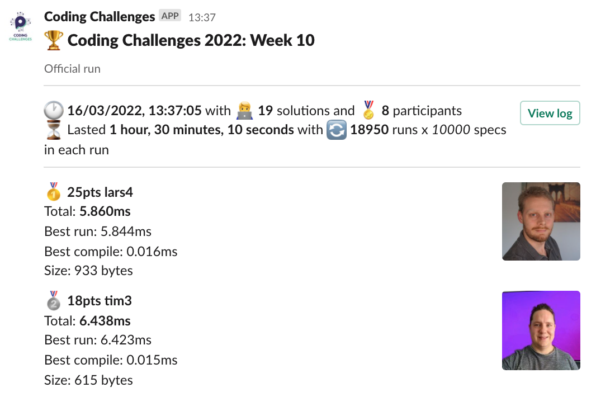
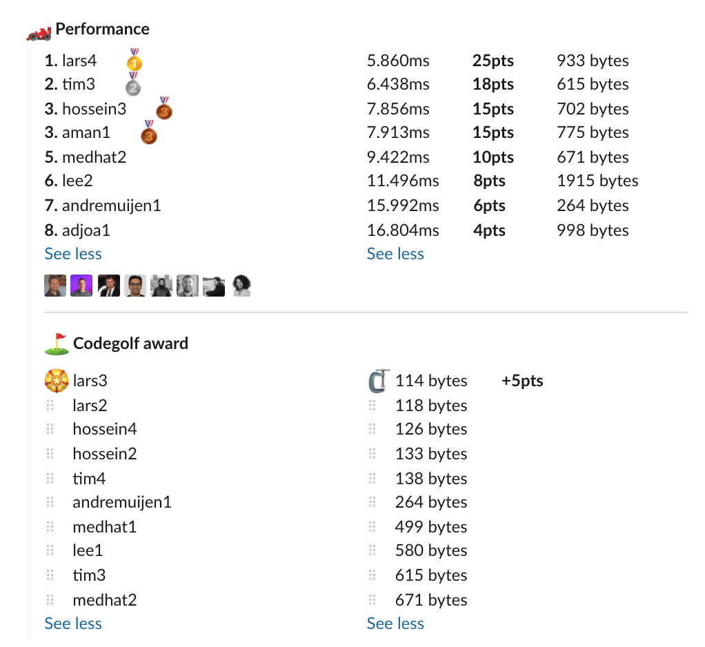

# Week 10 challenge
​
Write a function `ageMedian` which accepts an array of birthdate strings in format yyyy-MM-dd and a date(same format) on which to calculate the age from.
​
First you need to determine the ages of the birthdates as if today was date from the second parameter. Then you have to return the median age as a number. The returned value is either a whole number(no decimals) or whole number + .5
​
Age in the test cases is calculated with one year being 31557600000 miliseconds.
​
​
Examples:
```
ageMedian(["1979-01-30","2007-02-11","1992-04-23","1992-06-30","2001-06-01","2002-02-04","2009-03-26","1998-04-19"],"2011-01-12"]) // returns 10.5
ageMedian(["1975-12-22","1975-02-14","1985-01-26"],"1987-12-18") // returns 11
ageMedian(["1978-01-10","1979-11-04","1976-08-27","1975-03-01","1972-10-16","1970-10-22","1971-02-06","1973-03-27","1974-04-30"],"1982-12-29") // returns 8
ageMedian(["1990-01-01"],"2022-01-01") // returns 32
```

## Author

Daan de Groot (+10 pts)

## Upload link

[PP Connect](https://connect.passionatepeople.io/code-challenge-submission)

## Results

| Place | Name         | Performance | Codegolf | Vote / Authoring  | Total points |
|-------|--------------|-------------|----------|-------|--------------|
| 1.    | Lars         | 25          | 5        |       | 30           |
| 2.    | Tim          | 18          |          |       | 18           |
| 3.    | Hossein      | 15          |          |       | 15           |
|       | Aman         | 15          |          |       | 15           |
| 5.    | Medhat       | 10          |          |       | 10           |
|       | Daan         |             |          | 10    | 10           |
| 7.    | Lee          | 8           |          |       | 8            |
| 8.    | Andre Muijen | 6           |          |       | 6            |
| 9.    | Adjoa        | 4           |          |       | 4            |


### Screenshot





### Vote

Voting is ongoing. Please `/vote` in Slack.


### Full output log
```

EVALUATION STARTED:                 16/03/2022, 12:06:48
EVALUATING CHALLENGE:               2022/w10
FOUND 19 SOLUTIONS:                 adjoa1.js, aman1.js, andremuijen1.js, hossein1.js, hossein2.js, hossein3.js, hossein4.js, lars1.js, lars2.js, lars3.js,
                          lars4.js, lee1.js, lee2.js, medhat1.js, medhat2.js, tim1.js, tim2.js, tim3.js, tim4.js
RUNNING EVALUATION FOR:             5400 SECONDS WITH 10000 TEST CASES IN EACH CYCLE...


EVALUATION ENDED:                   16/03/2022, 13:36:59
DURATION:                           1 hour, 30 minutes, 10.852 seconds

RANKINGS:
╔═══════╤════════╤══════════════╤══════════╤══════════╤══════════════╤══════╗
║ Place │ Points │ Name         │ Total    │ Best run │ Best compile │ Size ║
╟───────┼────────┼──────────────┼──────────┼──────────┼──────────────┼──────╢
║ 1     │ 25     │ lars4        │ 5.860ms  │ 5.844ms  │ 0.016ms      │ 933  ║
╟───────┼────────┼──────────────┼──────────┼──────────┼──────────────┼──────╢
║ 2     │ 18     │ tim3         │ 6.438ms  │ 6.423ms  │ 0.015ms      │ 615  ║
╟───────┼────────┼──────────────┼──────────┼──────────┼──────────────┼──────╢
║ 3     │ 15     │ hossein3     │ 7.856ms  │ 7.840ms  │ 0.015ms      │ 702  ║
╟───────┼────────┼──────────────┼──────────┼──────────┼──────────────┼──────╢
║       │ 15     │ aman1        │ 7.913ms  │ 7.899ms  │ 0.014ms      │ 775  ║
╟───────┼────────┼──────────────┼──────────┼──────────┼──────────────┼──────╢
║ 5     │ 10     │ medhat2      │ 9.422ms  │ 9.407ms  │ 0.015ms      │ 671  ║
╟───────┼────────┼──────────────┼──────────┼──────────┼──────────────┼──────╢
║ 6     │ 8      │ lee2         │ 11.496ms │ 11.474ms │ 0.023ms      │ 1915 ║
╟───────┼────────┼──────────────┼──────────┼──────────┼──────────────┼──────╢
║ 7     │ 6      │ andremuijen1 │ 15.992ms │ 15.977ms │ 0.016ms      │ 264  ║
╟───────┼────────┼──────────────┼──────────┼──────────┼──────────────┼──────╢
║ 8     │ 4      │ adjoa1       │ 16.804ms │ 16.791ms │ 0.013ms      │ 998  ║
╚═══════╧════════╧══════════════╧══════════╧══════════╧══════════════╧══════╝

Keeping only best run from each contestant
Using 5% margin for determening ties

OMITTED FROM RANKINGS:              lars1.js, hossein4.js, medhat1.js, hossein1.js, tim2.js, tim4.js, lars2.js, tim1.js, hossein2.js, lee1.js, lars3.js

CODEGOLF AWARD:                     lars3.js with 114 bytes

SYSTEM INFO:
NODE: v14.16.0
ARCH: x64
PLATFORM: linux
VERSION: #56-Ubuntu SMP Mon Oct 5 14:28:49 UTC 2020
MEMORY: 15.64GB
CPUS: 2 x Intel(R) Xeon(R) Gold 6248 CPU @ 2.50GHz
CPU speed: 2494MHz

RAW RESULTS:
┌─────────┬───────────────────┬────────────────────┬────────────────────┬──────────────────────┬──────┬────────────────┬────────────────────┬──────────────┬────────┬────────────┬───────┐
│ (index) │     solution      │       total        │      bestRun       │     bestCompile      │ size │    compiled    │   validationTime   │ onlyCodegolf │ failed │ failReason │ runs  │
├─────────┼───────────────────┼────────────────────┼────────────────────┼──────────────────────┼──────┼────────────────┼────────────────────┼──────────────┼────────┼────────────┼───────┤
│    0    │    'lars4.js'     │ 5.860171999782324  │ 5.843909000046551  │ 0.01626299973577261  │ 933  │ 'successfully' │  33.8601579999995  │    false     │ false  │    null    │ 18950 │
│    1    │     'tim3.js'     │ 6.437748999916948  │ 6.422628000029363  │ 0.01512099988758564  │ 615  │ 'successfully' │ 61.67001999999775  │    false     │ false  │    null    │ 18950 │
│    2    │   'hossein3.js'   │ 7.855534000089392  │ 7.840343000134453  │ 0.015190999954938889 │ 702  │ 'successfully' │ 36.150682999999844 │    false     │ false  │    null    │ 18950 │
│    3    │    'aman1.js'     │ 7.913280999986455  │ 7.898871999932453  │ 0.014409000054001808 │ 775  │ 'successfully' │ 80.61061699999846  │    false     │ false  │    null    │ 18950 │
│    4    │    'lars1.js'     │ 8.228351999656297  │ 8.211058999993838  │ 0.017292999662458897 │ 716  │ 'successfully' │ 40.42453300000125  │    false     │ false  │    null    │ 18950 │
│    5    │   'medhat2.js'    │ 9.421703999862075  │ 9.407137000001967  │ 0.014566999860107899 │ 671  │ 'successfully' │ 55.91214899999977  │    false     │ false  │    null    │ 18950 │
│    6    │   'hossein4.js'   │  10.1672620002646  │ 10.154687999980524 │ 0.012574000284075737 │ 126  │ 'successfully' │ 65.77047600000151  │    false     │ false  │    null    │ 18950 │
│    7    │   'medhat1.js'    │ 10.914030000567436 │ 10.899514000862837 │ 0.01451599970459938  │ 499  │ 'successfully' │ 55.323669000001246 │    false     │ false  │    null    │ 18950 │
│    8    │   'hossein1.js'   │ 11.12761800037697  │ 11.112618000246584 │ 0.01500000013038516  │ 711  │ 'successfully' │ 46.07364299999972  │    false     │ false  │    null    │ 18950 │
│    9    │     'tim2.js'     │ 11.245303000090644 │ 11.23010200005956  │ 0.015201000031083822 │ 685  │ 'successfully' │ 65.30396800000017  │    false     │ false  │    null    │ 18950 │
│   10    │     'lee2.js'     │ 11.496385000180453 │ 11.473598999902606 │ 0.02278600027784705  │ 1915 │ 'successfully' │ 62.58759199999986  │    false     │ false  │    null    │ 18950 │
│   11    │     'tim4.js'     │ 11.715125999879092 │ 11.701688000001013 │ 0.013437999878078699 │ 138  │ 'successfully' │ 72.46059400000013  │    false     │ false  │    null    │ 18950 │
│   12    │    'lars2.js'     │ 15.372379000065848 │ 15.35956500004977  │ 0.012814000016078353 │ 118  │ 'successfully' │ 76.97311500000069  │    false     │ false  │    null    │ 18950 │
│   13    │     'tim1.js'     │ 15.379880000196863 │ 15.364599000022281 │ 0.015281000174582005 │ 700  │ 'successfully' │ 74.64798299999893  │    false     │ false  │    null    │ 18950 │
│   14    │   'hossein2.js'   │ 15.856564000190701 │ 15.843602999986615 │ 0.012961000204086304 │ 133  │ 'successfully' │ 54.89854000000196  │    false     │ false  │    null    │ 18950 │
│   15    │ 'andremuijen1.js' │ 15.99244800012093  │ 15.976922999951057 │ 0.015525000169873238 │ 264  │ 'successfully' │  82.8785429999989  │    false     │ false  │    null    │ 18950 │
│   16    │    'adjoa1.js'    │ 16.804163000226254 │ 16.790710000001127 │ 0.013453000225126743 │ 998  │ 'successfully' │ 155.5797730000013  │    false     │ false  │    null    │ 18950 │
│   17    │     'lee1.js'     │ 20.334480000194162 │ 20.31930200010538  │ 0.015178000088781118 │ 580  │ 'successfully' │ 97.30911800000104  │    false     │ false  │    null    │ 18950 │
│   18    │    'lars3.js'     │ 26.655826000031084 │ 26.64237600006163  │ 0.01344999996945262  │ 114  │ 'successfully' │ 79.58671700000195  │    false     │ false  │    null    │ 18950 │
└─────────┴───────────────────┴────────────────────┴────────────────────┴──────────────────────┴──────┴────────────────┴────────────────────┴──────────────┴────────┴────────────┴───────┘
```
  