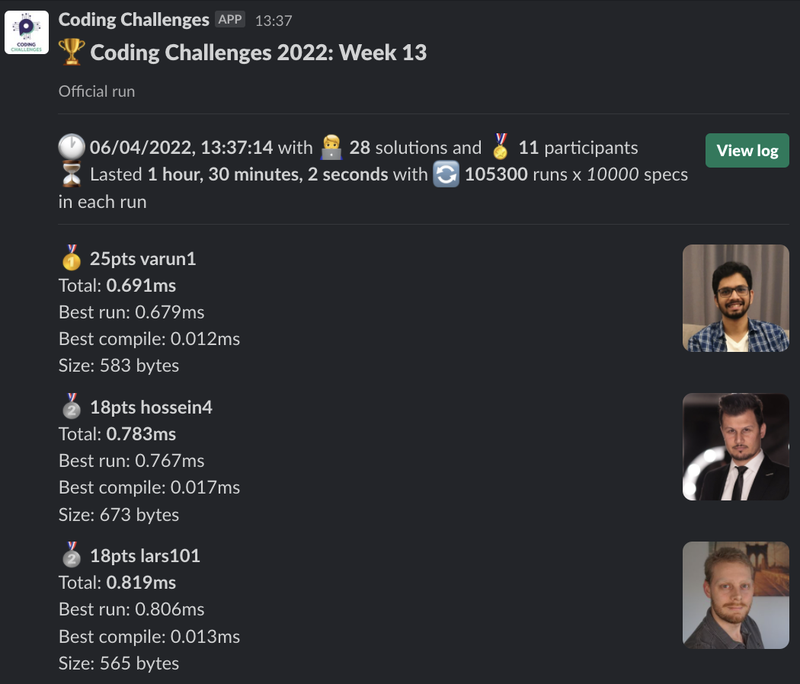
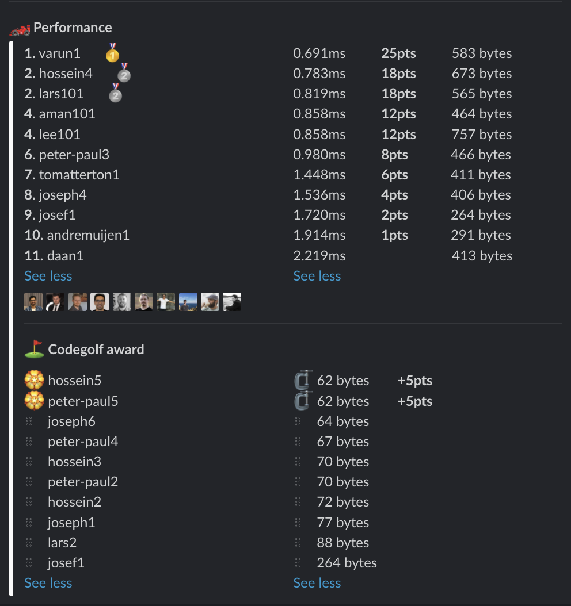

# Week 13 challenge

Write a function `braceful` which accepts a string of braces and returns whether they are opening, wrapping and closing correctly.


Examples:
```
braceful('') // returns false
braceful('[]') // returns true
braceful(')(') // returns false
braceful('({})') // returns true
braceful('(}{)') // returns false
braceful('{}[()]') // returns true
```


## Upload link

[PP Connect](https://connect.passionatepeople.io/code-challenge-submission)

## Results

| Place | Name         | Performance | Codegolf | Vote  | Total points |
|-------|--------------|-------------|----------|-------|--------------|
| 1.    | Varun        | 25          |          | 5     | 30           |
| 2.    | Hossein      | 18          | 5        |       | 23           |
| 3.    | Lars         | 18          |          |       | 18           |
| 4.    | Peter-Paul   | 8           | 5        |       | 13           |
| 5.    | Aman         | 12          |          |       | 12           |
|       | Lee          | 12          |          |       | 12           |
| 7.    | Tom Atterton | 6           |          |       | 6            |
| 8.    | Joseph       | 4           |          |       | 4            |
| 9.    | Josef        | 2           |          |       | 2            |
| 10.   | Andre Muijen | 1           |          |       | 1            |


### Screenshot





### Vote

```
╔════════════════╤═════════════╤═════════════════════════════════════════════════╗
║ Name           │ Vote        │ Comment                                         ║
╟────────────────┼─────────────┼─────────────────────────────────────────────────╢
║ harijs.deksnis │ peter-paul7 │ finding the "cheat", but not capitalising on it ║
╟────────────────┼─────────────┼─────────────────────────────────────────────────╢
║ aman.tuladhar  │ varun1      │ WOW, the switch is faster than if :O            ║
╟────────────────┼─────────────┼─────────────────────────────────────────────────╢
║ joseph         │ varun1      │ One submit is all it takes!                     ║
╟────────────────┼─────────────┼─────────────────────────────────────────────────╢
║ daan           │ hossein4    │ :O nice find // reverse engineering             ║
║                │             │   if (length > 7) return false;                 ║
╚════════════════╧═════════════╧═════════════════════════════════════════════════╝
```


### Full output log
```

EVALUATION STARTED:                 06/04/2022, 12:07:06
EVALUATING CHALLENGE:               2022/w13
FOUND 28 SOLUTIONS:                 aman101.js, andremuijen1.js, daan1.js, hossein1.js, hossein2.js, hossein3.js, hossein4.js, hossein5.js, josef1.js,
                          joseph1.js, joseph2.js, joseph3.js, joseph4.js, joseph5.js, joseph6.js, lars1.js, lars101.js, lars2.js, lee101.js,
                          peter-paul1.js, peter-paul2.js, peter-paul3.js, peter-paul4.js, peter-paul5.js, peter-paul6.js, peter-paul7.js,
                          tomatterton1.js, varun1.js
RUNNING EVALUATION FOR:             5400 SECONDS WITH 10000 TEST CASES IN EACH CYCLE...


EVALUATION ENDED:                   06/04/2022, 13:37:09
DURATION:                           1 hour, 30 minutes, 2.199 seconds

RANKINGS:
╔═══════╤════════╤══════════════╤═════════╤══════════╤══════════════╤══════╗
║ Place │ Points │ Name         │ Total   │ Best run │ Best compile │ Size ║
╟───────┼────────┼──────────────┼─────────┼──────────┼──────────────┼──────╢
║ 1     │ 25     │ varun1       │ 0.691ms │ 0.679ms  │ 0.012ms      │ 583  ║
╟───────┼────────┼──────────────┼─────────┼──────────┼──────────────┼──────╢
║ 2     │ 18     │ hossein4     │ 0.783ms │ 0.767ms  │ 0.017ms      │ 673  ║
╟───────┼────────┼──────────────┼─────────┼──────────┼──────────────┼──────╢
║       │ 18     │ lars101      │ 0.819ms │ 0.806ms  │ 0.013ms      │ 565  ║
╟───────┼────────┼──────────────┼─────────┼──────────┼──────────────┼──────╢
║ 4     │ 12     │ aman101      │ 0.858ms │ 0.843ms  │ 0.014ms      │ 464  ║
╟───────┼────────┼──────────────┼─────────┼──────────┼──────────────┼──────╢
║       │ 12     │ lee101       │ 0.858ms │ 0.846ms  │ 0.012ms      │ 757  ║
╟───────┼────────┼──────────────┼─────────┼──────────┼──────────────┼──────╢
║ 6     │ 8      │ peter-paul3  │ 0.980ms │ 0.969ms  │ 0.011ms      │ 466  ║
╟───────┼────────┼──────────────┼─────────┼──────────┼──────────────┼──────╢
║ 7     │ 6      │ tomatterton1 │ 1.448ms │ 1.436ms  │ 0.012ms      │ 411  ║
╟───────┼────────┼──────────────┼─────────┼──────────┼──────────────┼──────╢
║ 8     │ 4      │ joseph4      │ 1.536ms │ 1.524ms  │ 0.012ms      │ 406  ║
╟───────┼────────┼──────────────┼─────────┼──────────┼──────────────┼──────╢
║ 9     │ 2      │ josef1       │ 1.720ms │ 1.709ms  │ 0.011ms      │ 264  ║
╟───────┼────────┼──────────────┼─────────┼──────────┼──────────────┼──────╢
║ 10    │ 1      │ andremuijen1 │ 1.914ms │ 1.901ms  │ 0.013ms      │ 291  ║
╟───────┼────────┼──────────────┼─────────┼──────────┼──────────────┼──────╢
║ 11    │        │ daan1        │ 2.219ms │ 2.207ms  │ 0.013ms      │ 413  ║
╚═══════╧════════╧══════════════╧═════════╧══════════╧══════════════╧══════╝

Keeping only best run from each contestant
Using 5% margin for determening ties

OMITTED FROM RANKINGS:              peter-paul6.js, peter-paul1.js, joseph2.js, hossein3.js, joseph5.js, joseph3.js, hossein1.js, lars1.js, joseph1.js

ONLY CODEGOLF SOLUTIONS:            hossein2.js, hossein5.js, joseph6.js, lars2.js, peter-paul2.js, peter-paul4.js, peter-paul5.js, peter-paul7.js

CODEGOLF AWARD:                     hossein5.js, peter-paul5.js with 62 bytes

SYSTEM INFO:
NODE: v14.16.0
ARCH: x64
PLATFORM: linux
VERSION: #56-Ubuntu SMP Mon Oct 5 14:28:49 UTC 2020
MEMORY: 15.64GB
CPUS: 2 x Intel(R) Xeon(R) Gold 6248 CPU @ 2.50GHz
CPU speed: 2494MHz

RAW RESULTS:
┌─────────┬───────────────────┬────────────────────┬────────────────────┬──────────────────────┬──────┬────────────────┬────────────────────┬──────────────┬────────┬────────────┬────────┐
│ (index) │     solution      │       total        │      bestRun       │     bestCompile      │ size │    compiled    │   validationTime   │ onlyCodegolf │ failed │ failReason │  runs  │
├─────────┼───────────────────┼────────────────────┼────────────────────┼──────────────────────┼──────┼────────────────┼────────────────────┼──────────────┼────────┼────────────┼────────┤
│    0    │    'varun1.js'    │ 0.6909790004137903 │ 0.6794410001020879 │ 0.01153800031170249  │ 583  │ 'successfully' │ 11.788109000000986 │    false     │ false  │    null    │ 105300 │
│    1    │   'hossein4.js'   │ 0.7833020002581179 │ 0.7666720002889633 │ 0.016629999969154596 │ 673  │ 'successfully' │ 10.868207999999868 │    false     │ false  │    null    │ 105300 │
│    2    │   'lars101.js'    │ 0.8193929996341467 │ 0.8062490001320839 │ 0.013143999502062798 │ 565  │ 'successfully' │ 9.531176000000414  │    false     │ false  │    null    │ 105300 │
│    3    │   'aman101.js'    │ 0.8576139998622239 │ 0.8432229999452829 │ 0.014390999916940928 │ 464  │ 'successfully' │ 32.21655400000054  │    false     │ false  │    null    │ 105300 │
│    4    │    'lee101.js'    │ 0.8582269999897107 │ 0.8464249999960884 │ 0.011801999993622303 │ 757  │ 'successfully' │ 9.737386999999217  │    false     │ false  │    null    │ 105300 │
│    5    │ 'peter-paul3.js'  │ 0.9795029998931568 │ 0.9686739998869598 │ 0.01082900000619702  │ 466  │ 'successfully' │ 8.329110000000583  │    false     │ false  │    null    │ 105300 │
│    6    │ 'peter-paul6.js'  │ 0.9811889994889498 │ 0.9705029996111989 │ 0.010685999877750874 │ 510  │ 'successfully' │ 9.109350000000632  │    false     │ false  │    null    │ 105300 │
│    7    │ 'peter-paul1.js'  │ 1.0347179998643696 │ 1.0241489997133613 │ 0.010569000151008368 │ 515  │ 'successfully' │ 8.912195999999312  │    false     │ false  │    null    │ 105300 │
│    8    │ 'tomatterton1.js' │ 1.4478629999794066 │ 1.436003000009805  │ 0.011859999969601631 │ 411  │ 'successfully' │ 9.459700000001249  │    false     │ false  │    null    │ 105300 │
│    9    │   'joseph4.js'    │ 1.535988999530673  │ 1.5242219995707273 │ 0.011766999959945679 │ 406  │ 'successfully' │ 11.551242999999886 │    false     │ false  │    null    │ 105300 │
│   10    │    'josef1.js'    │ 1.7200820000725798 │ 1.7093730000779033 │ 0.01070899999467656  │ 264  │ 'successfully' │ 12.297897999998895 │    false     │ false  │    null    │ 105300 │
│   11    │   'joseph2.js'    │ 1.8020899998955429 │ 1.7900620000436902 │ 0.012027999851852655 │ 411  │ 'successfully' │ 12.280839999999444 │    false     │ false  │    null    │ 105300 │
│   12    │ 'andremuijen1.js' │ 1.9136980003677309 │ 1.9007430002093315 │ 0.012955000158399343 │ 291  │ 'successfully' │ 31.97888099999909  │    false     │ false  │    null    │ 105300 │
│   13    │   'hossein3.js'   │ 2.0249229996697977 │ 2.0143299996852875 │ 0.010592999984510243 │  70  │ 'successfully' │ 19.77926699999989  │    false     │ false  │    null    │ 105300 │
│   14    │   'joseph5.js'    │ 2.053861000575125  │ 2.040261000394821  │ 0.01360000018030405  │ 537  │ 'successfully' │ 11.368941999999151 │    false     │ false  │    null    │ 105300 │
│   15    │    'daan1.js'     │ 2.2193140001036227 │ 2.2067800001241267 │ 0.012533999979496002 │ 413  │ 'successfully' │ 18.63762400000087  │    false     │ false  │    null    │ 105300 │
│   16    │   'joseph3.js'    │ 2.296711999922991  │  2.28316199965775  │ 0.01355000026524067  │ 578  │ 'successfully' │ 13.035310999999638 │    false     │ false  │    null    │ 105300 │
│   17    │   'hossein1.js'   │ 2.316522999666631  │ 2.2999259997159243 │ 0.01659699995070696  │ 638  │ 'successfully' │ 20.092367999999624 │    false     │ false  │    null    │ 105300 │
│   18    │    'lars1.js'     │ 2.7096159998327494 │ 2.6980489999987185 │ 0.011566999834030867 │ 344  │ 'successfully' │ 51.33985599999869  │    false     │ false  │    null    │ 105300 │
│   19    │   'joseph1.js'    │  4.89466099999845  │ 4.883562000002712  │ 0.011098999995738268 │  77  │ 'successfully' │ 15.748818999998548 │    false     │ false  │    null    │ 105300 │
│   20    │   'hossein2.js'   │        null        │        null        │         null         │  72  │ 'successfully' │ 17.796150000000125 │     true     │ false  │    null    │   0    │
│   21    │   'hossein5.js'   │        null        │        null        │         null         │  62  │ 'successfully' │ 12.737092000001212 │     true     │ false  │    null    │   0    │
│   22    │   'joseph6.js'    │        null        │        null        │         null         │  64  │ 'successfully' │  29.2592769999992  │     true     │ false  │    null    │   0    │
│   23    │    'lars2.js'     │        null        │        null        │         null         │  88  │ 'successfully' │ 23.79933500000152  │     true     │ false  │    null    │   0    │
│   24    │ 'peter-paul2.js'  │        null        │        null        │         null         │  70  │ 'successfully' │ 12.621490000001359 │     true     │ false  │    null    │   0    │
│   25    │ 'peter-paul4.js'  │        null        │        null        │         null         │  67  │ 'successfully' │ 11.325143999998545 │     true     │ false  │    null    │   0    │
│   26    │ 'peter-paul5.js'  │        null        │        null        │         null         │  62  │ 'successfully' │ 12.425242000001163 │     true     │ false  │    null    │   0    │
│   27    │ 'peter-paul7.js'  │        null        │        null        │         null         │ 480  │ 'successfully' │ 5.732471000001169  │     true     │ false  │    null    │   0    │
└─────────┴───────────────────┴────────────────────┴────────────────────┴──────────────────────┴──────┴────────────────┴────────────────────┴──────────────┴────────┴────────────┴────────┘
```
  