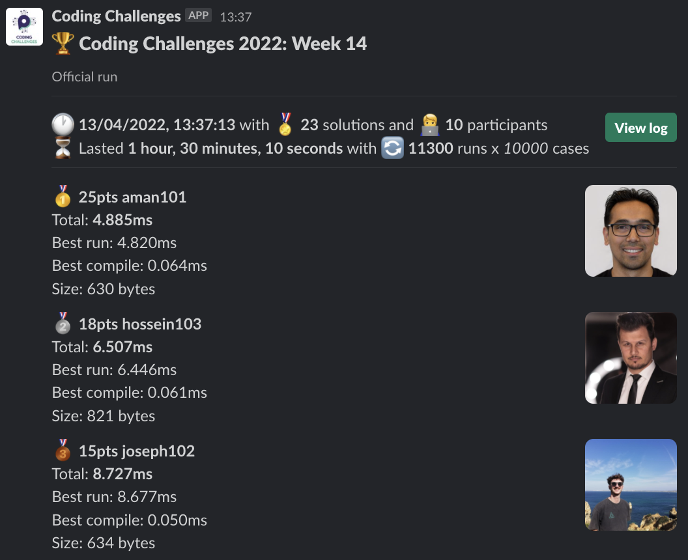
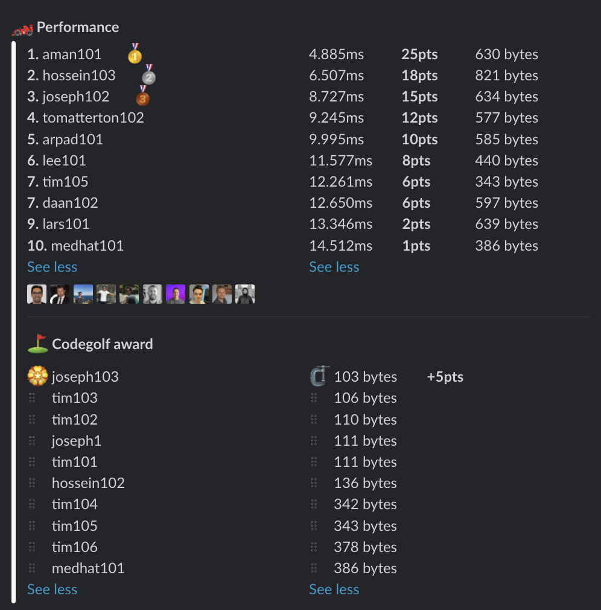

# Week 14 challenge

You are dealing with an archaic navigation system that sends you around the city by making you follow 4 cardinal directions: North, East, South, West.
You soon realise that this system sends you for a loop by making you needlesly travel up and then down, first left and then right etc.

Write a function `cutToTheChase` which accepts an array of directions, cancels out the immediate opposing directions and then returns only the ones you should follow.

*Note:* You should cancel out immediatelly following opposing directions, like North-South-West is just West. But North-West-South is still North-West-South;


Examples:
```
cutToTheChase(['NORTH']) // returns ['NORTH']
cutToTheChase(['NORTH', 'EAST']) // returns ['NORTH', 'EAST']
cutToTheChase(['NORTH', 'EAST', 'SOUTH']) // returns ['NORTH', 'EAST', 'SOUTH']
cutToTheChase(['NORTH', 'SOUTH', 'EAST', 'WEST', 'NORTH', 'WEST']) // returns ['NORTH', 'WEST']
cutToTheChase(['SOUTH', 'NORTH', 'EAST', 'WEST']) // returns []
```


## Upload link

You can `/submit` your solution in Slack.

## Results

| Place | Name         | Performance | Codegolf | Vote  | Total points |
|-------|--------------|-------------|----------|-------|--------------|
| 1.    | Aman         | 25          |          | 5     | 30           |
| 2.    | Joseph       | 15          | 5        | 5     | 25           |
| 3.    | Hossein      | 18          |          |       | 18           |
| 4.    | Tom Atterton | 12          |          |       | 12           |
| 5.    | Arpad        | 10          |          |       | 10           |
| 6.    | Lee          | 8           |          |       | 8            |
| 7.    | Tim          | 6           |          |       | 6            |
|       | Daan         | 6           |          |       | 6            |
| 9.    | Lars         | 2           |          |       | 2            |
| 10.   | Medhat       | 1           |          |       | 1            |


### Screenshot





### Vote

```
╔════════════════╤═══════════╤══════════════════════════════╗
║ Name           │ Vote      │ Comment                      ║
╟────────────────┼───────────┼──────────────────────────────╢
║ harijs.deksnis │ aman101   │ Really smart solution        ║
╟────────────────┼───────────┼──────────────────────────────╢
║ hossein        │ joseph103 │ Awesome codegolf             ║
╟────────────────┼───────────┼──────────────────────────────╢
║ varun          │ joseph103 │ Crazy short 😅               ║
╟────────────────┼───────────┼──────────────────────────────╢
║ aman.tuladhar  │ joseph103 │ Nice one                     ║
╟────────────────┼───────────┼──────────────────────────────╢
║ tomatterton    │ aman101   │ I like the use of charCodeAt ║
╟────────────────┼───────────┼──────────────────────────────╢
║ arpad          │ aman101   │ my head hurts but wow        ║
╚════════════════╧═══════════╧══════════════════════════════╝
```


### Full output log
```

EVALUATION STARTED:                 13/04/2022, 12:06:57
EVALUATING CHALLENGE:               2022/w14
FOUND 23 SOLUTIONS:                 aman101.js, arpad101.js, daan101.js, daan102.js, hossein101.js, hossein102.js, hossein103.js, joseph1.js, joseph101.js,
                          joseph102.js, joseph103.js, lars101.js, lee101.js, medhat101.js, tim101.js, tim102.js, tim103.js, tim104.js, tim105.js,
                          tim106.js, tim107.js, tomatterton101.js, tomatterton102.js
RUNNING EVALUATION FOR:             5400 SECONDS WITH 10000 TEST CASES IN EACH CYCLE...


EVALUATION ENDED:                   13/04/2022, 13:37:08
DURATION:                           1 hour, 30 minutes, 10.366 seconds

RANKINGS:
╔═══════╤════════╤════════════════╤══════════╤══════════╤══════════════╤══════╗
║ Place │ Points │ Name           │ Total    │ Best run │ Best compile │ Size ║
╟───────┼────────┼────────────────┼──────────┼──────────┼──────────────┼──────╢
║ 1     │ 25     │ aman101        │ 4.885ms  │ 4.820ms  │ 0.064ms      │ 630  ║
╟───────┼────────┼────────────────┼──────────┼──────────┼──────────────┼──────╢
║ 2     │ 18     │ hossein103     │ 6.507ms  │ 6.446ms  │ 0.061ms      │ 821  ║
╟───────┼────────┼────────────────┼──────────┼──────────┼──────────────┼──────╢
║ 3     │ 15     │ joseph102      │ 8.727ms  │ 8.677ms  │ 0.050ms      │ 634  ║
╟───────┼────────┼────────────────┼──────────┼──────────┼──────────────┼──────╢
║ 4     │ 12     │ tomatterton102 │ 9.245ms  │ 9.184ms  │ 0.061ms      │ 577  ║
╟───────┼────────┼────────────────┼──────────┼──────────┼──────────────┼──────╢
║ 5     │ 10     │ arpad101       │ 9.995ms  │ 9.944ms  │ 0.051ms      │ 585  ║
╟───────┼────────┼────────────────┼──────────┼──────────┼──────────────┼──────╢
║ 6     │ 8      │ lee101         │ 11.577ms │ 11.521ms │ 0.055ms      │ 440  ║
╟───────┼────────┼────────────────┼──────────┼──────────┼──────────────┼──────╢
║ 7     │ 6      │ tim105         │ 12.261ms │ 12.204ms │ 0.057ms      │ 343  ║
╟───────┼────────┼────────────────┼──────────┼──────────┼──────────────┼──────╢
║       │ 6      │ daan102        │ 12.650ms │ 12.600ms │ 0.050ms      │ 597  ║
╟───────┼────────┼────────────────┼──────────┼──────────┼──────────────┼──────╢
║ 9     │ 2      │ lars101        │ 13.346ms │ 13.287ms │ 0.059ms      │ 639  ║
╟───────┼────────┼────────────────┼──────────┼──────────┼──────────────┼──────╢
║ 10    │ 1      │ medhat101      │ 14.512ms │ 14.463ms │ 0.048ms      │ 386  ║
╚═══════╧════════╧════════════════╧══════════╧══════════╧══════════════╧══════╝

Keeping only best run from each contestant
Using 5% margin for determening ties

OMITTED FROM RANKINGS:              hossein101.js, joseph101.js, tim104.js, tim106.js, daan101.js, joseph1.js, tim107.js, tomatterton101.js, joseph103.js,
                          tim102.js, tim101.js, tim103.js, hossein102.js

CODEGOLF AWARD:                     joseph103.js with 103 bytes

SYSTEM INFO:
NODE: v16.14.2
ARCH: x64
PLATFORM: linux
VERSION: #56-Ubuntu SMP Mon Oct 5 14:28:49 UTC 2020
MEMORY: 15.64GB
CPUS: 2 x Intel(R) Xeon(R) Gold 6248 CPU @ 2.50GHz
CPU speed: 2494MHz

RAW RESULTS:
┌─────────┬─────────────────────┬────────────────────┬────────────────────┬──────────────────────┬──────┬────────────────┬────────────────────┬──────────────┬────────┬────────────┬───────┐
│ (index) │      solution       │       total        │      bestRun       │     bestCompile      │ size │    compiled    │   validationTime   │ onlyCodegolf │ failed │ failReason │ runs  │
├─────────┼─────────────────────┼────────────────────┼────────────────────┼──────────────────────┼──────┼────────────────┼────────────────────┼──────────────┼────────┼────────────┼───────┤
│    0    │    'aman101.js'     │ 4.884580000012647  │  4.82042599999113  │ 0.06415400002151728  │ 630  │ 'successfully' │ 124.68641699999898 │    false     │ false  │    null    │ 11300 │
│    1    │   'hossein103.js'   │ 6.507004000013694  │ 6.446040000068024  │ 0.060963999945670366 │ 821  │ 'successfully' │ 91.63730599999872  │    false     │ false  │    null    │ 11300 │
│    2    │   'joseph102.js'    │  8.72735299996566  │ 8.677060999907553  │ 0.05029200005810708  │ 634  │ 'successfully' │ 89.75297999999748  │    false     │ false  │    null    │ 11300 │
│    3    │ 'tomatterton102.js' │ 9.245073999743909  │ 9.183881999924779  │ 0.061191999819129705 │ 577  │ 'successfully' │ 89.77300999999716  │    false     │ false  │    null    │ 11300 │
│    4    │    'arpad101.js'    │ 9.994614999974146  │  9.94361299998127  │ 0.051001999992877245 │ 585  │ 'successfully' │ 93.86275899999964  │    false     │ false  │    null    │ 11300 │
│    5    │   'hossein101.js'   │ 11.179994999896735 │ 11.107776999939233 │ 0.07221799995750189  │ 726  │ 'successfully' │ 94.90344900000127  │    false     │ false  │    null    │ 11300 │
│    6    │     'lee101.js'     │ 11.576699000317603 │ 11.52145600039512  │ 0.05524299992248416  │ 440  │ 'successfully' │ 93.04508300000089  │    false     │ false  │    null    │ 11300 │
│    7    │   'joseph101.js'    │ 12.014210999943316 │ 11.95861699996749  │ 0.05559399997582659  │ 983  │ 'successfully' │  97.3216829999983  │    false     │ false  │    null    │ 11300 │
│    8    │     'tim105.js'     │ 12.26079099997878  │ 12.203650000039488 │ 0.05714099993929267  │ 343  │ 'successfully' │ 96.33007900000302  │    false     │ false  │    null    │ 11300 │
│    9    │    'daan102.js'     │ 12.649957999936305 │ 12.59954799991101  │ 0.05041000002529472  │ 597  │ 'successfully' │ 100.05730500000027 │    false     │ false  │    null    │ 11300 │
│   10    │     'tim104.js'     │ 12.65555100061465  │ 12.598757000640035 │ 0.05679399997461587  │ 342  │ 'successfully' │ 97.62860100000034  │    false     │ false  │    null    │ 11300 │
│   11    │     'tim106.js'     │ 12.75249299989082  │ 12.692319999914616 │ 0.060172999976202846 │ 378  │ 'successfully' │ 103.02958299999955 │    false     │ false  │    null    │ 11300 │
│   12    │    'daan101.js'     │ 12.976253000088036 │ 12.92530700005591  │ 0.050946000032126904 │ 662  │ 'successfully' │  95.4679670000005  │    false     │ false  │    null    │ 11300 │
│   13    │    'lars101.js'     │ 13.346026999875903 │ 13.286805999930948 │ 0.05922099994495511  │ 639  │ 'successfully' │ 95.66341600000305  │    false     │ false  │    null    │ 11300 │
│   14    │   'medhat101.js'    │ 14.511778000276536 │ 14.463342000264674 │ 0.048436000011861324 │ 386  │ 'successfully' │ 99.71296599999914  │    false     │ false  │    null    │ 11300 │
│   15    │    'joseph1.js'     │  17.3793959999457  │ 17.336259000003338 │ 0.04313699994236231  │ 111  │ 'successfully' │ 105.13696500000151 │    false     │ false  │    null    │ 11300 │
│   16    │     'tim107.js'     │ 20.95875499997055  │ 20.892698999959975 │  0.0660560000105761  │ 447  │ 'successfully' │ 117.72458499999993 │    false     │ false  │    null    │ 11300 │
│   17    │ 'tomatterton101.js' │ 23.159242999739945 │ 23.109784999862313 │ 0.049457999877631664 │ 583  │ 'successfully' │ 103.70220100000006 │    false     │ false  │    null    │ 11300 │
│   18    │   'joseph103.js'    │ 30.588192999988678 │ 30.542465999998967 │ 0.04572699998971075  │ 103  │ 'successfully' │ 118.25492600000143 │    false     │ false  │    null    │ 11300 │
│   19    │     'tim102.js'     │ 37.805261000059545 │ 37.76234100013971  │ 0.04291999991983175  │ 110  │ 'successfully' │ 130.0119080000004  │    false     │ false  │    null    │ 11300 │
│   20    │     'tim101.js'     │ 37.993189000175335 │ 37.94993200013414  │ 0.04325700004119426  │ 111  │ 'successfully' │     128.646299     │    false     │ false  │    null    │ 11300 │
│   21    │     'tim103.js'     │ 38.047320000012405 │ 38.00482400000328  │ 0.042496000009123236 │ 106  │ 'successfully' │ 128.91864599999826 │    false     │ false  │    null    │ 11300 │
│   22    │   'hossein102.js'   │ 58.681367000041064 │ 58.634851999988314 │ 0.04651500005275011  │ 136  │ 'successfully' │ 148.78823399999965 │    false     │ false  │    null    │ 11300 │
└─────────┴─────────────────────┴────────────────────┴────────────────────┴──────────────────────┴──────┴────────────────┴────────────────────┴──────────────┴────────┴────────────┴───────┘
```
  