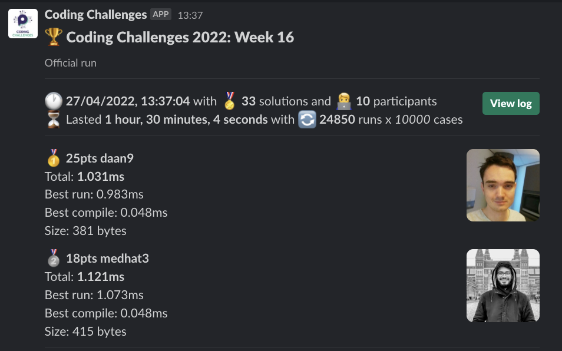
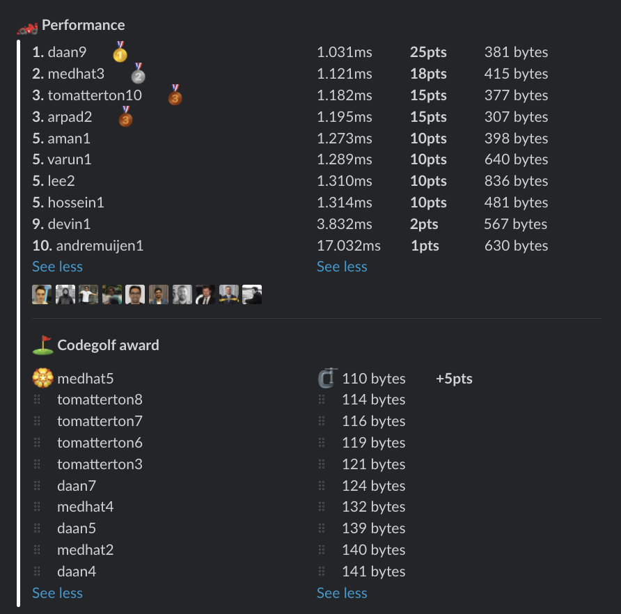

# Week 16 challenge

Write a function `greed` which is a scoring function for a dice game Greed. The game is played with a regular six-sided dices (yielding random values 1-6) by throwing 5 at the same time. Then the throw is scored according to these rules:
```
  Three 1's => 1000 points
  Three 6's =>  600 points
  Three 5's =>  500 points
  Three 4's =>  400 points
  Three 3's =>  300 points
  Three 2's =>  200 points
  One   1   =>  100 points
  One   5   =>   50 point
```

Each digit can be used up only once. E.g. if you have four 3' and one 2 you get 300 points, because 333 gives you 300, but lone 2 and 3 don't award any points.


Examples:
```
greed([1,2,3,4,5]) // returns 150
greed([2,3,4,6,6]) // returns 0
greed([1,1,1,1,1]) // returns 1200
greed([5,5,5,5,5]) // returns 600
```

## Upload link

You can `/submit` your solution in Slack.

## Results

| Place | Name         | Performance | Codegolf | Vote  | Total points |
|-------|--------------|-------------|----------|-------|--------------|
| 1.    | Medhat       | 18          | 5        | 5     | 28           |
| 2.    | Daan         | 25          |          |       | 25           |
| 3.    | Tom Atterton | 15          |          |       | 15           |
|       | Arpad        | 15          |          |       | 15           |
| 5.    | Aman         | 10          |          |       | 10           |
|       | Varun        | 10          |          |       | 10           |
|       | Lee          | 10          |          |       | 10           |
|       | Hossein      | 10          |          |       | 10           |
| 9.    | Devin        | 2           |          |       | 2            |
| 10.   | Andre Muijen | 1           |          |       | 1            |


### Screenshot





### Vote

```
╔════════════════╤══════════╤═══════════════════════════════════════════╗
║ Name           │ Vote     │ Comment                                   ║
╟────────────────┼──────────┼───────────────────────────────────────────╢
║ daan           │ medhat5  │ codegolf                                  ║
╟────────────────┼──────────┼───────────────────────────────────────────╢
║ aman.tuladhar  │ medhat5  │ Like it!                                  ║
╟────────────────┼──────────┼───────────────────────────────────────────╢
║ tomatterton    │ medhat5  │ Magician  🧙                              ║
╟────────────────┼──────────┼───────────────────────────────────────────╢
║ varun          │ medhat5  │ 🤏 So tiny 🤯 and 1e3 usage was neat!     ║
╟────────────────┼──────────┼───────────────────────────────────────────╢
║ harijs.deksnis │ hossein1 │ Pretty neat way, even tho not the fastest ║
╚════════════════╧══════════╧═══════════════════════════════════════════╝
```


### Full output log
```

EVALUATION STARTED:                 27/04/2022, 12:06:53
EVALUATING CHALLENGE:               2022/w16
FOUND 33 SOLUTIONS:                 aman1.js, andremuijen1.js, arpad1.js, arpad2.js, daan1.js, daan2.js, daan3.js, daan4.js, daan5.js, daan6.js, daan7.js,
                          daan8.js, daan9.js, devin1.js, hossein1.js, lee1.js, lee2.js, medhat1.js, medhat2.js, medhat3.js, medhat4.js, medhat5.js,
                          tomatterton1.js, tomatterton10.js, tomatterton2.js, tomatterton3.js, tomatterton4.js, tomatterton5.js, tomatterton6.js,
                          tomatterton7.js, tomatterton8.js, tomatterton9.js, varun1.js
RUNNING EVALUATION FOR:             5400 SECONDS WITH 10000 TEST CASES IN EACH CYCLE...


EVALUATION ENDED:                   27/04/2022, 13:36:58
DURATION:                           1 hour, 30 minutes, 4.854 seconds

RANKINGS:
╔═══════╤════════╤═══════════════╤══════════╤══════════╤══════════════╤══════╗
║ Place │ Points │ Name          │ Total    │ Best run │ Best compile │ Size ║
╟───────┼────────┼───────────────┼──────────┼──────────┼──────────────┼──────╢
║ 1     │ 25     │ daan9         │ 1.031ms  │ 0.983ms  │ 0.048ms      │ 381  ║
╟───────┼────────┼───────────────┼──────────┼──────────┼──────────────┼──────╢
║ 2     │ 18     │ medhat3       │ 1.121ms  │ 1.073ms  │ 0.048ms      │ 415  ║
╟───────┼────────┼───────────────┼──────────┼──────────┼──────────────┼──────╢
║ 3     │ 15     │ tomatterton10 │ 1.182ms  │ 1.138ms  │ 0.044ms      │ 377  ║
╟───────┼────────┼───────────────┼──────────┼──────────┼──────────────┼──────╢
║       │ 15     │ arpad2        │ 1.195ms  │ 1.147ms  │ 0.047ms      │ 307  ║
╟───────┼────────┼───────────────┼──────────┼──────────┼──────────────┼──────╢
║ 5     │ 10     │ aman1         │ 1.273ms  │ 1.222ms  │ 0.051ms      │ 398  ║
╟───────┼────────┼───────────────┼──────────┼──────────┼──────────────┼──────╢
║       │ 10     │ varun1        │ 1.289ms  │ 1.236ms  │ 0.052ms      │ 640  ║
╟───────┼────────┼───────────────┼──────────┼──────────┼──────────────┼──────╢
║       │ 10     │ lee2          │ 1.310ms  │ 1.257ms  │ 0.053ms      │ 836  ║
╟───────┼────────┼───────────────┼──────────┼──────────┼──────────────┼──────╢
║       │ 10     │ hossein1      │ 1.314ms  │ 1.260ms  │ 0.054ms      │ 481  ║
╟───────┼────────┼───────────────┼──────────┼──────────┼──────────────┼──────╢
║ 9     │ 2      │ devin1        │ 3.832ms  │ 3.782ms  │ 0.050ms      │ 567  ║
╟───────┼────────┼───────────────┼──────────┼──────────┼──────────────┼──────╢
║ 10    │ 1      │ andremuijen1  │ 17.032ms │ 16.977ms │ 0.055ms      │ 630  ║
╚═══════╧════════╧═══════════════╧══════════╧══════════╧══════════════╧══════╝

Keeping only best run from each contestant
Using 5% margin for determening ties

OMITTED FROM RANKINGS:              daan8.js, tomatterton4.js, daan6.js, tomatterton1.js, daan3.js, arpad1.js, medhat2.js, medhat4.js, medhat1.js, daan5.js,
                          daan4.js, daan7.js, medhat5.js, tomatterton2.js, daan2.js, tomatterton9.js, lee1.js, tomatterton5.js, daan1.js,
                          tomatterton3.js, tomatterton7.js, tomatterton6.js, tomatterton8.js

CODEGOLF AWARD:                     medhat5.js with 110 bytes

SYSTEM INFO:
NODE: v16.14.2
ARCH: x64
PLATFORM: linux
VERSION: #56-Ubuntu SMP Mon Oct 5 14:28:49 UTC 2020
MEMORY: 15.64GB
CPUS: 2 x Intel(R) Xeon(R) Gold 6248 CPU @ 2.50GHz
CPU speed: 2494MHz

RAW RESULTS:
┌─────────┬────────────────────┬────────────────────┬────────────────────┬──────────────────────┬──────┬────────────────┬────────────────────┬──────────────┬────────┬────────────┬───────┐
│ (index) │      solution      │       total        │      bestRun       │     bestCompile      │ size │    compiled    │   validationTime   │ onlyCodegolf │ failed │ failReason │ runs  │
├─────────┼────────────────────┼────────────────────┼────────────────────┼──────────────────────┼──────┼────────────────┼────────────────────┼──────────────┼────────┼────────────┼───────┤
│    0    │     'daan9.js'     │ 1.031152999959886  │ 0.983049999922514  │ 0.04810300003737211  │ 381  │ 'successfully' │ 22.40608499999871  │    false     │ false  │    null    │ 24850 │
│    1    │     'daan8.js'     │ 1.0441790000186302 │ 0.9968840000219643 │ 0.047294999996665865 │ 360  │ 'successfully' │ 22.911753000000317 │    false     │ false  │    null    │ 24850 │
│    2    │    'medhat3.js'    │ 1.1207639999920502 │ 1.0726159999903757 │ 0.04814800000167452  │ 415  │ 'successfully' │ 21.850454999999783 │    false     │ false  │    null    │ 24850 │
│    3    │ 'tomatterton10.js' │ 1.1822319999337196 │ 1.1378770000301301 │ 0.04435499990358949  │ 377  │ 'successfully' │ 23.36137400000007  │    false     │ false  │    null    │ 24850 │
│    4    │    'arpad2.js'     │ 1.194729000038933  │ 1.1474659999948926 │ 0.04726300004404038  │ 307  │ 'successfully' │ 24.128215999999156 │    false     │ false  │    null    │ 24850 │
│    5    │ 'tomatterton4.js'  │ 1.205208000028506  │ 1.1586390000302345 │ 0.046568999998271465 │ 413  │ 'successfully' │ 22.00174800000059  │    false     │ false  │    null    │ 24850 │
│    6    │     'daan6.js'     │ 1.209310999882291  │ 1.162074999883771  │ 0.04723599999852013  │ 321  │ 'successfully' │ 25.395074000000022 │    false     │ false  │    null    │ 24850 │
│    7    │ 'tomatterton1.js'  │ 1.2219069999991916 │ 1.1743579999892972 │ 0.04754900000989437  │ 677  │ 'successfully' │ 21.93679499999962  │    false     │ false  │    null    │ 24850 │
│    8    │     'daan3.js'     │ 1.241266000084579  │ 1.1905810004100204 │ 0.05068499967455864  │ 351  │ 'successfully' │ 27.239474999998492 │    false     │ false  │    null    │ 24850 │
│    9    │    'arpad1.js'     │ 1.2703420000325423 │ 1.2254419999953825 │ 0.04490000003715977  │ 148  │ 'successfully' │ 29.733588000000964 │    false     │ false  │    null    │ 24850 │
│   10    │     'aman1.js'     │ 1.2730740001425147 │ 1.222002999857068  │ 0.051071000285446644 │ 398  │ 'successfully' │  53.0385869999991  │    false     │ false  │    null    │ 24850 │
│   11    │    'varun1.js'     │ 1.2886890000663698 │ 1.2362660001963377 │ 0.05242299987003207  │ 640  │ 'successfully' │  24.3822710000004  │    false     │ false  │    null    │ 24850 │
│   12    │    'medhat2.js'    │ 1.291514000040479  │ 1.2503200000501238 │ 0.04119399999035522  │ 140  │ 'successfully' │     111.230458     │    false     │ false  │    null    │ 24850 │
│   13    │    'medhat4.js'    │ 1.2951009996468201 │ 1.2541460000211373 │ 0.04095499962568283  │ 132  │ 'successfully' │ 108.05474200000026 │    false     │ false  │    null    │ 24850 │
│   14    │    'medhat1.js'    │ 1.3044420004152926 │ 1.2558920000010403 │ 0.04855000041425228  │ 382  │ 'successfully' │ 21.77431600000091  │    false     │ false  │    null    │ 24850 │
│   15    │     'lee2.js'      │ 1.3096159997512586 │ 1.2570849999901839 │ 0.05253099976107478  │ 836  │ 'successfully' │ 24.73341900000014  │    false     │ false  │    null    │ 24850 │
│   16    │   'hossein1.js'    │ 1.3140879997226875 │ 1.260481999721378  │ 0.05360600000130944  │ 481  │ 'successfully' │ 23.633696000000782 │    false     │ false  │    null    │ 24850 │
│   17    │     'daan5.js'     │ 1.3666260007303208 │ 1.3258930006995797 │ 0.040733000030741096 │ 139  │ 'successfully' │  54.1570640000009  │    false     │ false  │    null    │ 24850 │
│   18    │     'daan4.js'     │ 1.3761600000143517 │ 1.3351240000047255 │ 0.04103600000962615  │ 141  │ 'successfully' │ 55.40350000000035  │    false     │ false  │    null    │ 24850 │
│   19    │     'daan7.js'     │ 1.420915000140667  │ 1.3799660000950098 │ 0.04094900004565716  │ 124  │ 'successfully' │ 51.155188999999154 │    false     │ false  │    null    │ 24850 │
│   20    │    'medhat5.js'    │ 1.469607999548316  │ 1.428189999423921  │ 0.041418000124394894 │ 110  │ 'successfully' │ 45.58836800000063  │    false     │ false  │    null    │ 24850 │
│   21    │ 'tomatterton2.js'  │ 1.816338000120595  │ 1.7718770001083612 │ 0.04446100001223385  │ 201  │ 'successfully' │ 27.503498999998556 │    false     │ false  │    null    │ 24850 │
│   22    │     'daan2.js'     │ 2.1360210005077533 │ 2.082287000492215  │ 0.053734000015538186 │ 867  │ 'successfully' │ 29.316623000000618 │    false     │ false  │    null    │ 24850 │
│   23    │ 'tomatterton9.js'  │ 3.5457549998536706 │ 3.5007599997334182 │ 0.04499500012025237  │ 377  │ 'successfully' │ 27.305727999999363 │    false     │ false  │    null    │ 24850 │
│   24    │     'lee1.js'      │ 3.696498999837786  │ 3.6430219998583198 │  0.0534769999794662  │ 834  │ 'successfully' │ 30.056077999999616 │    false     │ false  │    null    │ 24850 │
│   25    │    'devin1.js'     │ 3.831854000221938  │ 3.781597000081092  │ 0.050257000140845776 │ 567  │ 'successfully' │  30.0573430000004  │    false     │ false  │    null    │ 24850 │
│   26    │ 'tomatterton5.js'  │  3.85959800001001  │ 3.8147330000065267 │ 0.044865000003483146 │ 303  │ 'successfully' │ 24.776866000000155 │    false     │ false  │    null    │ 24850 │
│   27    │     'daan1.js'     │ 9.337449999991804  │ 9.281986000016332  │ 0.05546399997547269  │ 862  │ 'successfully' │ 43.942848000000595 │    false     │ false  │    null    │ 24850 │
│   28    │ 'tomatterton3.js'  │ 13.148379999911413 │ 13.104623999912292 │ 0.04375599999912083  │ 121  │ 'successfully' │ 45.72999400000117  │    false     │ false  │    null    │ 24850 │
│   29    │ 'tomatterton7.js'  │ 14.444093000027351 │ 14.39922999998089  │ 0.04486300004646182  │ 116  │ 'successfully' │ 45.45193299999846  │    false     │ false  │    null    │ 24850 │
│   30    │ 'tomatterton6.js'  │ 14.486830999376252 │ 14.441321999998763 │ 0.04550899937748909  │ 119  │ 'successfully' │ 47.558836000000156 │    false     │ false  │    null    │ 24850 │
│   31    │ 'tomatterton8.js'  │ 14.598727999808034 │ 14.552366999996593 │ 0.046360999811440706 │ 114  │ 'successfully' │ 48.37017500000002  │    false     │ false  │    null    │ 24850 │
│   32    │ 'andremuijen1.js'  │ 17.032150000333786 │ 16.976928000338376 │ 0.05522199999541044  │ 630  │ 'successfully' │ 80.60054399999899  │    false     │ false  │    null    │ 24850 │
└─────────┴────────────────────┴────────────────────┴────────────────────┴──────────────────────┴──────┴────────────────┴────────────────────┴──────────────┴────────┴────────────┴───────┘
```
  