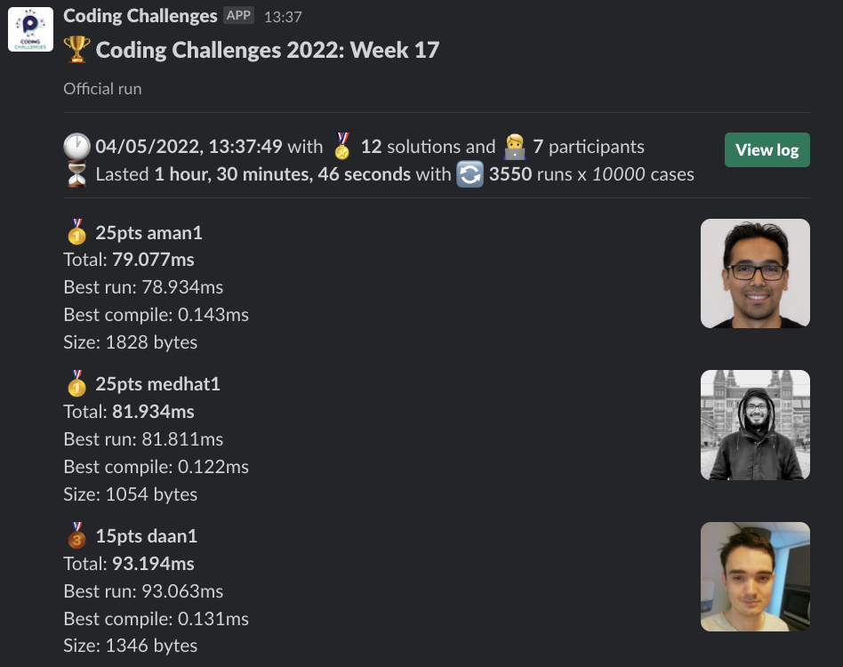
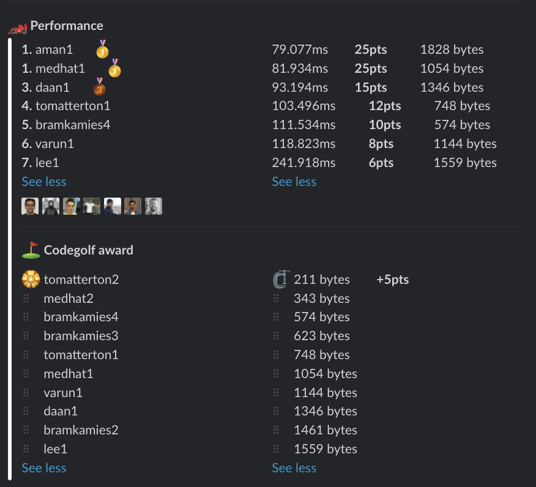

# Week 17 challenge

Write a function `subtract` which takes in two numbers (as strings) and returns the result, also as a string.
You might want to recall [how](https://www.wikihow.com/Subtract) we did it in school on the blackboard :)

*Note:* Using `BigInt` for this challenge is forbidden.

Examples:
```
subtract('1', '1') // returns '0'
subtract('7', '123') // returns '-116'
subtract('9999', '1542') // returns '8457'
subtract('81489141787297148918947891489148971', '8417894917984718949817471897441') // returns '81480723892379164199998074017251530'
```


## Upload link

You can `/submit` your solution in Slack.

## Results

| Place | Name         | Performance | Codegolf | Vote  | Total points |
|-------|--------------|-------------|----------|-------|--------------|
| 1.    | Aman         | 25          |          | 5     | 30           |
| 2.    | Medhat       | 25          |          |       | 25           |
| 3.    | Tom Atterton | 12          | 5        |       | 17           |
| 4.    | Daan         | 15          |          |       | 15           |
| 5.    | Bram Kamies  | 10          |          |       | 10           |
| 6.    | Varun        | 8           |          |       | 8            |
| 7.    | Lee          | 6           |          |       | 6            |


### Screenshot





### Vote

```
╔═══════════════╤══════════════╤═════════════════════════════════════╗
║ Name          │ Vote         │ Comment                             ║
╟───────────────┼──────────────┼─────────────────────────────────────╢
║ medhat        │ tomatterton2 │ Great golf 👏 could be even smaller ║
╟───────────────┼──────────────┼─────────────────────────────────────╢
║ aman.tuladhar │ bramkamies4  │ Buffer.alloc looks interesting      ║
╟───────────────┼──────────────┼─────────────────────────────────────╢
║ bramkamies    │ aman1        │ Speedy                              ║
╟───────────────┼──────────────┼─────────────────────────────────────╢
║ tomatterton   │ aman1        │ 😲                                  ║
╚═══════════════╧══════════════╧═════════════════════════════════════╝
```


### Full output log
```

EVALUATION STARTED:                 04/05/2022, 12:06:57
EVALUATING CHALLENGE:               2022/w17
FOUND 12 SOLUTIONS:                 aman1.js, bramkamies1.js, bramkamies2.js, bramkamies3.js, bramkamies4.js, daan1.js, lee1.js, medhat1.js, medhat2.js,
                          tomatterton1.js, tomatterton2.js, varun1.js
RUNNING EVALUATION FOR:             5400 SECONDS WITH 10000 TEST CASES IN EACH CYCLE...


EVALUATION ENDED:                   04/05/2022, 13:37:44
DURATION:                           1 hour, 30 minutes, 46.171 seconds

RANKINGS:
╔═══════╤════════╤══════════════╤═══════════╤═══════════╤══════════════╤══════╗
║ Place │ Points │ Name         │ Total     │ Best run  │ Best compile │ Size ║
╟───────┼────────┼──────────────┼───────────┼───────────┼──────────────┼──────╢
║ 1     │ 25     │ aman1        │ 79.077ms  │ 78.934ms  │ 0.143ms      │ 1828 ║
╟───────┼────────┼──────────────┼───────────┼───────────┼──────────────┼──────╢
║       │ 25     │ medhat1      │ 81.934ms  │ 81.811ms  │ 0.122ms      │ 1054 ║
╟───────┼────────┼──────────────┼───────────┼───────────┼──────────────┼──────╢
║ 3     │ 15     │ daan1        │ 93.194ms  │ 93.063ms  │ 0.131ms      │ 1346 ║
╟───────┼────────┼──────────────┼───────────┼───────────┼──────────────┼──────╢
║ 4     │ 12     │ tomatterton1 │ 103.496ms │ 103.391ms │ 0.105ms      │ 748  ║
╟───────┼────────┼──────────────┼───────────┼───────────┼──────────────┼──────╢
║ 5     │ 10     │ bramkamies4  │ 111.534ms │ 111.420ms │ 0.114ms      │ 574  ║
╟───────┼────────┼──────────────┼───────────┼───────────┼──────────────┼──────╢
║ 6     │ 8      │ varun1       │ 118.823ms │ 118.702ms │ 0.121ms      │ 1144 ║
╟───────┼────────┼──────────────┼───────────┼───────────┼──────────────┼──────╢
║ 7     │ 6      │ lee1         │ 241.918ms │ 241.752ms │ 0.166ms      │ 1559 ║
╚═══════╧════════╧══════════════╧═══════════╧═══════════╧══════════════╧══════╝

Keeping only best run from each contestant
Using 5% margin for determening ties

OMITTED FROM RANKINGS:              bramkamies3.js, tomatterton2.js, bramkamies2.js

ONLY CODEGOLF SOLUTIONS:            medhat2.js

CODEGOLF AWARD:                     tomatterton2.js with 211 bytes

FAILED SOLUTIONS:                   bramkamies1.js

SYSTEM INFO:
NODE: v16.14.2
ARCH: x64
PLATFORM: linux
VERSION: #56-Ubuntu SMP Mon Oct 5 14:28:49 UTC 2020
MEMORY: 15.64GB
CPUS: 2 x Intel(R) Xeon(R) Gold 6248 CPU @ 2.50GHz
CPU speed: 2494MHz

RAW RESULTS:
┌─────────┬───────────────────┬────────────────────┬────────────────────┬─────────────────────┬──────┬────────────────┬───────────────────────┬──────────────┬────────┬───────────────────────┬──────┐
│ (index) │     solution      │       total        │      bestRun       │     bestCompile     │ size │    compiled    │    validationTime     │ onlyCodegolf │ failed │      failReason       │ runs │
├─────────┼───────────────────┼────────────────────┼────────────────────┼─────────────────────┼──────┼────────────────┼───────────────────────┼──────────────┼────────┼───────────────────────┼──────┤
│    0    │    'aman1.js'     │ 79.07688199961558  │ 78.93428499996662  │ 0.14259699964895844 │ 1828 │ 'successfully' │   156.3760000000002   │    false     │ false  │         null          │ 3550 │
│    1    │   'medhat1.js'    │ 81.93350000027567  │ 81.81126300012693  │ 0.12223700014874339 │ 1054 │ 'successfully' │  113.09637999999904   │    false     │ false  │         null          │ 3550 │
│    2    │    'daan1.js'     │ 93.19391699973494  │ 93.06272599985823  │ 0.1311909998767078  │ 1346 │ 'successfully' │   949.5165800000013   │    false     │ false  │         null          │ 3550 │
│    3    │ 'tomatterton1.js' │ 103.49553799978457 │ 103.39062600000761 │ 0.10491199977695942 │ 748  │ 'successfully' │  125.08396899999934   │    false     │ false  │         null          │ 3550 │
│    4    │ 'bramkamies4.js'  │ 111.53394799958915 │ 111.41983499983326 │ 0.11411299975588918 │ 574  │ 'successfully' │   84.4072959999994    │    false     │ false  │         null          │ 3550 │
│    5    │ 'bramkamies3.js'  │ 113.73100399994291 │ 113.61631499999203 │ 0.11468899995088577 │ 623  │ 'successfully' │   82.04933100000017   │    false     │ false  │         null          │ 3550 │
│    6    │    'varun1.js'    │ 118.82303699990734 │ 118.7016459996812  │ 0.12139100022614002 │ 1144 │ 'successfully' │  1240.7748539999993   │    false     │ false  │         null          │ 3550 │
│    7    │ 'tomatterton2.js' │ 144.51231200015172 │ 144.4175760000944  │ 0.09473600005730987 │ 211  │ 'successfully' │  2276.4342450000004   │    false     │ false  │         null          │ 3550 │
│    8    │     'lee1.js'     │ 241.9175549999345  │ 241.7516089999117  │ 0.16594600002281368 │ 1559 │ 'successfully' │  303.37264799999684   │    false     │ false  │         null          │ 3550 │
│    9    │ 'bramkamies2.js'  │ 347.0414340002462  │ 346.90978600038216 │ 0.1316479998640716  │ 1461 │ 'successfully' │   704.0531589999991   │    false     │ false  │         null          │ 3550 │
│   10    │ 'bramkamies1.js'  │        null        │        null        │        null         │ 2590 │ 'successfully' │ 0.0022100000005593756 │    false     │  true  │ 'Exceeded 2048 bytes' │  0   │
│   11    │   'medhat2.js'    │        null        │        null        │        null         │ 343  │ 'successfully' │  1989.4613669999999   │     true     │ false  │         null          │  0   │
└─────────┴───────────────────┴────────────────────┴────────────────────┴─────────────────────┴──────┴────────────────┴───────────────────────┴──────────────┴────────┴───────────────────────┴──────┘
```
  