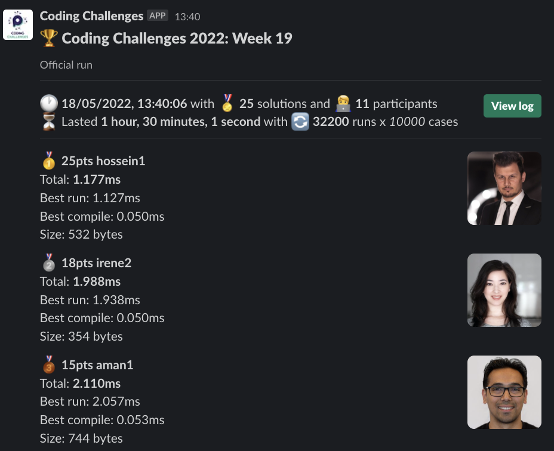
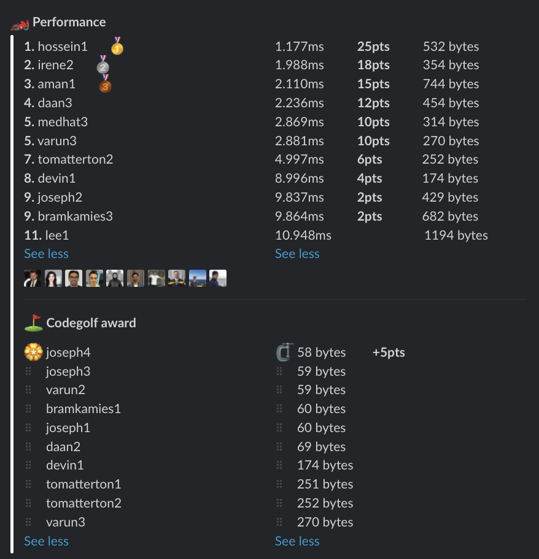

# Week 19 challenge

Write a function `bigFive` which accepts a string of digits and returns the largest number that can be formed from 5 consecutive digits.


Examples:
```
bigFive('123456') // returns 23456
bigFive('12415820981') // returns 82098
bigFive('781144221') // returns 81144
```


## Upload link

You can `/submit` your solution in Slack.

## Results

| Place | Name         | Performance | Codegolf | Vote  | Total points |
|-------|--------------|-------------|----------|-------|--------------|
| 1.    | Hossein      | 25          |          |       | 25           |
| 2.    | Irene        | 18          |          |       | 18           |
| 3.    | Aman         | 15          |          |       | 15           |
| 4.    | Daan         | 12          |          |       | 12           |
|       | Joseph       | 2           | 5        | 5     | 12           |
| 6.    | Medhat       | 10          |          |       | 10           |
|       | Varun        | 10          |          |       | 10           |
| 8.    | Tom Atterton | 6           |          |       | 6            |
| 9.    | Devin        | 4           |          |       | 4            |
| 10.   | Bram Kamies  | 2           |          |       | 2            |


### Screenshot





### Vote

```
╔═══════════════╤══════════╤═══════════════════════════════════════════════════════════════════╗
║ Name          │ Vote     │ Comment                                                           ║
╟───────────────┼──────────┼───────────────────────────────────────────────────────────────────╢
║ daan          │ joseph4  │ clever                                                            ║
╟───────────────┼──────────┼───────────────────────────────────────────────────────────────────╢
║ varun         │ joseph4  │ Genius solution 🫡                                                 ║
╟───────────────┼──────────┼───────────────────────────────────────────────────────────────────╢
║ hossein       │ joseph4  │ Very smart alternative                                            ║
║               │          │ You could even make it shorter by using `1e5` instead of `100000` ║
╟───────────────┼──────────┼───────────────────────────────────────────────────────────────────╢
║ irene         │ joseph4  │ Creative!                                                         ║
╟───────────────┼──────────┼───────────────────────────────────────────────────────────────────╢
║ aman.tuladhar │ hossein1 │ Nice solution!!!                                                  ║
╚═══════════════╧══════════╧═══════════════════════════════════════════════════════════════════╝
```


### Full output log
```

EVALUATION STARTED:                 18/05/2022, 12:09:59
EVALUATING CHALLENGE:               2022/w19
FOUND 25 SOLUTIONS:                 aman1.js, bramkamies1.js, bramkamies2.js, bramkamies3.js, daan1.js, daan2.js, daan3.js, devin1.js, hossein1.js,
                          irene1.js, irene2.js, joseph1.js, joseph2.js, joseph3.js, joseph4.js, lee1.js, medhat1.js, medhat2.js, medhat3.js,
                          tomatterton1.js, tomatterton2.js, tomatterton3.js, varun1.js, varun2.js, varun3.js
RUNNING EVALUATION FOR:             5400 SECONDS WITH 10000 TEST CASES IN EACH CYCLE...


EVALUATION ENDED:                   18/05/2022, 13:40:00
DURATION:                           1 hour, 30 minutes, 1.89 seconds

RANKINGS:
╔═══════╤════════╤══════════════╤══════════╤══════════╤══════════════╤══════╗
║ Place │ Points │ Name         │ Total    │ Best run │ Best compile │ Size ║
╟───────┼────────┼──────────────┼──────────┼──────────┼──────────────┼──────╢
║ 1     │ 25     │ hossein1     │ 1.177ms  │ 1.127ms  │ 0.050ms      │ 532  ║
╟───────┼────────┼──────────────┼──────────┼──────────┼──────────────┼──────╢
║ 2     │ 18     │ irene2       │ 1.988ms  │ 1.938ms  │ 0.050ms      │ 354  ║
╟───────┼────────┼──────────────┼──────────┼──────────┼──────────────┼──────╢
║ 3     │ 15     │ aman1        │ 2.110ms  │ 2.057ms  │ 0.053ms      │ 744  ║
╟───────┼────────┼──────────────┼──────────┼──────────┼──────────────┼──────╢
║ 4     │ 12     │ daan3        │ 2.236ms  │ 2.179ms  │ 0.056ms      │ 454  ║
╟───────┼────────┼──────────────┼──────────┼──────────┼──────────────┼──────╢
║ 5     │ 10     │ medhat3      │ 2.869ms  │ 2.824ms  │ 0.046ms      │ 314  ║
╟───────┼────────┼──────────────┼──────────┼──────────┼──────────────┼──────╢
║       │ 10     │ varun3       │ 2.881ms  │ 2.839ms  │ 0.043ms      │ 270  ║
╟───────┼────────┼──────────────┼──────────┼──────────┼──────────────┼──────╢
║ 7     │ 6      │ tomatterton2 │ 4.997ms  │ 4.954ms  │ 0.042ms      │ 252  ║
╟───────┼────────┼──────────────┼──────────┼──────────┼──────────────┼──────╢
║ 8     │ 4      │ devin1       │ 8.996ms  │ 8.953ms  │ 0.042ms      │ 174  ║
╟───────┼────────┼──────────────┼──────────┼──────────┼──────────────┼──────╢
║ 9     │ 2      │ joseph2      │ 9.837ms  │ 9.790ms  │ 0.047ms      │ 429  ║
╟───────┼────────┼──────────────┼──────────┼──────────┼──────────────┼──────╢
║       │ 2      │ bramkamies3  │ 9.864ms  │ 9.806ms  │ 0.057ms      │ 682  ║
╟───────┼────────┼──────────────┼──────────┼──────────┼──────────────┼──────╢
║ 11    │        │ lee1         │ 10.948ms │ 10.895ms │ 0.053ms      │ 1194 ║
╚═══════╧════════╧══════════════╧══════════╧══════════╧══════════════╧══════╝

Keeping only best run from each contestant
Using 5% margin for determening ties

OMITTED FROM RANKINGS:              irene1.js, medhat2.js, varun1.js, medhat1.js, tomatterton3.js, daan1.js, tomatterton1.js, daan2.js, bramkamies2.js

ONLY CODEGOLF SOLUTIONS:            bramkamies1.js, joseph1.js, joseph3.js, joseph4.js, varun2.js

CODEGOLF AWARD:                     joseph4.js with 58 bytes

SYSTEM INFO:
NODE: v16.14.2
ARCH: x64
PLATFORM: linux
VERSION: #56-Ubuntu SMP Mon Oct 5 14:28:49 UTC 2020
MEMORY: 15.64GB
CPUS: 2 x Intel(R) Xeon(R) Gold 6248 CPU @ 2.50GHz
CPU speed: 2494MHz

RAW RESULTS:
┌─────────┬───────────────────┬────────────────────┬────────────────────┬──────────────────────┬──────┬────────────────┬────────────────────┬──────────────┬────────┬────────────┬───────┐
│ (index) │     solution      │       total        │      bestRun       │     bestCompile      │ size │    compiled    │   validationTime   │ onlyCodegolf │ failed │ failReason │ runs  │
├─────────┼───────────────────┼────────────────────┼────────────────────┼──────────────────────┼──────┼────────────────┼────────────────────┼──────────────┼────────┼────────────┼───────┤
│    0    │   'hossein1.js'   │ 1.1766630002530292 │  1.12677300022915  │ 0.04989000002387911  │ 532  │ 'successfully' │ 8.178751000001284  │    false     │ false  │    null    │ 32200 │
│    1    │    'irene2.js'    │ 1.988019999815151  │ 1.9378769998438656 │ 0.05014299997128546  │ 354  │ 'successfully' │ 9.545444000001226  │    false     │ false  │    null    │ 32200 │
│    2    │    'aman1.js'     │ 2.1103649999713525 │ 2.0573810000205413 │ 0.05298399995081127  │ 744  │ 'successfully' │ 31.680382000000463 │    false     │ false  │    null    │ 32200 │
│    3    │    'daan3.js'     │ 2.2355579999275506 │ 2.1793289999477565 │ 0.056228999979794025 │ 454  │ 'successfully' │ 13.898462999999538 │    false     │ false  │    null    │ 32200 │
│    4    │    'irene1.js'    │ 2.573564999969676  │ 2.5278610000386834 │ 0.04570399993099272  │ 308  │ 'successfully' │  9.80423299999893  │    false     │ false  │    null    │ 32200 │
│    5    │   'medhat3.js'    │ 2.8692600005306304 │ 2.823735000099987  │ 0.04552500043064356  │ 314  │ 'successfully' │ 10.542285000003176 │    false     │ false  │    null    │ 32200 │
│    6    │    'varun3.js'    │ 2.881315000122413  │ 2.8386550000868738 │ 0.04266000003553927  │ 270  │ 'successfully' │ 11.470312999997986 │    false     │ false  │    null    │ 32200 │
│    7    │   'medhat2.js'    │ 2.9010790000029374 │ 2.855537999974331  │ 0.045541000028606504 │ 313  │ 'successfully' │ 10.642013000004226 │    false     │ false  │    null    │ 32200 │
│    8    │    'varun1.js'    │  3.19176800083369  │ 3.1423410000279546 │ 0.04942700080573559  │ 321  │ 'successfully' │ 10.611512000003131 │    false     │ false  │    null    │ 32200 │
│    9    │ 'tomatterton2.js' │ 4.996503000031225  │ 4.954056999995373  │ 0.042446000035852194 │ 252  │ 'successfully' │ 9.746100999996997  │    false     │ false  │    null    │ 32200 │
│   10    │   'medhat1.js'    │ 5.073905000463128  │ 5.029492000117898  │  0.0444130003452301  │ 281  │ 'successfully' │ 11.776752999983728 │    false     │ false  │    null    │ 32200 │
│   11    │ 'tomatterton3.js' │ 5.264666999923065  │  5.2217149999924   │  0.0429519999306649  │ 278  │ 'successfully' │ 13.047058000025572 │    false     │ false  │    null    │ 32200 │
│   12    │    'daan1.js'     │ 5.944437000202015  │ 5.8960740002803504 │ 0.048362999921664596 │ 420  │ 'successfully' │ 46.67138899999918  │    false     │ false  │    null    │ 32200 │
│   13    │ 'tomatterton1.js' │ 6.347945999936201  │ 6.305203999974765  │ 0.042741999961435795 │ 251  │ 'successfully' │ 12.523214999993797 │    false     │ false  │    null    │ 32200 │
│   14    │    'devin1.js'    │ 8.995506000006571  │ 8.953379000071436  │ 0.042126999935135245 │ 174  │ 'successfully' │ 13.393192999999883 │    false     │ false  │    null    │ 32200 │
│   15    │   'joseph2.js'    │ 9.837424999568611  │ 9.790113999973983  │ 0.04731099959462881  │ 429  │ 'successfully' │ 47.47728099999949  │    false     │ false  │    null    │ 32200 │
│   16    │ 'bramkamies3.js'  │ 9.863526999717578  │ 9.806354000000283  │ 0.05717299971729517  │ 682  │ 'successfully' │  59.4520279999997  │    false     │ false  │    null    │ 32200 │
│   17    │     'lee1.js'     │ 10.948090000194497 │ 10.89511800010223  │ 0.05297200009226799  │ 1194 │ 'successfully' │ 23.36264599999413  │    false     │ false  │    null    │ 32200 │
│   18    │    'daan2.js'     │ 15.989392999908887 │ 15.950436999904923 │ 0.03895600000396371  │  69  │ 'successfully' │ 26.00804699999935  │    false     │ false  │    null    │ 32200 │
│   19    │ 'bramkamies2.js'  │  38.0296509998152  │ 37.98420399997849  │ 0.045446999836713076 │ 325  │ 'successfully' │ 96.32301799999914  │    false     │ false  │    null    │ 32200 │
│   20    │ 'bramkamies1.js'  │        null        │        null        │         null         │  60  │ 'successfully' │ 95.59497800000099  │     true     │ false  │    null    │   0   │
│   21    │   'joseph1.js'    │        null        │        null        │         null         │  60  │ 'successfully' │    46173.787534    │     true     │ false  │    null    │   0   │
│   22    │   'joseph3.js'    │        null        │        null        │         null         │  59  │ 'successfully' │ 62722.35190100001  │     true     │ false  │    null    │   0   │
│   23    │   'joseph4.js'    │        null        │        null        │         null         │  58  │ 'successfully' │    64358.886275    │     true     │ false  │    null    │   0   │
│   24    │    'varun2.js'    │        null        │        null        │         null         │  59  │ 'successfully' │ 89.08688499999698  │     true     │ false  │    null    │   0   │
└─────────┴───────────────────┴────────────────────┴────────────────────┴──────────────────────┴──────┴────────────────┴────────────────────┴──────────────┴────────┴────────────┴───────┘
```
  