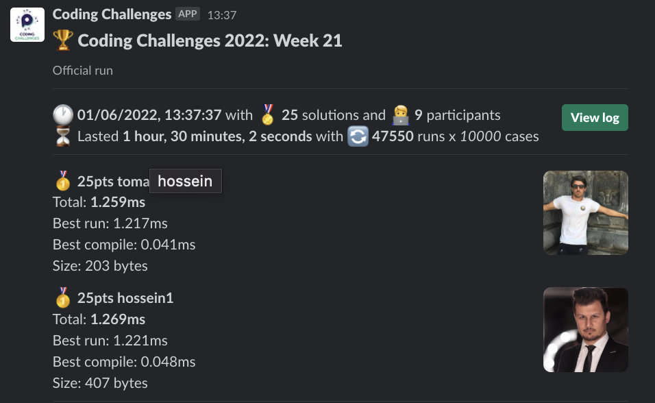
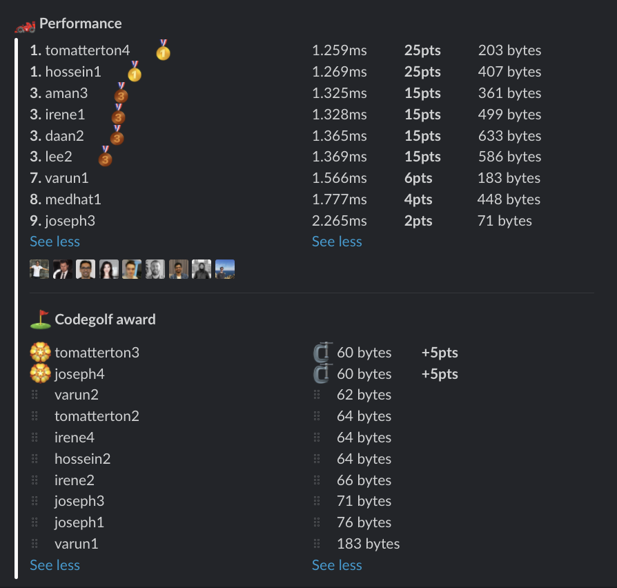

# Week 21 challenge

Write a function `iStandOut` which accepts an array of numbers. All numbers will be either even, or odd. Except one. 


Examples:
```
iStandOut([1,19,23,5,4,9,13]) // returns 4
iStandOut([8,16,2,11,88,24]) // returns 11
```


## Upload link

You can `/submit` your solution in Slack.

## Results

| Place | Name         | Performance | Codegolf | Vote  | Total points |
|-------|--------------|-------------|----------|-------|--------------|
| 1.    | Tom Atterton | 25          | 5        |       | 30           |
| 2.    | Hossein      | 25          |          |       | 25           |
| 3.    | Aman         | 15          |          | 5     | 20           |
| 4.    | Irene        | 15          |          |       | 15           |
|       | Daan         | 15          |          |       | 15           |
|       | Lee          | 15          |          |       | 15           |
| 7.    | Joseph       | 2           | 5        | 5     | 12           |
| 8.    | Varun        | 6           |          |       | 6            |
| 9.    | Medhat       | 4           |          |       | 4            |


### Screenshot





### Vote

```
╔═══════╤═════════╤═════════════════════════════════════════════════╗
║ Name  │ Vote    │ Comment                                         ║
╟───────┼─────────┼─────────────────────────────────────────────────╢
║ varun │ joseph4 │ Wise!                                           ║
╟───────┼─────────┼─────────────────────────────────────────────────╢
║ irene │ aman4   │ because Aman doing 4 submissions is a rarity :P ║
╚═══════╧═════════╧═════════════════════════════════════════════════╝
```


### Full output log
```

EVALUATION STARTED:                 01/06/2022, 12:07:28
EVALUATING CHALLENGE:               2022/w21
FOUND 25 SOLUTIONS:                 aman1.js, aman2.js, aman3.js, aman4.js, daan1.js, daan2.js, hossein1.js, hossein2.js, irene1.js, irene2.js, irene3.js,
                          irene4.js, joseph1.js, joseph2.js, joseph3.js, joseph4.js, lee1.js, lee2.js, medhat1.js, tomatterton1.js,
                          tomatterton2.js, tomatterton3.js, tomatterton4.js, varun1.js, varun2.js
RUNNING EVALUATION FOR:             5400 SECONDS WITH 10000 TEST CASES IN EACH CYCLE...


EVALUATION ENDED:                   01/06/2022, 13:37:31
DURATION:                           1 hour, 30 minutes, 2.904 seconds

RANKINGS:
╔═══════╤════════╤══════════════╤═════════╤══════════╤══════════════╤══════╗
║ Place │ Points │ Name         │ Total   │ Best run │ Best compile │ Size ║
╟───────┼────────┼──────────────┼─────────┼──────────┼──────────────┼──────╢
║ 1     │ 25     │ tomatterton4 │ 1.259ms │ 1.217ms  │ 0.041ms      │ 203  ║
╟───────┼────────┼──────────────┼─────────┼──────────┼──────────────┼──────╢
║       │ 25     │ hossein1     │ 1.269ms │ 1.221ms  │ 0.048ms      │ 407  ║
╟───────┼────────┼──────────────┼─────────┼──────────┼──────────────┼──────╢
║ 3     │ 15     │ aman3        │ 1.325ms │ 1.280ms  │ 0.045ms      │ 361  ║
╟───────┼────────┼──────────────┼─────────┼──────────┼──────────────┼──────╢
║       │ 15     │ irene1       │ 1.328ms │ 1.281ms  │ 0.047ms      │ 499  ║
╟───────┼────────┼──────────────┼─────────┼──────────┼──────────────┼──────╢
║       │ 15     │ daan2        │ 1.365ms │ 1.313ms  │ 0.052ms      │ 633  ║
╟───────┼────────┼──────────────┼─────────┼──────────┼──────────────┼──────╢
║       │ 15     │ lee2         │ 1.369ms │ 1.319ms  │ 0.049ms      │ 586  ║
╟───────┼────────┼──────────────┼─────────┼──────────┼──────────────┼──────╢
║ 7     │ 6      │ varun1       │ 1.566ms │ 1.523ms  │ 0.043ms      │ 183  ║
╟───────┼────────┼──────────────┼─────────┼──────────┼──────────────┼──────╢
║ 8     │ 4      │ medhat1      │ 1.777ms │ 1.727ms  │ 0.050ms      │ 448  ║
╟───────┼────────┼──────────────┼─────────┼──────────┼──────────────┼──────╢
║ 9     │ 2      │ joseph3      │ 2.265ms │ 2.226ms  │ 0.039ms      │ 71   ║
╚═══════╧════════╧══════════════╧═════════╧══════════╧══════════════╧══════╝

Keeping only best run from each contestant
Using 5% margin for determening ties

OMITTED FROM RANKINGS:              aman4.js, irene3.js, tomatterton1.js, daan1.js, aman2.js, lee1.js, aman1.js, tomatterton2.js, tomatterton3.js, irene2.js,
                          joseph1.js, irene4.js, joseph2.js, joseph4.js, hossein2.js, varun2.js

CODEGOLF AWARD:                     joseph4.js, tomatterton3.js with 60 bytes

SYSTEM INFO:
NODE: v16.14.2
ARCH: x64
PLATFORM: linux
VERSION: #56-Ubuntu SMP Mon Oct 5 14:28:49 UTC 2020
MEMORY: 15.64GB
CPUS: 2 x Intel(R) Xeon(R) Gold 6248 CPU @ 2.50GHz
CPU speed: 2494MHz

RAW RESULTS:
┌─────────┬───────────────────┬────────────────────┬────────────────────┬──────────────────────┬──────┬────────────────┬────────────────────┬──────────────┬────────┬────────────┬───────┐
│ (index) │     solution      │       total        │      bestRun       │     bestCompile      │ size │    compiled    │   validationTime   │ onlyCodegolf │ failed │ failReason │ runs  │
├─────────┼───────────────────┼────────────────────┼────────────────────┼──────────────────────┼──────┼────────────────┼────────────────────┼──────────────┼────────┼────────────┼───────┤
│    0    │ 'tomatterton4.js' │ 1.258625000002212  │ 1.2172300000020186 │ 0.04139500000019325  │ 203  │ 'successfully' │ 61.67655300000115  │    false     │ false  │    null    │ 47550 │
│    1    │   'hossein1.js'   │ 1.2685310000233585 │ 1.2209029999939958 │ 0.04762800002936274  │ 407  │ 'successfully' │  56.2746819999993  │    false     │ false  │    null    │ 47550 │
│    2    │    'aman3.js'     │ 1.3251719993932056 │ 1.280332999995153  │ 0.04483899939805269  │ 361  │ 'successfully' │ 58.074900999999954 │    false     │ false  │    null    │ 47550 │
│    3    │    'aman4.js'     │ 1.325401000198326  │ 1.2799070000037318 │ 0.045494000194594264 │ 360  │ 'successfully' │ 58.81615300000158  │    false     │ false  │    null    │ 47550 │
│    4    │    'irene1.js'    │ 1.328365999943344  │ 1.2811619999993127 │ 0.04720399994403124  │ 499  │ 'successfully' │ 58.146152999999686 │    false     │ false  │    null    │ 47550 │
│    5    │    'irene3.js'    │ 1.3376139999963925 │ 1.2922539999999572 │ 0.04535999999643536  │ 327  │ 'successfully' │ 58.581670000001395 │    false     │ false  │    null    │ 47550 │
│    6    │ 'tomatterton1.js' │ 1.3627899999919464 │ 1.3188520000039716 │ 0.04393799998797476  │ 277  │ 'successfully' │ 56.838943999999174 │    false     │ false  │    null    │ 47550 │
│    7    │    'daan2.js'     │ 1.3651570000001811 │ 1.3134420000060345 │ 0.05171499999414664  │ 633  │ 'successfully' │ 56.80777699999999  │    false     │ false  │    null    │ 47550 │
│    8    │     'lee2.js'     │ 1.3687009999994189 │ 1.319415999998455  │ 0.04928500000096392  │ 586  │ 'successfully' │ 57.97767399999975  │    false     │ false  │    null    │ 47550 │
│    9    │    'daan1.js'     │ 1.4361149999240297 │ 1.3836389999996754 │ 0.052475999924354255 │ 652  │ 'successfully' │ 57.32078999999976  │    false     │ false  │    null    │ 47550 │
│   10    │    'aman2.js'     │ 1.437755000006291  │ 1.3917340000043623 │ 0.04602100000192877  │ 389  │ 'successfully' │ 68.01184199999989  │    false     │ false  │    null    │ 47550 │
│   11    │     'lee1.js'     │ 1.4396340000457712 │ 1.3889609999969252 │ 0.050673000048846006 │ 610  │ 'successfully' │ 56.152852999999595 │    false     │ false  │    null    │ 47550 │
│   12    │    'aman1.js'     │ 1.5047539999941364 │ 1.454279999998107  │ 0.050473999996029306 │ 685  │ 'successfully' │  91.582527999999   │    false     │ false  │    null    │ 47550 │
│   13    │    'varun1.js'    │ 1.5663640000057057 │ 1.5231750000020838 │ 0.043189000003621913 │ 183  │ 'successfully' │ 61.15626099999827  │    false     │ false  │    null    │ 47550 │
│   14    │   'medhat1.js'    │ 1.7769999999945867 │ 1.727043999999296  │ 0.04995599999529077  │ 448  │ 'successfully' │ 61.769798000001174 │    false     │ false  │    null    │ 47550 │
│   15    │ 'tomatterton2.js' │ 2.1472109999958775 │ 2.1095799999966403 │ 0.03763099999923725  │  64  │ 'successfully' │ 85.83454900000106  │    false     │ false  │    null    │ 47550 │
│   16    │ 'tomatterton3.js' │ 2.195497000015166  │ 2.1577929999984917 │  0.0377040000166744  │  60  │ 'successfully' │  86.9200460000011  │    false     │ false  │    null    │ 47550 │
│   17    │   'joseph3.js'    │ 2.264607999648433  │ 2.225728999997955  │ 0.03887899965047836  │  71  │ 'successfully' │ 64.11963699999978  │    false     │ false  │    null    │ 47550 │
│   18    │    'irene2.js'    │ 2.265523999973084  │ 2.2267250000004424 │ 0.03879899997264147  │  66  │ 'successfully' │ 63.849529000000985 │    false     │ false  │    null    │ 47550 │
│   19    │   'joseph1.js'    │ 2.270131000004767  │ 2.231381000005058  │ 0.03874999999970896  │  76  │ 'successfully' │ 63.65986800000064  │    false     │ false  │    null    │ 47550 │
│   20    │    'irene4.js'    │ 2.2944420000058017 │ 2.2556150000018533 │ 0.03882700000394834  │  64  │ 'successfully' │ 66.71169700000064  │    false     │ false  │    null    │ 47550 │
│   21    │   'joseph2.js'    │ 2.374333000079787  │ 2.3306740000043646 │ 0.04365900007542223  │ 211  │ 'successfully' │ 62.556720000000496 │    false     │ false  │    null    │ 47550 │
│   22    │   'joseph4.js'    │ 15.104977000046347 │ 15.062880999998015 │ 0.042096000048331916 │  60  │ 'successfully' │ 138.28620099999898 │    false     │ false  │    null    │ 47550 │
│   23    │   'hossein2.js'   │ 16.51217500000348  │ 16.472051000004285 │  0.0401239999991958  │  64  │ 'successfully' │ 85.76781999999912  │    false     │ false  │    null    │ 47550 │
│   24    │    'varun2.js'    │ 18.654283000156283 │  18.6109980000183  │ 0.04328500013798475  │  62  │ 'successfully' │ 143.9305400000012  │    false     │ false  │    null    │ 47550 │
└─────────┴───────────────────┴────────────────────┴────────────────────┴──────────────────────┴──────┴────────────────┴────────────────────┴──────────────┴────────┴────────────┴───────┘
```
  