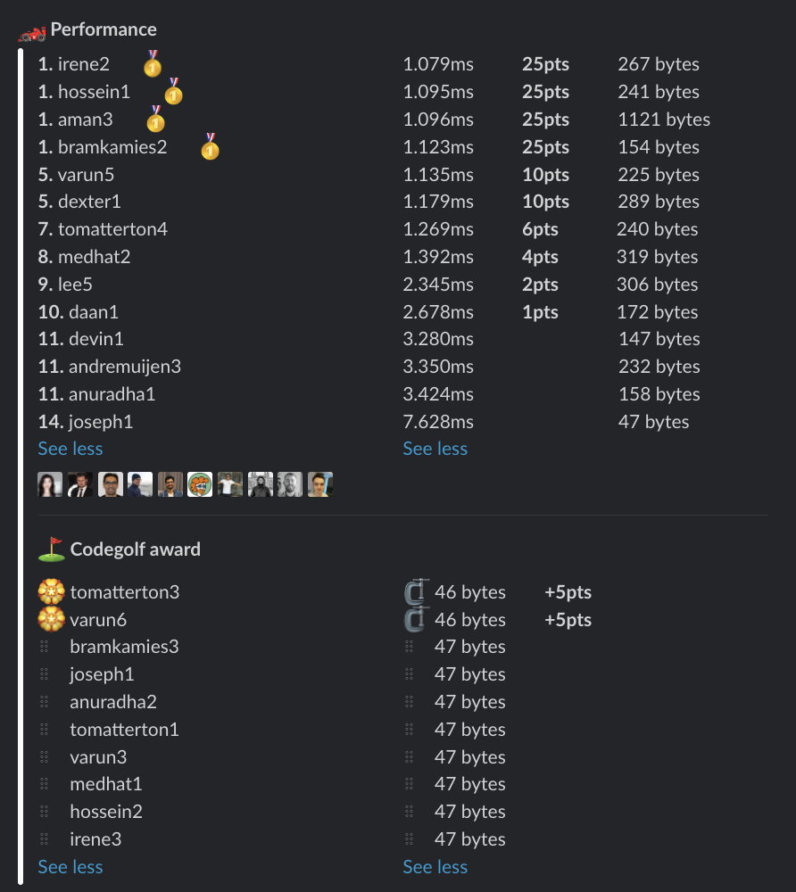

# Week 22 challenge

Write a function `expand` which accepts a number. Your task is to square each digit and concatenate the result.


Examples:
```
expand(2) // returns 4
expand(13) // returns 19
expand(123) // returns 149
expand(567) // returns 253649
```


## Upload link

You can `/submit` your solution in Slack.

## Results

| Place | Name         | Performance | Codegolf | Vote  | Total points |
|-------|--------------|-------------|----------|-------|--------------|
| 1.    | Irene        | 25          |          |       | 25           |
|       | Hossein      | 25          |          |       | 25           |
|       | Aman         | 25          |          |       | 25           |
|       | Bram Kamies  | 25          |          |       | 25           |
| 5.    | Tom Atterton | 6           | 5        | 5     | 16           |
| 6.    | Varun        | 10          | 5        |       | 15           |
| 7.    | Dexter       | 10          |          |       | 10           |
| 8.    | Medhat       | 4           |          |       | 4            |
| 9.    | Lee          | 2           |          |       | 2            |
| 10.   | Daan         | 1           |          |       | 1            |


### Screenshot




### Vote

```
╔═══════════════╤══════════════╤═════════════════════════════════════════════════════════════════════════════════╗
║ Name          │ Vote         │ Comment                                                                         ║
╟───────────────┼──────────────┼─────────────────────────────────────────────────────────────────────────────────╢
║ luuk          │ joseph2      │ Small size but still readable                                                   ║
╟───────────────┼──────────────┼─────────────────────────────────────────────────────────────────────────────────╢
║ daanhouweling │ aman1        │ Smart to use maps, would never think of a solution like this really impressive! ║
╟───────────────┼──────────────┼─────────────────────────────────────────────────────────────────────────────────╢
║ medhat        │ tomatterton5 │ Nice golf                                                                       ║
╟───────────────┼──────────────┼─────────────────────────────────────────────────────────────────────────────────╢
║ aman.tuladhar │ tomatterton3 │ Awesome codegolf! sadly can't vote for both Tom and Varun                       ║
╚═══════════════╧══════════════╧═════════════════════════════════════════════════════════════════════════════════╝
```


### Full output log
```

EVALUATION STARTED:                 08/06/2022, 12:07:07
EVALUATING CHALLENGE:               2022/w22
FOUND 41 SOLUTIONS:                 aman1.js, aman2.js, aman3.js, andremuijen1.js, andremuijen2.js, andremuijen3.js, anuradha1.js, anuradha2.js,
                          anuradha3.js, bramkamies1.js, bramkamies2.js, bramkamies3.js, daan1.js, devin1.js, dexter1.js, hossein1.js, hossein2.js,
                          irene1.js, irene2.js, irene3.js, joseph1.js, joseph2.js, lee1.js, lee2.js, lee3.js, lee4.js, lee5.js, lee6.js,
                          medhat1.js, medhat2.js, tomatterton1.js, tomatterton2.js, tomatterton3.js, tomatterton4.js, tomatterton5.js, varun1.js,
                          varun2.js, varun3.js, varun4.js, varun5.js, varun6.js
RUNNING EVALUATION FOR:             5400 SECONDS WITH 10000 TEST CASES IN EACH CYCLE...


EVALUATION ENDED:                   08/06/2022, 13:37:09
DURATION:                           1 hour, 30 minutes, 2.558 seconds

RANKINGS:
╔═══════╤════════╤══════════════╤═════════╤══════════╤══════════════╤══════╗
║ Place │ Points │ Name         │ Total   │ Best run │ Best compile │ Size ║
╟───────┼────────┼──────────────┼─────────┼──────────┼──────────────┼──────╢
║ 1     │ 25     │ irene2       │ 1.079ms │ 1.030ms  │ 0.048ms      │ 267  ║
╟───────┼────────┼──────────────┼─────────┼──────────┼──────────────┼──────╢
║       │ 25     │ hossein1     │ 1.095ms │ 1.047ms  │ 0.048ms      │ 241  ║
╟───────┼────────┼──────────────┼─────────┼──────────┼──────────────┼──────╢
║       │ 25     │ aman3        │ 1.096ms │ 1.025ms  │ 0.071ms      │ 1121 ║
╟───────┼────────┼──────────────┼─────────┼──────────┼──────────────┼──────╢
║       │ 25     │ bramkamies2  │ 1.123ms │ 1.073ms  │ 0.050ms      │ 154  ║
╟───────┼────────┼──────────────┼─────────┼──────────┼──────────────┼──────╢
║ 5     │ 10     │ varun5       │ 1.135ms │ 1.088ms  │ 0.046ms      │ 225  ║
╟───────┼────────┼──────────────┼─────────┼──────────┼──────────────┼──────╢
║       │ 10     │ dexter1      │ 1.179ms │ 1.130ms  │ 0.049ms      │ 289  ║
╟───────┼────────┼──────────────┼─────────┼──────────┼──────────────┼──────╢
║ 7     │ 6      │ tomatterton4 │ 1.269ms │ 1.221ms  │ 0.048ms      │ 240  ║
╟───────┼────────┼──────────────┼─────────┼──────────┼──────────────┼──────╢
║ 8     │ 4      │ medhat2      │ 1.392ms │ 1.339ms  │ 0.053ms      │ 319  ║
╟───────┼────────┼──────────────┼─────────┼──────────┼──────────────┼──────╢
║ 9     │ 2      │ lee5         │ 2.345ms │ 2.288ms  │ 0.057ms      │ 306  ║
╟───────┼────────┼──────────────┼─────────┼──────────┼──────────────┼──────╢
║ 10    │ 1      │ daan1        │ 2.678ms │ 2.631ms  │ 0.047ms      │ 172  ║
╟───────┼────────┼──────────────┼─────────┼──────────┼──────────────┼──────╢
║ 11    │        │ devin1       │ 3.280ms │ 3.234ms  │ 0.045ms      │ 147  ║
╟───────┼────────┼──────────────┼─────────┼──────────┼──────────────┼──────╢
║       │        │ andremuijen3 │ 3.350ms │ 3.302ms  │ 0.048ms      │ 232  ║
╟───────┼────────┼──────────────┼─────────┼──────────┼──────────────┼──────╢
║       │        │ anuradha1    │ 3.424ms │ 3.378ms  │ 0.046ms      │ 158  ║
╟───────┼────────┼──────────────┼─────────┼──────────┼──────────────┼──────╢
║ 14    │        │ joseph1      │ 7.628ms │ 7.590ms  │ 0.038ms      │ 47   ║
╚═══════╧════════╧══════════════╧═════════╧══════════╧══════════════╧══════╝

Keeping only best run from each contestant
Using 5% margin for determening ties

OMITTED FROM RANKINGS:              varun1.js, bramkamies1.js, varun2.js, varun4.js, irene1.js, aman1.js, aman2.js, tomatterton2.js, tomatterton5.js,
                          lee4.js, lee6.js, lee3.js, lee2.js, andremuijen1.js, lee1.js, anuradha3.js, andremuijen2.js, bramkamies3.js,
                          anuradha2.js, tomatterton1.js, varun3.js, medhat1.js, hossein2.js, irene3.js, tomatterton3.js, joseph2.js, varun6.js

CODEGOLF AWARD:                     tomatterton3.js, varun6.js with 46 bytes

SYSTEM INFO:
NODE: v16.14.2
ARCH: x64
PLATFORM: linux
VERSION: #56-Ubuntu SMP Mon Oct 5 14:28:49 UTC 2020
MEMORY: 15.64GB
CPUS: 2 x Intel(R) Xeon(R) Gold 6248 CPU @ 2.50GHz
CPU speed: 2494MHz

RAW RESULTS:
┌─────────┬───────────────────┬────────────────────┬────────────────────┬──────────────────────┬──────┬────────────────┬────────────────────┬──────────────┬────────┬────────────┬───────┐
│ (index) │     solution      │       total        │      bestRun       │     bestCompile      │ size │    compiled    │   validationTime   │ onlyCodegolf │ failed │ failReason │ runs  │
├─────────┼───────────────────┼────────────────────┼────────────────────┼──────────────────────┼──────┼────────────────┼────────────────────┼──────────────┼────────┼────────────┼───────┤
│    0    │    'irene2.js'    │ 1.0786999999982072 │ 1.0302749999973457 │ 0.04842500000086147  │ 267  │ 'successfully' │ 6.886762000001909  │    false     │ false  │    null    │ 25350 │
│    1    │   'hossein1.js'   │ 1.0950620000003255 │ 1.0468519999994896 │ 0.04821000000083586  │ 241  │ 'successfully' │ 7.473384000000806  │    false     │ false  │    null    │ 25350 │
│    2    │    'aman3.js'     │ 1.0960439999980736 │ 1.0252010000040173 │  0.0708429999940563  │ 1121 │ 'successfully' │ 17.29711099999986  │    false     │ false  │    null    │ 25350 │
│    3    │ 'bramkamies2.js'  │ 1.1230500000019674 │ 1.0729070000015781 │ 0.05014300000038929  │ 154  │ 'successfully' │ 11.076294000002235 │    false     │ false  │    null    │ 25350 │
│    4    │    'varun5.js'    │ 1.1345739999960642 │ 1.0882669999991776 │ 0.04630699999688659  │ 225  │ 'successfully' │ 7.283070000001317  │    false     │ false  │    null    │ 25350 │
│    5    │    'varun1.js'    │ 1.1381159999982629 │ 1.0939400000024762 │  0.0441759999957867  │ 262  │ 'successfully' │ 7.727419999999256  │    false     │ false  │    null    │ 25350 │
│    6    │ 'bramkamies1.js'  │ 1.147400000001653  │ 1.098562999999558  │ 0.04883700000209501  │ 139  │ 'successfully' │ 11.085895000000164 │    false     │ false  │    null    │ 25350 │
│    7    │    'varun2.js'    │ 1.162135999995371  │ 1.1152130000009493 │ 0.04692299999442184  │ 259  │ 'successfully' │ 7.302969000000303  │    false     │ false  │    null    │ 25350 │
│    8    │    'varun4.js'    │ 1.1738870000044699 │ 1.1300330000012764 │ 0.043854000003193505 │  96  │ 'successfully' │ 6.990667000001849  │    false     │ false  │    null    │ 25350 │
│    9    │   'dexter1.js'    │ 1.1793169999946258 │ 1.130156999999599  │ 0.04915999999502674  │ 289  │ 'successfully' │ 8.312680000002729  │    false     │ false  │    null    │ 25350 │
│   10    │    'irene1.js'    │ 1.188163999999233  │ 1.141366999996535  │ 0.04679700000269804  │ 273  │ 'successfully' │ 8.420771000000968  │    false     │ false  │    null    │ 25350 │
│   11    │    'aman1.js'     │ 1.1898119995457819 │ 1.1117159999994328 │ 0.07809599954634905  │ 1324 │ 'successfully' │ 30.000661000001855 │    false     │ false  │    null    │ 25350 │
│   12    │    'aman2.js'     │ 1.2084299999987707 │ 1.1323390000034124 │ 0.07609099999535829  │ 1157 │ 'successfully' │ 24.61905399999887  │    false     │ false  │    null    │ 25350 │
│   13    │ 'tomatterton4.js' │ 1.2691570000024512 │ 1.2213820000033593 │ 0.04777499999909196  │ 240  │ 'successfully' │ 7.615057000002707  │    false     │ false  │    null    │ 25350 │
│   14    │ 'tomatterton2.js' │ 1.3361100000038277 │ 1.2887830000036047 │ 0.04732700000022305  │ 227  │ 'successfully' │ 20.997221000001446 │    false     │ false  │    null    │ 25350 │
│   15    │ 'tomatterton5.js' │ 1.3388249999989057 │ 1.285957000000053  │ 0.05286799999885261  │ 320  │ 'successfully' │ 7.907531000000745  │    false     │ false  │    null    │ 25350 │
│   16    │   'medhat2.js'    │ 1.3916750000025786 │ 1.3390850000032515 │ 0.05258999999932712  │ 319  │ 'successfully' │ 8.682363999996596  │    false     │ false  │    null    │ 25350 │
│   17    │     'lee5.js'     │ 2.3449229999969248 │ 2.2882539999991423 │ 0.05666899999778252  │ 306  │ 'successfully' │ 8.905972000000475  │    false     │ false  │    null    │ 25350 │
│   18    │     'lee4.js'     │ 2.369474999992235  │ 2.3104029999958584 │ 0.05907199999637669  │ 328  │ 'successfully' │ 9.176010999999562  │    false     │ false  │    null    │ 25350 │
│   19    │    'daan1.js'     │ 2.677834999998595  │ 2.631094000000303  │ 0.046740999998291954 │ 172  │ 'successfully' │ 13.401808999999048 │    false     │ false  │    null    │ 25350 │
│   20    │     'lee6.js'     │ 2.938351999997394  │ 2.878807000000961  │ 0.059544999996433035 │ 325  │ 'successfully' │ 11.360767999998643 │    false     │ false  │    null    │ 25350 │
│   21    │     'lee3.js'     │ 3.091789999998582  │ 3.032640999997966  │ 0.05914900000061607  │ 318  │ 'successfully' │ 14.800028000001475 │    false     │ false  │    null    │ 25350 │
│   22    │    'devin1.js'    │ 3.2796110000053886 │ 3.234247000000323  │ 0.045364000005065463 │ 147  │ 'successfully' │ 11.149948999998742 │    false     │ false  │    null    │ 25350 │
│   23    │     'lee2.js'     │ 3.2817160000013246 │ 3.234323000000586  │ 0.04739300000073854  │ 189  │ 'successfully' │ 14.470620000000054 │    false     │ false  │    null    │ 25350 │
│   24    │ 'andremuijen3.js' │ 3.3500379999968573 │ 3.3022300000011455 │ 0.047807999995711725 │ 232  │ 'successfully' │ 18.493727000000945 │    false     │ false  │    null    │ 25350 │
│   25    │ 'andremuijen1.js' │ 3.3748320000013337 │ 3.3310599999967963 │ 0.043772000004537404 │  91  │ 'successfully' │ 13.959243000001152 │    false     │ false  │    null    │ 25350 │
│   26    │     'lee1.js'     │ 3.413368999994418  │ 3.3671639999956824 │ 0.04620499999873573  │ 182  │ 'successfully' │ 9.418283999999403  │    false     │ false  │    null    │ 25350 │
│   27    │  'anuradha1.js'   │ 3.424128999999084  │ 3.378059000002395  │ 0.04606999999668915  │ 158  │ 'successfully' │ 10.119927999996435 │    false     │ false  │    null    │ 25350 │
│   28    │  'anuradha3.js'   │ 3.7398919999977807 │ 3.695248999996693  │ 0.044643000001087785 │ 154  │ 'successfully' │ 15.908245999999053 │    false     │ false  │    null    │ 25350 │
│   29    │ 'andremuijen2.js' │ 5.838895000000775  │ 5.798530000000028  │ 0.040365000000747386 │  67  │ 'successfully' │ 22.756517000001622 │    false     │ false  │    null    │ 25350 │
│   30    │ 'bramkamies3.js'  │ 7.608833999998751  │ 7.569229000000632  │ 0.03960499999811873  │  47  │ 'successfully' │ 27.60780099999829  │    false     │ false  │    null    │ 25350 │
│   31    │   'joseph1.js'    │ 7.628424999995332  │ 7.5900929999988875 │ 0.03833199999644421  │  47  │ 'successfully' │ 20.223330999997415 │    false     │ false  │    null    │ 25350 │
│   32    │  'anuradha2.js'   │ 7.633469000000332  │ 7.5933530000038445 │ 0.04011599999648752  │  47  │ 'successfully' │ 20.27289000000019  │    false     │ false  │    null    │ 25350 │
│   33    │ 'tomatterton1.js' │ 7.701895999998669  │ 7.661647000000812  │ 0.04024899999785703  │  47  │ 'successfully' │ 19.671473999998852 │    false     │ false  │    null    │ 25350 │
│   34    │    'varun3.js'    │ 7.721794000004593  │ 7.681182000000263  │ 0.040612000004330184 │  47  │ 'successfully' │ 16.919505000001664 │    false     │ false  │    null    │ 25350 │
│   35    │   'medhat1.js'    │ 7.727279999999155  │ 7.687153999999282  │ 0.040125999999872874 │  47  │ 'successfully' │ 19.445580999999947 │    false     │ false  │    null    │ 25350 │
│   36    │   'hossein2.js'   │ 7.7726219999894965 │ 7.732118999992963  │ 0.04050299999653362  │  47  │ 'successfully' │ 17.45120500000121  │    false     │ false  │    null    │ 25350 │
│   37    │    'irene3.js'    │ 7.951882999997906  │ 7.912187999998423  │ 0.039694999999483116 │  47  │ 'successfully' │ 19.47167999999874  │    false     │ false  │    null    │ 25350 │
│   38    │ 'tomatterton3.js' │ 9.470013000005565  │ 9.430307000002358  │ 0.03970600000320701  │  46  │ 'successfully' │ 18.059917999999016 │    false     │ false  │    null    │ 25350 │
│   39    │   'joseph2.js'    │ 9.628919999999198  │ 9.590750999999727  │ 0.03816899999947054  │  47  │ 'successfully' │ 18.774962999999843 │    false     │ false  │    null    │ 25350 │
│   40    │    'varun6.js'    │ 9.917979000005289  │ 9.878355000000738  │ 0.03962400000455091  │  46  │ 'successfully' │ 18.456951000000117 │    false     │ false  │    null    │ 25350 │
└─────────┴───────────────────┴────────────────────┴────────────────────┴──────────────────────┴──────┴────────────────┴────────────────────┴──────────────┴────────┴────────────┴───────┘
```
  