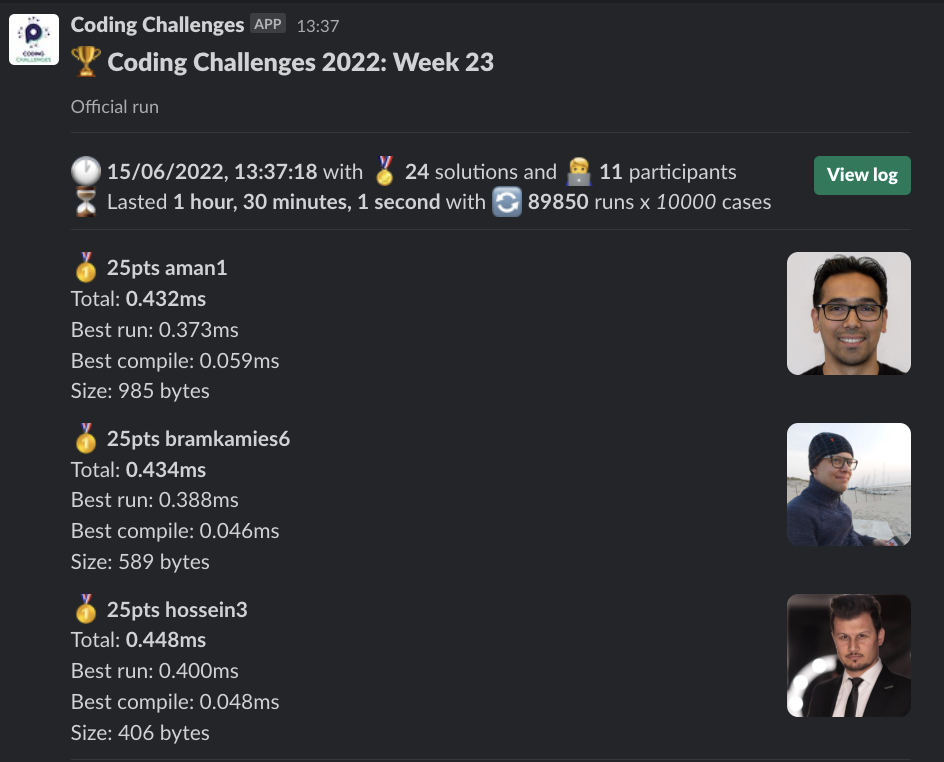

# Week 23 challenge

Write a function `swappedDiff` which accepts two numbers, swaps their first digits and returns the absolute difference between resulting numbers.


Examples:
```
swappedDiff(123,456) // returns 267, because 423 - 156 = 267
swappedDiff(1,7) // returns 6
swappedDiff(13,91) // returns 82
swappedDiff(35,14) // returns 19
```


## Upload link

You can `/submit` your solution in Slack.

## Results

| Place | Name           | Performance | Codegolf | Vote  | Total points |
|-------|----------------|-------------|----------|-------|--------------|
| 1.    | Bram Kamies    | 25          | 5        | 5     | 35           |
|       | Hossein        | 25          | 5        | 5     | 35           |
| 3.    | Aman           | 25          |          | 5     | 30           |
| 4.    | Medhat         | 12          |          |       | 12           |
| 5.    | Irene          | 10          |          |       | 10           |
| 6.    | Daan           | 8           |          |       | 8            |
| 7.    | Devin          | 2           |          | 5     | 7            |
| 8.    | Daan Houweling | 6           |          |       | 6            |
| 9.    | Lee            | 4           |          |       | 4            |
| 10.   | Luuk           | 2           |          |       | 2            |


### Screenshot




### Vote

```
╔═══════════════╤═════════════╤══════════════════════════════════════╗
║ Name          │ Vote        │ Comment                              ║
╟───────────────┼─────────────┼──────────────────────────────────────╢
║ luuk          │ bramkamies5 │ Looks readable and performs          ║
╟───────────────┼─────────────┼──────────────────────────────────────╢
║ daan          │ hossein3    │ fast and neat                        ║
╟───────────────┼─────────────┼──────────────────────────────────────╢
║ aman.tuladhar │ devin2      │ Humm.... code looks very interesting ║
╟───────────────┼─────────────┼──────────────────────────────────────╢
║ varun         │ aman1       │ A genius solution 👏                 ║
╚═══════════════╧═════════════╧══════════════════════════════════════╝
```


### Full output log
```

EVALUATION STARTED:                 15/06/2022, 12:07:10
EVALUATING CHALLENGE:               2022/w23
FOUND 24 SOLUTIONS:                 aman1.js, bramkamies1.js, bramkamies2.js, bramkamies3.js, bramkamies4.js, bramkamies5.js, bramkamies6.js, daan1.js,
                          daanhouweling1.js, daanhouweling2.js, devin1.js, devin2.js, hossein1.js, hossein2.js, hossein3.js, irene1.js, irene2.js,
                          lee1.js, lee2.js, luuk1.js, luuk2.js, medhat1.js, medhat2.js, tomatterton1.js
RUNNING EVALUATION FOR:             5400 SECONDS WITH 10000 TEST CASES IN EACH CYCLE...


EVALUATION ENDED:                   15/06/2022, 13:37:13
DURATION:                           1 hour, 30 minutes, 1.746 seconds

RANKINGS:
╔═══════╤════════╤════════════════╤═════════╤══════════╤══════════════╤══════╗
║ Place │ Points │ Name           │ Total   │ Best run │ Best compile │ Size ║
╟───────┼────────┼────────────────┼─────────┼──────────┼──────────────┼──────╢
║ 1     │ 25     │ aman1          │ 0.432ms │ 0.373ms  │ 0.059ms      │ 985  ║
╟───────┼────────┼────────────────┼─────────┼──────────┼──────────────┼──────╢
║       │ 25     │ bramkamies6    │ 0.434ms │ 0.388ms  │ 0.046ms      │ 589  ║
╟───────┼────────┼────────────────┼─────────┼──────────┼──────────────┼──────╢
║       │ 25     │ hossein3       │ 0.448ms │ 0.400ms  │ 0.048ms      │ 406  ║
╟───────┼────────┼────────────────┼─────────┼──────────┼──────────────┼──────╢
║ 4     │ 12     │ medhat2        │ 0.476ms │ 0.427ms  │ 0.049ms      │ 660  ║
╟───────┼────────┼────────────────┼─────────┼──────────┼──────────────┼──────╢
║ 5     │ 10     │ irene2         │ 0.527ms │ 0.477ms  │ 0.050ms      │ 476  ║
╟───────┼────────┼────────────────┼─────────┼──────────┼──────────────┼──────╢
║ 6     │ 8      │ daan1          │ 0.945ms │ 0.891ms  │ 0.054ms      │ 614  ║
╟───────┼────────┼────────────────┼─────────┼──────────┼──────────────┼──────╢
║ 7     │ 6      │ daanhouweling2 │ 1.020ms │ 0.966ms  │ 0.053ms      │ 578  ║
╟───────┼────────┼────────────────┼─────────┼──────────┼──────────────┼──────╢
║ 8     │ 4      │ lee2           │ 2.245ms │ 2.187ms  │ 0.058ms      │ 971  ║
╟───────┼────────┼────────────────┼─────────┼──────────┼──────────────┼──────╢
║ 9     │ 2      │ luuk1          │ 2.550ms │ 2.507ms  │ 0.043ms      │ 184  ║
╟───────┼────────┼────────────────┼─────────┼──────────┼──────────────┼──────╢
║       │ 2      │ devin2         │ 2.568ms │ 2.520ms  │ 0.048ms      │ 369  ║
╟───────┼────────┼────────────────┼─────────┼──────────┼──────────────┼──────╢
║ 11    │        │ tomatterton1   │ 2.881ms │ 2.832ms  │ 0.049ms      │ 271  ║
╚═══════╧════════╧════════════════╧═════════╧══════════╧══════════════╧══════╝

Keeping only best run from each contestant
Using 5% margin for determening ties

OMITTED FROM RANKINGS:              bramkamies5.js, bramkamies4.js, hossein1.js, irene1.js, bramkamies1.js, bramkamies3.js, lee1.js, bramkamies2.js,
                          devin1.js, luuk2.js, medhat1.js, daanhouweling1.js

ONLY CODEGOLF SOLUTIONS:            hossein2.js

CODEGOLF AWARD:                     bramkamies3.js, hossein2.js with 77 bytes

SYSTEM INFO:
NODE: v16.14.2
ARCH: x64
PLATFORM: linux
VERSION: #56-Ubuntu SMP Mon Oct 5 14:28:49 UTC 2020
MEMORY: 15.64GB
CPUS: 2 x Intel(R) Xeon(R) Gold 6248 CPU @ 2.50GHz
CPU speed: 2494MHz

RAW RESULTS:
┌─────────┬─────────────────────┬─────────────────────┬─────────────────────┬──────────────────────┬──────┬────────────────┬────────────────────┬──────────────┬────────┬────────────┬───────┐
│ (index) │      solution       │        total        │       bestRun       │     bestCompile      │ size │    compiled    │   validationTime   │ onlyCodegolf │ failed │ failReason │ runs  │
├─────────┼─────────────────────┼─────────────────────┼─────────────────────┼──────────────────────┼──────┼────────────────┼────────────────────┼──────────────┼────────┼────────────┼───────┤
│    0    │     'aman1.js'      │ 0.4315810000989586  │ 0.3725820002146065  │ 0.05899899988435209  │ 985  │ 'successfully' │ 22.627513999999792 │    false     │ false  │    null    │ 89850 │
│    1    │  'bramkamies6.js'   │ 0.4336700001731515  │  0.388069000095129  │ 0.04560100007802248  │ 589  │ 'successfully' │ 12.410744000000705 │    false     │ false  │    null    │ 89850 │
│    2    │    'hossein3.js'    │ 0.44765599980019033 │ 0.3997579999268055  │ 0.04789799987338483  │ 406  │ 'successfully' │ 10.708635999999387 │    false     │ false  │    null    │ 89850 │
│    3    │    'medhat2.js'     │ 0.47601499990560114 │  0.426551999989897  │ 0.04946299991570413  │ 660  │ 'successfully' │ 12.979304999997112 │    false     │ false  │    null    │ 89850 │
│    4    │  'bramkamies5.js'   │ 0.5085530003998429  │ 0.4637160003185272  │ 0.04483700008131564  │ 287  │ 'successfully' │ 13.135209000000032 │    false     │ false  │    null    │ 89850 │
│    5    │     'irene2.js'     │ 0.5269279996864498  │ 0.4767419998534024  │ 0.05018599983304739  │ 476  │ 'successfully' │ 13.826554999999644 │    false     │ false  │    null    │ 89850 │
│    6    │  'bramkamies4.js'   │ 0.5358850003685802  │ 0.48916600039228797 │ 0.04671899997629225  │ 419  │ 'successfully' │  9.21371999999974  │    false     │ false  │    null    │ 89850 │
│    7    │    'hossein1.js'    │ 0.6084790001623333  │ 0.5578640000894666  │ 0.05061500007286668  │ 588  │ 'successfully' │ 10.693992000000435 │    false     │ false  │    null    │ 89850 │
│    8    │     'irene1.js'     │  0.640434000059031  │  0.59046199999284   │ 0.04997200006619096  │ 481  │ 'successfully' │ 13.275637999999162 │    false     │ false  │    null    │ 89850 │
│    9    │     'daan1.js'      │  0.944984000059776  │ 0.8908010000595823  │ 0.054183000000193715 │ 614  │ 'successfully' │ 26.868121000001338 │    false     │ false  │    null    │ 89850 │
│   10    │ 'daanhouweling2.js' │  1.019729999359697  │ 0.9663809994235635  │ 0.05334899993613362  │ 578  │ 'successfully' │ 12.264761000000362 │    false     │ false  │    null    │ 89850 │
│   11    │      'lee2.js'      │  2.244815999874845  │ 2.1870269998908043  │ 0.057788999984040856 │ 971  │ 'successfully' │ 12.757745999999315 │    false     │ false  │    null    │ 89850 │
│   12    │  'bramkamies1.js'   │ 2.5373970001237467  │  2.49117799999658   │ 0.04621900012716651  │ 310  │ 'successfully' │ 29.15124300000025  │    false     │ false  │    null    │ 89850 │
│   13    │     'luuk1.js'      │  2.550245999591425  │ 2.5069279996678233  │ 0.04331799992360175  │ 184  │ 'successfully' │ 13.619565000000875 │    false     │ false  │    null    │ 89850 │
│   14    │  'bramkamies3.js'   │  2.56690599990543   │  2.527346999850124  │ 0.03955900005530566  │  77  │ 'successfully' │ 24.250632000001133 │    false     │ false  │    null    │ 89850 │
│   15    │     'devin2.js'     │  2.56787699990673   │  2.520113999955356  │ 0.047762999951373786 │ 369  │ 'successfully' │ 17.558100000000195 │    false     │ false  │    null    │ 89850 │
│   16    │      'lee1.js'      │  2.585418000118807  │ 2.5281899999827147  │ 0.057228000136092305 │ 716  │ 'successfully' │ 13.850031999998464 │    false     │ false  │    null    │ 89850 │
│   17    │  'bramkamies2.js'   │ 2.5920669998740777  │ 2.5523029998876154  │ 0.039763999986462295 │  82  │ 'successfully' │  23.0327870000001  │    false     │ false  │    null    │ 89850 │
│   18    │     'devin1.js'     │  2.596517999889329  │ 2.5485049998387694  │ 0.04801300005055964  │ 367  │ 'successfully' │ 21.449900999999954 │    false     │ false  │    null    │ 89850 │
│   19    │     'luuk2.js'      │ 2.6098970000166446  │ 2.5693580000661314  │ 0.040538999950513244 │ 107  │ 'successfully' │ 14.162484000000404 │    false     │ false  │    null    │ 89850 │
│   20    │    'medhat1.js'     │ 2.6442550000501797  │ 2.6027000000467524  │ 0.04155500000342727  │  79  │ 'successfully' │ 16.964403999998467 │    false     │ false  │    null    │ 89850 │
│   21    │ 'daanhouweling1.js' │ 2.7165780000796076  │  2.671620000008261  │ 0.04495800007134676  │ 204  │ 'successfully' │ 18.624214999999822 │    false     │ false  │    null    │ 89850 │
│   22    │  'tomatterton1.js'  │  2.881020000029821  │ 2.8318440000293776  │ 0.04917600000044331  │ 271  │ 'successfully' │ 13.69226400000116  │    false     │ false  │    null    │ 89850 │
│   23    │    'hossein2.js'    │        null         │        null         │         null         │  77  │ 'successfully' │ 30.781400999998368 │     true     │ false  │    null    │   0   │
└─────────┴─────────────────────┴─────────────────────┴─────────────────────┴──────────────────────┴──────┴────────────────┴────────────────────┴──────────────┴────────┴────────────┴───────┘
```
  