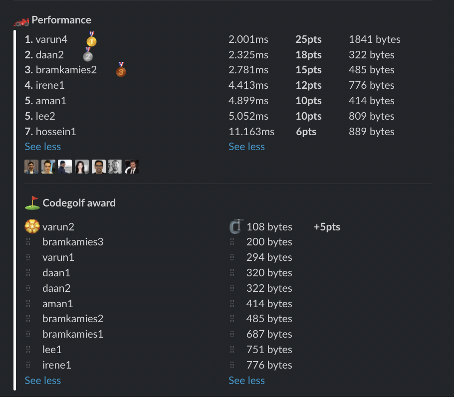

# Week 24 challenge

Write a function `validSudoku` which accepts a two dimensional (9x9) array of numbers representing a Sudoku board. The task is to return whether this is a valid Sudoku board according to [rules](https://www.sudokuonline.io/tips/sudoku-rules).


Examples:
```
validSudoku([
  [4,1,7,2,3,8,5,6,9],
  [6,5,3,1,4,9,7,2,8],
  [8,2,9,6,5,7,1,3,4],
  [3,8,2,5,9,4,6,1,7],
  [9,7,4,3,6,1,2,8,5],
  [1,6,5,8,7,2,9,4,3],
  [2,9,6,4,8,5,3,7,1],
  [7,3,8,9,1,6,4,5,2],
  [5,4,1,7,2,3,8,9,6]
]) // returns true

validSudoku([
  [6,7,8,4,5,3,2,1,9],
  [3,4,9,2,6,1,8,5,7],
  [1,5,2,7,9,8,4,2,6],
  [8,6,1,3,4,2,7,9,5],
  [3,9,5,8,7,6,3,2,1],
  [7,2,3,5,1,9,6,8,4],
  [2,1,7,6,7,5,9,4,8],
  [5,8,4,9,2,7,1,6,3],
  [9,3,6,1,8,4,5,7,2]
]) // returns false

```


## Upload link

You can `/submit` your solution in Slack.

## Results

| Place | Name        | Performance | Codegolf | Vote  | Total points |
|-------|-------------|-------------|----------|-------|--------------|
| 1.    | Varun       | 25          | 5        | 5     | 35           |
| 2.    | Daan        | 18          |          |       | 18           |
| 3.    | Bram Kamies | 15          |          |       | 15           |
| 4.    | Irene       | 12          |          |       | 12           |
| 5.    | Aman        | 10          |          |       | 10           |
|       | Lee         | 10          |          |       | 10           |
| 7.    | Hossein     | 6           |          |       | 6            |


### Screenshot




### Vote

```
╔═══════════════╤═════════════╤════════════════════════════════════╗
║ Name          │ Vote        │ Comment                            ║
╟───────────────┼─────────────┼────────────────────────────────────╢
║ daan          │ varun4      │ Made me laugh :D                   ║
╟───────────────┼─────────────┼────────────────────────────────────╢
║ bramkamies    │ irene1      │ Nice looking through the 3x3 boxes ║
╟───────────────┼─────────────┼────────────────────────────────────╢
║ daanhouweling │ varun4      │ haha smart                         ║
╟───────────────┼─────────────┼────────────────────────────────────╢
║ varun         │ bramkamies2 │ Very creative!                     ║
╟───────────────┼─────────────┼────────────────────────────────────╢
║ aman.tuladhar │ varun4      │ what the hack 「(°ヘ°)             ║
╚═══════════════╧═════════════╧════════════════════════════════════╝
```


### Full output log
```

EVALUATION STARTED:                 22/06/2022, 12:07:04
EVALUATING CHALLENGE:               2022/w24
FOUND 14 SOLUTIONS:                 aman1.js, bramkamies1.js, bramkamies2.js, bramkamies3.js, daan1.js, daan2.js, hossein1.js, irene1.js, lee1.js, lee2.js,
                          varun1.js, varun2.js, varun3.js, varun4.js
RUNNING EVALUATION FOR:             5400 SECONDS WITH 10000 TEST CASES IN EACH CYCLE...


EVALUATION ENDED:                   22/06/2022, 13:37:05
DURATION:                           1 hour, 30 minutes, 0.824 seconds

RANKINGS:
╔═══════╤════════╤═════════════╤══════════╤══════════╤══════════════╤══════╗
║ Place │ Points │ Name        │ Total    │ Best run │ Best compile │ Size ║
╟───────┼────────┼─────────────┼──────────┼──────────┼──────────────┼──────╢
║ 1     │ 25     │ varun4      │ 2.001ms  │ 1.928ms  │ 0.073ms      │ 1841 ║
╟───────┼────────┼─────────────┼──────────┼──────────┼──────────────┼──────╢
║ 2     │ 18     │ daan2       │ 2.325ms  │ 2.274ms  │ 0.051ms      │ 322  ║
╟───────┼────────┼─────────────┼──────────┼──────────┼──────────────┼──────╢
║ 3     │ 15     │ bramkamies2 │ 2.781ms  │ 2.389ms  │ 0.393ms      │ 485  ║
╟───────┼────────┼─────────────┼──────────┼──────────┼──────────────┼──────╢
║ 4     │ 12     │ irene1      │ 4.413ms  │ 4.351ms  │ 0.062ms      │ 776  ║
╟───────┼────────┼─────────────┼──────────┼──────────┼──────────────┼──────╢
║ 5     │ 10     │ aman1       │ 4.899ms  │ 4.845ms  │ 0.054ms      │ 414  ║
╟───────┼────────┼─────────────┼──────────┼──────────┼──────────────┼──────╢
║       │ 10     │ lee2        │ 5.052ms  │ 4.989ms  │ 0.063ms      │ 809  ║
╟───────┼────────┼─────────────┼──────────┼──────────┼──────────────┼──────╢
║ 7     │ 6      │ hossein1    │ 11.163ms │ 11.088ms │ 0.075ms      │ 889  ║
╚═══════╧════════╧═════════════╧══════════╧══════════╧══════════════╧══════╝

Keeping only best run from each contestant
Using 5% margin for determening ties

OMITTED FROM RANKINGS:              varun3.js, daan1.js, varun1.js, varun2.js, bramkamies1.js, lee1.js

ONLY CODEGOLF SOLUTIONS:            bramkamies3.js

CODEGOLF AWARD:                     varun2.js with 108 bytes

SYSTEM INFO:
NODE: v16.14.2
ARCH: x64
PLATFORM: linux
VERSION: #56-Ubuntu SMP Mon Oct 5 14:28:49 UTC 2020
MEMORY: 15.64GB
CPUS: 2 x Intel(R) Xeon(R) Gold 6248 CPU @ 2.50GHz
CPU speed: 2494MHz

RAW RESULTS:
┌─────────┬──────────────────┬────────────────────┬────────────────────┬──────────────────────┬──────┬────────────────┬────────────────────┬──────────────┬────────┬────────────┬───────┐
│ (index) │     solution     │       total        │      bestRun       │     bestCompile      │ size │    compiled    │   validationTime   │ onlyCodegolf │ failed │ failReason │ runs  │
├─────────┼──────────────────┼────────────────────┼────────────────────┼──────────────────────┼──────┼────────────────┼────────────────────┼──────────────┼────────┼────────────┼───────┤
│    0    │   'varun4.js'    │ 2.001127000199631  │ 1.927665000082925  │  0.0734620001167059  │ 1841 │ 'successfully' │ 396.37881299999935 │    false     │ false  │    null    │ 46550 │
│    1    │   'varun3.js'    │ 2.029643999936525  │ 1.949938999954611  │ 0.07970499998191372  │ 1405 │ 'successfully' │ 395.5999499999998  │    false     │ false  │    null    │ 46550 │
│    2    │    'daan2.js'    │ 2.3251829999499023 │ 2.2743049999698997 │ 0.05087799998000264  │ 322  │ 'successfully' │ 361.2024989999991  │    false     │ false  │    null    │ 46550 │
│    3    │    'daan1.js'    │ 2.4033270000945777 │ 2.3525730001274496 │ 0.05075399996712804  │ 320  │ 'successfully' │ 357.0999919999995  │    false     │ false  │    null    │ 46550 │
│    4    │   'varun1.js'    │ 2.404116000107024  │ 2.353681000007782  │ 0.050435000099241734 │ 294  │ 'successfully' │ 362.1632110000028  │    false     │ false  │    null    │ 46550 │
│    5    │   'varun2.js'    │ 2.541284999810159  │ 2.497444000095129  │ 0.04384099971503019  │ 108  │ 'successfully' │ 388.77518899999995 │    false     │ false  │    null    │ 46550 │
│    6    │ 'bramkamies2.js' │ 2.7812689999118447 │ 2.3885699999518692 │  0.3926989999599755  │ 485  │ 'successfully' │ 407.41214299999956 │    false     │ false  │    null    │ 46550 │
│    7    │ 'bramkamies1.js' │ 3.6646739998832345 │ 3.6063230000436306 │  0.0583509998396039  │ 687  │ 'successfully' │ 365.47162299999945 │    false     │ false  │    null    │ 46550 │
│    8    │   'irene1.js'    │ 4.413122999947518  │ 4.350932999979705  │ 0.06218999996781349  │ 776  │ 'successfully' │ 393.5173130000003  │    false     │ false  │    null    │ 46550 │
│    9    │    'aman1.js'    │  4.89913500007242  │ 4.845350000075996  │ 0.05378499999642372  │ 414  │ 'successfully' │ 427.6615180000008  │    false     │ false  │    null    │ 46550 │
│   10    │    'lee2.js'     │ 5.051753999548964  │ 4.988875999581069  │ 0.06287799996789545  │ 809  │ 'successfully' │ 366.99323699999877 │    false     │ false  │    null    │ 46550 │
│   11    │  'hossein1.js'   │ 11.163062999490649 │ 11.088124000001699 │ 0.07493899948894978  │ 889  │ 'successfully' │ 373.6461769999987  │    false     │ false  │    null    │ 46550 │
│   12    │    'lee1.js'     │ 37.79939899989404  │ 37.71322499983944  │ 0.08617400005459785  │ 751  │ 'successfully' │ 469.99655500000154 │    false     │ false  │    null    │ 46550 │
│   13    │ 'bramkamies3.js' │        null        │        null        │         null         │ 200  │ 'successfully' │ 406.5230659999979  │     true     │ false  │    null    │   0   │
└─────────┴──────────────────┴────────────────────┴────────────────────┴──────────────────────┴──────┴────────────────┴────────────────────┴──────────────┴────────┴────────────┴───────┘
```
  