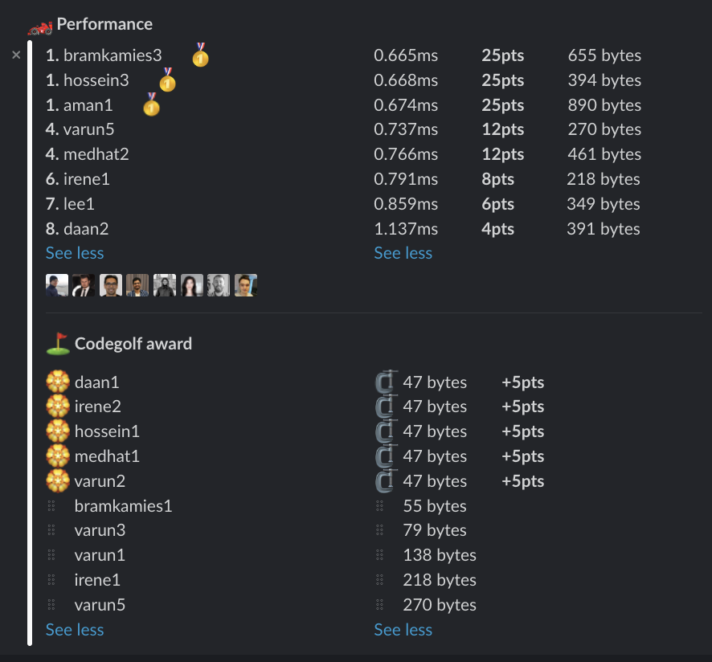

# Week 26 challenge

Write a function `doIReadBothWays` which accepts a number and returns whether this number is a palindrome - reads the same backward as forward.


Examples:
```
doIReadBothWays(1) // return true
doIReadBothWays(156) // return false
doIReadBothWays(565) // return true
doIReadBothWays(235151) // false
```


## Upload link

You can `/submit` your solution in Slack.

## Results

| Place | Name        | Performance | Codegolf | Vote  | Total points |
|-------|-------------|-------------|----------|-------|--------------|
| 1.    | Hossein     | 25          | 5        | 5     | 35           |
| 2.    | Bram Kamies | 25          |          |       | 25           |
|       | Aman        | 25          |          |       | 25           |
| 4.    | Varun       | 12          | 5        |       | 17           |
|       | Medhat      | 12          | 5        |       | 17           |
| 6.    | Irene       | 8           | 5        |       | 13           |
| 7.    | Daan        | 4           | 5        |       | 9            |
| 8.    | Lee         | 6           |          |       | 6            |


### Screenshot




### Vote

```
╔═══════╤══════════╤══════════════════════════════════════════════════════════════╗
║ Name  │ Vote     │ Comment                                                      ║
╟───────┼──────────┼──────────────────────────────────────────────────────────────╢
║ varun │ hossein3 │ Good balance of optimization and checking all possible cases ║
╚═══════╧══════════╧══════════════════════════════════════════════════════════════╝
```


### Full output log
```

EVALUATION STARTED:                 06/07/2022, 12:07:06
EVALUATING CHALLENGE:               2022/w26
FOUND 19 SOLUTIONS:                 aman1.js, bramkamies1.js, bramkamies2.js, bramkamies3.js, daan1.js, daan2.js, hossein1.js, hossein2.js, hossein3.js,
                          irene1.js, irene2.js, lee1.js, medhat1.js, medhat2.js, varun1.js, varun2.js, varun3.js, varun4.js, varun5.js
RUNNING EVALUATION FOR:             5400 SECONDS WITH 10000 TEST CASES IN EACH CYCLE...


EVALUATION ENDED:                   06/07/2022, 13:37:08
DURATION:                           1 hour, 30 minutes, 1.386 seconds

RANKINGS:
╔═══════╤════════╤═════════════╤═════════╤══════════╤══════════════╤══════╗
║ Place │ Points │ Name        │ Total   │ Best run │ Best compile │ Size ║
╟───────┼────────┼─────────────┼─────────┼──────────┼──────────────┼──────╢
║ 1     │ 25     │ bramkamies3 │ 0.665ms │ 0.618ms  │ 0.046ms      │ 655  ║
╟───────┼────────┼─────────────┼─────────┼──────────┼──────────────┼──────╢
║       │ 25     │ hossein3    │ 0.668ms │ 0.619ms  │ 0.049ms      │ 394  ║
╟───────┼────────┼─────────────┼─────────┼──────────┼──────────────┼──────╢
║       │ 25     │ aman1       │ 0.674ms │ 0.614ms  │ 0.060ms      │ 890  ║
╟───────┼────────┼─────────────┼─────────┼──────────┼──────────────┼──────╢
║ 4     │ 12     │ varun5      │ 0.737ms │ 0.692ms  │ 0.044ms      │ 270  ║
╟───────┼────────┼─────────────┼─────────┼──────────┼──────────────┼──────╢
║       │ 12     │ medhat2     │ 0.766ms │ 0.717ms  │ 0.049ms      │ 461  ║
╟───────┼────────┼─────────────┼─────────┼──────────┼──────────────┼──────╢
║ 6     │ 8      │ irene1      │ 0.791ms │ 0.745ms  │ 0.046ms      │ 218  ║
╟───────┼────────┼─────────────┼─────────┼──────────┼──────────────┼──────╢
║ 7     │ 6      │ lee1        │ 0.859ms │ 0.810ms  │ 0.048ms      │ 349  ║
╟───────┼────────┼─────────────┼─────────┼──────────┼──────────────┼──────╢
║ 8     │ 4      │ daan2       │ 1.137ms │ 1.086ms  │ 0.051ms      │ 391  ║
╚═══════╧════════╧═════════════╧═════════╧══════════╧══════════════╧══════╝

Keeping only best run from each contestant
Using 5% margin for determening ties

OMITTED FROM RANKINGS:              varun4.js, bramkamies2.js, varun3.js, hossein2.js, varun1.js, daan1.js, irene2.js, hossein1.js, medhat1.js, varun2.js,
                          bramkamies1.js

CODEGOLF AWARD:                     daan1.js, hossein1.js, irene2.js, medhat1.js, varun2.js with 47 bytes

SYSTEM INFO:
NODE: v16.14.2
ARCH: x64
PLATFORM: linux
VERSION: #56-Ubuntu SMP Mon Oct 5 14:28:49 UTC 2020
MEMORY: 15.64GB
CPUS: 2 x Intel(R) Xeon(R) Gold 6248 CPU @ 2.50GHz
CPU speed: 2494MHz

RAW RESULTS:
┌─────────┬──────────────────┬────────────────────┬────────────────────┬──────────────────────┬──────┬────────────────┬────────────────────┬──────────────┬────────┬────────────┬───────┐
│ (index) │     solution     │       total        │      bestRun       │     bestCompile      │ size │    compiled    │   validationTime   │ onlyCodegolf │ failed │ failReason │ runs  │
├─────────┼──────────────────┼────────────────────┼────────────────────┼──────────────────────┼──────┼────────────────┼────────────────────┼──────────────┼────────┼────────────┼───────┤
│    0    │ 'bramkamies3.js' │ 0.6645540001336485 │ 0.6182669999543577 │ 0.04628700017929077  │ 655  │ 'successfully' │ 11.544232000000193 │    false     │ false  │    null    │ 82400 │
│    1    │  'hossein3.js'   │ 0.6678100000135601 │ 0.6187040000222623 │ 0.04910599999129772  │ 394  │ 'successfully' │ 11.560970000002271 │    false     │ false  │    null    │ 82400 │
│    2    │    'aman1.js'    │ 0.6740589998662472 │ 0.6135970000177622 │ 0.06046199984848499  │ 890  │ 'successfully' │ 20.22577900000033  │    false     │ false  │    null    │ 82400 │
│    3    │   'varun5.js'    │ 0.7366240001283586 │ 0.6922149998135865 │ 0.04440900031477213  │ 270  │ 'successfully' │ 7.365174999998999  │    false     │ false  │    null    │ 82400 │
│    4    │   'varun4.js'    │ 0.7412930000573397 │ 0.6969750002026558 │ 0.044317999854683876 │ 292  │ 'successfully' │ 7.404129999998986  │    false     │ false  │    null    │ 82400 │
│    5    │ 'bramkamies2.js' │ 0.7453249997342937 │ 0.6312639997340739 │ 0.11406100000021979  │ 766  │ 'successfully' │ 18.11218800000279  │    false     │ false  │    null    │ 82400 │
│    6    │   'medhat2.js'   │ 0.7659399998374283 │ 0.7170219998806715 │ 0.04891799995675683  │ 461  │ 'successfully' │ 8.560905999998795  │    false     │ false  │    null    │ 82400 │
│    7    │   'varun3.js'    │ 0.7682340000756085 │ 0.7273300001397729 │  0.0409039999358356  │  79  │ 'successfully' │ 6.277914999998757  │    false     │ false  │    null    │ 82400 │
│    8    │  'hossein2.js'   │ 0.7878310000523925 │ 0.7387520000338554 │ 0.049079000018537045 │ 371  │ 'successfully' │ 11.364428999997472 │    false     │ false  │    null    │ 82400 │
│    9    │   'varun1.js'    │ 0.7894310001283884 │ 0.747529000043869  │ 0.041902000084519386 │ 138  │ 'successfully' │  6.52520899999945  │    false     │ false  │    null    │ 82400 │
│   10    │   'irene1.js'    │ 0.7912759999744594 │ 0.7451939999591559 │ 0.04608200001530349  │ 218  │ 'successfully' │ 6.697032000003674  │    false     │ false  │    null    │ 82400 │
│   11    │    'lee1.js'     │ 0.8585489997640252 │ 0.8101019999012351 │ 0.04844699986279011  │ 349  │ 'successfully' │ 10.974325999999564 │    false     │ false  │    null    │ 82400 │
│   12    │    'daan2.js'    │ 1.1367190000601113 │ 1.0859159999527037 │ 0.05080300010740757  │ 391  │ 'successfully' │ 9.363154999999097  │    false     │ false  │    null    │ 82400 │
│   13    │    'daan1.js'    │ 5.7249699998646975 │ 5.686569000128657  │ 0.03840099973604083  │  47  │ 'successfully' │ 19.72393199999715  │    false     │ false  │    null    │ 82400 │
│   14    │   'irene2.js'    │ 5.778320000041276  │ 5.738878000061959  │ 0.03944199997931719  │  47  │ 'successfully' │ 13.95975499999986  │    false     │ false  │    null    │ 82400 │
│   15    │  'hossein1.js'   │ 5.797644000500441  │ 5.758669000118971  │ 0.03897500038146973  │  47  │ 'successfully' │ 19.039597999999387 │    false     │ false  │    null    │ 82400 │
│   16    │   'medhat1.js'   │ 5.7989620002917945 │ 5.759936000220478  │ 0.03902600007131696  │  47  │ 'successfully' │ 12.492471999998088 │    false     │ false  │    null    │ 82400 │
│   17    │   'varun2.js'    │ 5.817907000426203  │ 5.778737000189722  │ 0.03917000023648143  │  47  │ 'successfully' │ 11.956710999998904 │    false     │ false  │    null    │ 82400 │
│   18    │ 'bramkamies1.js' │ 6.156482999678701  │  6.11652799975127  │ 0.039954999927431345 │  55  │ 'successfully' │ 24.903935999998794 │    false     │ false  │    null    │ 82400 │
└─────────┴──────────────────┴────────────────────┴────────────────────┴──────────────────────┴──────┴────────────────┴────────────────────┴──────────────┴────────┴────────────┴───────┘
```
  