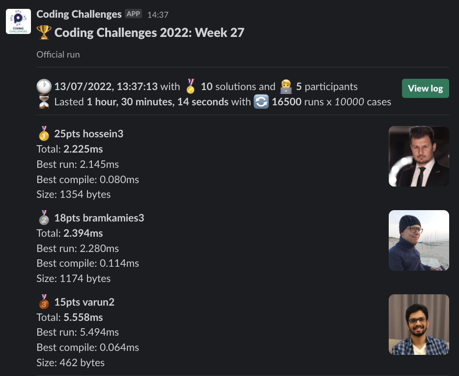
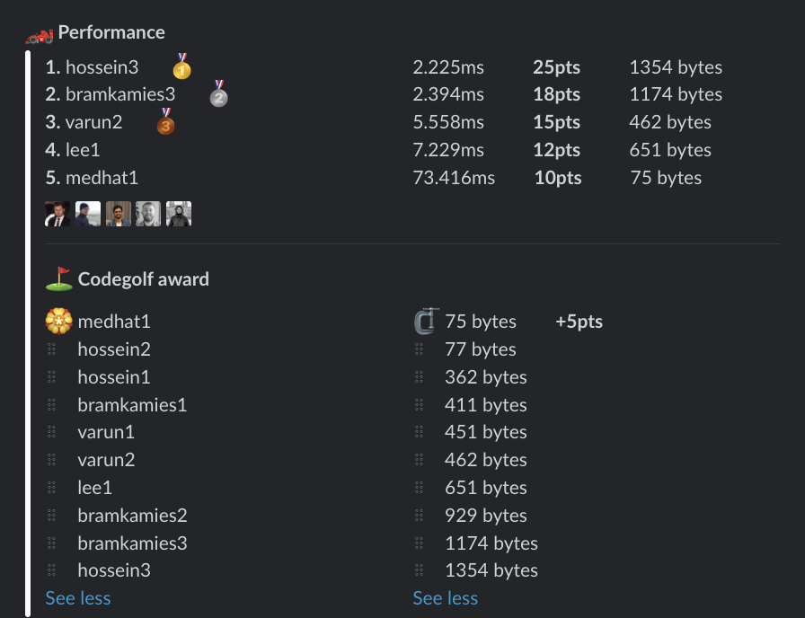

# Week 27 challenge

Write a function `summedIntervals` which accepts an array of intervals (start and end number). Your task is to return the sum if all interval lengths. If some intervals are overlapping, those numbers should be counted only once.


Examples:
```
summedIntervals([[1,4], [5,7]]) // return 5
summedIntervals([[1,4], [3,8]]) // return 7
summedIntervals([[1,4], [3,8], [12,17]]) // return 12
```


## Upload link

You can `/submit` your solution in Slack.

## Results

| Place | Name        | Performance | Codegolf | Vote  | Total points |
|-------|-------------|-------------|----------|-------|--------------|
| 1.    | Hossein     | 25          |          |       | 25           |
| 2.    | Bram Kamies | 18          |          |       | 18           |
| 3.    | Varun       | 15          |          |       | 15           |
|       | Medhat      | 10          | 5        |       | 15           |
| 5.    | Lee         | 12          |          |       | 12           |


### Screenshot





### Vote

No votes this week.


### Full output log
```

EVALUATION STARTED:                 13/07/2022, 12:06:52
EVALUATING CHALLENGE:               2022/w27
FOUND 10 SOLUTIONS:                 bramkamies1.js, bramkamies2.js, bramkamies3.js, hossein1.js, hossein2.js, hossein3.js, lee1.js, medhat1.js, varun1.js,
                          varun2.js
RUNNING EVALUATION FOR:             5400 SECONDS WITH 10000 TEST CASES IN EACH CYCLE...


EVALUATION ENDED:                   13/07/2022, 13:37:07
DURATION:                           1 hour, 30 minutes, 14.055 seconds

RANKINGS:
╔═══════╤════════╤═════════════╤══════════╤══════════╤══════════════╤══════╗
║ Place │ Points │ Name        │ Total    │ Best run │ Best compile │ Size ║
╟───────┼────────┼─────────────┼──────────┼──────────┼──────────────┼──────╢
║ 1     │ 25     │ hossein3    │ 2.225ms  │ 2.145ms  │ 0.080ms      │ 1354 ║
╟───────┼────────┼─────────────┼──────────┼──────────┼──────────────┼──────╢
║ 2     │ 18     │ bramkamies3 │ 2.394ms  │ 2.280ms  │ 0.114ms      │ 1174 ║
╟───────┼────────┼─────────────┼──────────┼──────────┼──────────────┼──────╢
║ 3     │ 15     │ varun2      │ 5.558ms  │ 5.494ms  │ 0.064ms      │ 462  ║
╟───────┼────────┼─────────────┼──────────┼──────────┼──────────────┼──────╢
║ 4     │ 12     │ lee1        │ 7.229ms  │ 7.149ms  │ 0.079ms      │ 651  ║
╟───────┼────────┼─────────────┼──────────┼──────────┼──────────────┼──────╢
║ 5     │ 10     │ medhat1     │ 73.416ms │ 73.326ms │ 0.090ms      │ 75   ║
╚═══════╧════════╧═════════════╧══════════╧══════════╧══════════════╧══════╝

Keeping only best run from each contestant
Using 5% margin for determening ties

OMITTED FROM RANKINGS:              bramkamies2.js, hossein1.js, varun1.js, hossein2.js, bramkamies1.js

CODEGOLF AWARD:                     medhat1.js with 75 bytes

SYSTEM INFO:
NODE: v16.14.2
ARCH: x64
PLATFORM: linux
VERSION: #56-Ubuntu SMP Mon Oct 5 14:28:49 UTC 2020
MEMORY: 15.64GB
CPUS: 2 x Intel(R) Xeon(R) Gold 6248 CPU @ 2.50GHz
CPU speed: 2494MHz

RAW RESULTS:
┌─────────┬──────────────────┬────────────────────┬────────────────────┬─────────────────────┬──────┬────────────────┬────────────────────┬──────────────┬────────┬────────────┬───────┐
│ (index) │     solution     │       total        │      bestRun       │     bestCompile     │ size │    compiled    │   validationTime   │ onlyCodegolf │ failed │ failReason │ runs  │
├─────────┼──────────────────┼────────────────────┼────────────────────┼─────────────────────┼──────┼────────────────┼────────────────────┼──────────────┼────────┼────────────┼───────┤
│    0    │  'hossein3.js'   │ 2.2246919996105134 │ 2.1448260000906885 │ 0.07986599951982498 │ 1354 │ 'successfully' │ 84.68026399999872  │    false     │ false  │    null    │ 16500 │
│    1    │ 'bramkamies3.js' │ 2.393643000163138  │ 2.279690000228584  │ 0.1139529999345541  │ 1174 │ 'successfully' │ 79.07390999999916  │    false     │ false  │    null    │ 16500 │
│    2    │ 'bramkamies2.js' │ 3.3429810007219203 │ 3.252699000760913  │ 0.09028199996100739 │ 929  │ 'successfully' │ 87.60741999999664  │    false     │ false  │    null    │ 16500 │
│    3    │  'hossein1.js'   │  5.26246300060302  │ 5.188971000723541  │ 0.07349199987947941 │ 362  │ 'successfully' │ 83.23975999999675  │    false     │ false  │    null    │ 16500 │
│    4    │   'varun2.js'    │ 5.557778999209404  │ 5.493590000085533  │ 0.06418899912387133 │ 462  │ 'successfully' │ 85.33373900000151  │    false     │ false  │    null    │ 16500 │
│    5    │    'lee1.js'     │ 7.228589000354987  │ 7.149249999958556  │ 0.07933900039643049 │ 651  │ 'successfully' │ 89.24589399999968  │    false     │ false  │    null    │ 16500 │
│    6    │   'varun1.js'    │ 7.643102000001818  │ 7.5691639999859035 │ 0.07393800001591444 │ 451  │ 'successfully' │ 99.58571200000006  │    false     │ false  │    null    │ 16500 │
│    7    │   'medhat1.js'   │ 73.41593800031114  │ 73.32584299996961  │ 0.09009500034153461 │  75  │ 'successfully' │ 330.12271300000066 │    false     │ false  │    null    │ 16500 │
│    8    │  'hossein2.js'   │ 85.44692099932581  │ 85.35504699964076  │ 0.09187399968504906 │  77  │ 'successfully' │ 344.65862299999935 │    false     │ false  │    null    │ 16500 │
│    9    │ 'bramkamies1.js' │ 88.00989000016125  │ 87.90810599998804  │ 0.1017840001732111  │ 411  │ 'successfully' │ 205.57448300000033 │    false     │ false  │    null    │ 16500 │
└─────────┴──────────────────┴────────────────────┴────────────────────┴─────────────────────┴──────┴────────────────┴────────────────────┴──────────────┴────────┴────────────┴───────┘
```
  