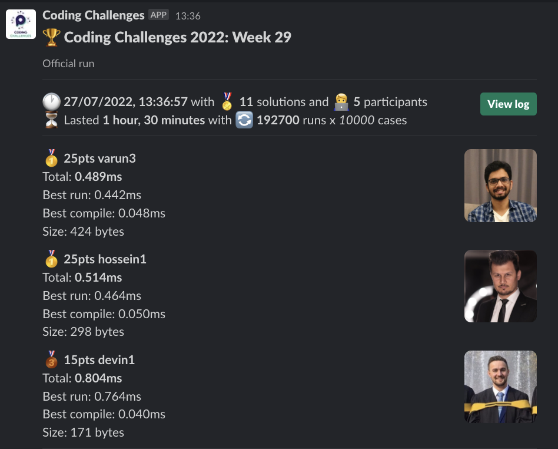
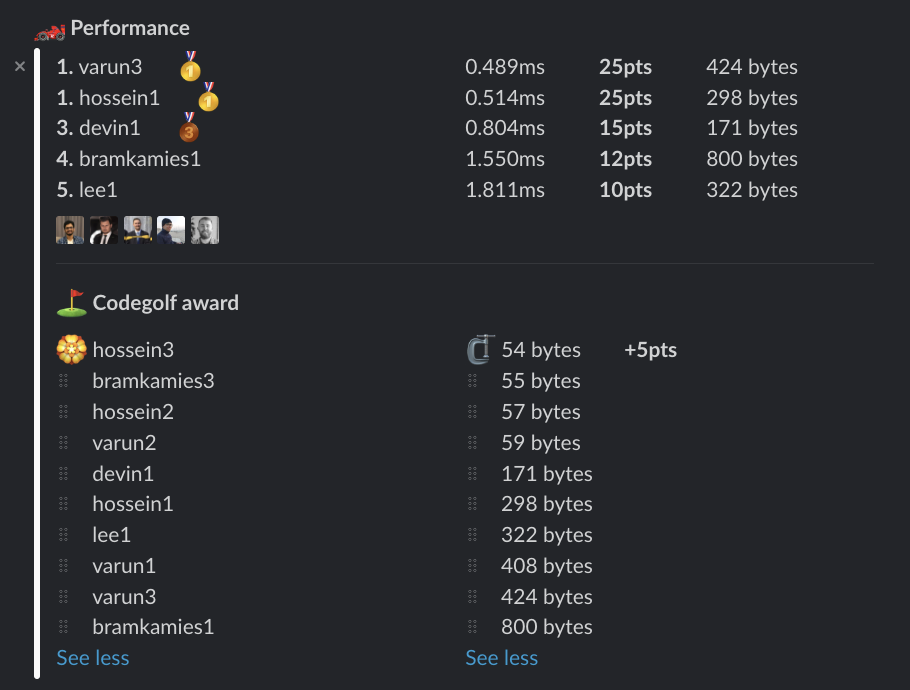

# Week 29 challenge

Write a function `isThisABook` which accepts a string representing a [ISBN](https://en.wikipedia.org/wiki/ISBN) code. Your task is to return if this is a valid ISBN code.

For the purpose of this challenge a valid ISBN code consists of 10 digits, with 'X' denoting 10.
A valid ISBN code is divisable by 11 when each digit is multiplied with it's positional number and then summed.
Also, X can only appear as the last digit which typically is used as a checksum of error detection digit.


For example, 7873312984 is a valid ISBN number because:
```
Digit:      7 8 7 3 3 1 2 9 8 4
Position:   1 2 3 4 5 6 7 8 9 10

(7 * 1) + (8 * 2) + (7 * 3) + (3 * 4) + (3 * 5) + (1 * 6) + (2 * 7) + (9 * 8) + (8 * 9) + (4 * 10) == 275

275 % 11 = 0
```

Examples:
```
isThisABook('7873312984') // return true
isThisABook('724496814X') // return false
```


## Upload link

You can `/submit` your solution in Slack.

## Results

| Place | Name        | Performance | Codegolf | Vote  | Total points |
|-------|-------------|-------------|----------|-------|--------------|
| 1.    | Hossein     | 25          | 5        |       | 30           |
| 2.    | Varun       | 25          |          |       | 25           |
| 3.    | Bram Kamies | 12          |          | 5     | 17           |
| 4.    | Devin       | 15          |          |       | 15           |
| 5.    | Lee         | 10          |          |       | 10           |


### Screenshot





### Vote

```
╔═════════╤═════════════╤═══════════════════════════════╗
║ Name    │ Vote        │ Comment                       ║
╟─────────┼─────────────┼───────────────────────────────╢
║ hossein │ bramkamies2 │ The `<1` was a great idea 💡  ║
╚═════════╧═════════════╧═══════════════════════════════╝
```


### Full output log
```

EVALUATION STARTED:                 27/07/2022, 12:06:50
EVALUATING CHALLENGE:               2022/w29
FOUND 11 SOLUTIONS:                 bramkamies1.js, bramkamies2.js, bramkamies3.js, devin1.js, hossein1.js, hossein2.js, hossein3.js, lee1.js, varun1.js,
                          varun2.js, varun3.js
RUNNING EVALUATION FOR:             5400 SECONDS WITH 10000 TEST CASES IN EACH CYCLE...


EVALUATION ENDED:                   27/07/2022, 13:36:51
DURATION:                           1 hour, 30 minutes, 0.48 seconds

RANKINGS:
╔═══════╤════════╤═════════════╤═════════╤══════════╤══════════════╤══════╗
║ Place │ Points │ Name        │ Total   │ Best run │ Best compile │ Size ║
╟───────┼────────┼─────────────┼─────────┼──────────┼──────────────┼──────╢
║ 1     │ 25     │ varun3      │ 0.489ms │ 0.442ms  │ 0.048ms      │ 424  ║
╟───────┼────────┼─────────────┼─────────┼──────────┼──────────────┼──────╢
║       │ 25     │ hossein1    │ 0.514ms │ 0.464ms  │ 0.050ms      │ 298  ║
╟───────┼────────┼─────────────┼─────────┼──────────┼──────────────┼──────╢
║ 3     │ 15     │ devin1      │ 0.804ms │ 0.764ms  │ 0.040ms      │ 171  ║
╟───────┼────────┼─────────────┼─────────┼──────────┼──────────────┼──────╢
║ 4     │ 12     │ bramkamies1 │ 1.550ms │ 1.499ms  │ 0.051ms      │ 800  ║
╟───────┼────────┼─────────────┼─────────┼──────────┼──────────────┼──────╢
║ 5     │ 10     │ lee1        │ 1.811ms │ 1.750ms  │ 0.061ms      │ 322  ║
╚═══════╧════════╧═════════════╧═════════╧══════════╧══════════════╧══════╝

Keeping only best run from each contestant
Using 5% margin for determening ties

OMITTED FROM RANKINGS:              varun1.js, hossein2.js, varun2.js, bramkamies3.js, hossein3.js, bramkamies2.js

CODEGOLF AWARD:                     hossein3.js with 54 bytes

SYSTEM INFO:
NODE: v16.14.2
ARCH: x64
PLATFORM: linux
VERSION: #56-Ubuntu SMP Mon Oct 5 14:28:49 UTC 2020
MEMORY: 15.64GB
CPUS: 2 x Intel(R) Xeon(R) Gold 6248 CPU @ 2.50GHz
CPU speed: 2494MHz

RAW RESULTS:
┌─────────┬──────────────────┬─────────────────────┬─────────────────────┬──────────────────────┬──────┬────────────────┬────────────────────┬──────────────┬────────┬────────────┬────────┐
│ (index) │     solution     │        total        │       bestRun       │     bestCompile      │ size │    compiled    │   validationTime   │ onlyCodegolf │ failed │ failReason │  runs  │
├─────────┼──────────────────┼─────────────────────┼─────────────────────┼──────────────────────┼──────┼────────────────┼────────────────────┼──────────────┼────────┼────────────┼────────┤
│    0    │   'varun3.js'    │ 0.48946499987505376 │ 0.44167099986225367 │  0.0477940000128001  │ 424  │ 'successfully' │ 17.233980000000884 │    false     │ false  │    null    │ 192700 │
│    1    │  'hossein1.js'   │ 0.5137890004552901  │ 0.4641970004886389  │  0.0495919999666512  │ 298  │ 'successfully' │ 12.276345999998739 │    false     │ false  │    null    │ 192700 │
│    2    │   'varun1.js'    │ 0.7104019997641444  │ 0.6639250000007451  │ 0.04647699976339936  │ 408  │ 'successfully' │ 13.838142000000516 │    false     │ false  │    null    │ 192700 │
│    3    │   'devin1.js'    │ 0.8038190000224859  │ 0.7636969999875873  │ 0.04012200003489852  │ 171  │ 'successfully' │ 11.36168600000019  │    false     │ false  │    null    │ 192700 │
│    4    │ 'bramkamies1.js' │ 1.5502170003019273  │ 1.4988950002007186  │ 0.05132200010120869  │ 800  │ 'successfully' │ 31.67596500000218  │    false     │ false  │    null    │ 192700 │
│    5    │    'lee1.js'     │  1.810899999924004  │ 1.7497899997979403  │ 0.061110000126063824 │ 322  │ 'successfully' │ 8.843450999997003  │    false     │ false  │    null    │ 192700 │
│    6    │  'hossein2.js'   │  2.075606999802403  │ 2.0371209997683764  │  0.0384860000340268  │  57  │ 'successfully' │ 15.70911100000012  │    false     │ false  │    null    │ 192700 │
│    7    │   'varun2.js'    │  2.087422999786213  │ 2.0488400000613183  │ 0.03858299972489476  │  59  │ 'successfully' │ 20.728863000000274 │    false     │ false  │    null    │ 192700 │
│    8    │ 'bramkamies3.js' │  2.138115999987349  │ 2.1001060002017766  │ 0.03800999978557229  │  55  │ 'successfully' │ 14.416017999999895 │    false     │ false  │    null    │ 192700 │
│    9    │  'hossein3.js'   │ 2.6200739999767393  │ 2.5803529999684542  │ 0.039721000008285046 │  54  │ 'successfully' │ 15.574635000000853 │    false     │ false  │    null    │ 192700 │
│   10    │ 'bramkamies2.js' │  3.96142499987036   │  3.909680999815464  │ 0.05174400005489588  │ 891  │ 'successfully' │ 43.69505500000014  │    false     │ false  │    null    │ 192700 │
└─────────┴──────────────────┴─────────────────────┴─────────────────────┴──────────────────────┴──────┴────────────────┴────────────────────┴──────────────┴────────┴────────────┴────────┘
```
  