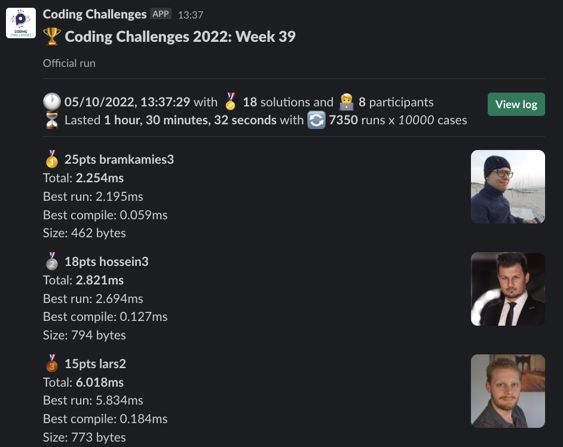
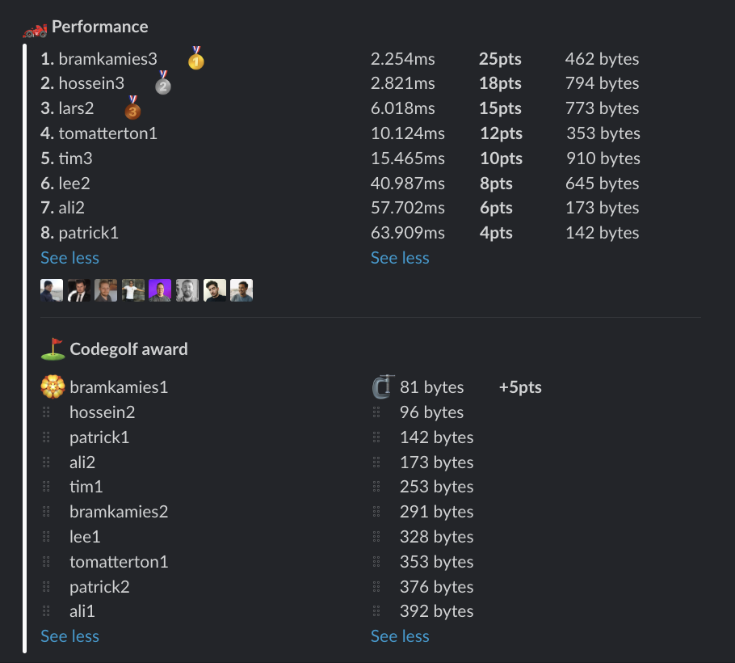

# Week 39 challenge

Write a function `hashedAllTheWay` which implements a hashing algorithm taking a string and returning a final number.
The hashing works as follows: it converts every character in the string to its ASCII code in hexadecimal.
Then it summs all the digits in decimal system from hexadecimal codes, ignoring letters.


Examples:
```
hashedAllTheWay('passion') // return 61
// p = '70'
// a = '61'
// s = '73'
// s = '73'
// i = '69'
// o = '6f'
// n = '6e'
// => 7 + 0 + 6 + 1 + 7 + 3 + 7 + 3 + 6 + 9 + 6 + 6 = 61
```

## Upload link

You can `/submit` your solution in Slack.

## Results

| Place | Name         | Performance | Codegolf | Vote  | Total points |
|-------|--------------|-------------|----------|-------|--------------|
| 1.    | Bram Kamies  | 25          | 5        | 5     | 35           |
| 2.    | Hossein      | 18          |          | 5     | 23           |
| 3.    | Lars         | 15          |          |       | 15           |
| 4.    | Tom Atterton | 12          |          |       | 12           |
| 5.    | Tim          | 10          |          |       | 10           |
| 6.    | Patrick      | 4           |          | 5     | 9            |
| 7.    | Lee          | 8           |          |       | 8            |
| 8.    | Ali          | 6           |          |       | 6            |


### Screenshot





### Vote

```
╔════════════╤═════════════╤════════════════════════════════════════════════════╗
║ Name       │ Vote        │ Comment                                            ║
╟────────────┼─────────────┼────────────────────────────────────────────────────╢
║ bramkamies │ hossein2    │ Nice strat to flatten hex chars into single string ║
╟────────────┼─────────────┼────────────────────────────────────────────────────╢
║ hossein    │ bramkamies1 │ Buffer! Genius! Well done m8                       ║
╟────────────┼─────────────┼────────────────────────────────────────────────────╢
║ lee        │ patrick1    │ Simply marvellous                                  ║
╚════════════╧═════════════╧════════════════════════════════════════════════════╝
```


### Full output log
```

EVALUATION STARTED:                 05/10/2022, 12:06:51
EVALUATING CHALLENGE:               2022/w39
FOUND 18 SOLUTIONS:                 ali1.js, ali2.js, bramkamies1.js, bramkamies2.js, bramkamies3.js, hossein1.js, hossein2.js, hossein3.js, lars1.js,
                          lars2.js, lee1.js, lee2.js, patrick1.js, patrick2.js, tim1.js, tim2.js, tim3.js, tomatterton1.js
RUNNING EVALUATION FOR:             5400 SECONDS WITH 10000 TEST CASES IN EACH CYCLE...


EVALUATION ENDED:                   05/10/2022, 13:37:24
DURATION:                           1 hour, 30 minutes, 32.673 seconds

RANKINGS:
╔═══════╤════════╤══════════════╤══════════╤══════════╤══════════════╤══════╗
║ Place │ Points │ Name         │ Total    │ Best run │ Best compile │ Size ║
╟───────┼────────┼──────────────┼──────────┼──────────┼──────────────┼──────╢
║ 1     │ 25     │ bramkamies3  │ 2.254ms  │ 2.195ms  │ 0.059ms      │ 462  ║
╟───────┼────────┼──────────────┼──────────┼──────────┼──────────────┼──────╢
║ 2     │ 18     │ hossein3     │ 2.821ms  │ 2.694ms  │ 0.127ms      │ 794  ║
╟───────┼────────┼──────────────┼──────────┼──────────┼──────────────┼──────╢
║ 3     │ 15     │ lars2        │ 6.018ms  │ 5.834ms  │ 0.184ms      │ 773  ║
╟───────┼────────┼──────────────┼──────────┼──────────┼──────────────┼──────╢
║ 4     │ 12     │ tomatterton1 │ 10.124ms │ 10.076ms │ 0.047ms      │ 353  ║
╟───────┼────────┼──────────────┼──────────┼──────────┼──────────────┼──────╢
║ 5     │ 10     │ tim3         │ 15.465ms │ 15.378ms │ 0.087ms      │ 910  ║
╟───────┼────────┼──────────────┼──────────┼──────────┼──────────────┼──────╢
║ 6     │ 8      │ lee2         │ 40.987ms │ 40.876ms │ 0.111ms      │ 645  ║
╟───────┼────────┼──────────────┼──────────┼──────────┼──────────────┼──────╢
║ 7     │ 6      │ ali2         │ 57.702ms │ 57.639ms │ 0.063ms      │ 173  ║
╟───────┼────────┼──────────────┼──────────┼──────────┼──────────────┼──────╢
║ 8     │ 4      │ patrick1     │ 63.909ms │ 63.849ms │ 0.060ms      │ 142  ║
╚═══════╧════════╧══════════════╧══════════╧══════════╧══════════════╧══════╝

Keeping only best run from each contestant
Using 5% margin for determening ties

OMITTED FROM RANKINGS:              bramkamies2.js, lars1.js, hossein1.js, tim2.js, lee1.js, bramkamies1.js, tim1.js, patrick2.js, hossein2.js, ali1.js

CODEGOLF AWARD:                     bramkamies1.js with 81 bytes

SYSTEM INFO:
NODE: v16.14.2
ARCH: x64
PLATFORM: linux
VERSION: #56-Ubuntu SMP Mon Oct 5 14:28:49 UTC 2020
MEMORY: 15.64GB
CPUS: 2 x Intel(R) Xeon(R) Gold 6248 CPU @ 2.50GHz
CPU speed: 2494MHz

RAW RESULTS:
┌─────────┬───────────────────┬────────────────────┬────────────────────┬──────────────────────┬──────┬────────────────┬────────────────────┬──────────────┬────────┬────────────┬──────┐
│ (index) │     solution      │       total        │      bestRun       │     bestCompile      │ size │    compiled    │   validationTime   │ onlyCodegolf │ failed │ failReason │ runs │
├─────────┼───────────────────┼────────────────────┼────────────────────┼──────────────────────┼──────┼────────────────┼────────────────────┼──────────────┼────────┼────────────┼──────┤
│    0    │ 'bramkamies3.js'  │ 2.254034999990836  │ 2.194744999986142  │ 0.059290000004693866 │ 462  │ 'successfully' │ 10.743915999999444 │    false     │ false  │    null    │ 7350 │
│    1    │ 'bramkamies2.js'  │ 2.5263459995621815 │ 2.409408999606967  │ 0.11693699995521456  │ 291  │ 'successfully' │ 133.63119000000006 │    false     │ false  │    null    │ 7350 │
│    2    │   'hossein3.js'   │ 2.820985000143992  │ 2.693765000003623  │ 0.12722000014036894  │ 794  │ 'successfully' │ 11.644154000001436 │    false     │ false  │    null    │ 7350 │
│    3    │    'lars2.js'     │ 6.0182340000756085 │ 5.834487000014633  │ 0.18374700006097555  │ 773  │ 'successfully' │ 12.372620999998617 │    false     │ false  │    null    │ 7350 │
│    4    │ 'tomatterton1.js' │ 10.12369400030002  │ 10.076216999907047 │ 0.04747700039297342  │ 353  │ 'successfully' │ 10.493180999998003 │    false     │ false  │    null    │ 7350 │
│    5    │    'lars1.js'     │ 15.356883999949787 │ 15.271331999974791 │ 0.08555199997499585  │ 1004 │ 'successfully' │ 25.250183000000106 │    false     │ false  │    null    │ 7350 │
│    6    │     'tim3.js'     │ 15.464798999717459 │ 15.378025999991223 │ 0.08677299972623587  │ 910  │ 'successfully' │ 23.48913299999913  │    false     │ false  │    null    │ 7350 │
│    7    │   'hossein1.js'   │ 22.656351999379694 │ 22.57190499966964  │  0.0844469997100532  │ 719  │ 'successfully' │ 24.961553000001004 │    false     │ false  │    null    │ 7350 │
│    8    │     'lee2.js'     │  40.9873929998721  │ 40.87610699998913  │ 0.11128599988296628  │ 645  │ 'successfully' │  53.3128910000014  │    false     │ false  │    null    │ 7350 │
│    9    │     'tim2.js'     │ 41.68490599980578  │ 41.575263999868184 │ 0.10964199993759394  │ 606  │ 'successfully' │ 55.37856800000009  │    false     │ false  │    null    │ 7350 │
│   10    │     'lee1.js'     │ 55.290852999314666 │ 55.23000799957663  │ 0.060844999738037586 │ 328  │ 'successfully' │  44.265499000001   │    false     │ false  │    null    │ 7350 │
│   11    │ 'bramkamies1.js'  │ 56.31949999992503  │ 56.25846299994737  │ 0.061036999977659434 │  81  │ 'successfully' │ 91.80664899999829  │    false     │ false  │    null    │ 7350 │
│   12    │     'ali2.js'     │ 57.70204899972305  │ 57.63881199993193  │ 0.06323699979111552  │ 173  │ 'successfully' │ 89.84067800000048  │    false     │ false  │    null    │ 7350 │
│   13    │     'tim1.js'     │ 59.312792999786325 │ 59.24328699999023  │ 0.06950599979609251  │ 253  │ 'successfully' │ 509.30785000000105 │    false     │ false  │    null    │ 7350 │
│   14    │   'patrick1.js'   │ 63.90883699990809  │ 63.849010000005364 │ 0.05982699990272522  │ 142  │ 'successfully' │ 712.0571259999997  │    false     │ false  │    null    │ 7350 │
│   15    │   'patrick2.js'   │ 64.78526499983855  │ 64.70704599982128  │ 0.07821900001727045  │ 376  │ 'successfully' │ 712.1331119999995  │    false     │ false  │    null    │ 7350 │
│   16    │   'hossein2.js'   │ 71.49113100022078  │  71.4295540000312  │ 0.06157700018957257  │  96  │ 'successfully' │ 659.8444969999982  │    false     │ false  │    null    │ 7350 │
│   17    │     'ali1.js'     │ 71.73755100020207  │ 71.66145399981178  │ 0.07609700039029121  │ 392  │ 'successfully' │ 337.1308680000002  │    false     │ false  │    null    │ 7350 │
└─────────┴───────────────────┴────────────────────┴────────────────────┴──────────────────────┴──────┴────────────────┴────────────────────┴──────────────┴────────┴────────────┴──────┘
```
  